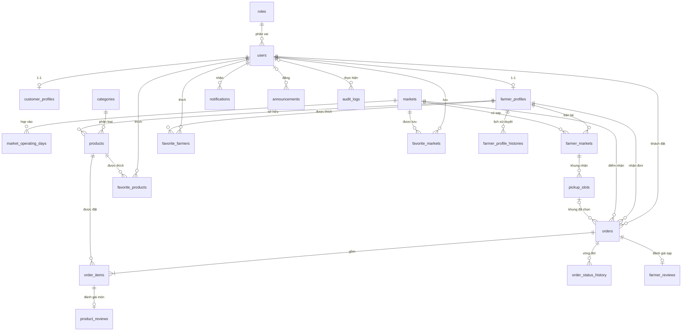

# 🗄️ PASS 4 (PHẦN A): THIẾT KẾ CƠ SỞ DỮ LIỆU (ERD & DATA DICTIONARY)
## DỰ ÁN MARKETLINK — TECHWIZ 7
> **Đầu vào**: SRS §1.8 (Database Design mẫu) · UC-01 → UC-34, FR-01 → FR-59, NFR-01 → NFR-12 (`MarketLink_requirement_analysis.md`) · Decision Log D-001 → D-021 (FSM 13 cạnh) · Kiểm kê dữ liệu UI (Pass 3 §11).
> **CSDL**: MySQL 8.4 LTS · InnoDB · `utf8mb4` / `utf8mb4_0900_ai_ci` · Django 5.2 ORM · `DEFAULT_AUTO_FIELD = BigAutoField` · `TIME_ZONE = "Asia/Ho_Chi_Minh"`, `USE_TZ = True`.
> **Phạm vi phần A**: ERD, từ điển dữ liệu, ràng buộc toàn vẹn, index, kiểm soát đồng thời. **Phần B (API Contract Freeze 10 điểm)** làm sau khi Lead duyệt phần A.
> **Trạng thái**: ✅ Lead Architect đã duyệt hướng thiết kế (bản nền Pass 4 + 3 điểm gộp từ thiết kế của Lead: `order_status_history`, `pickup_slots.is_active`, `markets.image`).

---

## 0. QUY ƯỚC THIẾT KẾ ÁP DỤNG CHO MỌI BẢNG

| # | Quy ước | Chi tiết |
| :---: | :--- | :--- |
| 1 | Khóa chính | `id BIGINT AUTO_INCREMENT` (BigAutoField). Ngoại lệ: bảng profile 1-1 dùng `user_id` làm PK |
| 2 | Tên bảng | `snake_case` số nhiều, khai báo `db_table` tường minh |
| 3 | Dấu thời gian | Mọi bảng nghiệp vụ kế thừa `core.BaseModel`: `created_at` (auto_now_add), `updated_at` (auto_now). CSDL lưu UTC |
| 4 | Enum | Lưu `VARCHAR` chữ HOA `UPPER_SNAKE_CASE`; so sánh trong code qua `TextChoices` |
| 5 | Tiền tệ (D-020) | `DECIMAL(12,0)` — VND, không phần thập phân |
| 6 | Tọa độ (D-012) | `DECIMAL(9,6)` |
| 7 | Giờ trong ngày | `TIME` naive, hiểu theo giờ Việt Nam; so sánh bằng `timezone.localtime(...)` |
| 8 | Khóa ngoại (D6 playbook) | Mặc định `RESTRICT`. `CASCADE` chỉ cho profile 1-1 và dòng con thuần phụ thuộc. `SET_NULL` cho tham chiếu có thể mất (người thực hiện, slot đã xóa) |
| 9 | `related_name` | Bắt buộc, dạng danh từ số nhiều của bảng con |
| 10 | Xóa dữ liệu (D-017) | Không xóa cứng thực thể đã phát sinh giao dịch; dùng cờ `is_archived` / `is_active` / `is_hidden_by_admin` |
| 11 | Chuỗi unique cần phân biệt dấu | `db_collation="utf8mb4_0900_as_ci"` (tên chợ, tên danh mục, mã role) |
| 12 | Bất biến có điều kiện | MySQL bỏ qua `UniqueConstraint(condition=...)` → bảo vệ bằng `select_for_update()` trong service |

---

## 1. ĐỐI CHIẾU VỚI BẢNG MẪU TRONG SRS §1.8
SRS ghi rõ *"These are just examples, you may design your own table structure"*. Bảng dưới giải trình từng thay đổi để trả lời giám khảo.

| Bảng mẫu SRS | Thiết kế MarketLink | Lý do |
| :--- | :--- | :--- |
| `Users` (username, password_hash, email, role) | `roles` + `users` + `customer_profiles` + `farmer_profiles` | Đăng nhập bằng email (bỏ `username`); role thành bảng để thêm vai trò không cần migration; thông tin riêng từng vai trò tách sang profile 1-1 (3NF) |
| `Products` (Farmer_id, name, price, stock_quantity) | `products` + `categories` | Bổ sung đơn vị, danh mục, ảnh, mẫu tuần, cờ tạm ngừng / lưu trữ / bị gỡ theo FR-41 → FR-43, FR-54 |
| `Orders` (customer_id, **product_id**, quantity, total_amount) | `orders` + `order_items` | Mẫu SRS chỉ cho 1 sản phẩm / đơn; giỏ hàng nhiều món (FR-17) bắt buộc tách chi tiết đơn, kèm snapshot giá |
| `Reviews` (product_id, customer_id, rating) | `product_reviews` + `farmer_reviews` | SRS yêu cầu đánh giá cả Nông dân lẫn sản phẩm (FR-26); gắn với dòng đơn / đơn đã hoàn tất để chặn đánh giá khống (D-016) |
| `Reports` (generated_by, report_type) | `audit_logs` (action `EXPORT_DATA`) | D-018: báo cáo tính động từ dữ liệu đơn; mỗi lần xuất được ghi nhật ký |
| `Markets` (name, address, lat, lng, map_provider) | `markets` + `market_operating_days` | Giữ nguyên các cột mẫu (kể cả `map_provider`); thêm ngày họp, giờ mở/đóng theo FR-53 |

---

## 2. SƠ ĐỒ THỰC THỂ LIÊN KẾT (ERD)

### 2.1 Danh mục bảng theo Django app
| App | Bảng | Số bảng |
| :--- | :--- | :---: |
| `accounts` | `roles`, `users`, `customer_profiles`, `farmer_profiles`, `farmer_profile_histories` | 5 |
| `markets` | `markets`, `market_operating_days`, `farmer_markets`, `pickup_slots` | 4 |
| `catalog` | `categories`, `products` | 2 |
| `orders` | `orders`, `order_items`, `order_status_history` | 3 |
| `reviews` | `product_reviews`, `farmer_reviews` | 2 |
| `favorites` | `favorite_farmers`, `favorite_products`, `favorite_markets` | 3 |
| `notifications` | `notifications`, `announcements` | 2 |
| `system` | `audit_logs` | 1 |
| **Tổng** | | **22** |

`chat` không có bảng (D-011: không lưu lịch sử trên server). Dữ liệu ngắn hạn nằm trong Redis, không thuộc CSDL: JTI blacklist, vé WebSocket (TTL 30s), `Idempotency-Key` (TTL 24h).

---

## 3. TỪ ĐIỂN DỮ LIỆU (DATA DICTIONARY)
*(Cột `created_at`, `updated_at` của `BaseModel` không liệt kê lại trong từng bảng trừ khi có ghi chú riêng.)*

### 3.1 App `accounts`

#### `roles`
| Cột | Kiểu MySQL | Null | Ràng buộc | Ghi chú |
| :--- | :--- | :---: | :--- | :--- |
| id | BIGINT | ✗ | PK | |
| code | VARCHAR(50) | ✗ | UNIQUE, collation `as_ci` | `ADMIN`, `CUSTOMER`, `FARMER` |
| name | VARCHAR(100) | ✗ | | Tên hiển thị tiếng Việt |
| is_active | BOOLEAN | ✗ | default TRUE | |

#### `users` (`CustomUser` kế thừa `AbstractUser`, `USERNAME_FIELD = "email"`)
| Cột | Kiểu MySQL | Null | Ràng buộc | Ghi chú |
| :--- | :--- | :---: | :--- | :--- |
| id | BIGINT | ✗ | PK | |
| email | VARCHAR(100) | ✗ | UNIQUE | Chuẩn hóa `strip().lower()` trước khi lưu |
| password | VARCHAR(128) | ✗ | | Băm PBKDF2-SHA256 (Django) |
| role_id | BIGINT | ✗ | FK → `roles.id` **RESTRICT** | `related_name="users"` |
| is_active | BOOLEAN | ✗ | default TRUE | `FALSE` = bị Admin khóa (UC-22) |
| must_change_password | BOOLEAN | ✗ | default FALSE | Chỉ TRUE với tài khoản Admin tạo sẵn |
| is_staff, is_superuser | BOOLEAN | ✗ | default FALSE | Phục vụ Django Admin khi dev |
| last_login | DATETIME(6) | ✓ | | |
| date_joined | DATETIME(6) | ✗ | | Dùng làm ngày đăng ký |
| updated_at | DATETIME(6) | ✗ | | |
- **Bỏ**: `username`, `first_name`, `last_name` (họ tên nằm ở profile).
- **Index**: `(role_id, is_active)` cho danh sách Admin A-04.

#### `customer_profiles`
| Cột | Kiểu MySQL | Null | Ràng buộc | Ghi chú |
| :--- | :--- | :---: | :--- | :--- |
| user_id | BIGINT | ✗ | PK + FK → `users.id` **CASCADE** | `related_name="customer_profile"` |
| full_name | VARCHAR(100) | ✗ | | FR-01 |
| phone | VARCHAR(15) | ✗ | | Regex VN ở serializer |
| address | VARCHAR(255) | ✗ | | FR-01 |
- **Khóa dòng**: service checkout gọi `select_for_update()` trên dòng này trước khi đếm đơn mở (D-005, chốt 2).

#### `farmer_profiles` (có `HistoricalRecords` → `farmer_profile_histories`)
| Cột | Kiểu MySQL | Null | Ràng buộc | Ghi chú |
| :--- | :--- | :---: | :--- | :--- |
| user_id | BIGINT | ✗ | PK + FK → `users.id` **CASCADE** | `related_name="farmer_profile"` |
| stall_name | VARCHAR(100) | ✗ | | FR-02 |
| contact_person | VARCHAR(100) | ✗ | | FR-02 |
| phone | VARCHAR(15) | ✗ | | |
| address | VARCHAR(255) | ✗ | | |
| description | TEXT | ✓ | | |
| image | VARCHAR(255) | ✓ | | Đường dẫn ảnh (tên UUID) |
| latitude | DECIMAL(9,6) | ✓ | CHECK cùng NULL hoặc cùng có với `longitude` | D-012 |
| longitude | DECIMAL(9,6) | ✓ | | |
| status | VARCHAR(20) | ✗ | default `PENDING` | `PENDING`, `APPROVED`, `SUSPENDED`, `REJECTED` (D-015) |
| status_reason | VARCHAR(500) | ✓ | | Bắt buộc khi `REJECTED` / `SUSPENDED` (service) |
| order_cutoff_hours | SMALLINT UNSIGNED | ✗ | default 12, CHECK 0–72 | D-007 |
- **Index**: `(status)` cho lọc công khai chỉ `APPROVED` và tab Admin A-02.
- **Lịch sử**: `farmer_profile_histories` (django-simple-history) lưu người đổi trạng thái, thời điểm, `history_change_reason` → hiển thị ở A-03.
- **Không có `version`**: Farmer chỉ sửa trường hồ sơ, Admin chỉ sửa `status`; thao tác đổi trạng thái của Admin chạy dưới `select_for_update()` (xem §5).
- **`operating_days` không lưu cột**: SRS "operating days" được suy ra từ `pickup_slots` (Pass 3, F-07), tránh 2 nguồn dữ liệu lệch nhau.

### 3.2 App `markets`

#### `markets`
| Cột | Kiểu MySQL | Null | Ràng buộc | Ghi chú |
| :--- | :--- | :---: | :--- | :--- |
| id | BIGINT | ✗ | PK | |
| name | VARCHAR(100) | ✗ | UNIQUE, collation `as_ci` | |
| address | VARCHAR(255) | ✗ | | |
| description | TEXT | ✓ | | |
| image | VARCHAR(255) | ✓ | | Ảnh đại diện chợ cho card G-02 (tên UUID) |
| latitude | DECIMAL(9,6) | ✗ | | Bắt buộc (D-012) |
| longitude | DECIMAL(9,6) | ✗ | | |
| map_provider | VARCHAR(30) | ✗ | default `OSM` | Giữ theo bảng mẫu SRS |
| open_time | TIME | ✗ | | |
| close_time | TIME | ✗ | CHECK `close_time > open_time` | |
| is_active | BOOLEAN | ✗ | default TRUE | Gỡ mềm (D-017) |
- **Index**: `(is_active)`.

#### `market_operating_days`
| Cột | Kiểu MySQL | Null | Ràng buộc | Ghi chú |
| :--- | :--- | :---: | :--- | :--- |
| id | BIGINT | ✗ | PK | |
| market_id | BIGINT | ✗ | FK → `markets.id` **CASCADE** | `related_name="operating_days"` |
| day_of_week | TINYINT UNSIGNED | ✗ | CHECK 1–7 | ISO: 1 = Thứ 2 … 7 = Chủ nhật |
- **Unique**: `(market_id, day_of_week)`. **Index**: `(day_of_week)` cho lọc "chợ họp ngày X" (FR-10).
- **Lý do không dùng JSON / bitmask**: MySQL không có ArrayField; bảng quan hệ cho phép lọc bằng index thường và giữ 3NF.

#### `farmer_markets` (Nông dân bán tại chợ nào)
| Cột | Kiểu MySQL | Null | Ràng buộc | Ghi chú |
| :--- | :--- | :---: | :--- | :--- |
| id | BIGINT | ✗ | PK | |
| farmer_id | BIGINT | ✗ | FK → `farmer_profiles.user_id` **CASCADE** | `related_name="farmer_markets"` |
| market_id | BIGINT | ✗ | FK → `markets.id` **RESTRICT** | `related_name="farmer_markets"` |
| stall_label | VARCHAR(30) | ✓ | | "Sạp B12" |
- **Unique**: `(farmer_id, market_id)`.
- **Xóa cứng được**: đơn hàng không trỏ vào bảng này mà lưu snapshot `market_id` (xem `orders`). Service chặn xóa khi còn đơn mở tại chợ đó (F-07).

#### `pickup_slots` (D-013)
| Cột | Kiểu MySQL | Null | Ràng buộc | Ghi chú |
| :--- | :--- | :---: | :--- | :--- |
| id | BIGINT | ✗ | PK | |
| farmer_market_id | BIGINT | ✗ | FK → `farmer_markets.id` **CASCADE** | `related_name="pickup_slots"` |
| day_of_week | TINYINT UNSIGNED | ✗ | CHECK 1–7 | Phải là ngày chợ họp (service, U-04) |
| start_time | TIME | ✗ | | Trong giờ mở cửa chợ (service) |
| end_time | TIME | ✗ | CHECK `end_time > start_time` | |
| is_active | BOOLEAN | ✗ | default TRUE | Farmer tạm tắt khung giờ mà không phải xóa; khung tắt không hiện ở Checkout (C-02) |
- **Unique**: `(farmer_market_id, day_of_week, start_time)`.
- **Sửa / xóa slot không ảnh hưởng đơn đã đặt**: đơn lưu snapshot thời gian (D-007).

### 3.3 App `catalog`

#### `categories`
| Cột | Kiểu MySQL | Null | Ràng buộc | Ghi chú |
| :--- | :--- | :---: | :--- | :--- |
| id | BIGINT | ✗ | PK | |
| name | VARCHAR(50) | ✗ | UNIQUE, collation `as_ci` | |
| icon | VARCHAR(50) | ✓ | | Tên icon lucide |
| display_order | SMALLINT UNSIGNED | ✗ | default 0 | |
| is_active | BOOLEAN | ✗ | default TRUE | Ẩn thay vì xóa khi đã có sản phẩm (A-07) |

#### `products` (không gắn `HistoricalRecords`)
| Cột | Kiểu MySQL | Null | Ràng buộc | Ghi chú |
| :--- | :--- | :---: | :--- | :--- |
| id | BIGINT | ✗ | PK | |
| farmer_id | BIGINT | ✗ | FK → `farmer_profiles.user_id` **RESTRICT** | `related_name="products"` |
| category_id | BIGINT | ✗ | FK → `categories.id` **RESTRICT** | `related_name="products"` |
| name | VARCHAR(100) | ✗ | | |
| description | TEXT | ✓ | | |
| image | VARCHAR(255) | ✓ | | |
| price | DECIMAL(12,0) | ✗ | CHECK ≥ 1000 | Giá hiện tại; đơn dùng giá snapshot |
| unit | VARCHAR(10) | ✗ | | `KG`, `BUNCH`, `PIECE`, `PACK` (D-014) |
| stock_quantity | INT UNSIGNED | ✗ | default 0 | Tồn kho **khả dụng** (đã trừ phần giữ bởi đơn mở, D-005) |
| weekly_default_quantity | INT UNSIGNED | ✓ | | NULL = không thuộc mẫu tuần (D-008) |
| is_available | BOOLEAN | ✗ | default TRUE | FALSE = tạm ngừng bán (FR-43) |
| is_archived | BOOLEAN | ✗ | default FALSE | "Xóa" của Farmer (D-017) |
| is_hidden_by_admin | BOOLEAN | ✗ | default FALSE | Admin gỡ (FR-54) |
| hidden_reason | VARCHAR(500) | ✓ | | |
| hidden_at | DATETIME(6) | ✓ | | |
| hidden_by_id | BIGINT | ✓ | FK → `users.id` **SET_NULL** | `related_name="hidden_products"` |
- **Index**: `(farmer_id, is_archived)` · `(category_id, is_archived, is_hidden_by_admin)` · `(price)` · `(created_at)`.
- **"Còn bán công khai"** = `is_archived=0 AND is_hidden_by_admin=0 AND farmer.status='APPROVED'`; hết hàng khi `stock_quantity = 0`.
- **Vì sao không có history**: trừ kho dùng `select_for_update()` theo lô (D-004); không cần audit trail giá. `held_quantity` (Pass 3, F-06) là trường tính: tổng `order_items.quantity` của đơn mở.

### 3.4 App `orders`

#### `orders` (lịch sử trạng thái ghi vào `order_status_history`)
| Cột | Kiểu MySQL | Null | Ràng buộc | Ghi chú |
| :--- | :--- | :---: | :--- | :--- |
| id | BIGINT | ✗ | PK | Hiển thị `#id` |
| customer_id | BIGINT | ✗ | FK → `users.id` **RESTRICT** | `related_name="orders"` (role `CUSTOMER`) |
| farmer_id | BIGINT | ✗ | FK → `farmer_profiles.user_id` **RESTRICT** | `related_name="orders"` — mỗi đơn đúng 1 Farmer (D-004) |
| market_id | BIGINT | ✗ | FK → `markets.id` **RESTRICT** | **Snapshot** điểm nhận; phục vụ báo cáo doanh thu theo chợ (FR-55) |
| pickup_slot_id | BIGINT | ✓ | FK → `pickup_slots.id` **SET_NULL** | Tham chiếu mềm; slot bị xóa thì đơn vẫn đủ dữ liệu |
| stall_label | VARCHAR(30) | ✓ | | **Snapshot** vị trí sạp lúc đặt |
| pickup_date | DATE | ✗ | | Ngày nhận (giờ VN) |
| pickup_start_at | DATETIME(6) | ✗ | | **Snapshot** = `pickup_date` + `start_time` (VN → UTC) |
| pickup_end_at | DATETIME(6) | ✗ | CHECK `> pickup_start_at` | |
| cutoff_at | DATETIME(6) | ✗ | CHECK `<= pickup_start_at` | = `pickup_start_at − order_cutoff_hours` lúc đặt/sửa (D-007) |
| status | VARCHAR(20) | ✗ | default `PLACED` | 8 trạng thái (D-006) |
| note | VARCHAR(300) | ✓ | | Ghi chú cho Farmer |
| total_amount | DECIMAL(12,0) | ✗ | CHECK ≥ 0 | Tổng các `line_total`, tính lại mỗi lần sửa |
| version | INT UNSIGNED | ✗ | default 1 | OCC (`If-Match`) — tăng ở mọi lần ghi, kể cả T8, T12, T13 |
- **Index**:
  | Index | Phục vụ |
  | :--- | :--- |
  | `(farmer_id, status, pickup_start_at)` | Danh sách đơn Farmer theo tab (F-02), đếm Pending (F-01), quét lười theo Farmer (D-009) |
  | `(customer_id, status)` | Đơn của tôi (C-04), đếm đơn mở toàn hệ thống (D-005: ≤ 5) |
  | `(customer_id, farmer_id, status)` | Kiểm tra 1 đơn mở / Farmer (D-005) |
  | `(status, pickup_start_at)` | Quét `PLACED` quá hạn toàn hệ thống (lệnh `expire_orders`) |
  | `(market_id, status, pickup_date)` | Báo cáo doanh thu theo chợ (A-09) |
  | `(created_at)` | Sắp xếp / lọc theo ngày |
- **Lý do không trỏ trực tiếp `pickup_slot` làm nguồn thời gian**: Farmer sửa hoặc xóa khung giờ giữa tuần không được làm thay đổi đơn đã đặt (D-007) và không được làm sai báo cáo theo chợ.

#### `order_items`
| Cột | Kiểu MySQL | Null | Ràng buộc | Ghi chú |
| :--- | :--- | :---: | :--- | :--- |
| id | BIGINT | ✗ | PK | |
| order_id | BIGINT | ✗ | FK → `orders.id` **CASCADE** | `related_name="items"` (dòng con thuần) |
| product_id | BIGINT | ✗ | FK → `products.id` **RESTRICT** | `related_name="order_items"` |
| product_name | VARCHAR(100) | ✗ | | **Snapshot** |
| unit | VARCHAR(10) | ✗ | | **Snapshot** |
| unit_price | DECIMAL(12,0) | ✗ | CHECK ≥ 0 | **Snapshot giá từ DB lúc đặt** — không tin giá client (D-004) |
| quantity | INT UNSIGNED | ✗ | CHECK ≥ 1 | |
| line_total | DECIMAL(12,0) | ✗ | | = `unit_price × quantity` |
- **Unique**: `(order_id, product_id)` — mỗi sản phẩm một dòng trong đơn; tăng giảm số lượng sửa trên dòng đó.
- **Index**: `(product_id)` — tính `held_quantity` và "sản phẩm bán chạy".
- **Khi sửa đơn (D-007)**: món giữ nguyên → giữ `unit_price` cũ; món thêm mới → lấy giá hiện tại. Món bị bớt hết bị xóa dòng (đơn còn ≥ 1 dòng).

#### `order_status_history` (Audit Trail FSM — bảng tự thiết kế, append-only)
| Cột | Kiểu MySQL | Null | Ràng buộc | Ghi chú |
| :--- | :--- | :---: | :--- | :--- |
| id | BIGINT | ✗ | PK | |
| order_id | BIGINT | ✗ | FK → `orders.id` **CASCADE** | `related_name="status_history"` (dòng con thuần) |
| from_status | VARCHAR(20) | ✓ | | NULL ở T1 (tạo đơn) |
| to_status | VARCHAR(20) | ✗ | | Bằng `from_status` khi sửa đơn đang `PLACED` (không đổi trạng thái) |
| transition | VARCHAR(10) | ✓ | | Mã cạnh `T1`…`T13`; NULL khi chỉ sửa món ở `PLACED` |
| actor_id | BIGINT | ✓ | FK → `users.id` **SET_NULL** | `related_name="order_status_actions"`; NULL khi `actor_role = SYSTEM` |
| actor_role | VARCHAR(20) | ✗ | | `CUSTOMER`, `FARMER`, `ADMIN`, `SYSTEM` |
| change_reason | TEXT | ✓ | | Bắt buộc (service) ở T3, T4 (lý do Farmer nhập, ≤ 500 ký tự), T7 và sửa đơn (tóm tắt: *"Khách sửa: cà chua 5→8 kg"*), T8 `SYSTEM_EXPIRED`, cạnh Admin `FARMER_SUSPENDED_BY_ADMIN` / `CUSTOMER_LOCKED_BY_ADMIN` |
| request_id | CHAR(36) | ✓ | | Truy vết `X-Request-ID` (NFR-04); NULL khi chạy từ lệnh `expire_orders` |
| created_at | DATETIME(6) | ✗ | | Không có `updated_at` |
- **Index**: `(order_id, created_at)` cho Timeline.
- **Quy tắc ghi**: mọi service đổi trạng thái hoặc sửa đơn ghi đúng 1 dòng vào bảng này **trong cùng `transaction.atomic()`** với lệnh cập nhật `orders`. Không có API sửa/xóa.
- **Timeline UI (C-05, F-03)** đọc thẳng `from_status → to_status`, `actor_role`, `change_reason`, `created_at`; không cần so sánh hai bản ghi liền kề. `orders` không có cột `cancelled_by`, `decline_reason` (D-006).
- **Thay cho django-simple-history trên `orders`**: nhẹ hơn (không sao chép toàn bộ cột đơn), có sẵn `from_status`/`actor_role`, không phải đổi kiểu `history_change_reason`. D-006 cần cập nhật câu "lưu vết `_history_user` và `_change_reason`" thành "lưu vết vào `order_status_history`".

### 3.5 App `reviews` (D-016)

#### `product_reviews`
| Cột | Kiểu MySQL | Null | Ràng buộc | Ghi chú |
| :--- | :--- | :---: | :--- | :--- |
| id | BIGINT | ✗ | PK | |
| order_item_id | BIGINT | ✗ | **UNIQUE** FK → `order_items.id` **RESTRICT** | `related_name="product_review"` — mỗi món 1 lần |
| rating | TINYINT UNSIGNED | ✗ | CHECK 1–5 | |
| comment | VARCHAR(1000) | ✓ | | |
| reply | VARCHAR(500) | ✓ | | Farmer phản hồi 1 lần |
| replied_at | DATETIME(6) | ✓ | | |
| is_hidden_by_admin | BOOLEAN | ✗ | default FALSE | |
| hidden_reason | VARCHAR(500) | ✓ | | |
| hidden_at | DATETIME(6) | ✓ | | |
| hidden_by_id | BIGINT | ✓ | FK → `users.id` **SET_NULL** | `related_name="hidden_product_reviews"` |
- Sản phẩm và khách được suy ra qua `order_item → product` và `order_item → order → customer` (3NF, không lưu trùng).
- **Index**: `(is_hidden_by_admin, created_at)`; truy vấn theo sản phẩm dùng index `order_items(product_id)`.

#### `farmer_reviews`
| Cột | Kiểu MySQL | Null | Ràng buộc | Ghi chú |
| :--- | :--- | :---: | :--- | :--- |
| id | BIGINT | ✗ | PK | |
| order_id | BIGINT | ✗ | **UNIQUE** FK → `orders.id` **RESTRICT** | `related_name="farmer_review"` — mỗi đơn 1 lần |
| rating, comment, reply, replied_at, is_hidden_by_admin, hidden_reason, hidden_at, hidden_by_id | | | Như `product_reviews` | `hidden_by` `related_name="hidden_farmer_reviews"` |
- Farmer suy ra qua `order → farmer`. **Điều kiện tạo** (service): `order.status = COMPLETED` và `order.customer = request.user`.

### 3.6 App `favorites` (D-019)
| Bảng | Cột (ngoài `id`, `created_at`) | Ràng buộc |
| :--- | :--- | :--- |
| `favorite_farmers` | `customer_id` FK `users` **CASCADE** · `farmer_id` FK `farmer_profiles` **RESTRICT** | UNIQUE `(customer_id, farmer_id)` |
| `favorite_products` | `customer_id` FK `users` **CASCADE** · `product_id` FK `products` **RESTRICT** | UNIQUE `(customer_id, product_id)`; index `(product_id)` để tìm người cần nhận restock alert |
| `favorite_markets` | `customer_id` FK `users` **CASCADE** · `market_id` FK `markets` **RESTRICT** | UNIQUE `(customer_id, market_id)` |
- `related_name`: `favorite_farmers`, `favorite_products`, `favorite_markets` phía khách; `favorited_by` phía đối tượng. Không có `updated_at` (dữ liệu chỉ thêm / xóa).

### 3.7 App `notifications` (D-010)

#### `notifications`
| Cột | Kiểu MySQL | Null | Ràng buộc | Ghi chú |
| :--- | :--- | :---: | :--- | :--- |
| id | BIGINT | ✗ | PK | |
| recipient_id | BIGINT | ✗ | FK → `users.id` **CASCADE** | `related_name="notifications"` |
| type | VARCHAR(40) | ✗ | | Xem §4 |
| title | VARCHAR(150) | ✗ | | |
| message | VARCHAR(500) | ✗ | | |
| target_url | VARCHAR(255) | ✓ | | Route FE, ví dụ `/customer/orders/1024` |
| is_read | BOOLEAN | ✗ | default FALSE | |
| read_at | DATETIME(6) | ✓ | | |
| created_at | DATETIME(6) | ✗ | | Không có `updated_at` |
- **Index**: `(recipient_id, is_read, created_at)` (D-010).

#### `announcements`
| Cột | Kiểu MySQL | Null | Ràng buộc | Ghi chú |
| :--- | :--- | :---: | :--- | :--- |
| id | BIGINT | ✗ | PK | |
| title | VARCHAR(150) | ✗ | | |
| content | VARCHAR(1000) | ✗ | | Plain text |
| audience | VARCHAR(20) | ✗ | default `ALL` | `ALL`, `CUSTOMER`, `FARMER` |
| starts_at | DATETIME(6) | ✗ | | |
| ends_at | DATETIME(6) | ✓ | CHECK NULL hoặc `> starts_at` | |
| is_active | BOOLEAN | ✗ | default TRUE | |
| created_by_id | BIGINT | ✓ | FK → `users.id` **SET_NULL** | `related_name="announcements"` |
- **Index**: `(is_active, audience, starts_at)`.

### 3.8 App `system`

#### `audit_logs` (append-only — không có API sửa/xóa)
| Cột | Kiểu MySQL | Null | Ràng buộc | Ghi chú |
| :--- | :--- | :---: | :--- | :--- |
| id | BIGINT | ✗ | PK | |
| user_id | BIGINT | ✓ | FK → `users.id` **SET_NULL** | NULL khi đăng nhập thất bại với email không tồn tại |
| action | VARCHAR(40) | ✗ | | Xem §4 |
| endpoint | VARCHAR(255) | ✓ | | |
| method | VARCHAR(10) | ✓ | | |
| ip_address | VARCHAR(45) | ✓ | | `GenericIPAddressField` (IPv4/IPv6) |
| user_agent | VARCHAR(255) | ✓ | | Cắt ngắn |
| status_code | SMALLINT UNSIGNED | ✓ | | |
| request_id | CHAR(36) | ✓ | | |
| details | JSON | ✗ | default `{}` | `encoder=DjangoJSONEncoder`; không chứa mật khẩu / token |
| created_at | DATETIME(6) | ✗ | | |
- **Index**: `(action, created_at)` · `(user_id, created_at)` · `(created_at)`.
- Ghi ngoài transaction nghiệp vụ (`ATOMIC_REQUESTS = False`) để không bị rollback.

---

## 4. TỪ ĐIỂN GIÁ TRỊ ENUM (UPPER_SNAKE_CASE)

| Enum | Cột | Giá trị |
| :--- | :--- | :--- |
| `RoleCode` | `roles.code` | `ADMIN`, `CUSTOMER`, `FARMER` |
| `FarmerStatus` | `farmer_profiles.status` | `PENDING`, `APPROVED`, `SUSPENDED`, `REJECTED` |
| `DayOfWeek` | `market_operating_days.day_of_week`, `pickup_slots.day_of_week` | `1` Thứ 2 … `7` Chủ nhật (`IntegerChoices`) |
| `Unit` | `products.unit`, `order_items.unit` | `KG`, `BUNCH`, `PIECE`, `PACK` |
| `OrderStatus` | `orders.status` | `PLACED`, `ACCEPTED`, `READY_FOR_PICKUP`, `COMPLETED`, `CANCELLED`, `DECLINED`, `NO_SHOW`, `EXPIRED` |
| `OPEN_STATUSES` | *(hằng số code)* | `PLACED`, `ACCEPTED`, `READY_FOR_PICKUP` |
| `ActorRole` | `order_status_history.actor_role` | `CUSTOMER`, `FARMER`, `ADMIN`, `SYSTEM` |
| `Transition` | `order_status_history.transition` | `T1` … `T13` (D-006) |
| `ChangeReason` (mã hệ thống) | `order_status_history.change_reason` | `SYSTEM_EXPIRED`, `FARMER_SUSPENDED_BY_ADMIN`, `CUSTOMER_LOCKED_BY_ADMIN` (lý do do người nhập là text tự do) |
| `NotificationType` | `notifications.type` | Khách: `ORDER_ACCEPTED`, `ORDER_READY`, `ORDER_DECLINED`, `ORDER_EXPIRED`, `RESTOCK`. Farmer: `ORDER_PLACED`, `ORDER_MODIFIED`, `ORDER_CANCELLED`, `ORDER_CANCELLED_CUSTOMER_LOCKED`, `ACCOUNT_STATUS_CHANGED` |
| `AnnouncementAudience` | `announcements.audience` | `ALL`, `CUSTOMER`, `FARMER` |
| `AuditAction` | `audit_logs.action` | `LOGIN`, `LOGIN_FAILED`, `LOGOUT`, `PASSWORD_CHANGED`, `ACCESS_DENIED`, `EXPORT_DATA`, `FARMER_APPROVED`, `FARMER_REJECTED`, `FARMER_SUSPENDED`, `FARMER_REINSTATED`, `CUSTOMER_DEACTIVATED`, `CUSTOMER_ACTIVATED`, `PRODUCT_HIDDEN`, `PRODUCT_RESTORED`, `REVIEW_HIDDEN`, `REVIEW_RESTORED` |

---

## 5. KIỂM SOÁT ĐỒNG THỜI & RANH GIỚI GIAO DỊCH (THEO MA TRẬN PLAYBOOK)

### 5.1 Phân loại thực thể
| Thực thể | Kịch bản ma trận | Cơ chế | Lỗi khi xung đột |
| :--- | :--- | :--- | :--- |
| `orders` | 2 — nhiều Role cùng sửa (Khách, Farmer, Admin, Hệ thống) | **OCC** `version` + `If-Match`; ghi dưới `select_for_update(of=("self",))` | `409 RESOURCE_MODIFIED` / `428` thiếu header |
| `products.stock_quantity` | 3 — tài nguyên hữu hạn | **Pessimistic** `select_for_update()` theo `order_by("id")` | `400 INSUFFICIENT_STOCK` |
| `customer_profiles` (đếm đơn mở) | 3 — bất biến "≤ 5 đơn mở, ≤ 1 / Farmer" | `select_for_update()` dòng profile trước khi đếm | `422 OPEN_ORDER_LIMIT_EXCEEDED` |
| `farmer_profiles.status` | Admin đổi trạng thái | `select_for_update()` + FSM đơn giản 4 trạng thái | `400 INVALID_STATUS_TRANSITION` |
| Review `reply` | Farmer phản hồi 1 lần | `select_for_update()` + kiểm tra `reply IS NULL` | `422 FAILED_PRECONDITION` |
| Profile, favorites, notifications | 1 — dữ liệu cá nhân | Chỉ object-level authorization | `404` khi truy cập chéo |

### 5.2 Các thao tác nghiệp vụ bắt buộc `transaction.atomic()`
| Thao tác | Bảng ghi | Thứ tự khóa (chống deadlock) |
| :--- | :--- | :--- |
| Checkout N đơn (T1) | `orders`, `order_items`, `products`, `order_status_history`, `notifications` | 1. `customer_profiles` → 2. quét lười theo từng Farmer → 3. `products` gom mọi nhóm, `order_by("id")` |
| Sửa đơn (T7 / sửa khi `PLACED`) | `orders`, `order_items`, `products`, `order_status_history` | 1. `orders` (kiểm `version`) → 2. `products` `order_by("id")` |
| Hủy / Từ chối / Hết hạn (T3–T6, T8) | `orders`, `products`, `order_status_history` | 1. `orders` → 2. `products` `order_by("id")` |
| Đình chỉ Farmer (T3, T4, T12 hàng loạt) | `farmer_profiles`, `orders`, `products`, `order_status_history`, `audit_logs` | 1. `farmer_profiles` → 2. đơn mở `order_by("id")` → 3. `products` `order_by("id")` |
| Khóa Khách (T5, T6, T13 hàng loạt) | `users`, `orders`, `products`, `order_status_history`, `audit_logs` | 1. `users` → 2. đơn mở `order_by("id")` → 3. `products` `order_by("id")` |
| Áp dụng mẫu tuần (D-008) | `products`, (quét lười) `orders` | 1. quét lười → 2. `products` của Farmer `order_by("id")` |
| Đổi tồn kho thủ công (F-04) | `products`, `notifications` (restock) | `products` |
- **Quy tắc chung**: luôn khóa `orders` trước `products`; khóa nhiều dòng luôn theo `id` tăng dần; deadlock (MySQL 1213) → retry 1 lần rồi trả `409`.
- **Email / WebSocket** phát qua `transaction.on_commit` (D-010), không nằm trong giao dịch.

### 5.3 Bảng tác động tồn kho (tham chiếu A-001b, nhắc lại để thi công)
| Sự kiện | `products.stock_quantity` |
| :--- | :--- |
| T1 tạo đơn | − số lượng |
| Sửa đơn | ± chênh lệch từng món |
| T3, T4, T5, T6, T8, T12, T13 | + trả lại |
| T2, T9, T10, T11 | không đổi |
| Áp dụng mẫu tuần | = `max(weekly_default_quantity − held, 0)` |

---

## 6. RÀNG BUỘC TOÀN VẸN — TẦNG CSDL vs TẦNG SERVICE
| Bất biến | Tầng CSDL | Tầng Service |
| :--- | :--- | :--- |
| Email duy nhất | UNIQUE | Chuẩn hóa lowercase |
| Tồn kho không âm | `INT UNSIGNED` | Kiểm tra trước khi trừ, dưới khóa |
| Rating 1–5 | CHECK | Serializer |
| Giờ kết thúc > giờ bắt đầu (chợ, slot, đơn) | CHECK | Serializer |
| `cutoff_at ≤ pickup_start_at` | CHECK | Tính tự động |
| Tọa độ Farmer cùng NULL / cùng có | CHECK | Serializer |
| 1 review / món, 1 review Farmer / đơn | UNIQUE (1-1) | Chỉ khi `COMPLETED`, đúng chủ đơn |
| 1 dòng / sản phẩm trong đơn | UNIQUE `(order_id, product_id)` | — |
| ≤ 1 đơn mở / Farmer, ≤ 5 đơn mở / khách | *(MySQL không hỗ trợ unique có điều kiện)* | Khóa `customer_profiles` rồi đếm (D-005) |
| Mọi món trong đơn thuộc cùng Farmer của đơn | — | Validate theo nhóm (D-004) |
| Slot thuộc Farmer, đúng thứ, trong giờ chợ | — | Validate khi tạo slot / đặt đơn |
| Chỉ Farmer `APPROVED` được tạo sản phẩm / nhận đơn | — | Policy |
| Chuyển trạng thái đơn đúng 13 cạnh | — | FSM Triple-Gate (D-006) |

---

## 7. TRUY VẾT FR → BẢNG (ĐẦU VÀO RTM PASS 5)
| FR | Bảng chính |
| :--- | :--- |
| FR-01, 02, 03, 04, 31 | `roles`, `users`, `customer_profiles`, `farmer_profiles` |
| FR-05, 06 | *(tĩnh)* |
| FR-10, 11, 13, 25 | `markets`, `market_operating_days`, `farmer_markets`, `favorite_markets` |
| FR-12, 16, 40, 45 | `farmer_profiles`, `farmer_markets`, `pickup_slots` (`is_active`) |
| FR-14, 15, 41, 42, 43, 56 | `products`, `categories` |
| FR-17 | *(client — Zustand persist, D-004)* |
| FR-18, 19, 20, 21, 22, 44, 49, 59 | `orders`, `order_items`, `order_status_history`, `products` |
| FR-23, 32, 46 | `orders`, `order_items` (truy vấn tổng hợp) |
| FR-24 | `favorite_farmers`, `favorite_products`, `notifications` |
| FR-26, 27, 47 | `product_reviews`, `farmer_reviews` |
| FR-28, 48 | `notifications` |
| FR-29 | *(không bảng — đọc qua service)* |
| FR-30 | *(không bảng — đa phiên JWT, D-021)* |
| FR-50, 55 | Truy vấn tổng hợp `users`, `farmer_profiles`, `markets`, `orders`; xuất Excel ghi `audit_logs` |
| FR-51 | `farmer_profiles`, `farmer_profile_histories`, `orders`, `audit_logs` |
| FR-52 | `users`, `orders`, `audit_logs` |
| FR-53 | `markets`, `market_operating_days` |
| FR-54 | `products`, `product_reviews`, `farmer_reviews`, `audit_logs` |
| FR-57 | `announcements` |
| FR-58 | `audit_logs` |

---

## 8. DỮ LIỆU SEED TỐI THIỂU (PHỤC VỤ NFR-05 VÀ DEMO)
| Nhóm | Số lượng | Ghi chú |
| :--- | :---: | :--- |
| `roles` | 3 | Bắt buộc, nạp bằng data migration |
| Admin | 1 | Tài khoản ghi trong ReadMe (SRS §1.9) |
| Farmer | 12 | Đủ 4 trạng thái: 9 `APPROVED`, 1 `PENDING`, 1 `SUSPENDED`, 1 `REJECTED` |
| Customer | 20 | 1 tài khoản bị khóa |
| `markets` | 6 | Tọa độ thật tại TP.HCM; 1 chợ `is_active=false` |
| `categories` | 6 | Rau củ, Trái cây, Sữa & trứng, Bánh, Gia vị, Khác |
| `products` | ≥ 1.000 | Phục vụ đo NFR-05; ảnh có nguồn bản quyền (NFR-12) |
| `orders` | ~ 300 | Phủ đủ 8 trạng thái, có đơn quá hạn để demo quét lười |
| Reviews | ~ 150 | Có review bị ẩn, có phản hồi |
- Lệnh `python manage.py seed_demo` (model-bakery), xuất kèm `database_seed_data.sql`.

---

## 9. ĐIỂM CẦN LEAD ARCHITECT XÁC NHẬN
| ID | Điểm | Đề xuất |
| :---: | :--- | :--- |
| DB-01 | `orders` lưu snapshot `market_id`, `stall_label`, `pickup_start_at`, `pickup_end_at`; `pickup_slot_id` chỉ là tham chiếu mềm `SET_NULL` | Áp dụng — bảo vệ D-007 và báo cáo theo chợ |
| DB-02 | Ngày họp chợ lưu bảng `market_operating_days` (không JSON / bitmask) | Áp dụng |
| DB-03 | "Ngày hoạt động" của Farmer suy ra từ `pickup_slots`, không lưu cột riêng | Áp dụng |
| DB-04 | Review không lưu trùng `product_id` / `customer_id` (suy ra qua đơn) | Áp dụng (3NF) |
| DB-05 | `products` không gắn history; `farmer_profiles` dùng django-simple-history (lịch sử duyệt A-03) | Áp dụng |
| DB-06 | Lịch sử đơn dùng bảng tự thiết kế `order_status_history` thay cho simple-history; cập nhật câu chữ D-006 | ✅ Đã chốt |
| DB-07 | Thêm `pickup_slots.is_active` và `markets.image` | ✅ Đã chốt |

~~~ Hết Pass 4 phần A — Chờ Lead Architect duyệt trước khi sang phần B (API Contract Freeze) ~~~
