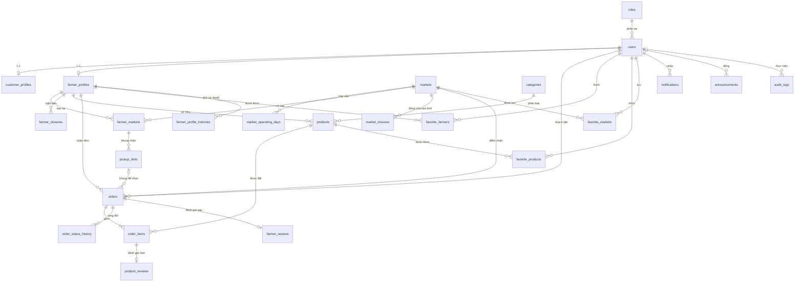

# ⚡ DỰ ÁN TECHWIZ 7: MARKETLINK (CHỦ ĐỀ: eGREEN BASKET)
## TÀI LIỆU BÓC TÁCH YÊU CẦU & ĐẶC TẢ HỆ THỐNG TOÀN DIỆN
> **Nguồn sự thật duy nhất (Single Source of Truth)**: `MarketLink End-to-End Web Solutions_SRS.pdf` (Phiên bản 1.0)  
> **Quy trình áp dụng**: Sổ tay kỹ thuật thực chiến 5 Pass Outside-In (`spec_for_techwiz7.md`)  
> **Chuẩn kỹ thuật Backend**: `django-backend_skill.md`  
> **Vai trò dự án**: Lead Architect (Người phê duyệt và ra mọi quyết định) & Trợ lý Phân tích (AI Assistant)

---

## 📋 BẢNG NHẬT KÝ QUYẾT ĐỊNH TOÀN DIỆN (DECISION LOG)
*(Ghi nhận toàn bộ quyết định kiến trúc chính thức D-001 → D-035 do Lead Architect phê duyệt. Quyết định có số lớn hơn thay thế phần tương ứng của quyết định cũ; các chỗ bị thay thế được ghi chú "cập nhật v1.7")*:

* **D-001 (Tech Stack Cố Định)**: Backend Django REST Framework + MySQL 8.x (InnoDB, `utf8mb4_0900_ai_ci`); Frontend React 19 / Vite + CSS3 thuần (CSS Modules tích hợp sẵn trong Vite + Design Tokens CSS Variables). Khớp danh mục công nghệ SRS §1.8 ("HTML5, CSS3").
* **D-002 (Actors Hệ Thống)**: 4 Tác nhân thực tế: `Admin`, `Farmer` (Vendor), `Customer`, `Guest` (Public).
* **D-003 (Ranh Giới Phạm Vi SRS §1.5)**: Không tích hợp cổng thanh toán trực tuyến (Thanh toán COD/tiền mặt tại sạp); Không vận chuyển/shipper (Chỉ nhận hàng tại sạp chợ); Không thẩm định chứng chỉ nông dân (VietGAP, Organic).
* **D-004 (A-001 Checkout Multi-Farmer)**: Giỏ hàng gom nhiều Farmer; khi checkout sinh **$N$ đơn độc lập**, mỗi Farmer 1 đơn; không dùng bảng Order cha / SubOrder. Một endpoint duy nhất `POST /api/customer/orders/`; All-or-Nothing; *(cập nhật v1.7 — D-029)* checkout chỉ kiểm tra tồn kho khả dụng, không trừ kho; giá lấy từ DB; giỏ hàng lưu tại client (Zustand persist trong `localStorage`).
* **D-005 (A-001b Chống Đặt Đơn Ảo & Giữ Hàng)**: *(cập nhật v1.7 — D-029)* Tạo đơn `PLACED` **không trừ kho**; kho chỉ bị trừ khi Farmer duyệt đơn. Áp dụng 4 chốt chặn: (1) Bắt buộc đăng nhập Customer; (2) *(cập nhật v1.5)* Giới hạn tối đa **10 đơn chưa duyệt (`PLACED`)** trên toàn hệ thống cho mỗi khách (setting `MAX_PLACED_ORDERS_PER_CUSTOMER`); đơn đã được Farmer duyệt không tính; đơn `PLACED` đã qua `pickup_start_at` không tính; **không giới hạn số đơn với cùng một Farmer** — khách quên món cứ đặt đơn mới (Mã lỗi 422 `OPEN_ORDER_LIMIT_EXCEEDED`, khóa `CustomerProfile`); (3) Throttle riêng `orders: 10/hour`; (4) Quyền Farmer `DECLINED` và Admin khóa tài khoản vi phạm.
* **D-006 (A-002 Order FSM Chuẩn Hóa)**: Chuẩn hóa đồ thị FSM 8 trạng thái: 3 trạng thái Mở (`PLACED`, `ACCEPTED`, `READY_FOR_PICKUP`) và 5 trạng thái Kết thúc (`COMPLETED`, `CANCELLED`, `DECLINED`, `NO_SHOW`, `EXPIRED`). Quản lý bằng 13 cạnh chuyển trạng thái *(cập nhật v1.7: T7 bãi bỏ theo D-030, thêm T14 theo D-029; 13 cạnh đang dùng là T1–T6, T8–T14)* (bao gồm các cạnh can thiệp khẩn cấp T12, T13 của Admin khi đình chỉ Farmer hoặc khóa Khách, giải quyết dứt điểm trạng thái `READY_FOR_PICKUP`); Triple-Gate Validation; OCC `version` + `If-Match`; lưu vết mỗi lần chuyển trạng thái / sửa đơn vào bảng `order_status_history` (`from_status`, `to_status`, `transition`, `actor`, `actor_role`, `change_reason`, `request_id`) trong cùng transaction với lệnh cập nhật `orders`.
* **D-007 (A-003 Sửa Đơn & Giờ Cutoff)**: Cutoff gắn theo từng đơn (`order_cutoff_hours`), tính và lưu cứng `cutoff_at`. Khách chỉ sửa trước cutoff. Farmer chỉ được chuyển `READY_FOR_PICKUP` sau cutoff. *(cập nhật v1.7 — D-030)* Khách sửa đơn đang `PLACED` thì áp dụng ngay; sửa đơn đang `ACCEPTED` thì tạo **yêu cầu thay đổi** chờ Farmer quyết định, đơn giữ nguyên nội dung cũ cho tới khi Farmer chấp nhận. `order_cutoff_hours` nhận giá trị 1–72 (không cho phép 0). Giao diện hiển thị thời điểm chốt cụ thể (`cutoff_at`), không hiển thị số giờ; khung có `cutoff_at` đã qua không cho chọn.
* **D-008 (A-004 Mẫu Tồn Kho Hàng Tuần)**: Không tạo bảng riêng; thêm `weekly_default_quantity` vào `Product`. Nông dân bấm nút "Apply to this week". Công thức: $\text{tồn\_kho\_mới} = \max(\text{mẫu} - \text{số\_đang\_giữ},\; 0)$, trong đó *(cập nhật v1.7 — D-029)* "số đang giữ" chỉ gồm đơn `ACCEPTED` và `READY_FOR_PICKUP` (đơn `PLACED` chưa trừ kho nên không tính). Service gọi quét lười `expire_overdue_orders` trước khi nạp kho.
* **D-009 (A-005 Quét Lười Đơn Quá Hạn)**: Không dùng Celery Beat. Dùng service quét lười `expire_overdue_orders` tại 3 điểm (đầu checkout, đầu nạp mẫu tuần, khi mở dashboard Farmer). Đơn `PLACED` quá giờ bắt đầu pickup tự chuyển `EXPIRED`; *(cập nhật v1.7 — D-029)* không đổi kho vì đơn chưa từng bị trừ kho, và không tính lỗi cho khách. Cùng lúc hủy các yêu cầu thay đổi đã quá hạn (D-030).
* **D-010 (A-006 Thông Báo Đa Kênh)**: In-app WebSocket (Channels + Daphne + Upstash Redis qua vé 1 lần `ws-ticket`) là kênh chính; Email Gmail SMTP phụ qua `on_commit` + `ThreadPoolExecutor(max_workers=2)`. Điểm phát duy nhất `notify()`. Gửi mail cho 6 loại sự kiện: Khách nhận 4 (`ACCEPTED`, `READY_FOR_PICKUP`, `DECLINED` gồm cả do Admin đình chỉ Farmer, `EXPIRED`); Farmer nhận 2 (khách hủy đơn qua T5/T6, đơn bị hủy do Admin khóa khách qua T5/T6/T13). Restock alert chỉ gửi in-app. Bảng `notifications` và `announcements`.
* **D-011 (A-007 Trợ Lý AI Chatbot)**: *(cập nhật v1.7 — D-034)* Bắt buộc triển khai. Chatbot xây dựng bằng Gemini API (dòng Flash) qua `google-genai` với Function Calling (chỉ đọc 4 công cụ, không truy cập DB trực tiếp, không text-to-SQL, không lưu lịch sử trên server).
* **D-012 (A-008 Bản Đồ Số)**: OpenStreetMap + React-Leaflet cho 100% bản đồ trong app (Ghim vị trí, hiển thị sạp, tính Haversine khoảng cách). Google Maps chỉ dùng cho link chỉ đường ngoại vi và iframe tại trang Contact Us. Tọa độ lưu `DecimalField(max_digits=9, decimal_places=6)`. Điểm nhận hàng suy ra từ chợ. Tọa độ của Farmer do hệ thống tự tra từ địa chỉ đăng ký (D-032). Giữ cột `markets.map_provider` (mặc định `OSM`) để khớp bảng mẫu SRS §1.8.
* **D-013 (A-009 Khung Pickup)**: Bảng `pickup_slots` lặp lại hàng tuần gắn với cặp Farmer–Chợ (`day_of_week`, `start_time`, `end_time`). Khách chọn ngày cụ thể + 1 khung hợp lệ. *(cập nhật v1.7 — D-031)* Khung chỉ được đặt vào ngày vừa là ngày chợ họp vừa là ngày hoạt động của Farmer.
* **D-014 (A-010 Tồn Kho & Đơn Vị Tính)**: Mỗi sản phẩm dùng 1 kho chung cho mọi chợ. `unit` là TextChoices (`KG`, `BUNCH`, `PIECE`, `PACK`...). Số lượng là số nguyên `stock_quantity INT`.
* **D-015 (A-011 Vòng Đời Farmer & Khóa User)**: Farmer: `PENDING` $\rightarrow$ `APPROVED` $\rightleftarrows$ `SUSPENDED` / `REJECTED`. Bị đình chỉ: ẩn khỏi public, toàn bộ đơn mở (`PLACED`, `ACCEPTED` qua T3, T4; `READY_FOR_PICKUP` qua T12) chuyển sang `DECLINED` (lý do `FARMER_SUSPENDED_BY_ADMIN`), hoàn kho cho đơn đã bị trừ kho (`ACCEPTED`, `READY_FOR_PICKUP` — D-029), thông báo khách. Khách bị khóa: `is_active=False`, toàn bộ đơn mở (`PLACED`, `ACCEPTED` qua T5, T6; `READY_FOR_PICKUP` qua T13) chuyển sang `CANCELLED` (lý do `CUSTOMER_LOCKED_BY_ADMIN`), hoàn kho cho đơn đã bị trừ kho (D-029), thông báo Farmer rằng hàng của các đơn này đã được trả về kho online. Admin không thao tác trên từng đơn (D-033).
* **D-016 (A-012 Đánh Giá & Nhận Xét)**: Chỉ đánh giá khi đơn `COMPLETED`. Mỗi món review tối đa 1 lần, mỗi đơn review Farmer 1 lần (1–5 sao). Farmer phản hồi 1 lần. Admin ẩn review (`is_hidden_by_admin`) chứ không xóa cứng.
* **D-017 (A-013 Chính Sách Xóa Dữ Liệu)**: Xóa mềm bằng `is_archived` cho sản phẩm và `is_active` cho chợ. Admin gỡ sản phẩm vi phạm dùng cờ `is_hidden_by_admin`.
* **D-018 (A-014 Báo Cáo & Thống Kê)**: Xem dashboard theo khoảng ngày; xuất file Excel bằng `openpyxl`. Mỗi lần xuất ghi `audit_logs` action `EXPORT_DATA`. Thay thế bảng `reports` của SRS bằng `audit_logs`.
* **D-019 (A-015 Yêu Thích & Đặt Lại Nhanh)**: 3 bảng riêng: `favorite_farmers`, `favorite_products`, `favorite_markets`. Nút "Reorder" nạp món vào giỏ theo giá hiện tại, bỏ qua món hết hàng/ngừng bán.
* **D-020 (A-016 Tiền Tệ & Ngôn Ngữ)** *(cập nhật)*: Đơn vị tiền tệ **USD** (`DecimalField(max_digits=10, decimal_places=2)`; giá sản phẩm $0.01–$10,000.00; JSON trả chuỗi thập phân 2 chữ số, ví dụ `"12.50"`; hiển thị `$12.50`). **Ngôn ngữ 100% tiếng Anh**: giao diện web, `message`, `errors`, thông báo in-app, email và nhãn hiển thị. Giờ hiển thị GMT+7.
* **D-021 (A-017 Chia Sẻ Tài Khoản Gia Đình)**: Đáp ứng chuẩn xác câu chữ SRS *"can be permitted"* thông qua kiến trúc đa phiên đồng thời của JWT (mỗi thiết bị 1 cặp Access/Refresh token riêng, JTI Blacklist chỉ thu hồi thiết bị đăng xuất, giỏ hàng độc lập từng máy qua client storage, dùng chung lịch sử đơn và yêu thích). Chi phí phát triển 0 dòng code thừa; công bố tài liệu tại trang About Us / FAQ.
* **D-022 (A-018 Giờ Mở Cửa Chợ & Đổi Lịch Chợ)**: Mỗi chợ có một cặp `open_time`/`close_time` chung cho mọi ngày mở cửa (Admin quản lý). Giờ riêng của từng Farmer là `pickup_slots`, bắt buộc rơi vào ngày chợ mở và nằm trong giờ mở cửa của chợ. Admin đổi lịch lâu dài (AD-16) thì hệ thống tự tắt (`is_active = false`) các khung nằm ngoài lịch mới và gửi `MARKET_SCHEDULE_CHANGED` cho Farmer liên quan; đơn đã đặt không bị ảnh hưởng (snapshot D-007). Ngừng hoạt động chợ (AD-17) bị chặn `422 RESOURCE_IN_USE` khi còn đơn mở tại chợ.
* **D-023 (A-019 Lịch Đóng Cửa Chợ & Lịch Nghỉ Farmer)**: Bảng `market_closures` (Admin khai báo: lễ, Tết, thời tiết) và `farmer_closures` (Farmer khai báo: "closed for the week" — SRS §1.1), theo khoảng ngày `start_date`–`end_date`. Ngày thuộc kỳ đóng cửa / nghỉ không được chọn làm ngày nhận hàng; khung giờ giữ nguyên và tự hoạt động lại sau kỳ nghỉ. Tạo kỳ nghỉ bị chặn `422 RESOURCE_IN_USE` nếu còn đơn mở có ngày nhận trong khoảng đó.
* **D-024 (A-020 Lý Do Khóa Tài Khoản Khách)**: Cột `customer_profiles.deactivation_reason` (bắt buộc khi khóa, xóa về NULL khi mở khóa; lịch sử khóa/mở vẫn nằm trong `audit_logs`). Đăng nhập đúng mật khẩu nhưng tài khoản đã khóa trả `403 ACCOUNT_LOCKED` kèm lý do; sai mật khẩu vẫn trả `401 INVALID_CREDENTIALS` (không tiết lộ trạng thái khóa cho người ngoài).
* **D-025 (A-021 Điều Kiện Gửi Restock Alert)**: Chỉ gửi `RESTOCK` khi Farmer chủ động bổ sung hàng (FA-14 sửa tồn kho, FA-18 áp dụng mẫu tuần) làm tồn kho từ `0` lên `> 0`. Không gửi khi hàng quay lại do đơn bị hủy / từ chối / khách không đến / Admin can thiệp / Farmer chấp nhận yêu cầu giảm số lượng.
* **D-026 (A-022 Vị Trí Sạp Trong Chợ)**: `farmer_markets.stall_label` bắt buộc, `VARCHAR(100)` (nhãn "Stall location in market"); snapshot `orders.stall_label` `VARCHAR(100)`. Chi tiết đơn luôn hiển thị số điện thoại Farmer kèm nút Gọi để khách tìm sạp.
* **D-027 (Tài Khoản Admin & Cổng Đăng Nhập Riêng)**: (1) Tài khoản Admin do phòng IT cấp bằng `python manage.py createsuperuser` hoặc lệnh seed; hệ thống **không** có màn hình / API tạo Admin. Admin đăng nhập bằng email + mật khẩu (`USERNAME_FIELD = "email"`). (2) Hai cổng đăng nhập: Customer và Farmer dùng chung `/login` (AU-03); Admin dùng trang riêng `/admin/login` (A-00, AU-09). Mỗi cổng từ chối role của cổng kia bằng `401 INVALID_CREDENTIALS` (không tiết lộ tài khoản Admin tồn tại). (3) Không có luồng bắt buộc đổi mật khẩu lần đầu; bỏ cột `users.must_change_password`. Đổi mật khẩu (AU-07) là thao tác tự nguyện. (4) `/django-admin/` chỉ là công cụ cho dev (`is_staff`), không phải trang quản trị của đề bài.
* **D-028 (Chặn Tài Khoản Spam — không thêm bảng)**: (1) Mỗi số điện thoại chỉ gắn **một** tài khoản Customer (và một tài khoản Farmer): `customer_profiles.phone`, `farmer_profiles.phone` được chuẩn hóa (`+84 90 123 4567`, `090.123.4567` → `0901234567`) và đặt UNIQUE — hiện thực: hàm `accounts/phone.py::normalize_phone()`, `CustomerProfile.save()` / `FarmerProfile.save()` tự chuẩn hóa trước khi lưu, migration `accounts/0005_unique_phone` (chuẩn hóa dữ liệu cũ rồi thêm UNIQUE); đăng ký trùng → `400 VALIDATION_ERROR` với lỗi dưới ô số điện thoại. (2) **Khóa tài khoản chính là blacklist**: tài khoản không bị xóa cứng (D-017) nên email và số điện thoại của tài khoản bị khóa không đăng ký lại được; mở khóa (AD-13) là gỡ chặn. Không có bảng blacklist riêng. (3) Cờ **"At risk"** ở A-04: khách có từ `AT_RISK_THRESHOLD` (3) đơn **`NO_SHOW`** trong `AT_RISK_WINDOW_DAYS` (30) ngày được đánh dấu (tuyệt đối không đếm `EXPIRED`, vì đơn hết hạn là do Farmer không duyệt đơn trước giờ nhận, không phải lỗi từ phía khách), tính trực tiếp từ `orders`; **Admin quyết định khóa**, hệ thống không tự khóa. (4) Hạn chế đã biết: không có OTP SMS nên số điện thoại vẫn có thể nhập bừa — ràng buộc trên chỉ nâng rào cản, không tuyệt đối.
* **D-029 (Trừ Kho Khi Duyệt, Hết Hạn & Khách Không Đến — v1.7)**:
  (1) **Tạo đơn (T1) không trừ kho**: hệ thống chỉ kiểm tra mỗi món có số lượng đặt ≤ `stock_quantity` hiện tại; thiếu → `400 INSUFFICIENT_STOCK`. Nhiều khách có thể cùng đặt một món; Farmer là người chọn đơn để duyệt.
  (2) **Duyệt đơn (T2) mới trừ kho**: khóa sản phẩm theo `id` tăng dần rồi trừ; không đủ hàng → `400 INSUFFICIENT_STOCK`, đơn vẫn `PLACED` để Farmer từ chối hoặc bổ sung kho rồi duyệt lại. Hệ thống không tự từ chối các đơn chờ khác.
  (3) **Chỉ cộng trả kho cho đơn đã bị trừ kho**: T4, T6, T11, T12, T13, T14 cộng trả; T3, T5, T8 không đổi kho.
  (4) **Hết hạn (`EXPIRED`, T8)**: đơn `PLACED` mà Farmer không duyệt trước `pickup_start_at` tự hết hạn, như chưa từng phát sinh: không đổi kho, không tính lỗi cho khách, khách nhận thông báo.
  (5) **Khách không đến (`NO_SHOW`, T11 từ `READY_FOR_PICKUP`, T14 từ `ACCEPTED`)**: Farmer bấm sau khi hết khung nhận (`now ≥ pickup_end_at`) và đã liên hệ khách không được; không bắt chờ thêm. Hàng được **cộng trả về kho online**. Mỗi đơn `NO_SHOW` tính 1 lần vào cờ "At risk" của khách (D-028). Đã `NO_SHOW` thì không thể chuyển sang `COMPLETED`.
  (6) **Farmer từ chối đơn đã duyệt (T4)**: được làm tới trước `pickup_start_at`, bắt buộc lý do 5–500 ký tự, không khóa nút trước giờ nhận; hộp thoại nhắc Farmer gọi điện cho khách và có tùy chọn đánh dấu hết hàng các món trong đơn.
* **D-030 (Sửa Đơn & Yêu Cầu Thay Đổi — v1.7)**:
  (1) **Đơn `PLACED`**: khách sửa trực tiếp; hệ thống chỉ kiểm tra kho khả dụng, không trừ kho; ghi lịch sử và báo Farmer `ORDER_MODIFIED`.
  (2) **Đơn `ACCEPTED`**: khách gửi **yêu cầu thay đổi**; đơn giữ nguyên nội dung cũ và số hàng đã trừ. Hệ thống kiểm tra kho khả dụng đủ cho phần tăng thêm mới nhận yêu cầu. Farmer có 3 lựa chọn: *Chấp nhận* (trừ thêm phần tăng / trả lại phần giảm rồi áp dụng nội dung mới), *Từ chối thay đổi* (giữ nguyên đơn cũ), *Hủy cả đơn* (T4, có lý do, hoàn kho). Mỗi lựa chọn đều báo khách.
  (3) **Quy tắc thời gian**: chỉ gửi yêu cầu trước `cutoff_at` hiện tại; ngày nhận mới phải từ hôm nay trở đi (khóa ngày quá khứ) và không quá `BOOKING_HORIZON_DAYS` (7) ngày tính từ hôm nay; `cutoff_at` của khung mới chưa qua. Tới `pickup_start_at` của đơn hiện tại mà Farmer chưa xử lý thì yêu cầu tự hủy, đơn giữ nguyên. Mỗi đơn chỉ có một yêu cầu đang chờ; yêu cầu mới thay yêu cầu cũ.
  (4) **Lưu trữ gọn**: không thêm bảng; thêm 1 cột JSON `orders.pending_change` (NULL khi không có yêu cầu). Mọi sự kiện gửi / chấp nhận / từ chối / tự hủy yêu cầu ghi 1 dòng `order_status_history` với `from_status = to_status`, `transition = NULL`.
  (5) **Cạnh T7 (`ACCEPTED → PLACED`) bị bãi bỏ**: sửa đơn không còn làm đổi trạng thái.
  (6) **Kiểm tra sản phẩm khi sửa**: món thêm mới hoặc tăng số lượng phải đang bán công khai (không lưu trữ, không bị Admin gỡ, đang mở bán, Farmer `APPROVED`); món đã ngừng bán chỉ được giữ nguyên hoặc giảm.
  (7) Chỉ chính chủ đơn được sửa; Admin và nhân viên không sửa thay.
* **D-031 (Ngày Hoạt Động Của Farmer — v1.7)**: Farmer khai **ngày hoạt động** (Thứ 2 → Chủ nhật) ngay khi đăng ký, **bắt buộc ≥ 1 ngày**, sửa được ở hồ sơ sạp. Lưu trong `farmer_profiles.operating_days` (JSON danh sách số 1–7, không thêm bảng). Khung giờ nhận chỉ được đặt vào ngày vừa là ngày chợ họp vừa là ngày hoạt động của Farmer; ngày khách được chọn cũng phải thỏa cả hai. Bỏ một ngày hoạt động thì các khung giờ của ngày đó tự tắt; nếu còn đơn mở có ngày nhận rơi vào thứ đó (từ hôm nay trở đi) thì chặn `422 RESOURCE_IN_USE` kèm danh sách đơn. Thay thế DB-03 (trước đây ngày hoạt động suy ra từ khung giờ).
* **D-032 (Tọa Độ Farmer Tự Tra Từ Địa Chỉ — v1.7)**: Farmer không phải nhập tọa độ. Khi đăng ký (AU-02) hoặc đổi địa chỉ (FA-03), backend tự tra tọa độ từ địa chỉ qua OpenStreetMap Nominatim (gọi ngoài transaction, timeout 5 giây, tối đa 1 lượt/giây, có User-Agent riêng). Tra không được thì để tọa độ trống, không chặn đăng ký; bản đồ dùng vị trí chợ Farmer bán và F-08 hiện nhắc "Location not found". Farmer có thể kéo ghim trên bản đồ để chỉnh lại (không bắt buộc). Độ chính xác thường ở mức phường / đường.
* **D-033 (Quyền Admin Với Đơn Hàng — v1.7)**: Admin **không** hủy hay sửa từng đơn. Chỉ khi Admin đình chỉ Farmer (AD-07) hoặc khóa khách (AD-12), hệ thống tự đóng các đơn mở liên quan (T3/T4/T12 hoặc T5/T6/T13), hoàn kho theo D-029. Lý do Admin nhập chỉ lưu ở `audit_logs` và `farmer_profiles.status_reason` / `customer_profiles.deactivation_reason`; lịch sử đơn luôn ghi mã hệ thống (`FARMER_SUSPENDED_BY_ADMIN`, `CUSTOMER_LOCKED_BY_ADMIN`) và email gửi khách / Farmer dùng câu chữ chuẩn, trung tính.
* **D-034 (Phạm Vi Bắt Buộc — v1.7)**: Mọi tính năng có trong tài liệu thiết kế này đều **bắt buộc** triển khai, kể cả thông báo in-app (WebSocket) + email, yêu thích + đặt lại nhanh + cảnh báo có hàng lại, trợ lý AI. Bỏ nhóm "Điểm cộng" trong Scope Freeze.
* **D-035 (Diễn Giải "Track Deliveries" — v1.7)**: Mục "Track Deliveries" trong sơ đồ luồng SRS (trang 7) được hiểu là khách theo dõi trạng thái đơn nhận tại chợ (chờ duyệt, đã duyệt, sẵn sàng chờ đến lấy, hoàn tất) và tình trạng còn hàng, vì SRS §1.5 loại trừ giao hàng.

---

# 🚀 PASS 1: BÓC TÁCH NGUYÊN BẢN (RAW EXTRACTION)

## 1. DANH SÁCH TÁC NHÂN HỆ THỐNG THỰC TẾ (ACTORS)
Hệ thống xác định 4 tác nhân dựa trên văn bản SRS và Sơ đồ luồng chức năng (Trang 7):

1. **Quản trị viên (Admin / Administrator)**: Có bảng điều khiển riêng biệt; quản lý người dùng, xét duyệt và đình chỉ nông dân, quản lý danh mục chợ, kiểm duyệt nội dung (sản phẩm, đánh giá), xem báo cáo phân tích toàn sàn và cấu hình hệ thống.
2. **Nông dân / Chủ quầy hàng (Farmer / Vendor)**: Quản lý hồ sơ quầy hàng, vị trí sạp trên bản đồ số; thiết lập danh mục sản phẩm, mẫu tồn kho hàng tuần; tiếp nhận và cập nhật trạng thái đơn đặt trước; xem báo cáo doanh thu và phản hồi đánh giá.
3. **Khách hàng (Customer)**: Tìm kiếm chợ và nông dân gần nhất qua bản đồ số; lọc sản phẩm; thêm giỏ hàng và đặt đơn lấy tại chợ (pre-order pickup); theo dõi, chỉnh sửa hoặc hủy đơn trước giờ đóng (cutoff); lưu yêu thích, đánh giá và tương tác với trợ lý AI.
4. **Khách vãng lai / Công khai (Guest / Public)**: Người dùng chưa đăng nhập; xem các trang thông tin giới thiệu (About Us), liên hệ kèm bản đồ (Contact Us); duyệt xem danh sách chợ và sản phẩm công khai; đăng ký tài khoản Khách hàng hoặc Nông dân.

---

## 2. PHẠM VI HỆ THỐNG VÀ RÀNG BUỘC CỐT TỬ (SCOPE & CONSTRAINTS)
Trích xuất từ mục 1.5 của SRS (Trang 7–8):

* 🚫 **Không tích hợp cổng thanh toán trực tuyến (Ngoại vi phạm vi)**: Ứng dụng web không có bất kỳ chức năng thanh toán trực tuyến nào — việc thanh toán cho các đơn đặt trước sẽ được thực hiện trực tiếp bằng tiền mặt/tại chỗ khi nhận hàng tại chợ.
* 🚫 **Không hỗ trợ dịch vụ giao hàng / shipper (Ngoại vi phạm vi)**: Khâu vận chuyển giao hàng tận nơi nằm ngoài phạm vi; ứng dụng chỉ hỗ trợ nhận hàng trực tiếp tại sạp chợ.
* 🚫 **Không thẩm định chứng nhận nông dân (Ngoại vi phạm vi)**: Hệ thống không có chức năng xác thực danh tính, giấy phép kinh doanh hay chứng nhận an toàn thực phẩm/chứng nhận hữu cơ của nông dân.
* 🗺️ **Tích hợp bản đồ số (Trong phạm vi)**: Bắt buộc nhúng Google Maps API hoặc OpenStreetMap để định vị chợ, quầy hàng nông dân, hiển thị chỉ đường và điểm hẹn lấy hàng.
* 🤖 **Trợ lý ảo AI (SRS ghi là tùy chọn; dự án vẫn triển khai bắt buộc — D-034)**: Tích hợp chatbot hỗ trợ khách hàng tìm kiếm sản phẩm, giải đáp khung giờ chợ họp, thời gian nông dân có mặt và thông tin sản phẩm.

---

## 3. TRÍCH XUẤT CÂU LỆNH CHỨC NĂNG & QUY TẮC NGHIỆP VỤ NGUYÊN BẢN

### A. Phân Hệ Khách Hàng (Customer Features — SRS §1.6, Trang 8–9)
1. **Đăng ký & Đăng nhập**: Khách hàng phải có khả năng đăng ký, đăng nhập và truy cập an toàn vào bảng điều khiển cá nhân; bắt buộc cung cấp họ tên, số điện thoại, email và địa chỉ; có thể lưu nhiều nông dân và sản phẩm yêu thích; cho phép chia sẻ tài khoản giữa các thành viên trong gia đình.
2. **Duyệt Chợ & Nông Dân**: Duyệt các chợ lân cận theo vị trí và ngày họp; xem danh sách nông dân có mặt; xem hồ sơ sạp, ngày hoạt động, tồn kho tuần; xem bản đồ nhúng kèm ghim vị trí và chỉ đường.
3. **Tìm Kiếm, Xem & Lọc Sản Phẩm**: Duyệt danh mục (rau củ, trái cây, bơ sữa, đồ làm bánh...) kèm bộ lọc theo giá, danh mục, chợ, ngày; xem chi tiết giá, đơn vị tính, số lượng còn lại và nông dân.
4. **Đặt Đơn Hàng Trước Nhận Tại Chợ (Pre-Orders for Pickup)**: Thêm vào giỏ và đặt đơn theo tồn kho khả dụng; chọn ngày và khung giờ pickup trong khung giờ phục vụ; theo dõi trạng thái đơn (`placed`, `accepted`, `ready for pickup`, `completed`); hủy hoặc sửa đơn trước giờ cutoff; thanh toán trực tiếp khi nhận hàng.
5. **Quản Lý Đơn Hàng & Yêu Thích**: Xem, sửa, hủy đơn hàng; xem lại lịch sử đơn và đặt lại nhanh (reorder); đánh dấu nông dân và sản phẩm yêu thích để nhận cảnh báo có hàng lại (restock alerts); lưu vị trí chợ ưu tiên.
6. **Đánh Giá & Nhận Xét**: Đánh giá sao và nhận xét về nông dân và sản phẩm sau khi đơn hoàn tất; xem trước đánh giá của người khác trước khi đặt.
7. **Trợ Lý AI & Thông Báo**: Chatbot AI tùy chọn hỗ trợ tìm hàng, giải đáp giờ chợ, tính khả dụng và chi tiết sản phẩm; nhận thông báo qua email hoặc in-app alert khi đơn xác nhận và khi sẵn sàng lấy.

### B. Phân Hệ Nông Dân (Farmer Features — SRS §1.6, Trang 10)
1. **Đăng Ký & Quản Lý Hồ Sơ**: Đăng ký cung cấp tên quầy, người liên hệ, số điện thoại, email, địa chỉ; hoàn thiện hồ sơ gồm chợ tham gia, ngày hoạt động, khung giờ pickup, tọa độ bản đồ số.
2. **Quản Lý Kho Hàng Tuần & Giá Bán**: Thêm, sửa, xem, xóa sản phẩm (tên, danh mục, giá, đơn vị tính, số lượng tồn kho, mô tả, hình ảnh); thiết lập mẫu tồn kho định kỳ hàng tuần và điều chỉnh theo thực tế; đánh dấu hết hàng hoặc tạm ngừng.
3. **Quản Lý Đơn Đặt Trước**: Xem đơn đặt trước gửi đến, chấp nhận hoặc từ chối đơn, đánh dấu đơn sẵn sàng lấy; thiết lập thời gian chốt sổ (cutoff time) và quản lý khung giờ nhận hàng.
4. **Lịch Sử Đơn Hàng & Thống Kê**: Xem lịch sử bán hàng, sản phẩm bán chạy, tổng số đơn, đơn chờ xử lý, tóm tắt tổng doanh thu.
5. **Phản Hồi Đánh Giá**: Xem và tùy ý phản hồi nhận xét của khách để lại trên sản phẩm.

### C. Phân Hệ Quản Trị Viên (Admin Features — SRS §1.6, Trang 10–11)
1. **Đăng Nhập & Bảng Điều Khiển**: Đăng nhập dashboard riêng; tóm tắt tổng số nông dân, khách hàng, chợ và đơn hàng.
2. **Quản Lý Nông Dân & Khách Hàng**: Phê duyệt hoặc đình chỉ nông dân trước khi được đăng sản phẩm; kích hoạt hoặc vô hiệu hóa tài khoản khách vi phạm chính sách.
3. **Quản Lý Danh Mục Chợ**: Thêm, sửa, xóa chợ nông sản (tên, địa chỉ, ngày họp, giờ hoạt động, tọa độ bản đồ nhúng).
4. **Kiểm Duyệt Nội Dung**: Xem và gỡ bỏ sản phẩm hoặc đánh giá vi phạm quy chuẩn.
5. **Báo Cáo & Phân Tích**: Báo cáo tổng đơn hàng, doanh thu theo chợ, nông dân tích cực nhất.
6. **Cấu Hình Hệ Thống**: Quản lý danh mục sản phẩm gốc, phát thông báo/thông cáo toàn hệ thống.

### D. Các Tính Năng Bổ Trợ & Trang Tĩnh (SRS §1.6, Trang 11–12)
* Phân quyền RBAC nghiêm ngặt; Tìm kiếm và lọc đa tiêu chí kèm bản đồ; Giao diện Responsive; Thông báo email/in-app; Trang About Us và Contact Us có Google Maps.

---

## 4. DANH MỤC USE CASE NGUYÊN BẢN (RAW USE CASES)

| Mã UC | Tên Use Case | Tác Nhân Chính | Căn Cứ Đề Bài SRS |
| :---: | :--- | :--- | :--- |
| **UC-01** | Đăng ký tài khoản (Khách hàng / Nông dân) | Khách hàng, Nông dân | §1.6, Trang 8, 10 |
| **UC-02** | Đăng nhập, đăng xuất & xác thực phiên làm việc | Khách hàng, Nông dân, Quản trị viên | §1.6, Trang 8, 10, 11 |
| **UC-03** | Xem trang Giới thiệu & Liên hệ có bản đồ | Khách vãng lai, Mọi tác nhân | §1.6, Trang 12 |
| **UC-04** | Duyệt & Tìm kiếm Chợ trên bản đồ số | Khách vãng lai, Khách hàng | §1.6, Trang 8, 11 |
| **UC-05** | Tìm kiếm, lọc sản phẩm theo danh mục, giá, chợ, ngày | Khách vãng lai, Khách hàng | §1.6, Trang 8, 11 |
| **UC-06** | Xem chi tiết Nông dân và danh sách hàng trong tuần | Khách vãng lai, Khách hàng | §1.6, Trang 8 |
| **UC-07** | Quản lý Giỏ hàng & Đặt đơn nhận tại chợ (Pre-order) | Khách hàng | §1.6, Trang 9 |
| **UC-08** | Xem, Sửa, Hủy đơn đặt trước trước giờ Cutoff | Khách hàng | §1.6, Trang 9 |
| **UC-09** | Quản lý danh sách Yêu thích & Đặt lại nhanh (Reorder) | Khách hàng | §1.6, Trang 8, 9 |
| **UC-10** | Đánh giá & viết nhận xét sau khi hoàn tất đơn; xem đánh giá của người khác trước khi đặt | Khách hàng (xem: cả Khách vãng lai) | §1.6, Trang 9, 12 |
| **UC-11** | Hỏi đáp với Trợ lý ảo AI (Optional) | Khách vãng lai, Khách hàng (tra cứu đơn cần đăng nhập) | §1.6, Trang 9; §1.8 |
| **UC-12** | Nhận thông báo (in-app + email): xác nhận đơn, sẵn sàng lấy, bị từ chối, hết hạn; cảnh báo có hàng lại món yêu thích | Khách hàng | §1.6, Trang 9, 12 |
| **UC-13** | Cập nhật hồ sơ Nông dân, sạp hàng & tọa độ bản đồ | Nông dân | §1.6, Trang 10 |
| **UC-14** | Thiết lập & Điều chỉnh mẫu tồn kho hàng tuần (Weekly stock) | Nông dân | §1.6, Trang 10 |
| **UC-15** | Thêm, sửa, xóa, ẩn sản phẩm & đánh dấu hết hàng | Nông dân | §1.6, Trang 10 |
| **UC-16** | Cấu hình giờ Cutoff và các khung giờ nhận hàng (Pickup slots)| Nông dân | §1.6, Trang 10 |
| **UC-17** | Tiếp nhận đơn đặt trước: Duyệt, Từ chối, Sẵn sàng lấy hàng (T2, T3, T4, T9) | Nông dân | §1.6, Trang 10 |
| **UC-18** | Xem báo cáo doanh thu, đơn hàng & sản phẩm bán chạy | Nông dân | §1.6, Trang 10 |
| **UC-19** | Xem và phản hồi đánh giá của khách hàng | Nông dân | §1.6, Trang 10 |
| **UC-20** | Xem Dashboard tổng quan số liệu toàn nền tảng | Quản trị viên | §1.6, Trang 10–11 |
| **UC-21** | Xem, phê duyệt, từ chối, đình chỉ, khôi phục tài khoản Nông dân; đình chỉ kéo theo hủy đơn mở (T3, T4, T12) | Quản trị viên | §1.6, Trang 11 |
| **UC-22** | Xem, khóa hoặc kích hoạt tài khoản Khách hàng vi phạm; khóa kéo theo hủy đơn mở (T5, T6, T13) | Quản trị viên | §1.6, Trang 11 |
| **UC-23** | Quản lý danh mục Chợ (Thêm, sửa, gỡ mềm, gắn tọa độ map) | Quản trị viên | §1.6, Trang 11 |
| **UC-24** | Quản lý danh mục sản phẩm (Master Categories) | Quản trị viên | §1.6, Trang 11 |
| **UC-25** | Kiểm duyệt nội dung: Gỡ sản phẩm, ẩn đánh giá vi phạm (không xóa cứng, D-016) | Quản trị viên | §1.6, Trang 11 |
| **UC-26** | Xem và xuất báo cáo doanh thu, đơn hàng toàn sàn | Quản trị viên | §1.6, Trang 11 |
| **UC-27** | Đăng thông báo/tin tức toàn hệ thống | Quản trị viên | §1.6, Trang 11 |
| **UC-28** | Xem Dashboard cá nhân (đơn đang mở, lần nhận sắp tới, lối tắt yêu thích) | Khách hàng | §1.6 Trang 8 ("access their dashboard"); §1.4 ("dashboards for both Farmers and customers") |
| **UC-29** | Tìm kiếm, sắp xếp, lọc danh bạ Nông dân (vị trí, chợ, ngày, danh mục) | Khách vãng lai, Khách hàng | §1.6 Trang 11–12 ("Search, Sort, Filter ... Farmers") |
| **UC-30** | Xác nhận đơn hoàn tất / đánh dấu khách không đến nhận (T10, T11, T14) | Nông dân | §1.6 Trang 9 (trạng thái "completed"); D-006 |
| **UC-31** | Nhận thông báo đơn hàng (in-app + email): đơn mới, khách sửa, khách hủy, đơn bị hủy do khách bị khóa | Nông dân | Suy ra từ §1.6 Trang 10 ("view incoming pre-orders"); D-010 |
| **UC-32** | Quản lý hồ sơ cá nhân & đổi mật khẩu | Khách hàng, Nông dân, Quản trị viên | §1.6 Trang 8, 10; Sơ đồ luồng Trang 7 ("Update Profile") |
| **UC-33** | Giám sát hệ thống qua Nhật ký an ninh (Audit Log) | Quản trị viên | Sơ đồ luồng Trang 7 ("Monitor System", "Control Access") |
| **UC-34** | Tự động chuyển đơn quá hạn duyệt sang `EXPIRED` (không đổi kho — D-029) và tự hủy yêu cầu thay đổi quá hạn (quét lười) | Hệ thống | Giả định A-005; D-009 |

> **Tác nhân "Hệ thống"** chỉ xuất hiện ở UC-34, cạnh T8 (FSM) và sự kiện tự hủy yêu cầu thay đổi (D-030). Đây không phải role đăng nhập; trong `order_status_history` ghi `actor_role = SYSTEM`, `actor` để trống.

---

# 🛡️ PASS 2: PHẢN BIỆN ĐỐI KHÁNG, SỔ ĐĂNG KÝ GIẢ ĐỊNH & KHÓA CHẶT YÊU CẦU NỀN TẢNG (DECISION GATE)

## 1. SỔ ĐĂNG KÝ GIẢ ĐỊNH HOÀN CHỈNH (ASSUMPTION REGISTER)
Áp dụng kỷ luật 4 tầng tư duy: **FACT (Sự thật SRS) $\rightarrow$ ASSUMPTION (Giả định kỹ thuật) $\rightarrow$ DECISION (Quyết định của Lead) $\rightarrow$ IMPACT (Tác động thi công)**:

| ID | Vấn Đề Nghiệp Vụ & Bằng Chứng SRS (FACT) | Giả Định Đề Xuất (ASSUMPTION) | Quyết Định Đã Chốt (DECISION GATE) | Tác Động Kỹ Thuật (IMPACT) |
| :---: | :--- | :--- | :---: | :--- |
| **A-001** | Khách thêm sản phẩm vào giỏ và đặt hàng (SRS §1.6 Trang 9). | Giỏ hàng cho phép chứa sản phẩm từ nhiều Farmer khác nhau. | ✅ **ĐÃ CHỐT (D-004)**<br>Checkout sinh **$N$ đơn độc lập**; không dùng Master-SubOrder. | 1 endpoint `POST /orders/`; All-or-Nothing; Kiểm tra kho khả dụng, không trừ kho (D-029); Giỏ hàng lưu Zustand client. |
| **A-001b**| Đặt hàng theo tồn kho khả dụng; Farmer duyệt/từ chối (SRS §1.6). | Trừ kho khi đặt hay khi duyệt? Cách chống đặt đơn ảo giam hàng. | ✅ **ĐÃ CHỐT (D-005, D-029)**<br>Không trừ kho khi đặt; chỉ trừ khi Farmer duyệt. Áp dụng 4 chốt chặn chống spam. | Tối đa 10 đơn chưa duyệt (`PLACED`, chưa qua giờ nhận) toàn sàn, không giới hạn theo Farmer (Lỗi 422, v1.5); Throttle `orders: 10/h`; Khóa `CustomerProfile`. |
| **A-002** | Xem trạng thái đơn; hủy/sửa trước cutoff; Farmer duyệt/từ chối (SRS §1.6). | Danh sách trạng thái đầy đủ và các bước chuyển hợp lệ của đơn hàng. | ✅ **ĐÃ CHỐT (D-006)**<br>FSM 8 trạng thái; 13 cạnh (T1–T6, T8–T14; T7 bãi bỏ v1.7); Triple-Gate; OCC `version`. | Ma trận `TRANSITIONS` trong service; Kiểm soát OCC qua header `If-Match`; Lịch sử ghi bảng `order_status_history`. |
| **A-003** | Khách hủy hoặc sửa đơn trước giờ cutoff của Farmer (SRS §1.6). | Định nghĩa cutoff và phạm vi các trường khách được phép sửa. | ✅ **ĐÃ CHỐT (D-007)**<br>Cutoff tính theo từng đơn; Sửa khi `ACCEPTED` tạo yêu cầu thay đổi chờ Farmer quyết định (D-030). | Lưu cứng `Order.cutoff_at`; Chặn `READY_FOR_PICKUP` trước cutoff; Cột `orders.pending_change`. |
| **A-004** | Farmer thiết lập mẫu tồn kho tuần và điều chỉnh linh hoạt (SRS §1.6). | Cơ chế nạp mẫu tuần có ghi đè lượng hàng đang giữ của đơn mở không? | ✅ **ĐÃ CHỐT (D-008)**<br>Nút bấm UI nạp mẫu; Trừ đi lượng hàng đang giữ bởi đơn đã duyệt / sẵn sàng. | Trường `weekly_default_quantity` trong `Product`; Công thức $\max(\text{mẫu} - \text{đang\_giữ}, 0)$. |
| **A-005** | Đơn `PLACED` Farmer không duyệt hoặc khách không đến lấy (SRS §1.6). | Mốc hết hạn của đơn chưa duyệt và cơ chế quét đơn tự động. | ✅ **ĐÃ CHỐT (D-009)**<br>Hết hạn tại `pickup_start_at` $\rightarrow$ `EXPIRED`. Dùng quét lười 3 điểm. | Service `expire_overdue_orders` chạy tại checkout, nạp mẫu và xem dashboard; Không đổi kho, không tính lỗi khách (D-029). |
| **A-006** | Khách nhận thông báo qua email hoặc in-app alert (SRS §1.6 Trang 12). | Lựa chọn kênh thông báo tối ưu cho bài thi và tránh nghẽn. | ✅ **ĐÃ CHỐT (D-010)**<br>In-app WebSocket là kênh đảm bảo; Email Gmail SMTP là kênh phụ. | Điểm phát duy nhất `notify()`; WebSocket ticket 1 lần; ThreadPoolExecutor(2) gửi mail nền. |
| **A-007** | Trợ lý ảo AI / Chatbot hỗ trợ tra cứu thông tin (SRS §1.6 & §1.8). | Tự xây hay dùng tawk.to/Zapier? Phạm vi can thiệp dữ liệu của AI. | ✅ **ĐÃ CHỐT (D-011)**<br>Gemini Flash + Function Calling (chỉ đọc 4 tools); Bắt buộc (D-034). | Endpoint `/api/chat/messages/`; Không text-to-SQL; Có cờ bật/tắt `AI_CHAT_ENABLED`. |
| **A-008** | Nhúng bản đồ Google Maps hoặc OpenStreetMap (SRS §1.8 Trang 15). | Lựa chọn giải pháp bản đồ số an toàn, không tốn chi phí / API key. | ✅ **ĐÃ CHỐT (D-012)**<br>OpenStreetMap + React-Leaflet trong app; Google Maps cho link ngoài. | Lưu tọa độ `Decimal(9,6)`; Tính khoảng cách Haversine ở backend; Fix bẫy CSS/Icon Leaflet. |
| **A-009** | Khách chọn ngày và khung giờ lấy hàng khả dụng (SRS §1.6 Trang 9). | Cấu trúc dữ liệu khung giờ nhận hàng (Pickup Slot) của Farmer. | ✅ **ĐÃ CHỐT (D-013)**<br>Bảng `pickup_slots` lặp lại hàng tuần gắn cặp Farmer–Chợ. | Trường `day_of_week`, `start_time`, `end_time`; Khách chọn ngày cụ thể + 1 slot hợp lệ. |
| **A-010** | Danh mục sản phẩm, đơn vị tính và số lượng tồn kho (SRS §1.6). | Kho chia theo chợ hay dùng chung? Kiểu dữ liệu số lượng. | ✅ **ĐÃ CHỐT (D-014)**<br>Kho chung cho mọi chợ; Số lượng là số nguyên `INT`. | `stock_quantity = IntegerField`; `unit = TextChoices` (`KG`, `BUNCH`, `PIECE`, `PACK`). |
| **A-011** | Admin duyệt/đình chỉ Farmer; khóa tài khoản khách vi phạm (SRS §1.6). | Vòng đời tài khoản Farmer và xử lý các đơn mở khi bị khóa. | ✅ **ĐÃ CHỐT (D-015)**<br>Farmer 4 trạng thái; Khóa/Đình chỉ thì đơn mở tự đóng; hoàn kho đơn đã duyệt (D-029, D-033). | Đơn của Farmer bị đình chỉ chuyển `DECLINED`; Đơn của khách bị khóa chuyển `CANCELLED`. |
| **A-012** | Khách đánh giá sao và nhận xét sau khi đơn hoàn tất (SRS §1.6 Trang 9). | Giới hạn số lần đánh giá và phạm vi đánh giá (Farmer vs Sản phẩm). | ✅ **ĐÃ CHỐT (D-016)**<br>Chỉ review khi `COMPLETED`; Mỗi món 1 review, mỗi đơn 1 review Farmer. | Rating 1–5 sao; Farmer phản hồi 1 lần; Admin ẩn review vi phạm (`is_hidden_by_admin`). |
| **A-013** | Xóa sản phẩm và xóa chợ khỏi hệ thống (SRS §1.6). | Cơ chế xóa bảo vệ toàn vẹn dữ liệu khi đã phát sinh đơn hàng. | ✅ **ĐÃ CHỐT (D-017)**<br>Xóa mềm (`is_archived` cho sản phẩm, `is_active` cho chợ). | Áp dụng `on_delete=models.RESTRICT`; Admin gỡ sản phẩm dùng `is_hidden_by_admin`. |
| **A-014** | Admin xem báo cáo doanh thu, đơn hàng, nông dân năng nổ (SRS §1.6). | Báo cáo xem trên màn hình hay xuất file? Lưu trữ bảng reports. | ✅ **ĐÃ CHỐT (D-018)**<br>Xem dashboard theo ngày; Xuất Excel (`openpyxl`); Ghi `audit_logs`. | Thay bảng `reports` của SRS bằng `audit_logs` action `EXPORT_DATA`. |
| **A-015** | Lưu yêu thích (Farmer, sản phẩm, chợ) và đặt lại nhanh (SRS §1.6). | Thiết kế bảng lưu yêu thích và nghiệp vụ nút "Reorder". | ✅ **ĐÃ CHỐT (D-019)**<br>3 bảng yêu thích riêng; Đặt lại nạp món vào giỏ theo giá hiện tại. | `favorite_farmers`, `favorite_products`, `favorite_markets`; Bỏ qua món hết hàng khi reorder. |
| **A-016** | Đơn giá sản phẩm và ngôn ngữ giao diện hiển thị. | Lựa chọn tiền tệ (VND/USD) và ngôn ngữ chuẩn cho đồ án. | ✅ **ĐÃ CHỐT (D-020)**<br>Tiền tệ USD (`Decimal(10,2)`), giao diện tiếng Anh. | Format tiền tệ USD (`$12.50`); giao diện, `message`, thông báo và email 100% tiếng Anh. |
| **A-017** | Chia sẻ tài khoản giữa các thành viên trong gia đình (SRS §1.6). | Có cần xây dựng module phân quyền gia đình riêng không? | ✅ **ĐÃ CHỐT (D-021)**<br>Đáp ứng đúng nghĩa đen *"can be permitted"*: Đa phiên JWT + Giỏ hàng Client. | Không chặn concurrent sessions; JTI blacklist độc lập; 0 dòng code thừa; Ghi FAQ. |
| **A-018** | Admin quản lý "operating days, timings" của chợ; Farmer có "operating days, pickup time windows" riêng (SRS §1.6). | Giờ chợ và giờ Farmer quan hệ thế nào? Xử lý khung của Farmer khi chợ đổi lịch. | ✅ **ĐÃ CHỐT (D-022)**<br>Chợ 1 cặp giờ chung; khung Farmer nằm trong giờ chợ; đổi lịch thì tự tắt khung ngoài lịch. | AD-16 tự tắt slot + thông báo `MARKET_SCHEDULE_CHANGED`; AD-17 chặn khi còn đơn mở. |
| **A-019** | Khách đến chợ mới biết Farmer nghỉ tuần đó (SRS §1.1); chợ thật đóng cửa dịp lễ, Tết. | Biểu diễn ngày nghỉ khi khung giờ lặp hằng tuần. | ✅ **ĐÃ CHỐT (D-023)**<br>2 bảng `market_closures`, `farmer_closures` theo khoảng ngày. | Loại ngày nghỉ khỏi PU-08 và khi tạo đơn; chặn tạo kỳ nghỉ khi còn đơn mở trong khoảng. |
| **A-020** | Admin khóa khách "in case of policy violations" (SRS §1.6). | Khách bị khóa có được biết lý do không? | ✅ **ĐÃ CHỐT (D-024)**<br>Lưu `deactivation_reason`; báo lý do khi đăng nhập đúng mật khẩu. | Cột mới trong `customer_profiles`; mã `403 ACCOUNT_LOCKED` kèm lý do. |
| **A-021** | Cảnh báo có hàng lại cho món yêu thích (SRS §1.6). | Nguồn nào làm hàng "có lại" thì được báo? | ✅ **ĐÃ CHỐT (D-025)**<br>Chỉ khi Farmer chủ động bổ sung hàng. | Hook restock chỉ ở FA-14, FA-18; tránh báo liên tục khi đơn hủy/trả kho. |
| **A-022** | Khách nhận hàng tại sạp trong chợ (SRS §1.5). | Khách tìm đúng sạp bằng cách nào khi không lưu tọa độ sạp? | ✅ **ĐÃ CHỐT (D-026)**<br>`stall_label` bắt buộc, ≤ 100 ký tự; hiển thị SĐT Farmer + nút Gọi. | `farmer_markets.stall_label NOT NULL`; snapshot `orders.stall_label` 100 ký tự. |
| **A-023** | Sơ đồ luồng SRS trang 7 ghi "Track Deliveries" nhưng §1.5 loại trừ giao hàng. | Hiểu "Track Deliveries" là gì? | ✅ **ĐÃ CHỐT (D-035)**<br>Theo dõi trạng thái đơn nhận tại chợ và tình trạng còn hàng. | Timeline đơn C-05; badge trạng thái; không có module giao hàng. |
| **A-024** | Farmer khai "operating days" trong hồ sơ (SRS §1.6 Farmer Registration and Profile). | Lưu riêng hay suy ra từ khung giờ? Khai lúc nào? | ✅ **ĐÃ CHỐT (D-031)**<br>Khai ngay khi đăng ký (≥ 1 ngày), sửa ở hồ sơ. | Cột JSON `farmer_profiles.operating_days`; khung giờ và ngày nhận phải thuộc ngày hoạt động. |
| **A-025** | Farmer cung cấp vị trí sạp / điểm nhận để hiện trên bản đồ (SRS §1.2, §1.4, §1.8). | Farmer không biết tọa độ thì lấy ở đâu? | ✅ **ĐÃ CHỐT (D-032)**<br>Hệ thống tự tra tọa độ từ địa chỉ; Farmer chỉnh ghim nếu muốn. | Gọi Nominatim khi đăng ký / đổi địa chỉ; lỗi thì để trống, dùng vị trí chợ. |
| **A-026** | Khách sửa đơn trước cutoff (SRS §1.6) khi Farmer đã duyệt và đã trừ kho. | Sửa đơn đã duyệt có làm mất / trừ trùng kho không? | ✅ **ĐÃ CHỐT (D-030)**<br>Tạo yêu cầu thay đổi; Farmer chấp nhận / từ chối / hủy đơn. | Cột JSON `orders.pending_change`; bỏ cạnh T7. |

---

## 2. QUY CHUẨN KỸ THUẬT CHI TIẾT THEO TỪNG MÃ MỤC (TECHNICAL SPECIFICATIONS)

### 📌 A-001: Biến Thể "N Đơn Độc Lập" Khi Checkout Nhiều Farmer
* **Bản chất**: Giỏ hàng cho phép chứa sản phẩm của nhiều Farmer. Khi checkout, hệ thống tạo **$N$ đơn độc lập**, mỗi Farmer 1 đơn, và **không có bảng Order cha / SubOrder**.
* **Lợi thế kiến trúc**:
  * `get_queryset()` phía Farmer chỉ cần: `Order.objects.filter(farmer=self.request.user.farmer_profile)`, chống BOLA/IDOR gọn gàng tuyệt đối.
  * Mỗi Order có một FSM riêng theo A-002, không có trạng thái tổng hợp nào.
  * Cutoff, pickup slot, OCC, review sau khi `COMPLETED` đều tính theo từng đơn, đúng 100% câu chữ SRS.
* **Các điểm triển khai chốt cứng**:
  * **Chỉ một endpoint duy nhất**: `POST /api/customer/orders/`, body gồm danh sách nhóm:
    ```json
    [
      {
        "farmer_id": 1,
        "pickup_slot_id": 10,
        "items": [
          { "product_id": 101, "quantity": 2 },
          { "product_id": 102, "quantity": 1 }
        ]
      }
    ]
    ```
    Response trả về danh sách các đơn đã tạo. Tuyệt đối không để frontend tự lặp gọi $N$ lần vì mất tính nguyên tử và `Idempotency-Key` không bao trọn được giao dịch.
  * **All-or-Nothing**: Một sản phẩm thiếu hàng thì hủy cả lần checkout và trả mã lỗi `400 Bad Request` với code `INSUFFICIENT_STOCK`, kèm trường `errors` chỉ rõ sản phẩm nào.
  * **Kiểm tra kho xuyên Farmer** *(cập nhật v1.7 — D-029)*: Gom toàn bộ `product_id` của mọi nhóm, đọc tồn kho khả dụng một lần và so với số lượng đặt; **không khóa, không trừ kho** khi tạo đơn. Khóa sản phẩm (`.order_by("id").select_for_update(of=("self",))`) chỉ diễn ra khi Farmer duyệt đơn.
  * **Giá lấy từ DB**: Khi checkout, snapshot đơn giá vào `order_items`, không tin giá client gửi lên.
  * **Giỏ hàng để ở client (Zustand, có persist)**: Lưu `localStorage`. SRS chỉ ghi *"add products to a cart"*, không yêu cầu đồng bộ giữa các thiết bị, bớt được 1 bảng và 4–5 API endpoints thừa.
  * **Validate theo nhóm**: Mọi item trong một nhóm phải thuộc đúng `farmer_id` của nhóm đó, và `pickup_slot_id` phải thuộc Farmer đó, lọc queryset ở `__init__` của serializer (skill §10).

---

### 📌 A-001b: Cơ Chế Trừ Kho Khi Duyệt & Bốn Chốt Chặn Chống Đặt Đơn Ảo (Stock Deduction on Accept & Anti-Spam)
* **Nguyên tắc: Khách đặt (PLACED) chưa trừ kho, chỉ trừ khi Farmer duyệt (ACCEPTED)**:
  * Đơn `PLACED` đóng vai trò là "Phiếu yêu cầu đặt hàng trước" (Pre-order Request). Khi khách tạo đơn, hệ thống **KHÔNG trừ kho vật lý / kho online ngay**, nhằm tránh tình trạng khách ảo đặt đơn giam hàng làm sạp không còn hàng bán cho người khác.
  * Khi khách đặt (`PLACED`): Hệ thống chỉ kiểm tra mềm (soft check) xem tồn kho khả dụng hiện tại có $\ge$ số lượng yêu cầu hay không. Nếu thiếu trả lỗi `400 INSUFFICIENT_STOCK`.
  * Khi Farmer duyệt đơn (`ACCEPTED`): Farmer xác nhận có đủ nông sản thực tế để soạn hàng. Lúc này hệ thống mới chính thức khóa dòng sản phẩm bằng `.select_for_update()` và trừ kho khả dụng (`stock_quantity`).
* **Bảng ma trận tác động lên tồn kho theo từng sự kiện**:
  | Sự kiện | Tồn kho | Nguồn quy định |
  | :--- | :---: | :---: |
  | Khách đặt (tạo đơn `PLACED`) | **Không đổi** (chỉ kiểm tra tồn kho khả dụng) | A-001b |
  | Farmer duyệt đơn (`ACCEPTED`) | **Trừ** (khóa kho và trừ tồn kho chính thức) | A-001b, A-002 |
  | Khách sửa đơn `PLACED` trước cutoff | **Không đổi** (chỉ kiểm tra kho khả dụng) | A-003 |
  | Khách gửi yêu cầu thay đổi cho đơn `ACCEPTED` | **Không đổi** (chỉ kiểm tra kho đủ cho phần tăng) | A-003 |
  | Farmer chấp nhận yêu cầu thay đổi | **Theo chênh lệch từng món** (trừ phần tăng, trả phần giảm) | A-003 |
  | `DECLINED` từ `PLACED` (T3) | **Không đổi** (chưa trừ nên không hoàn) | A-002 |
  | `DECLINED` từ `ACCEPTED` (T4) | **Cộng trả** (đã trừ khi duyệt nên hoàn lại) | A-002 |
  | `CANCELLED` từ `PLACED` (T5) | **Không đổi** (chưa trừ nên không hoàn) | A-002 |
  | `CANCELLED` từ `ACCEPTED` (T6) | **Cộng trả** (đã trừ khi duyệt nên hoàn lại) | A-002 |
  | `EXPIRED` (Hệ thống, quá giờ bắt đầu pickup) | **Không đổi** (hết hạn khi còn PLACED, chưa trừ kho) | A-005 |
  | `READY_FOR_PICKUP`, `COMPLETED` | **Không đổi** | A-002 |
  | `NO_SHOW` (Khách không đến nhận — T11, T14) | **Cộng trả** về kho online (đã trừ khi duyệt) | A-002 |
  | Admin đình chỉ Farmer / khóa khách (T12, T13 từ `READY_FOR_PICKUP`) | **Cộng trả** | A-002, D-033 |
  | Áp dụng mẫu tuần | $= \max(\text{mẫu} - \text{số đang giữ bởi đơn ACCEPTED/READY},\; 0)$ | A-004 |
  *(Mọi thao tác đổi kho bắt buộc khóa Product bằng `.order_by("id").select_for_update()` trong `transaction.atomic()`)*.
* **Bốn chốt chặn chống đặt đơn ảo giam hàng**:
  1. **Chốt 1: Bắt buộc đăng nhập**: Endpoint tạo đơn yêu cầu role `CUSTOMER`. Mọi đơn đều gắn với một người cụ thể, không thể đặt ẩn danh.
  2. **Chốt 2: Giới hạn số đơn chưa duyệt** *(cập nhật v1.5)*:
     * Mỗi khách có **tối đa 10 đơn `PLACED`** (Farmer chưa duyệt) trên toàn hệ thống — setting `MAX_PLACED_ORDERS_PER_CUSTOMER = 10`.
     * Đơn `ACCEPTED` / `READY_FOR_PICKUP` **không tính**: Farmer đã chấp nhận người mua nên không còn là rủi ro giam hàng.
     * **Mốc loại trừ tự động**: Khi đếm số đơn `PLACED` của khách, câu query tự động loại trừ các đơn đã quá giờ bắt đầu nhận hàng (`pickup_start_at <= now`), vì các đơn này theo quy định A-005 đã hết hạn duyệt và không còn hiệu lực.
     * **Không giới hạn số đơn với cùng một Farmer**: khách quên món thì đặt thêm đơn mới như bình thường. Phía Farmer, F-02 nhóm các đơn cùng khách + cùng ngày nhận để soạn hàng một lần.
     * Vi phạm All-or-Nothing trả về HTTP `422`, class `UnprocessableEntityError`, code `OPEN_ORDER_LIMIT_EXCEEDED`.
     * Đầu service checkout, khóa dòng hồ sơ khách: `CustomerProfile.objects.select_for_update().get(user=actor)` trước khi đếm để tránh race condition khi khách mở 2 tab bấm cùng lúc.
  3. **Chốt 3: Throttle riêng cho việc tạo đơn**: Thêm scope `"orders": "10/hour"` vào `DEFAULT_THROTTLE_RATES` gắn `ScopedRateThrottle` cho endpoint `POST /api/customer/orders/`. Sửa/hủy đơn không tính vào giới hạn này.
  4. **Chốt 4: Xử lý sau khi phát hiện vi phạm**: Farmer thấy khả nghi thì bấm `DECLINED` (bắt buộc nhập lý do); Admin có quyền khóa tài khoản vi phạm. Khách hay đặt mà không đến lấy (`NO_SHOW`) được gắn cờ "At risk" và khóa tài khoản đồng thời chặn đăng ký lại bằng cùng email / số điện thoại (D-028).

---

### 📌 A-002: Vòng Đời Trạng Thái Đơn Hàng (Order FSM) — Bản Chốt Duy Nhất
> **Nguyên tắc**: Đây là nguồn duy nhất cho FSM của đơn hàng. Mọi mục khác chỉ tham chiếu tới A-002, không chép lại bảng chuyển trạng thái.

#### 1. Danh sách 8 trạng thái
| Trạng thái | Loại | Ý nghĩa | Nguồn |
| :--- | :---: | :--- | :---: |
| `PLACED` | Mở | Khách đã đặt, chờ Farmer duyệt (chưa trừ kho — D-029) | SRS |
| `ACCEPTED` | Mở | Farmer đã nhận đơn, sẽ chuẩn bị | SRS |
| `READY_FOR_PICKUP` | Mở | Hàng đã soạn xong, chờ khách đến lấy | SRS |
| `COMPLETED` | Kết thúc | Khách đã nhận hàng và trả tiền | SRS |
| `CANCELLED` | Kết thúc | Khách hủy trước cutoff | SRS ("cancel") |
| `DECLINED` | Kết thúc | Farmer từ chối, bắt buộc có lý do | SRS ("decline") |
| `NO_SHOW` | Kết thúc | Khách không đến lấy hàng; hàng trả về kho online; tính vào cờ At risk | Giả định |
| `EXPIRED` | Kết thúc | Farmer không duyệt trước giờ bắt đầu pickup; không ảnh hưởng kho và không tính lỗi khách | Giả định |

* **Đơn mở**: `PLACED`, `ACCEPTED`, `READY_FOR_PICKUP`.
* **Đơn đang giữ hàng (đã trừ kho)**: `ACCEPTED`, `READY_FOR_PICKUP`. Đơn `PLACED` chỉ là nhu cầu chờ đối soát.
* **Đơn kết thúc (điểm dừng vĩnh viễn)**: `COMPLETED`, `CANCELLED`, `DECLINED`, `NO_SHOW`, `EXPIRED`.

#### 2. Ba mốc thời gian lưu cứng trên mỗi đơn
| Mốc thời gian | Cách tính | Vai trò nghiệp vụ |
| :--- | :--- | :--- |
| `cutoff_at` | Giờ bắt đầu khung pickup − `order_cutoff_hours` (lưu cứng khi tạo/sửa khung) | Hạn chót để khách sửa, gửi yêu cầu thay đổi hoặc hủy; mốc cho phép soạn hàng (T9) |
| `pickup_start_at` | Ngày pickup + giờ bắt đầu khung pickup | Hạn chót để Farmer duyệt / từ chối đơn (T2, T3, T4) và xử lý yêu cầu thay đổi; đơn `PLACED` quá mốc này thành `EXPIRED` |
| `pickup_end_at` | Ngày pickup + giờ kết thúc khung pickup | Điều kiện cho phép Farmer đánh dấu `NO_SHOW` (T11, T14) |

#### 3. Bảng ma trận 13 cạnh chuyển trạng thái (Ma trận TRANSITIONS — v1.7: T1–T6, T8–T14; T7 bãi bỏ)
| # | Chuyển trạng thái | Ai thực hiện | Điều kiện (Gate 3) | Tồn kho | Thông báo (A-006) |
| :---: | :--- | :---: | :--- | :---: | :--- |
| **T1** | `(tạo)` $\rightarrow$ `PLACED` | Khách | Đủ hàng khả dụng; trước `cutoff_at`; không vượt giới hạn 10 đơn `PLACED` (A-001b) | — (kiểm tra khả dụng) | Farmer: đơn mới |
| **T2** | `PLACED` $\rightarrow$ `ACCEPTED` | Farmer | Trước `pickup_start_at` (được duyệt cả sau cutoff); đủ kho, thiếu → `400 INSUFFICIENT_STOCK` | **Trừ** (khóa & trừ kho) | Khách (in-app + email) |
| **T3** | `PLACED` $\rightarrow$ `DECLINED` | Farmer / Admin | Farmer: trước `pickup_start_at`, bắt buộc nhập lý do; Admin: khi đình chỉ Farmer (bỏ qua cutoff) | — (không cộng trả) | Khách (in-app + email) |
| **T4** | `ACCEPTED` $\rightarrow$ `DECLINED` | Farmer / Admin | Farmer: trước `pickup_start_at` (không khóa nút sớm hơn), bắt buộc nhập lý do 5–500 ký tự; cũng là lựa chọn "Hủy cả đơn" khi có yêu cầu thay đổi; Admin: khi đình chỉ Farmer | **Cộng trả** (hoàn kho) | Khách (in-app + email) |
| **T5** | `PLACED` $\rightarrow$ `CANCELLED` | Khách / Admin | Khách: trước `cutoff_at`; Admin: khi khóa tài khoản khách (bỏ qua cutoff) | — (không cộng trả) | Farmer (in-app + email) |
| **T6** | `ACCEPTED` $\rightarrow$ `CANCELLED` | Khách / Admin | Khách: trước `cutoff_at`; Admin: khi khóa tài khoản khách (bỏ qua cutoff) | **Cộng trả** (hoàn kho) | Farmer (in-app + email) |
| ~~**T7**~~ | ~~`ACCEPTED` $\rightarrow$ `PLACED`~~ | — | **Bãi bỏ từ v1.7 (D-030)**: sửa đơn đã duyệt tạo yêu cầu thay đổi, không đổi trạng thái | — | — |
| **T8** | `PLACED` $\rightarrow$ `EXPIRED` | Hệ thống | Đã qua `pickup_start_at` (quét lười A-005) | — (không cộng trả) | Khách (in-app + email) |
| **T9** | `ACCEPTED` $\rightarrow$ `READY_FOR_PICKUP` | Farmer | Sau `cutoff_at`; không có yêu cầu thay đổi đang chờ (còn thì `422 FAILED_PRECONDITION`) | — | Khách (in-app + email) |
| **T10** | `READY_FOR_PICKUP` $\rightarrow$ `COMPLETED` | Farmer | Khách nhận hàng và thanh toán | — | — |
| **T11** | `READY_FOR_PICKUP` $\rightarrow$ `NO_SHOW` | Farmer | Sau `pickup_end_at` (không bắt buộc chờ thêm) | **Cộng trả** (về kho online) | — |
| 🌟 **T12** | `READY_FOR_PICKUP` $\rightarrow$ `DECLINED` | **Admin** (tự động khi đình chỉ Farmer — D-033) | Khi đình chỉ Farmer; bỏ qua `cutoff_at` | **Cộng trả** | Khách (in-app + email) |
| 🌟 **T13** | `READY_FOR_PICKUP` $\rightarrow$ `CANCELLED` | **Admin** (tự động khi khóa khách — D-033) | Khi khóa tài khoản Khách; bỏ qua `cutoff_at` | **Cộng trả** | Farmer (in-app + email: hàng đã trả về kho online) |
| **T14** | `ACCEPTED` $\rightarrow$ `NO_SHOW` | Farmer | Sau `pickup_end_at` (Farmer chưa kịp bấm Sẵn sàng mà khách không đến) | **Cộng trả** (về kho online) | — |

*Mọi cạnh không có trong bảng đều bị Gate 1 chặn, trả `400 INVALID_STATUS_TRANSITION`. Sửa đơn khi đang `PLACED` và mọi sự kiện của yêu cầu thay đổi (D-030) không phải là chuyển trạng thái; ghi 1 dòng lịch sử với `transition = NULL`.*

#### 4. Luật thực thi FSM (theo skill §5)
* **Gate 1, 2, 3**: Đúng 13 cạnh đang dùng, đúng Actor (thu hẹp tại `get_queryset()`), đủ điều kiện thời gian/lý do (lỗi 422).
* **OCC**: Mọi thao tác do Khách hoặc Farmer thực hiện (T2–T6, T9–T11, T14, sửa đơn, gửi / chấp nhận / từ chối yêu cầu thay đổi) bắt buộc gửi `If-Match: <version>`. Các thao tác do Hệ thống quét lười hoặc Admin kích hoạt khẩn cấp (T8, T12, T13) thực thi dưới khóa dòng `select_for_update()` không cần `If-Match` nhưng vẫn tăng `version`.
* **Lịch sử (`order_status_history`) & `change_reason`**:
  | Cạnh | `change_reason` bắt buộc |
  | :--- | :--- |
  | **T3, T4** | Lý do Farmer nhập qua form, hoặc `FARMER_SUSPENDED_BY_ADMIN` |
  | **T5, T6** | Lý do Khách hủy qua form, hoặc `CUSTOMER_LOCKED_BY_ADMIN` |
  | Sửa đơn `PLACED`, sự kiện yêu cầu thay đổi (`transition = NULL`) | Tóm tắt bằng tiếng Anh, ví dụ *"Customer modified: Tomato 5→8 kg"*, *"Change request approved by farmer"*, *"Change request rejected: <lý do>"*, *"Change request expired"* |
  | **T8** | `SYSTEM_EXPIRED` |
  | **T12** | `FARMER_SUSPENDED_BY_ADMIN` |
  | **T13** | `CUSTOMER_LOCKED_BY_ADMIN` |
  * Lý do Admin tự nhập khi đình chỉ / khóa **không** ghi vào `change_reason` và không gửi cho khách (D-033).
  * Không dùng trường `cancelled_by`; người thực hiện lấy từ `order_status_history.actor` + `actor_role`.
* **Luật nghiệp vụ phụ thuộc**:
  * Doanh thu (Revenue Summary / Báo cáo Admin): Chỉ tính đơn `COMPLETED`.
  * Dashboard Farmer: Hiển thị 2 chỉ số Pending Orders tách biệt: *"Awaiting approval"* (`PLACED`) và *"In progress"* (`ACCEPTED` + `READY_FOR_PICKUP`).
  * Review: Chỉ được đánh giá khi đơn `COMPLETED`.
  * Thống kê từ chối: Đếm `DECLINED`; `EXPIRED` được đếm riêng. `NO_SHOW` là đơn chưa hoàn thành (không tính doanh thu, tính vào cờ At risk của khách).
  * Đơn quá hạn chưa đóng: Đơn `ACCEPTED` hoặc `READY_FOR_PICKUP` đã qua `pickup_end_at` được liệt kê trong hộp thoại áp dụng mẫu tuần (A-004) để Farmer xử lý nhanh tại chỗ: đơn `READY_FOR_PICKUP` có nút "Complete" (T10) / "No-show" (T11); đơn `ACCEPTED` có nút "No-show" (T14), còn muốn hoàn tất thì bấm "Ready" (T9) trước.

---

### 📌 A-003: Sửa Đơn Hàng & Cơ Chế Cutoff (Modify Order Rules)
* **Định nghĩa rõ Cutoff**:
  * Farmer cấu hình `order_cutoff_hours` (ví dụ `12` tiếng trước giờ bắt đầu pickup).
  * Lưu cứng `Order.cutoff_at` lúc tạo đơn (đổi khung pickup thì tính lại mốc mới). Sửa hoặc hủy đơn chỉ cần kiểm tra: `timezone.now() < order.cutoff_at`.
  * Farmer đổi cấu hình chung giữa tuần thì các đơn đã đặt vẫn giữ nguyên mốc cũ.
  * `order_cutoff_hours` nhận giá trị **1–72** (không cho phép 0: nếu bằng 0, khách sửa đơn đến tận giờ nhận và T9 chỉ thực hiện được khi khách đã có mặt). Giao diện hiển thị thời điểm chốt cụ thể (ví dụ *"Order cutoff: Fri 12/06, 18:00"*), không hiển thị số giờ; khung có `cutoff_at` đã qua không xuất hiện trong danh sách chọn (D-007).
* **Quy tắc READY_FOR_PICKUP sau cutoff**: Thêm vào Gate 3: Farmer chỉ được chuyển `ACCEPTED` $\rightarrow$ `READY_FOR_PICKUP` khi đã qua `cutoff_at`. Đảm bảo trước cutoff đơn chỉ ở `PLACED` hoặc `ACCEPTED`, không bao giờ xảy ra tình trạng khách sửa đơn đã gói xong.
* **Bảng phân định phạm vi khách được sửa**:
  | Được sửa | Không được sửa |
  | :--- | :--- |
  | • Số lượng từng món (món giữ nguyên giữ đơn giá snapshot cũ; món mới thêm lấy giá hiện tại).<br>• Thêm hoặc bớt món của cùng Farmer (tối thiểu 1 món).<br>• Đổi sang khung pickup khác của cùng Farmer tại cùng chợ.<br>• Ghi chú đơn hàng (tối đa 300 ký tự). | • Đổi sang Farmer khác hoặc chợ khác.<br>• Xóa sạch toàn bộ món (trả lỗi, hướng dẫn khách dùng nút Hủy đơn).<br>• Nhân viên / Admin sửa thay khách (chỉ chính chủ đơn được sửa — D-030). |
* **Quy tắc thời gian khi sửa** *(D-030)*:
  1. Khách chỉ sửa hoặc gửi yêu cầu thay đổi khi `now < cutoff_at` của đơn hiện tại; quá giờ → `422 CUTOFF_PASSED`.
  2. Ngày nhận mới phải từ **hôm nay trở đi** (khóa ngày trong quá khứ) và **không quá `BOOKING_HORIZON_DAYS` (7) ngày tính từ hôm nay**, để tránh dời đơn quá xa.
  3. Ngày nhận mới phải hợp lệ theo A-019 (ngày chợ họp, ngày hoạt động của Farmer, không trùng kỳ đóng cửa / nghỉ, khung và chợ đang bật) và `cutoff_at` của khung mới chưa qua; vi phạm → `422 SLOT_NOT_AVAILABLE`.
* **Kiểm tra sản phẩm khi sửa** *(D-030)*: món thêm mới hoặc tăng số lượng phải đang bán công khai (không lưu trữ, không bị Admin gỡ, đang mở bán, Farmer `APPROVED`) → vi phạm `422 PRODUCT_NOT_AVAILABLE`; món đã ngừng bán chỉ được giữ nguyên hoặc giảm. Kho khả dụng phải đủ cho phần tăng → thiếu `400 INSUFFICIENT_STOCK`.
* **Trường hợp 1 — Đơn đang `PLACED` (sửa trực tiếp)**:
  1. Khóa đơn, kiểm tra `version` với `If-Match` (sai → `409 RESOURCE_MODIFIED`).
  2. Kiểm tra thời gian, khung nhận mới và sản phẩm như trên; **không trừ kho** (đơn `PLACED` chưa trừ kho — D-029).
  3. Cập nhật `order_items`, `total_amount`, khung nhận (tính lại 3 mốc thời gian, chụp lại `stall_label`) và ghi chú.
  4. Tăng `version` 1 lần, ghi 1 dòng lịch sử `PLACED → PLACED` (`transition = NULL`, tóm tắt thay đổi), báo Farmer `ORDER_MODIFIED`.
* **Trường hợp 2 — Đơn đang `ACCEPTED` (gửi yêu cầu thay đổi)**:
  1. Khóa đơn, kiểm tra `version`.
  2. Kiểm tra thời gian, khung nhận mới, sản phẩm và kho khả dụng cho phần tăng như trên. **Không trừ kho, không đổi nội dung đơn**; đơn vẫn `ACCEPTED` với nội dung cũ và số hàng đã trừ.
  3. Lưu yêu cầu vào cột `orders.pending_change` (danh sách món đầy đủ sau khi sửa, khung / ngày nhận mới nếu đổi, ghi chú mới, thời điểm gửi). Đã có yêu cầu đang chờ thì **thay thế** yêu cầu cũ.
  4. Tăng `version`, ghi 1 dòng lịch sử (`transition = NULL`, *"Change request submitted: …"*), báo Farmer `ORDER_MODIFIED`.
* **Farmer xử lý yêu cầu thay đổi** (trước `pickup_start_at` của đơn hiện tại, gửi `If-Match`):
  | Lựa chọn | Kết quả | Kho | Thông báo khách |
  | :--- | :--- | :--- | :--- |
  | **Chấp nhận** (FA-34) | Áp dụng nội dung mới: món, số lượng, khung nhận, 3 mốc thời gian, `stall_label`, ghi chú, `total_amount`; xóa `pending_change`; đơn vẫn `ACCEPTED` | Khóa sản phẩm theo `id`, trừ thêm phần tăng, trả lại phần giảm; thiếu hàng → `400 INSUFFICIENT_STOCK` (yêu cầu vẫn giữ để Farmer chọn cách khác) | `ORDER_CHANGE_APPROVED` (in-app) |
  | **Từ chối thay đổi** (FA-35, lý do tùy chọn ≤ 500) | Xóa `pending_change`; đơn giữ nguyên nội dung cũ | Không đổi | `ORDER_CHANGE_REJECTED` (in-app) |
  | **Hủy cả đơn** (FA-24, T4, lý do bắt buộc 5–500) | Đơn → `DECLINED`; xóa `pending_change` | Cộng trả toàn bộ số đã trừ | `ORDER_DECLINED` (in-app + email) |
* **Yêu cầu tự hủy**: tới `pickup_start_at` của đơn hiện tại mà Farmer chưa xử lý → xóa `pending_change`, đơn giữ nguyên, ghi lịch sử *"Change request expired"* (`actor_role = SYSTEM`), báo khách `ORDER_CHANGE_REJECTED` với lý do *"The farmer did not respond before the pickup time."*. Việc hủy được thực hiện trong service quét lười (A-005) và cũng được kiểm tra ngay khi đơn bị thao tác.
* **Ràng buộc liên quan**: khi còn yêu cầu đang chờ, Farmer không được bấm Sẵn sàng (T9 → `422 FAILED_PRECONDITION`, phải xử lý yêu cầu trước). Khách hủy đơn (T6), Farmer hủy đơn (T4) hoặc Admin đình chỉ / khóa (T4/T6/T12/T13) đều xóa `pending_change`.

---

### 📌 A-004: Mẫu Tồn Kho Hàng Tuần (Weekly Stock Template)
* **Vì sao không dùng Celery Beat**: Mỗi Farmer có ngày họp chợ khác nhau (`operating days`), không có mốc "đầu tuần" chung. Nếu Celery reset lúc 00:00 thứ Hai mà Farmer đang họp chợ sáng thứ Hai thì tồn kho bị ghi đè làm bán vượt hàng. Thêm vào đó server Render free bị ngủ (sleep) nên lịch chạy nền rất dễ bị bỏ qua.
* **Cái bẫy ghi đè & Công thức bù trừ chính xác**:
  $$\text{tồn\_kho\_mới} = \max(\text{số\_lượng\_mẫu} - \text{số\_lượng\_đang\_giữ},\; 0)$$
  *(cập nhật v1.7 — D-029: "đang giữ" chỉ gồm đơn `ACCEPTED`, `READY_FOR_PICKUP` có `pickup_end_at > now`; đơn `PLACED` chưa trừ kho nên không trừ, chỉ hiển thị để đối soát; đơn đã quá giờ nhận không giữ hàng của tuần mới)*.
* **Năm điểm thiết kế cụ thể**:
  1. Không cần bảng riêng: Thêm trường `weekly_default_quantity = models.PositiveIntegerField(null=True, blank=True)` vào `Product`. Mẫu của Farmer là tập sản phẩm có trường này khác `NULL`.
  2. Màn hình "Mẫu tồn kho tuần": Bảng danh sách sản phẩm với cột "Default quantity" sửa được tại chỗ; nút *"Apply to this week"* mở hộp thoại xác nhận hiện trước kết quả: *"Tomato: 20 − 5 held = 15"*, kèm cột tham khảo "Awaiting approval" (tổng số lượng trong các đơn `PLACED`).
  3. Endpoint: `POST /api/farmer/products/apply-weekly-template/`. Service mở `transaction.atomic()`, gọi `expire_overdue_orders` trước, khóa Product bằng `.order_by("id").select_for_update()`, tính lại tồn kho theo công thức trên rồi lưu.
  4. Không động vào cờ "tạm ngừng bán": Sản phẩm đã đánh dấu tạm ngừng thì giữ nguyên cờ, chỉ số lượng thay đổi.
  5. Hộp thoại xác nhận liệt kê các đơn `ACCEPTED` và `READY_FOR_PICKUP` đã qua `pickup_end_at` chưa đóng để Farmer xử lý nhanh tại chỗ (nút theo A-002 §4).

---

### 📌 A-005: Xử Lý Đơn Quá Hạn & Cơ Chế Quét Lười (Overdue Orders & Lazy Evaluation)
* **Điểm chốt hết hạn**: Là **giờ bắt đầu khung pickup** (`pickup_start_at`), không phải cutoff. Cutoff là hạn của khách; sau cutoff Farmer mới bắt đầu soạn hàng nên Farmer duyệt sau cutoff vẫn hợp lệ.
* **Trạng thái `EXPIRED`**: Là trạng thái kết thúc thứ 8. Không dùng `DECLINED` thay vì `DECLINED` là Farmer chủ động từ chối. Chuyển `PLACED` $\rightarrow$ `EXPIRED` do hệ thống thực hiện (`order_status_history`: `actor_role = SYSTEM`, `actor` để trống, `change_reason = "SYSTEM_EXPIRED"`). *(cập nhật v1.7 — D-029)* Không đổi kho (đơn chưa từng bị trừ kho) và không tính lỗi cho khách.
* **Service quét lười `expire_overdue_orders(*, farmer_id)` được gọi tại đúng 3 điểm**:
  1. Đầu service checkout, với từng Farmer có trong giỏ hàng (dọn đơn chờ quá hạn trước khi đếm giới hạn đơn và kiểm tra kho).
  2. Đầu service áp dụng mẫu tồn kho (A-004).
  3. Khi Farmer mở danh sách đơn hoặc dashboard (đảm bảo chỉ số Pending Orders luôn đúng).
* **Việc service làm thêm** *(D-030)*: xóa các yêu cầu thay đổi (`orders.pending_change`) của đơn đã tới `pickup_start_at` và báo khách.
* **Giới hạn đã chấp nhận**: không có lịch chạy tự động; nếu không có sự kiện nào ở 3 điểm trên (và không ai chạy lệnh `expire_orders`), trạng thái và thông báo "hết hạn" có thể đến muộn. WebSocket chỉ phát khi trạng thái trong CSDL đã đổi.
* **Phía Khách hàng**: Serializer tự suy ra nhãn *"Expired"* nếu đơn còn `PLACED` mà đã qua giờ pickup (thao tác thuần đọc, không ghi DB).
* **Management Command**: Tạo thêm lệnh `python manage.py expire_orders` gọi lại service trên để hỗ trợ chạy thủ công hoặc cài cron sau này.

---

### 📌 A-006: Thông Báo Đa Kênh (Notifications: In-App Realtime & Email Background)
* **Quyết định kênh**: Dùng cả hai kênh. **In-app** (lưu DB, WebSocket qua Channels/Redis) là kênh đảm bảo. **Email** (Gmail SMTP) là kênh phụ.
* **Bảng danh sách sự kiện thông báo** *(cập nhật v1.7)*:
  | Sự kiện | Người nhận | In-app | Email | Nguồn |
  | :--- | :---: | :---: | :---: | :--- |
  | Đơn mới (`PLACED`) | Farmer | ✅ | — | Suy ra từ *"view incoming pre-orders"* |
  | Khách sửa đơn `PLACED` hoặc gửi yêu cầu thay đổi cho đơn `ACCEPTED` (`ORDER_MODIFIED`) | Farmer | ✅ | — | A-003, D-030 |
  | Farmer chấp nhận yêu cầu thay đổi (`ORDER_CHANGE_APPROVED`) | Khách | ✅ | — | D-030 |
  | Farmer từ chối hoặc yêu cầu tự hủy (`ORDER_CHANGE_REJECTED`) | Khách | ✅ | — | D-030 |
  | Khách hủy đơn (T5, T6 do Khách) | Farmer | ✅ | ✅ | A-003; Farmer cần biết sớm để không soạn hàng |
  | Đơn bị hủy do Admin khóa khách (T5, T6, T13) | Farmer | ✅ | ✅ | D-015, D-033; báo Farmer hàng của đơn đã duyệt / sẵn sàng đã trả về kho online |
  | Chợ đổi lịch làm tắt khung nhận hàng (`MARKET_SCHEDULE_CHANGED`) | Farmer | ✅ | — | D-022 |
  | `ACCEPTED` | Khách | ✅ | ✅ | SRS: *"order confirmations"* |
  | `READY_FOR_PICKUP` | Khách | ✅ | ✅ | SRS: *"orders ready for pickup"* |
  | `DECLINED` (T3, T4 do Farmer; T3, T4, T12 do Admin đình chỉ Farmer) | Khách | ✅ | ✅ | Giả định: tránh khách ra chợ lấy đơn đã hủy |
  | `EXPIRED` | Khách | ✅ | ✅ | Giả định: thông báo đơn hết hạn vì Farmer chưa duyệt (A-005); không ảnh hưởng khách |
  | Restock món yêu thích (Farmer bổ sung hàng làm tồn kho từ 0 lên >0 — D-025) | Khách đã yêu thích món | ✅ | — | SRS: *"restock alerts"* |
  | Thông báo toàn sàn | Toàn bộ User | Bảng riêng `announcements` | — | SRS: Admin *"publish announcements"* |
* **Cấu trúc dữ liệu & API**:
  * Bảng `notifications`: `recipient` (FK User, `CASCADE`), `type` (TextChoices), `title`, `message`, `target_url`, `is_read`, `created_at`. Index: `(recipient, is_read, created_at)`.
  * Bảng `announcements`: Bảng riêng do Admin quản lý dạng banner/tin tức.
  * Tuyến API: `GET /api/notifications/`, `GET /api/notifications/unread-count/`, `POST /api/notifications/<id>/read/`, `POST /api/notifications/read-all/`.
* **Điểm phát duy nhất `notify(*, recipient, event_type, context)`** tại `notifications/services.py`:
  1. Ghi DB dòng `notifications` trong transaction hiện tại.
  2. Đẩy WebSocket qua `on_commit` tới group `user_<id>`.
  3. Gửi Email qua `on_commit` (chỉ với sự kiện có cấu hình gửi mail).
* **WebSocket**:
  * Stack: Channels, Daphne, Upstash Redis channel layer (`rediss://`).
  * Vé 1 lần: Endpoint `/api/auth/ws-ticket/` cấp ticket UUID lưu Redis TTL 30s (`GETDEL`). Sai vé đóng code `4401`. Payload: `{event, data}`.
* **Email SMTP (Gmail)**:
  * Gửi bất đồng bộ không cần Celery: Sử dụng `ThreadPoolExecutor(max_workers=2)` khai báo cấp module; `on_commit` render template HTML/TXT rồi đẩy vào thread pool.
  * Cấu hình: `EMAIL_TIMEOUT = 10`, setting `EMAIL_ASYNC` (đặt `False` khi chạy pytest). 6 template: gửi Khách `order_accepted`, `order_ready`, `order_declined` (hiển thị lý do, gồm trường hợp Farmer bị đình chỉ), `order_expired`; gửi Farmer `order_cancelled_by_customer`, `order_cancelled_customer_locked`. Khi Admin khóa khách hoặc đình chỉ Farmer có nhiều đơn, mỗi đơn 1 email, cùng đi qua `ThreadPoolExecutor(max_workers=2)` nên không chặn request của Admin.

---

### 📌 A-007: Trợ Lý AI Chatbot (AI Assistant — bắt buộc theo D-034)
* **Giải pháp kỹ thuật**: Tự xây dựng chatbot bằng **Gemini API (dòng Flash)** qua SDK `google-genai` kết hợp **Function Calling** đọc dữ liệu thật của hệ thống. Không dùng tawk.to/Zapier vì widget bên ngoài không đọc được tồn kho động.
* **Bản chất**: Retrieval có cấu trúc qua công cụ (RAG qua SQL/ORM), không dùng vector DB, không dùng embedding. Dữ liệu có cấu trúc thì truy vấn ORM chuẩn xác tuyệt đối.
* **Sơ đồ luồng xử lý**:
  ```text
  Widget chat (React) ──POST /api/chat/messages/──► ChatView (mỏng)
                                                          │
                                                          ▼
                                             chat/services.py: run_chat()
                                                          │
                                 ┌── Gửi: system prompt + ~10 tin gần nhất + danh sách công cụ
                                 ▼
                           Gemini API ──► Yêu cầu gọi công cụ (JSON)
                                 │
                                 ▼
               Backend kiểm tra tham số → Service có sẵn → ORM → MySQL
                                 │  (tối đa 5 dòng, chỉ trường công khai)
                                 ▼
                           Gemini diễn đạt câu trả lời
                                 │  (tối đa 3 vòng gọi công cụ)
                                 ▼
                      api_response() → Frontend hiển thị
  ```
* **Bộ 4 công cụ (tất cả chỉ đọc)**:
  | Tên công cụ | Trả về | Yêu cầu đăng nhập |
  | :--- | :--- | :---: |
  | `search_products(keyword, category?, market?, day?)` | Tối đa 5 món: tên, giá, đơn vị, tồn kho, sạp, chợ | Không |
  | `get_market_info(name)` | Ngày họp, giờ mở cửa, địa chỉ | Không |
  | `get_farmer_availability(name)` | Ngày bán, chợ, khung pickup, giờ cutoff | Không |
  | `get_my_open_orders()` | Trạng thái các đơn đang mở của người hỏi | Có (`request.user`) |
* **An toàn dữ liệu**:
  * AI không truy cập DB trực tiếp, không sinh SQL (không làm text-to-SQL).
  * Không có công cụ ghi (không đặt/sửa/hủy đơn $\rightarrow$ chống Prompt Injection phá hoại).
  * Timeout 15s, tối đa 3 vòng lặp công cụ, throttle riêng `chat: 20/min`.
  * Cờ môi trường bật/tắt an toàn: `AI_CHAT_ENABLED=true/false`.
* **Kịch bản 4 câu hỏi demo**: (1) Giờ họp chợ; (2) Ai đang bán món X; (3) Trạng thái đơn của tôi; (4) Câu hỏi ngoài phạm vi để chatbot từ chối lịch sự.

---

### 📌 A-008: Bản Đồ Số & Định Vị (Maps & Geolocation)
* **Giải pháp công nghệ**: Dùng **OpenStreetMap với React-Leaflet** cho toàn bộ bản đồ trong app. Google Maps chỉ dùng cho link chỉ đường ngoại vi và iframe tại trang Contact Us (100% không tốn chi phí và không cần Google Maps API Key).
* **Bảng phân bổ công nghệ**:
  | Chức năng | Giải pháp | Ghi chú |
  | :--- | :--- | :--- |
  | Bản đồ chợ và sạp, marker | OpenStreetMap + React-Leaflet | Miễn phí, không key, không billing |
  | Farmer và Admin ghim vị trí | Component MapPicker: bấm hoặc kéo marker để điền tọa độ | Nhập tọa độ trực quan |
  | Tìm tọa độ từ địa chỉ | Nominatim: backend tự gọi khi Farmer đăng ký / đổi địa chỉ (D-032); Admin bấm "Search by address" ở form chợ | Giới hạn 1 request/giây, timeout 5 giây |
  | Tìm chợ gần tôi | Geolocation API trình duyệt + tính Haversine ở backend | Trả trường `distance_km`, sắp xếp gần $\rightarrow$ xa |
  | Chỉ đường | Link ngoài: `https://www.google.com/maps/dir/?api=1&destination=<lat>,<lng>` | Mở app Google Maps trên điện thoại |
  | Contact Us | Iframe: `https://www.google.com/maps?q=<lat>,<lng>&output=embed` | Đúng câu chữ SRS |
* **Cấu trúc cột tọa độ CSDL**:
  | Bảng | Cột vị trí | Ràng buộc kỹ thuật |
  | :--- | :--- | :--- |
  | `markets` | `address`, `latitude`, `longitude` | Cả 3 bắt buộc |
  | `farmer_profiles` | `address`, `latitude`, `longitude` | `address` bắt buộc; tọa độ nullable (phải cùng có hoặc cùng null), **hệ thống tự tra từ địa chỉ** (D-032), Farmer có thể kéo ghim chỉnh lại |
  | `farmer_markets` (trung gian) | `stall_label` bắt buộc, ≤ 100 ký tự (ví dụ: "Row B, Stall 12, near the main gate") | Không lưu tọa độ (D-026) |
  | `customer_profiles` | `address` dạng chữ | Bắt buộc theo SRS |
  *(Quy cách: `DecimalField(max_digits=9, decimal_places=6)`, độ chính xác ~0.1m. Điểm nhận hàng của đơn hàng suy ra từ tọa độ Chợ)*.
* **Cột `map_provider`**: Giữ trong bảng `markets` (mặc định `OSM`) để khớp bảng mẫu SRS §1.8; toàn hệ thống chỉ dùng một nguồn bản đồ nên giá trị cố định.
* **Năm bẫy tích hợp Frontend bắt buộc xử lý**:
  1. `import "leaflet/dist/leaflet.css"` (thiếu dòng này tile bản đồ vỡ).
  2. Sửa icon marker hỏng khi build Vite: Import 3 file `marker-icon.png`, `marker-icon-2x.png`, `marker-shadow.png` và gọi `L.Icon.Default.mergeOptions(...)`.
  3. Thẻ chứa `MapContainer` bắt buộc có chiều cao cụ thể (ví dụ: `height: 400px;` hoặc class CSS Module).
  4. Bản `react-leaflet` v5 dùng cho React 19.
  5. Geolocation chỉ hoạt động trên HTTPS hoặc localhost.
* **Bản quyền**: Giữ nguyên dòng ghi công *"© OpenStreetMap contributors"*.

---

### 📌 A-018: Giờ Mở Cửa Chợ & Đổi Lịch Chợ (Market Opening Hours)
* **Hai tầng thời gian**:
  | Tầng | Ý nghĩa | Người nhập | Căn cứ SRS | Bảng |
  | :--- | :--- | :--- | :--- | :--- |
  | Chợ | Ngày mở cửa và giờ mở cửa (một cặp giờ chung cho mọi ngày mở cửa) | Admin | *"operating days, timings"* (Manage Markets) | `markets`, `market_operating_days` |
  | Farmer | Ngày hoạt động (D-031) và khung giờ nhận hàng tại từng chợ | Farmer | *"operating days, pickup time windows"* | `farmer_profiles.operating_days`, `farmer_markets`, `pickup_slots` |
* **Ràng buộc**: khung của Farmer phải rơi vào ngày vừa là ngày chợ mở vừa là ngày hoạt động của Farmer (D-031) và nằm trong `open_time`–`close_time` của chợ (U-04). Farmer không tự tạo chợ; chợ chưa có trong danh sách thì liên hệ Admin qua Contact Us.
* **Đổi lịch lâu dài (AD-16)**: Admin được sửa ngày / giờ mở cửa. Khung nào nằm ngoài lịch mới thì tự `is_active = false` và gửi `MARKET_SCHEDULE_CHANGED` cho Farmer liên quan. Đơn đã đặt giữ nguyên (snapshot D-007). Response trả `deactivated_slot_count`.
* **Ngừng hoạt động chợ (AD-17)**: chặn `422 RESOURCE_IN_USE` nếu còn đơn mở tại chợ. Khi đã ngừng: ẩn khỏi trang công khai, không nhận đơn mới (`SLOT_NOT_AVAILABLE`), khung giờ giữ nguyên để kích hoạt lại sau.
* **Không làm**: giờ mở cửa khác nhau theo từng ngày; giờ đặc biệt ngày lễ (coi là đóng cửa qua A-019 hoặc mở bình thường).

---

### 📌 A-019: Lịch Đóng Cửa Chợ & Lịch Nghỉ Farmer (Market & Farmer Closures)
* **Căn cứ**: SRS §1.1 *"make a trip only to discover a Farmer is closed for the week"*; chợ thật đóng cửa dịp lễ, Tết, thời tiết.
* **Hai bảng cùng khuôn, theo khoảng ngày**:
  | Bảng | Người tạo | Phạm vi | Ví dụ |
  | :--- | :--- | :--- | :--- |
  | `market_closures` | Admin (A-06) | Toàn bộ Farmer tại chợ đó | "Lunar New Year closure" 28/01–04/02 |
  | `farmer_closures` | Farmer (F-07) | Mọi chợ của Farmer đó | "Harvest break" 10/06–16/06 |
* **Quy tắc**:
  1. `start_date` từ hôm nay trở đi; `end_date >= start_date`; hai kỳ nghỉ của cùng một chợ / Farmer không chồng lấn (service).
  2. Còn đơn mở có `pickup_date` trong khoảng thì chặn `422 RESOURCE_IN_USE` kèm danh sách đơn; Farmer từ chối các đơn đó trước (T3/T4, có lý do). Không tự hủy hàng loạt.
  3. Khung giờ (`pickup_slots`) giữ nguyên, tự hoạt động lại sau kỳ nghỉ; không ai phải bật lại.
  4. Được xóa kỳ nghỉ nếu mở cửa / bán lại sớm.
* **Một ngày nhận hàng hợp lệ khi thỏa đủ**: (1) ngày chợ mở (`market_operating_days`) **và** là ngày hoạt động của Farmer (`farmer_profiles.operating_days`, D-031); (2) chợ không đóng cửa (`market_closures`); (3) Farmer không nghỉ (`farmer_closures`); (4) khung `is_active` và chợ `is_active`; (5) từ hôm nay đến `BOOKING_HORIZON_DAYS` ngày tới và trước `cutoff_at`. Áp dụng ở PU-08, khi tạo đơn, khi sửa đơn và khi gửi / chấp nhận yêu cầu thay đổi; vi phạm trả `SLOT_NOT_AVAILABLE`.
* **Hiển thị**: badge "Away 10/06 – 16/06" trên card / hồ sơ Farmer; badge "Closed 28/01 – 04/02" trên card / trang chợ; công cụ chatbot `get_market_info`, `get_farmer_availability` trả thêm kỳ nghỉ sắp tới.

---

### 📌 A-020: Lý Do Khóa Tài Khoản Khách (Customer Deactivation Reason)
* Cột `customer_profiles.deactivation_reason VARCHAR(500) NULL`: AD-12 bắt buộc nhập lý do (5–500 ký tự); AD-13 mở khóa thì xóa về NULL. Lịch sử khóa / mở vẫn ghi `audit_logs` (`CUSTOMER_DEACTIVATED`, `CUSTOMER_ACTIVATED`).
* **Đăng nhập (AU-03)**: email + mật khẩu đúng nhưng `is_active = false` thì trả `403 ACCOUNT_LOCKED`, `errors.reason` chứa lý do. Mật khẩu sai trả `401 INVALID_CREDENTIALS` như bình thường, để người ngoài không dò được tài khoản nào đang bị khóa.
* Admin xem lý do ở danh sách khách (A-04).

---

### 📌 A-021: Điều Kiện Gửi Cảnh Báo Có Hàng Lại (Restock Alert Trigger)
* **Chỉ gửi** khi Farmer chủ động bổ sung hàng làm tồn kho sản phẩm công khai từ `0` lên `> 0`: FA-14 (sửa tồn kho) và FA-18 (áp dụng mẫu tuần).
* **Không gửi** khi hàng quay lại do đơn bị hủy (T6, T13), từ chối (T4, T12), khách không đến (T11, T14) hoặc Farmer chấp nhận yêu cầu giảm số lượng (D-030).
* **Lý do**: tránh bắn thông báo liên tục khi kho dao động quanh 0 do đơn đặt / hủy; người nhận vào xem thì hàng thường đã hết.

---

### 📌 A-022: Vị Trí Sạp Trong Chợ (Stall Label)
* `farmer_markets.stall_label` bắt buộc khi Farmer thêm chợ, tối đa 100 ký tự; nhãn form "Stall location in market", placeholder *"e.g. Row B, Stall 12, near the main gate"*.
* `orders.stall_label` là snapshot 100 ký tự lúc đặt / sửa đơn.
* Chi tiết đơn (C-05) và email / thông báo `ORDER_READY` hiển thị: chợ + nút Chỉ đường, vị trí sạp, tên sạp + người liên hệ + SĐT kèm nút Gọi (`tel:`), khung giờ, mã đơn.

---

### 📌 CÁC ĐIỂM SRS CHƯA PHÂN TÍCH (A-009 ĐẾN A-017)

#### 1. Nhóm Chặn (Phải chốt trước Pass 3)
* **A-009 (Khung pickup - Pickup Slots)**:
  * Khung pickup lặp lại hàng tuần, gắn với cặp Farmer–Chợ trong bảng `pickup_slots` gồm các trường: `farmer_market_id`, `day_of_week` (1–7), `start_time`, `end_time`.
  * Khách chọn ngày cụ thể + 1 khung pickup hợp lệ (ngày chọn phải đúng thứ trong tuần, là ngày chợ họp và ngày hoạt động của Farmer, và trong vòng $N$ ngày tới — A-019).
* **A-010 (Phạm vi tồn kho & Đơn vị tính)**:
  * Mỗi sản phẩm có **1 kho chung cho mọi chợ**.
  * `stock_quantity` là số nguyên `IntegerField` (khớp bảng mẫu SRS).
  * `unit` là `TextChoices`: `KG` (Kilogram), `BUNCH` (Bó), `PIECE` (Trái/Quả), `PACK` (Hộp/Gói)... Bán 0.5 kg thì đóng gói đơn vị Gói 500g.
* **A-011 (Vòng đời Farmer & Khóa tài khoản)**:
  * Vòng đời Farmer: `PENDING` $\rightarrow$ `APPROVED` $\rightleftarrows$ `SUSPENDED` / `REJECTED`.
  * Farmer chưa duyệt thì đăng nhập được nhưng không đăng bán sản phẩm được.
  * Farmer bị đình chỉ: Ẩn khỏi public; toàn bộ đơn mở tự chuyển `DECLINED` (đơn `PLACED`, `ACCEPTED` qua T3, T4; `READY_FOR_PICKUP` qua T12 với lý do: *"FARMER_SUSPENDED_BY_ADMIN"*), cộng trả kho cho đơn `ACCEPTED` / `READY_FOR_PICKUP` (D-029), thông báo khách.
  * Khách bị khóa: Đặt `is_active=False`; toàn bộ đơn mở tự chuyển `CANCELLED` (đơn `PLACED`, `ACCEPTED` qua T5, T6; `READY_FOR_PICKUP` qua T13 với lý do: *"CUSTOMER_LOCKED_BY_ADMIN"*), cộng trả kho cho đơn `ACCEPTED` / `READY_FOR_PICKUP` (D-029), thông báo Farmer hàng đã trả về kho online.
  * Admin không hủy / sửa từng đơn riêng lẻ (D-033).

#### 2. Nhóm Mở (Chốt kỹ thuật)
* **A-012 (Quy tắc đánh giá & Nhận xét)**:
  * Chỉ được tạo review khi đơn hàng ở trạng thái `COMPLETED`.
  * Mỗi món trong đơn được review sản phẩm tối đa 1 lần; mỗi đơn được review Farmer 1 lần. Rating từ 1 đến 5 sao.
  * Farmer được trả lời mỗi review 1 lần. Admin kiểm duyệt ẩn review (`is_hidden_by_admin`) chứ không xóa cứng CSDL.
* **A-013 (Chính sách xóa dữ liệu)**:
  * Không xóa cứng dữ liệu đã phát sinh liên kết (khóa ngoại `PROTECT`).
  * Xóa mềm bằng cờ: `is_archived = True` cho sản phẩm và `is_active = False` cho chợ. Admin gỡ sản phẩm vi phạm dùng cờ `is_hidden_by_admin`.
* **A-014 (Báo cáo & Xuất Excel)**:
  * Dashboard xem thống kê theo khoảng ngày.
  * Tích hợp nút xuất báo cáo Excel (`.xlsx`) bằng thư viện `openpyxl`.
  * Mỗi lần xuất file ghi 1 dòng vào `audit_logs` với action `EXPORT_DATA`. Bảng `reports` của SRS được thay thế bằng `audit_logs`.
* **A-015 (Yêu thích & Đặt lại nhanh - Reorder)**:
  * 3 bảng yêu thích riêng biệt: `favorite_farmers`, `favorite_products`, `favorite_markets` kèm ràng buộc `UniqueConstraint(customer, target)`.
  * Nút "Reorder" nạp các món của đơn cũ vào giỏ theo đơn giá hiện tại, tự động loại bỏ món đã hết hàng/ngừng bán và thông báo cho khách.
* **A-016 (Tiền tệ & Ngôn ngữ)**:
  * Sử dụng đơn vị tiền tệ USD (`DecimalField(max_digits=10, decimal_places=2)`); giá sản phẩm $0.01–$10,000.00.
  * Giao diện web, thông báo người dùng `message`, `errors`, thông báo in-app và email 100% bằng tiếng Anh; mã lỗi `code` bằng tiếng Anh `UPPER_SNAKE_CASE`.
* **A-017 (Chia sẻ tài khoản gia đình - Family Account Sharing)**:
  * Đáp ứng trọn vẹn yêu cầu SRS *"can be permitted"* với **chi phí 0 dòng code thừa**:
    1. Kiến trúc JWT hỗ trợ đa phiên đăng nhập đồng thời (Concurrent sessions) trên nhiều thiết bị (điện thoại của mẹ, laptop của con) với refresh token độc lập.
    2. JTI Blacklist chỉ thu hồi token của thiết bị đăng xuất, không làm gián đoạn thiết bị khác.
    3. Giỏ hàng lưu độc lập trên từng thiết bị (Client Zustand), nhưng lịch sử đơn và yêu thích đồng bộ chung toàn gia đình qua `user_id`.
    4. Công bố giải trình tại trang FAQ/About Us.

---

## 3. BẢNG PHÂN ĐỊNH PHẠM VI HỆ THỐNG ĐÓNG BĂNG (SCOPE FREEZE)

### 🟢 Phân hệ Bắt buộc (Must-Have — toàn bộ tính năng trong tài liệu, D-034)
1. **Xác thực & Tài khoản (IAM)**: Đăng ký (Customer, Farmer), Đăng nhập JWT đa phiên, Profile, Phân quyền PBAC 3 Roles.
2. **Quản lý Danh mục Chợ (Admin & Public)**: CRUD chợ, địa chỉ, ngày mở cửa, giờ mở cửa, lịch đóng cửa tạm thời (`market_closures`), tọa độ OpenStreetMap + Leaflet.
3. **Quản lý Nông dân & Sạp hàng (Farmer, Admin & Public)**: Hồ sơ nông dân, ngày hoạt động (D-031), tọa độ tự tra từ địa chỉ (D-032), sạp chợ (`stall_label`), giờ `order_cutoff_hours`, khung giờ nhận hàng (`pickup_slots`), lịch nghỉ bán (`farmer_closures`), Admin duyệt/đình chỉ Farmer.
4. **Quản lý Sản phẩm & Kho hàng (Farmer & Public)**: CRUD sản phẩm (kèm ảnh, danh mục, đơn vị tính TextChoices, số lượng `INT`), Mẫu tồn kho hàng tuần (`weekly_default_quantity`), nút nạp mẫu trừ hàng đơn đã duyệt / sẵn sàng.
5. **Duyệt hàng & Đặt hàng trước (Customer)**: Tìm kiếm, lọc đa tiêu chí, giỏ hàng Zustand client gom nhiều Farmer, checkout sinh $N$ đơn độc lập (All-or-Nothing, kiểm tra kho khả dụng; kho chỉ trừ khi Farmer duyệt — D-029).
6. **Quản lý Vòng đời Đơn hàng (FSM 8 trạng thái)**: Luồng FSM chuẩn 13 cạnh (T1–T6, T8–T14), kiểm soát sửa/hủy trước cutoff, yêu cầu thay đổi đơn đã duyệt (D-030), Farmer duyệt/từ chối, chuyển sẵn sàng nhận hàng, xác nhận hoàn thành, quét lười đơn quá hạn (`EXPIRED`), và các cạnh can thiệp khẩn cấp của Admin khi đình chỉ Farmer hoặc khóa Khách (T12, T13).
7. **Đánh giá & Nhận xét (Customer & Farmer)**: Đánh giá sao (1–5) và bình luận sau khi `COMPLETED`, Farmer phản hồi đánh giá, Admin ẩn đánh giá vi phạm (`is_hidden_by_admin`).
8. **Bảng điều khiển & Báo cáo (Admin & Farmer)**: Dashboard chỉ số thống kê, doanh thu theo chợ/nông dân (chỉ tính đơn `COMPLETED`), xuất báo cáo Excel (`openpyxl`), ghi nhật ký an ninh (`audit_logs`).
9. **Trang thông tin tĩnh**: About Us, Contact Us có iframe Google Maps; ghi chú rõ việc hỗ trợ dùng chung tài khoản gia đình trên nhiều thiết bị.

*(cập nhật v1.7 — D-034: bỏ nhóm "Điểm cộng"; 3 phân hệ dưới đây chuyển thành bắt buộc)*

10. **Thông báo Đa kênh Thời gian thực**: In-app Notification chuông rung qua WebSocket (Channels + Daphne + Upstash Redis) + Gửi email tự động qua Gmail SMTP nền.
11. **Trợ lý ảo AI Chatbot**: Chatbot thông minh tích hợp Gemini Flash + Function Calling tra cứu sản phẩm, lịch chợ, khung giờ và đơn hàng.
12. **Danh sách Yêu thích & Đặt lại nhanh (Quick Reorder)** kèm cảnh báo có hàng lại: 3 bảng yêu thích riêng (Chợ, Nông dân, Sản phẩm); đặt lại nhanh các món từ đơn cũ.

### 🔴 Phân hệ Loại trừ (Out-of-Scope — Tuyệt đối không phát sinh mã nguồn)
1. Cổng thanh toán trực tuyến (VNPay, MoMo, Stripe, thẻ tín dụng).
2. Dịch vụ vận chuyển, giao hàng shipper, bản đồ tính lộ trình di chuyển thời gian thực.
3. Thẩm định chứng chỉ VietGAP/Organic/An toàn thực phẩm.
4. Xây dựng module quản lý gia đình riêng (đã được đáp ứng trọn vẹn qua cơ chế JWT đa phiên đồng thời).

---

## 4. SỔ ĐĂNG KÝ YÊU CẦU CHỨC NĂNG (FR REGISTER — NGUỒN CHUẨN DUY NHẤT)
> Mỗi FR là một mắt xích RTM (Pass 5). Cột **Loại**: `SRS` = câu chữ đề bài; `Sơ đồ` = sơ đồ luồng Trang 7; `Suy ra` = hệ quả bắt buộc của một FR SRS; `Giả định` = từ Sổ Đăng Ký Giả Định. Ánh xạ FR → màn hình nằm ở Pass 3 §0.

### 4.1 Guest & Xác thực
| Mã FR | Yêu cầu | UC | Nguồn SRS | Loại | Quyết định |
| :---: | :--- | :---: | :--- | :---: | :---: |
| FR-01 | Khách hàng đăng ký: họ tên, SĐT, email, địa chỉ | UC-01 | §1.6 Customer — Registration and Login | SRS | — |
| FR-02 | Nông dân đăng ký: tên sạp, người liên hệ, SĐT, email, địa chỉ, ngày hoạt động (≥ 1 ngày); tọa độ tự tra từ địa chỉ; chờ Admin duyệt | UC-01 | §1.6 Farmer — Registration and Profile | SRS | D-015, D-031, D-032 |
| FR-03 | Đăng nhập an toàn, đăng xuất, vào dashboard riêng theo role | UC-02 | §1.6 Customer / Admin Login | SRS | — |
| FR-04 | Phân quyền: 3 role `CUSTOMER`, `FARMER`, `ADMIN` chỉ dùng tính năng của mình; Guest chỉ xem trang công khai | UC-02 | §1.6 Role-Based Access Control; §1.7 Security | SRS | D-002 |
| FR-05 | Trang About Us: đội ngũ + nền tảng (kèm FAQ dùng chung tài khoản) | UC-03 | §1.6 About Us | SRS | D-021 |
| FR-06 | Trang Contact Us: thông tin tĩnh + Google Maps | UC-03 | §1.6 Contact Us | SRS | D-012 |

### 4.2 Khách hàng
| Mã FR | Yêu cầu | UC | Nguồn SRS | Loại | Quyết định |
| :---: | :--- | :---: | :--- | :---: | :---: |
| FR-10 | Duyệt chợ gần theo vị trí và ngày họp | UC-04 | §1.6 Browse Markets and Farmers | SRS | D-012 |
| FR-11 | Xem danh sách Nông dân có mặt tại từng chợ | UC-04 | §1.6 Browse Markets and Farmers | SRS | — |
| FR-12 | Xem hồ sơ Nông dân: tên sạp, vị trí, ngày hoạt động, hàng trong tuần | UC-06 | §1.6 Browse Markets and Farmers | SRS | — |
| FR-13 | Bản đồ chợ/sạp có marker và chỉ đường tới điểm nhận hàng | UC-04, 06 | §1.6 Browse Markets and Farmers; §1.8 Maps | SRS | D-012 |
| FR-14 | Duyệt danh mục sản phẩm, lọc theo giá, danh mục, chợ, ngày | UC-05 | §1.6 Search, Browse, and Filter Products | SRS | — |
| FR-15 | Xem chi tiết sản phẩm: giá, đơn vị, số lượng còn, Nông dân | UC-05 | §1.6 Search, Browse, and Filter Products | SRS | D-014 |
| FR-16 | Tìm kiếm, sắp xếp, lọc chợ / Nông dân / sản phẩm theo vị trí, danh mục, giá, ngày họp; kết quả trên bản đồ khi cần định vị | UC-04, 05, 29 | §1.6 Search, Sort, Filter | SRS | D-012 |
| FR-17 | Giỏ hàng gom sản phẩm nhiều Nông dân | UC-07 | §1.6 Place Pre-Orders for Pickup | SRS | D-004 |
| FR-18 | Chọn ngày + khung giờ nhận trong khung của Nông dân | UC-07 | §1.6 Place Pre-Orders for Pickup | SRS | D-013 |
| FR-19 | Đặt đơn theo tồn kho khả dụng (N đơn độc lập, giữ hàng ngay) | UC-07 | §1.6 Place Pre-Orders for Pickup | SRS | D-004, D-005 |
| FR-20 | Xem trạng thái đơn (placed → accepted → ready → completed) | UC-08 | §1.6 Place Pre-Orders; Manage Orders | SRS | D-006 |
| FR-21 | Sửa đơn trước giờ cutoff (đơn đã duyệt: gửi yêu cầu thay đổi chờ Farmer quyết định) | UC-08 | §1.6 Manage Orders | SRS | D-007, D-030 |
| FR-22 | Hủy đơn trước giờ cutoff | UC-08 | §1.6 Manage Orders | SRS | D-006 |
| FR-23 | Xem lịch sử đơn và đặt lại nhanh | UC-09 | §1.6 Order History and Favorites | SRS | D-019 |
| FR-24 | Yêu thích Nông dân / sản phẩm + cảnh báo có hàng lại | UC-09, 12 | §1.6 Order History and Favorites | SRS | D-019, D-010 |
| FR-25 | Lưu chợ ưa thích + thông tin nhận hàng kèm chỉ đường | UC-09 | §1.6 Order History and Favorites | SRS | D-019, D-012 |
| FR-26 | Đánh giá sao + nhận xét Nông dân và sản phẩm sau khi đơn hoàn tất | UC-10 | §1.6 Reviews and Ratings; Feedback and Ratings | SRS | D-016 |
| FR-27 | Xem đánh giá của người khác trước khi đặt | UC-10 | §1.6 Reviews and Ratings | SRS | — |
| FR-28 | Nhận thông báo email + in-app: xác nhận đơn, sẵn sàng lấy (+ từ chối, hết hạn) | UC-12 | §1.6 Notifications | SRS | D-010, D-006 |
| FR-29 | Trợ lý AI tìm hàng, giải đáp giờ chợ, Nông dân, khung nhận, sản phẩm | UC-11 | §1.6 AI Assistant (Optional); §1.8 AI Tools | SRS | D-011 |
| FR-30 | Cho phép dùng chung tài khoản trong gia đình | UC-02 | §1.6 Registration and Login (optional) | SRS | D-021 |
| FR-31 | Quản lý hồ sơ cá nhân, đổi mật khẩu (mọi role) | UC-32 | §1.6 Trang 8, 10; Sơ đồ Trang 7 "Update Profile" | Sơ đồ | — |
| FR-32 | Dashboard Khách hàng: đơn đang mở, lần nhận sắp tới, lối tắt yêu thích | UC-28 | §1.6 "access their dashboard"; §1.4 | SRS | — |

### 4.3 Nông dân
| Mã FR | Yêu cầu | UC | Nguồn SRS | Loại | Quyết định |
| :---: | :--- | :---: | :--- | :---: | :---: |
| FR-40 | Hoàn thiện hồ sơ: chợ tham gia, sửa ngày hoạt động, vị trí (địa chỉ; tọa độ tự tra, chỉnh ghim nếu muốn) | UC-13 | §1.6 Farmer Registration and Profile Management | SRS | D-012, D-031, D-032 |
| FR-41 | Thêm / sửa / xem / xóa sản phẩm (tên, danh mục, giá, đơn vị, số lượng, mô tả, ảnh) | UC-15 | §1.6 Manage Weekly Stock and Pricing | SRS | D-014, D-017 |
| FR-42 | Mẫu tồn kho hàng tuần + điều chỉnh | UC-14 | §1.6 Manage Weekly Stock and Pricing | SRS | D-008 |
| FR-43 | Đánh dấu hết hàng / tạm ngừng bán | UC-15 | §1.6 Manage Weekly Stock and Pricing | SRS | — |
| FR-44 | Xem đơn đến, duyệt (trừ kho) / từ chối, đánh dấu sẵn sàng, xử lý yêu cầu thay đổi của khách | UC-17 | §1.6 Manage pre-orders | SRS | D-006, D-029, D-030 |
| FR-45 | Thiết lập giờ cutoff (1–72 giờ) + quản lý khung nhận hàng + lịch nghỉ bán | UC-16 | §1.6 Manage pre-orders; §1.1 "closed for the week" | SRS | D-007, D-013, D-023 |
| FR-46 | Lịch sử bán, sản phẩm bán chạy, Tổng đơn, Đơn chờ, Doanh thu | UC-18 | §1.6 View Order History and Insights | SRS | D-006 |
| FR-47 | Xem và phản hồi đánh giá | UC-19 | §1.6 Respond to Reviews | SRS | D-016 |
| FR-48 | Nhận thông báo: đơn mới, khách sửa (in-app); khách hủy, đơn bị hủy do khách bị khóa (in-app + email) | UC-31 | Suy ra từ "view incoming pre-orders" | Suy ra | D-010, D-006 |
| FR-49 | Xác nhận đơn hoàn tất / đánh dấu khách không đến | UC-30 | §1.6 trạng thái "completed" | Suy ra | D-006 |

### 4.4 Quản trị viên
| Mã FR | Yêu cầu | UC | Nguồn SRS | Loại | Quyết định |
| :---: | :--- | :---: | :--- | :---: | :---: |
| FR-50 | Dashboard riêng: tổng Nông dân, Khách hàng, chợ, đơn | UC-20 | §1.6 Admin Login and Dashboard | SRS | — |
| FR-51 | Xem / duyệt / từ chối / đình chỉ / khôi phục Nông dân; đình chỉ kéo theo đơn mở → `DECLINED` | UC-21 | §1.6 Manage Farmers and Customers | SRS | D-015, D-006 |
| FR-52 | Xem / kích hoạt / khóa Khách hàng (bắt buộc lý do); khóa kéo theo đơn mở → `CANCELLED` | UC-22 | §1.6 Manage Farmers and Customers | SRS | D-015, D-006, D-024 |
| FR-53 | Thêm / sửa / gỡ chợ: tên, địa chỉ, ngày mở cửa, giờ mở cửa, tọa độ, lịch đóng cửa tạm thời | UC-23 | §1.6 Manage Markets | SRS | D-012, D-017, D-022, D-023 |
| FR-54 | Gỡ sản phẩm / ẩn đánh giá vi phạm | UC-25 | §1.6 Content Moderation | SRS | D-016, D-017 |
| FR-55 | Báo cáo: tổng đơn, doanh thu theo chợ, Nông dân tích cực nhất; xuất Excel | UC-26 | §1.6 Reports and Analytics | SRS | D-018 |
| FR-56 | Quản lý danh mục sản phẩm gốc | UC-24 | §1.6 System Configuration | SRS | — |
| FR-57 | Đăng thông báo toàn sàn | UC-27 | §1.6 System Configuration | SRS | D-010 |
| FR-58 | Giám sát hệ thống qua nhật ký an ninh | UC-33 | Sơ đồ Trang 7 "Monitor System" | Sơ đồ | D-018 |

### 4.5 Hệ thống
| Mã FR | Yêu cầu | UC | Nguồn SRS | Loại | Quyết định |
| :---: | :--- | :---: | :--- | :---: | :---: |
| FR-59 | Đơn `PLACED` quá `pickup_start_at` tự chuyển `EXPIRED` (không đổi kho), báo khách; yêu cầu thay đổi quá hạn tự hủy | UC-34 | — | Giả định | D-009, D-029, D-030 |

---

## 5. SỔ ĐĂNG KÝ YÊU CẦU PHI CHỨC NĂNG (NFR REGISTER — ĐỦ 9 MỤC SRS §1.7 + RÀNG BUỘC §1.5)
| Mã | NFR (nguồn SRS) | Tiêu chí đo được | Cách đáp ứng | Cách kiểm chứng |
| :---: | :--- | :--- | :--- | :--- |
| NFR-01 | Safe to use — không tải tệp độc hại / tệp thừa (§1.7) | 0 lượt tải tự động; chỉ 1 loại tệp tải xuống (`.xlsx` báo cáo Admin) | Tải chỉ khi Admin bấm "Export to Excel"; upload ảnh kiểm tra extension + MIME + magic bytes, đổi tên UUID | Upload `.exe` đổi đuôi `.jpg` → 400 |
| NFR-02 | Accessibility — font, UI, điều hướng rõ ràng (§1.7) | Chữ gốc 16px; tương phản ≥ 4.5:1; 100% input có `<label>`; Dialog/Menu dùng được bằng bàn phím | CSS3 tokens; `:focus-visible`; Radix (ARIA); ảnh có `alt`; `prefers-reduced-motion` | Lighthouse Accessibility ≥ 90 trên 5 trang chính |
| NFR-03 | User-friendliness — menu rõ, dễ hiểu (§1.7) | Menu ≤ 2 cấp; đặt đơn từ trang sản phẩm ≤ 4 bước | Layout riêng từng role; breadcrumb; nhãn trạng thái tiếng Anh; lỗi inline | Kịch bản demo không cần hướng dẫn |
| NFR-04 | Operability — tin cậy, hiệu quả (§1.7) | 0 lỗi đỏ Console F12; mọi danh sách đủ 3 trạng thái Loading / Empty / Error | `ErrorBoundary`; envelope lỗi chuẩn + `X-Request-ID` xuyên suốt; Audit Log + Audit Trail | Rà Console trước khi quay video |
| NFR-05 | Performance — tải nhanh, catalogue lớn (§1.7) | API danh sách p95 < 500ms với seed ≥ 1.000 sản phẩm; LCP trang chủ < 2,5s | Phân trang 20; index FK/`status`/`created_at`; `select_related`/`prefetch_related` (chống N+1); ảnh lazy ≤ 2MB; debounce 400ms; TanStack Query cache; code-splitting theo role | Django Debug Toolbar / Lighthouse |
| NFR-06 | Scalability — tăng người dùng, cao điểm ngày họp chợ (§1.7) | Backend stateless; không mất tồn kho khi đặt đồng thời | JWT; Redis cho blacklist/channel layer; `select_for_update()` theo `order_by("id")`; throttle `orders: 10/hour`, `chat: 20/min` | Test đặt hàng đồng thời, tồn kho không âm |
| NFR-07 | Security — xác thực, chỉ user đăng ký dùng tính năng riêng (§1.7) | 100% API nghiệp vụ kiểm tra role + object-level; 100% truy vấn tham số hóa | JWT; PBAC + `get_queryset()`; OCC `version` + `If-Match`; ORM (chống SQLi); không `dangerouslySetInnerHTML`; throttle login; CORS hẹp; security headers; `.env` | Test P3: BOLA → 404, sai role → 403, 6 lần login sai → 429 |
| NFR-08 | Availability — 24/7, ít downtime (§1.7) | `/api/health/` trả 200; URL công khai truy cập được | Deploy FE + BE + MySQL ngoài; ping định kỳ chống ngủ gói free; quét lười thay cron (D-009) | Kiểm tra URL trước giờ nộp |
| NFR-09 | Compatibility — trình duyệt mới, nhiều thiết bị (§1.7, §1.5) | Chrome, Edge, Firefox, Safari bản mới nhất; rộng 360px → 1920px | CSS3 mobile-first, mốc 640 / 768 / 1024px | DevTools device mode |
| NFR-10 | Responsive Design (§1.6 Other Features) | Không cuộn ngang ở 360px | Bảng → card dưới 768px; sidebar → drawer | Như NFR-09 |
| NFR-11 | Lưu trữ & sao lưu dữ liệu (§1.5) | Có script sao lưu và khôi phục | `mysqldump` schema + seed; hướng dẫn trong ReadMe | Khôi phục thử trên máy sạch |
| NFR-12 | Bản quyền hình ảnh / video (§1.5) | 100% ảnh seed có nguồn giấy phép rõ ràng | Ảnh tự chụp hoặc nguồn miễn phí bản quyền, ghi nguồn; giữ "© OpenStreetMap contributors" | Bảng nguồn ảnh trong tài liệu |

---

# 🎨 PASS 3: THIẾT KẾ MÀN HÌNH & LUỒNG GIAO DIỆN (FRONTEND UI/UX FLOW & DATA SPEC)
## DỰ ÁN MARKETLINK — TECHWIZ 7
> **Đầu vào**: Use Case UC-01 → UC-34 (Pass 1) và Decision Log D-001 → D-035 (Pass 2; FSM 13 cạnh T1–T6, T8–T14 — v1.7).
> **Tác nhân & định tuyến**: 3 role đăng nhập `CUSTOMER`, `FARMER`, `ADMIN` + tác nhân `Guest` (chưa đăng nhập, không phải role trong CSDL). Route và thư mục `pages/` đặt tên đúng theo 4 tác nhân này.
> **Phạm vi**: 100% tính năng được thi công, không loại bỏ phân hệ nào.
> **Stack giao diện (D-001)**: React 19 + Vite, CSS3 thuần (CSS Modules + design tokens CSS Custom Properties), Radix UI primitives (headless), TanStack Query/Table, React Hook Form + Zod, Zustand, React-Leaflet (D-012), Recharts.
> **Ngôn ngữ/Tiền tệ (D-020)**: Giao diện tiếng Anh, USD, giờ hiển thị GMT+7.
>
> **Quy ước ngôn ngữ UI**: Mọi chữ hiển thị trên web (menu, nút, nhãn, placeholder, tooltip, toast, dialog, thông báo lỗi) viết bằng **tiếng Anh**. Các chuỗi trong ngoặc kép ở tài liệu này là văn bản UI chính thức; nếu còn sót tên nút / nhãn viết tiếng Việt không có ngoặc kép, đó chỉ là mô tả ý nghĩa — FE hiện thực bằng tiếng Anh tương đương.
> **Trạng thái**: ❓ Chờ Lead Architect duyệt trước khi sang Pass 4.

---

## 0. ÁNH XẠ YÊU CẦU CHỨC NĂNG → MÀN HÌNH (FR → SCREEN MAP)
*(Nguồn chuẩn của FR, UC và nguồn SRS là `MarketLink_requirement_analysis.md` Pass 2 §4. Bảng dưới lặp lại mã FR để ánh xạ sang màn hình; khi sửa nội dung FR phải sửa ở file phân tích trước.)*

### 0.1 Công khai & Xác thực
| Mã FR | Yêu cầu (SRS §1.6) | UC | Quyết định | Màn hình |
| :---: | :--- | :---: | :---: | :--- |
| FR-01 | Customer đăng ký: họ tên, SĐT, email, địa chỉ | UC-01 | — | G-10 |
| FR-02 | Farmer đăng ký: tên sạp, người liên hệ, SĐT, email, địa chỉ, ngày hoạt động | UC-01 | D-015, D-031, D-032 | G-11 |
| FR-03 | Đăng nhập an toàn, đăng xuất, chuyển tới dashboard riêng theo role | UC-02 | D-027 | G-09, A-00, C-00, F-01, A-01 |
| FR-04 | Phân quyền: mỗi role `CUSTOMER` / `FARMER` / `ADMIN` chỉ truy cập nhánh route của mình; Guest chỉ truy cập trang công khai | UC-02 | D-002 | `RoleRoute`, `GuestOnlyRoute` |
| FR-05 | Trang About Us (đội ngũ + nền tảng, FAQ dùng chung tài khoản) | UC-03 | D-021 | G-07 |
| FR-06 | Trang Contact Us: thông tin tĩnh + Google Maps | UC-03 | D-012 | G-08 |

### 0.2 Customer
| Mã FR | Yêu cầu | UC | Quyết định | Màn hình |
| :---: | :--- | :---: | :---: | :--- |
| FR-10 | Duyệt chợ gần theo vị trí và ngày họp | UC-04 | D-012 | G-02 |
| FR-11 | Xem danh sách Farmer có mặt tại từng chợ | UC-04 | — | G-03 |
| FR-12 | Hồ sơ Farmer: tên sạp, vị trí, ngày hoạt động, hàng trong tuần | UC-06 | — | G-06 |
| FR-13 | Bản đồ chợ/sạp có marker và chỉ đường tới điểm nhận | UC-04 | D-012 | G-02, G-03, G-06, C-05 |
| FR-14 | Duyệt danh mục sản phẩm, lọc giá / danh mục / chợ / ngày | UC-05 | — | G-04 |
| FR-15 | Chi tiết sản phẩm: giá, đơn vị, số lượng còn, Farmer | UC-05 | D-014 | G-05 |
| FR-16 | Tìm kiếm, **sắp xếp**, lọc chợ / **Farmer** / sản phẩm theo vị trí, danh mục, giá, ngày họp; kết quả trên bản đồ khi cần định vị | UC-04, 05, 29 | D-012 | G-01, G-02, G-04, G-13 |
| FR-17 | Giỏ hàng nhiều Farmer | UC-07 | D-004 | C-01 |
| FR-18 | Chọn ngày + khung pickup trong khung của Farmer | UC-07 | D-013 | C-02 |
| FR-19 | Đặt đơn đặt trước theo tồn kho khả dụng (N đơn độc lập) | UC-07 | D-004, D-005 | C-02, C-03 |
| FR-20 | Xem trạng thái đơn (placed → completed) | UC-08 | D-006 | C-04, C-05 |
| FR-21 | Sửa đơn trước cutoff (đơn đã duyệt: gửi yêu cầu thay đổi) | UC-08 | D-007, D-030 | C-06, C-05 |
| FR-22 | Hủy đơn trước cutoff | UC-08 | D-006 | C-05 |
| FR-23 | Lịch sử đơn + đặt lại nhanh | UC-09 | D-019 | C-04, C-05 |
| FR-24 | Yêu thích Farmer / sản phẩm + cảnh báo có hàng lại | UC-09 | D-019, D-010 | C-08, N-01 |
| FR-25 | Lưu chợ ưa thích + thông tin pickup kèm chỉ đường | UC-09 | D-019, D-012 | C-08, C-05 |
| FR-26 | Đánh giá Farmer và sản phẩm sau khi COMPLETED | UC-10 | D-016 | C-07 |
| FR-27 | Xem đánh giá của người khác trước khi đặt | UC-10 | — | G-05, G-06 |
| FR-28 | Thông báo email/in-app cho Customer: xác nhận đơn, sẵn sàng lấy (+ từ chối, hết hạn, hủy do Admin) | UC-12 | D-010, D-006 | N-01, C-09 |
| FR-29 | Trợ lý AI tìm hàng, giải đáp giờ chợ, khung pickup | UC-11 | D-011 | N-03 |
| FR-30 | Chia sẻ tài khoản gia đình | — | D-021 | G-07 (FAQ) |
| FR-31 | Quản lý hồ sơ cá nhân, đổi mật khẩu | UC-32 | — | C-10, C-11, F-08, F-11, A-12 |
| FR-32 | Dashboard Customer: đơn đang mở, lần nhận hàng sắp tới, lối tắt yêu thích | UC-28 | — | C-00 |

### 0.3 Farmer
| Mã FR | Yêu cầu | UC | Quyết định | Màn hình |
| :---: | :--- | :---: | :---: | :--- |
| FR-40 | Hồ sơ sạp: chợ tham gia, ngày hoạt động, vị trí (tự tra từ địa chỉ, chỉnh ghim nếu muốn) | UC-13 | D-012, D-031, D-032 | F-08, F-07 |
| FR-41 | Thêm/sửa/xem/xóa sản phẩm (tên, danh mục, giá, đơn vị, số lượng, mô tả, ảnh) | UC-15 | D-014, D-017 | F-04, F-05 |
| FR-42 | Mẫu tồn kho hàng tuần + điều chỉnh | UC-14 | D-008 | F-06 |
| FR-43 | Đánh dấu hết hàng / tạm ngừng bán | UC-15 | — | F-04 |
| FR-44 | Xem đơn đến, duyệt / từ chối, đánh dấu sẵn sàng (+ hoàn tất, không đến), xử lý yêu cầu thay đổi | UC-17 | D-006, D-029, D-030 | F-02, F-03 |
| FR-45 | Thiết lập cutoff (1–72 giờ) + quản lý khung pickup + lịch nghỉ bán | UC-16 | D-007, D-013, D-023 | F-07 |
| FR-46 | Lịch sử bán, sản phẩm bán chạy, Tổng đơn, Đơn chờ, Doanh thu | UC-18 | D-006 | F-01, F-02 |
| FR-47 | Xem và phản hồi đánh giá | UC-19 | D-016 | F-09 |
| FR-48 | Farmer nhận thông báo: đơn mới, khách sửa (in-app); khách hủy đơn, đơn bị hủy do khách bị khóa (in-app + email, T5, T6, T13) | UC-31 | D-010, D-006 | N-01, F-10 |
| FR-49 | Xác nhận đơn hoàn tất / đánh dấu khách không đến (T10, T11) | UC-30 | D-006 | F-02, F-03 |

### 0.4 Admin
| Mã FR | Yêu cầu | UC | Quyết định | Màn hình |
| :---: | :--- | :---: | :---: | :--- |
| FR-50 | Dashboard riêng: tổng Farmer, Customer, chợ, đơn | UC-20 | — | A-01 |
| FR-51 | Xem / duyệt / từ chối / đình chỉ / khôi phục Farmer; đình chỉ kéo theo đơn mở → `DECLINED` (T3, T4, T12) | UC-21 | D-015, D-006 | A-02, A-03 |
| FR-52 | Xem / kích hoạt / khóa Customer (bắt buộc lý do); khóa kéo theo đơn mở → `CANCELLED` (T5, T6, T13) | UC-22 | D-015, D-006, D-024 | A-04, G-09 |
| FR-53 | Thêm / sửa / gỡ chợ kèm tọa độ bản đồ, lịch đóng cửa tạm thời | UC-23 | D-012, D-017, D-022, D-023 | A-05, A-06 |
| FR-54 | Gỡ sản phẩm / đánh giá vi phạm | UC-25 | D-016, D-017 | A-08 |
| FR-55 | Báo cáo: tổng đơn, doanh thu theo chợ, Farmer tích cực | UC-26 | D-018 | A-09 |
| FR-56 | Quản lý danh mục sản phẩm gốc | UC-24 | — | A-07 |
| FR-57 | Đăng thông báo toàn sàn | UC-27 | D-010 | A-10, N-04 |
| FR-58 | Giám sát hệ thống (sơ đồ luồng trang 7: "Monitor System") | UC-33 | D-018 | A-11 |

### 0.4b Hệ thống
| Mã FR | Yêu cầu | UC | Quyết định | Màn hình |
| :---: | :--- | :---: | :---: | :--- |
| FR-59 | Đơn `PLACED` quá `pickup_start_at` tự chuyển `EXPIRED` (không đổi kho), báo khách | UC-34 | D-009, D-029 | Nhãn "Expired" ở C-04, C-05; chỉ số F-01 |

### 0.5 Yêu cầu phi chức năng
Nguồn chuẩn: `MarketLink_requirement_analysis.md` Pass 2 §5 (NFR-01 → NFR-12). Các NFR tác động trực tiếp lên giao diện được hiện thực hóa tại: §1.5 (validate), §1.6 (3 trạng thái — NFR-04), §1.7 (mã lỗi — NFR-04, NFR-07), §1.8 (chống bấm đúp), CSS3 mobile-first 640 / 768 / 1024px (NFR-09, NFR-10), Accessibility (NFR-02).

---

## 1. QUY ƯỚC GIAO DIỆN DÙNG CHUNG

### 1.1 Layouts
| Layout | Dùng cho | Thành phần |
| :--- | :--- | :--- |
| `GuestLayout` | Trang công khai (`pages/guest/`) — Guest và mọi role đều xem được | Header: logo, ô tìm kiếm, menu (Markets, Farmers, Products, About, Contact); Guest thấy nút Sign in / Sign up; Customer thấy thêm icon giỏ hàng, chuông, avatar menu. Banner thông báo toàn sàn. Footer. Nút chat AI nổi góc phải |
| `CustomerLayout` | Nhánh `/customer/*` | Cùng Header với `GuestLayout` + thanh điều hướng tài khoản: Overview, Orders, Favorites, Notifications, Profile |
| `AuthLayout` | Đăng nhập Customer / Farmer (G-09), đăng ký | Card giữa màn hình |
| `AdminAuthLayout` | Đăng nhập Admin (A-00) | Card giữa màn hình, logo + nhãn "MarketLink Admin"; không có header công khai, không có link đăng ký (D-027) |
| `FarmerLayout` | Farmer | Sidebar: Overview, Orders, Products, Weekly Stock Template, Markets & Pickup Slots, Stall Profile, Reviews. Header: chuông, avatar. Banner "Your account is pending approval" nếu `PENDING` |
| `AdminLayout` | Admin | Sidebar: Overview, Farmers, Customers, Markets, Categories, Moderation, Reports, Announcements, System Logs |

### 1.2 Huy hiệu trạng thái đơn hàng (8 trạng thái — D-006)
| Giá trị API | Nhãn hiển thị | Màu Badge |
| :--- | :--- | :---: |
| `PLACED` | Pending | Vàng (warning) |
| `ACCEPTED` | Accepted | Xanh dương (info) |
| `READY_FOR_PICKUP` | Ready for pickup | Tím (primary) |
| `COMPLETED` | Completed | Xanh lá (success) |
| `CANCELLED` | Cancelled | Xám (neutral) |
| `DECLINED` | Declined | Đỏ (danger) |
| `NO_SHOW` | No-show | Cam |
| `EXPIRED` | Expired | Xám nhạt |

Nhãn phụ phía Customer (D-009): đơn `PLACED` đã qua `pickup_start_at` nhưng chưa bị quét lười → hiển thị "Expired" dựa trên trường `is_overdue` do serializer trả về.

Nhãn phụ yêu cầu thay đổi (D-030): đơn `ACCEPTED` có `pending_change` hiển thị thêm badge "Change requested" (vàng) cho cả Customer và Farmer.

### 1.3 Huy hiệu trạng thái khác
| Thực thể | Giá trị → Nhãn |
| :--- | :--- |
| Farmer (D-015) | `PENDING` Pending approval · `APPROVED` Approved · `SUSPENDED` Suspended · `REJECTED` Rejected |
| Farmer (lịch nghỉ) | Away dd/mm – dd/mm (`farmer_closures`, D-023) |
| Customer | `is_active=true` Active · `false` Locked |
| Sản phẩm | In stock · Out of stock (`stock_quantity = 0`) · Paused (`is_available=false`) · Removed by admin (`is_hidden_by_admin`) · Archived (`is_archived`) |
| Chợ | Active · Inactive (`is_active=false`) · Closed dd/mm – dd/mm (`market_closures`, D-023) |
| Đánh giá | Visible · Hidden (`is_hidden_by_admin`) |

### 1.4 Định dạng dữ liệu
| Loại | Quy tắc | Ví dụ |
| :--- | :--- | :--- |
| Tiền | `formatCurrency` USD, luôn 2 chữ số thập phân, phân cách hàng nghìn bằng dấu phẩy | `$1,245.50` |
| Ngày | `dd/MM/yyyy` GMT+7 | `26/09/2026` |
| Ngày giờ | `HH:mm dd/MM/yyyy` | `07:30 26/09/2026` |
| Khung pickup | `Sat, 26/09 · 07:00–10:00` | — |
| Đơn vị (D-014) | `KG` kg · `BUNCH` bunch · `PIECE` piece · `PACK` pack | `$2.50 / kg` |
| Khoảng cách | 1 chữ số thập phân | `2.4 km` |
| Mã đơn | `#` + id | `#1024` |
| Đếm ngược cutoff | Còn < 24h thì hiện "5h 12m left to edit/cancel" | — |

### 1.5 Quy tắc validate dùng chung (Zod phía FE, lặp lại ở Serializer phía BE)
| Trường | Quy tắc | Thông báo lỗi inline |
| :--- | :--- | :--- |
| Email | Định dạng email, ≤ 100 ký tự, chuẩn hóa `trim().toLowerCase()` | "Invalid email address" |
| Số điện thoại VN | `^(0|\+84)(3|5|7|8|9)\d{8}$`; chuẩn hóa về `0xxxxxxxxx` trước khi kiểm tra trùng (D-028) | "Invalid phone number" |
| Mật khẩu | ≥ 8 ký tự, có chữ và số | "Password must be at least 8 characters and include letters and numbers" |
| Xác nhận mật khẩu | Trùng mật khẩu | "Passwords do not match" |
| Họ tên / Tên sạp | 2–100 ký tự | "Please enter 2–100 characters" |
| Địa chỉ | 5–255 ký tự | "Please enter a full address" |
| Giá | Số thập phân 2 chữ số, $0.01–$10,000.00 | "Price must be between $0.01 and $10,000.00" |
| Số lượng | Số nguyên ≥ 0 (tồn kho) / ≥ 1 (đặt hàng) | "Quantity must be a whole number" |
| Ảnh | jpg/png/webp, ≤ 2MB | "Image must be JPG/PNG/WEBP, max 2 MB" |
| Vĩ độ / Kinh độ | −90..90 / −180..180, 6 chữ số thập phân | "Invalid coordinates" |
| Giờ | `HH:mm`, giờ kết thúc > giờ bắt đầu | "End time must be after start time" |
| Nhận xét / Lý do | Nhận xét ≤ 1.000 ký tự; lý do từ chối/đình chỉ 5–500 ký tự, bắt buộc | "Please enter a reason" |

### 1.6 Ba trạng thái bắt buộc cho mọi danh sách
- **Loading**: `PageSkeleton` đúng hình dạng bảng/card.
- **Empty**: icon + câu hướng dẫn + nút hành động (ví dụ: "No products yet" + nút "Add product").
- **Error**: thông báo + nút "Retry" + "Incident ID: `<request_id>`".
- **Phân trang (bảng / danh sách có [P])**: dưới bảng có bộ chọn "Rows per page: 5 / 10 / 20" (mặc định 20, review công khai mặc định 10) và điều hướng trang. Đổi số dòng → quay về trang 1. `page` và `page_size` nằm trong URL (`?page=2&page_size=10`) và trong query key của react-query, để F5 / chia sẻ link giữ nguyên lựa chọn. Hiển thị theo `data.page_size` server trả về (Pass 4B §2.2).

### 1.7 Ánh xạ mã lỗi API → phản hồi UI
| HTTP / `code` | Cách hiển thị |
| :--- | :--- |
| 400 validation (`errors` theo field) | Lỗi đỏ dưới từng ô input |
| 400 `INSUFFICIENT_STOCK` | Tô đỏ các dòng sản phẩm thiếu trong giỏ/đơn, hiện "Only X left" |
| 400 `INVALID_STATUS_TRANSITION` | Toast lỗi + tự refetch đơn |
| 401 | Interceptor refresh token; hết hạn thì về `/login?next=...` |
| 403 | Trang `/403` nếu điều hướng; toast nếu là thao tác |
| 404 | Trang `/404` |
| 409 `RESOURCE_MODIFIED` | Dialog "This order was just updated by someone else" + nút "Reload" (refetch lấy `version` mới) |
| 422 `OPEN_ORDER_LIMIT_EXCEEDED` | Dialog "You have 10 orders waiting for farmer confirmation. Please wait for them to be confirmed before placing more." (D-005) + link "View open orders" |
| 422 `FAILED_PRECONDITION` | Toast với `message` từ server (ví dụ: đã quá giờ cutoff) |
| 422 `RESOURCE_IN_USE` | Toast với `message` + danh sách đối tượng liên quan (ví dụ đơn mở trong kỳ nghỉ, D-022/D-023) |
| 403 `ACCOUNT_LOCKED` | Thông báo trên form đăng nhập kèm lý do khóa (D-024) |
| 428 | Lỗi lập trình: log console dev, toast chung |
| 429 | Toast "You're doing that too fast. Please try again in a few minutes." |
| 5xx | Toast chung + mã sự cố |

### 1.8 Quy tắc tương tác
- Nút submit: `disabled` + spinner khi đang gửi (chống bấm đúp).
- Mọi hành động không hoàn tác được hoặc đổi trạng thái đơn đều qua `ConfirmDialog` (tiêu đề, hệ quả, nút xác nhận màu theo mức độ).
- Mọi thao tác đổi trạng thái / sửa đơn gửi header `If-Match: <version>` lấy từ dữ liệu đang hiển thị (D-006).
- Checkout gửi header `Idempotency-Key` (UUIDv4 sinh một lần khi mở màn hình Checkout).
- Thành công: toast xanh; riêng checkout có màn hình Success riêng.
- Bảng dữ liệu: dưới 768px chuyển thành danh sách card (media query trong `Table.module.css`).

---

## 2. SƠ ĐỒ TRANG & ĐỊNH TUYẾN (SITEMAP & ROUTES)

### 2.0 Quy ước đặt tên định tuyến theo tác nhân
| Tác nhân | Tiền tố route FE | Thư mục `src/pages/` | Layout | Guard | Tiền tố API tương ứng (Pass 4) |
| :--- | :--- | :--- | :--- | :--- | :--- |
| Guest (chưa đăng nhập) | Không tiền tố (`/`, `/markets`...) | `guest/` | `GuestLayout` / `AuthLayout` | Không (trang xác thực dùng `GuestOnlyRoute`) | `/api/public/` |
| Customer | `/customer/...` | `customer/` | `CustomerLayout` | `RoleRoute role="CUSTOMER"` | `/api/customer/` |
| Farmer | `/farmer/...` | `farmer/` | `FarmerLayout` | `RoleRoute role="FARMER"` | `/api/farmer/` |
| Admin | `/admin/...` | `admin/` | `AdminLayout` | `RoleRoute role="ADMIN"` | `/api/admin/` |

- **Mã màn hình** dùng chữ cái đầu tác nhân: `G-` Guest, `C-` Customer, `F-` Farmer, `A-` Admin. `N-` chỉ dành cho component nhúng không có route (chuông, chat, banner).
- **Trang công khai không mang tiền tố `/guest/`**: Customer, Farmer, Admin đã đăng nhập vẫn xem cùng các trang này; URL công khai ngắn gọn để chia sẻ. "Guest" là tên tác nhân và tên thư mục, không phải tên route.
- **Không có thư mục `shared/`**: trang hồ sơ, đổi mật khẩu, thông báo nằm trong nhánh của từng role; phần giao diện dùng chung đặt ở `src/features/` (ví dụ `features/auth/ChangePasswordForm.jsx`, `features/notifications/NotificationList.jsx`).
- **API công khai giữ tên `/api/public/`** (theo playbook): endpoint `AllowAny` được cả Guest lẫn các role đã đăng nhập gọi, nên đặt theo quyền truy cập thay vì theo tác nhân.

### 2.1 Bảng định tuyến toàn hệ thống

#### Guest — `pages/guest/`
| Mã | Route | File | Guard | FR |
| :---: | :--- | :--- | :--- | :--- |
| G-01 | `/` | `guest/HomePage.jsx` | — | FR-16 |
| G-02 | `/markets` | `guest/MarketsPage.jsx` | — | FR-10, 13, 16 |
| G-03 | `/markets/:id` | `guest/MarketDetailPage.jsx` | — | FR-11, 13 |
| G-04 | `/products` | `guest/ProductCatalogPage.jsx` | — | FR-14, 16 |
| G-05 | `/products/:id` | `guest/ProductDetailPage.jsx` | — | FR-15, 27 |
| G-06 | `/farmers/:id` | `guest/FarmerProfilePage.jsx` | — | FR-12, 13, 27 |
| G-13 | `/farmers` | `guest/FarmersPage.jsx` | — | FR-12, 16 |
| G-07 | `/about` | `guest/AboutPage.jsx` | — | FR-05, 30 |
| G-08 | `/contact` | `guest/ContactPage.jsx` | — | FR-06 |
| G-09 | `/login` | `guest/LoginPage.jsx` | `GuestOnlyRoute` | FR-03 |
| G-10 | `/register` | `guest/RegisterCustomerPage.jsx` | `GuestOnlyRoute` | FR-01 |
| G-11 | `/register/farmer` | `guest/RegisterFarmerPage.jsx` | `GuestOnlyRoute` | FR-02 |
| G-12 | `/403`, `*` | `guest/ForbiddenPage.jsx`, `guest/NotFoundPage.jsx` | — | FR-04 |

#### Customer — `pages/customer/`
| Mã | Route | File | Guard | FR |
| :---: | :--- | :--- | :--- | :--- |
| C-00 | `/customer` | `customer/CustomerDashboard.jsx` | `CUSTOMER` | FR-03, 32 |
| C-01 | `/customer/cart` | `customer/CartPage.jsx` | `CUSTOMER` | FR-17 |
| C-02 | `/customer/checkout` | `customer/CheckoutPage.jsx` | `CUSTOMER` | FR-18, 19 |
| C-03 | `/customer/checkout/success` | `customer/CheckoutSuccessPage.jsx` | `CUSTOMER` | FR-19 |
| C-04 | `/customer/orders` | `customer/OrdersPage.jsx` | `CUSTOMER` | FR-20, 23 |
| C-05 | `/customer/orders/:id` | `customer/OrderDetailPage.jsx` | `CUSTOMER` (chính chủ) | FR-20, 22, 23, 25 |
| C-06 | `/customer/orders/:id/edit` | `customer/EditOrderPage.jsx` | `CUSTOMER` (chính chủ) | FR-21 |
| C-07 | `/customer/orders/:id/review` | `customer/ReviewOrderPage.jsx` | `CUSTOMER` (chính chủ) | FR-26 |
| C-08 | `/customer/favorites` | `customer/FavoritesPage.jsx` | `CUSTOMER` | FR-24, 25 |
| C-09 | `/customer/notifications` | `customer/NotificationsPage.jsx` | `CUSTOMER` | FR-24, 28 |
| C-10 | `/customer/profile` | `customer/ProfilePage.jsx` | `CUSTOMER` | FR-31 |
| C-11 | `/customer/password` | `customer/ChangePasswordPage.jsx` | `CUSTOMER` | FR-31 |

#### Farmer — `pages/farmer/`
| Mã | Route | File | Guard | FR |
| :---: | :--- | :--- | :--- | :--- |
| F-01 | `/farmer` | `farmer/FarmerDashboard.jsx` | `FARMER` | FR-03, 46 |
| F-02 | `/farmer/orders` | `farmer/OrdersPage.jsx` | `FARMER` | FR-44, 46 |
| F-03 | `/farmer/orders/:id` | `farmer/OrderDetailPage.jsx` | `FARMER` (chủ đơn) | FR-44 |
| F-04 | `/farmer/products` | `farmer/ProductListPage.jsx` | `FARMER` | FR-41, 43 |
| F-05 | `/farmer/products/new`, `/farmer/products/:id/edit` | `farmer/ProductFormPage.jsx` | `FARMER` + `APPROVED` | FR-41 |
| F-06 | `/farmer/weekly-stock` | `farmer/WeeklyStockPage.jsx` | `FARMER` + `APPROVED` | FR-42 |
| F-07 | `/farmer/pickup-settings` | `farmer/PickupSettingsPage.jsx` | `FARMER` | FR-40, 45 |
| F-08 | `/farmer/profile` | `farmer/ProfilePage.jsx` | `FARMER` | FR-31, 40 |
| F-09 | `/farmer/reviews` | `farmer/ReviewsPage.jsx` | `FARMER` | FR-47 |
| F-10 | `/farmer/notifications` | `farmer/NotificationsPage.jsx` | `FARMER` | FR-48 |
| F-11 | `/farmer/password` | `farmer/ChangePasswordPage.jsx` | `FARMER` | FR-31 |

#### Admin — `pages/admin/`
| Mã | Route | File | Guard | FR |
| :---: | :--- | :--- | :--- | :--- |
| A-00 | `/admin/login` | `admin/AdminLoginPage.jsx` | `AdminGuestOnlyRoute` | FR-03 |
| A-01 | `/admin` | `admin/AdminDashboard.jsx` | `ADMIN` | FR-03, 50 |
| A-02 | `/admin/farmers` | `admin/FarmersPage.jsx` | `ADMIN` | FR-51 |
| A-03 | `/admin/farmers/:id` | `admin/FarmerDetailPage.jsx` | `ADMIN` | FR-51 |
| A-04 | `/admin/customers` | `admin/CustomersPage.jsx` | `ADMIN` | FR-52 |
| A-05 | `/admin/markets` | `admin/MarketListPage.jsx` | `ADMIN` | FR-53 |
| A-06 | `/admin/markets/new`, `/admin/markets/:id/edit` | `admin/MarketFormPage.jsx` | `ADMIN` | FR-53 |
| A-07 | `/admin/categories` | `admin/CategoriesPage.jsx` | `ADMIN` | FR-56 |
| A-08 | `/admin/moderation` | `admin/ModerationPage.jsx` | `ADMIN` | FR-54 |
| A-09 | `/admin/reports` | `admin/ReportsPage.jsx` | `ADMIN` | FR-55 |
| A-10 | `/admin/announcements` | `admin/AnnouncementsPage.jsx` | `ADMIN` | FR-57 |
| A-11 | `/admin/audit-logs` | `admin/AuditLogsPage.jsx` | `ADMIN` | FR-58 |
| A-12 | `/admin/password` | `admin/ChangePasswordPage.jsx` | `ADMIN` | FR-31 |

#### Component nhúng (không có route)
| Mã | Vị trí | File | Hiển thị cho | FR |
| :---: | :--- | :--- | :--- | :--- |
| N-01 | Chuông trên Header | `features/notifications/NotificationBell.jsx` | Customer, Farmer | FR-24, 28, 48 |
| N-03 | Widget chat nổi | `features/chat/ChatWidget.jsx` | Guest, Customer (tool đơn hàng cần đăng nhập) | FR-29 |
| N-04 | Banner thông báo toàn sàn | `features/announcements/AnnouncementBanner.jsx` | Theo đối tượng của thông báo | FR-57 |

### 2.2 Điều hướng sau đăng nhập & khi sai quyền
| Tình huống | Hành vi |
| :--- | :--- |
| `CUSTOMER` đăng nhập | Về `next` nếu có (chỉ chấp nhận route công khai hoặc `/customer/*`), ngược lại `/customer` |
| `FARMER` đăng nhập | `/farmer`. `PENDING`/`REJECTED`: banner trạng thái, khóa tạo sản phẩm. `SUSPENDED`: banner đỏ, chỉ xem |
| `ADMIN` đăng nhập (chỉ qua `/admin/login`) | Về `next` nếu có (chỉ chấp nhận `/admin/*`), ngược lại `/admin` |
| Guest mở route `/customer/*`, `/farmer/*` | Chuyển `/login?next=<route>` |
| Guest mở route `/admin/*` | Chuyển `/admin/login?next=<route>` |
| Đã đăng nhập mở nhánh của role khác | Trang `/403` |
| Đã đăng nhập mở `/login`, `/register*`, `/admin/login` | Chuyển về dashboard của role mình |
| Đăng xuất | Customer / Farmer về `/`; Admin về `/admin/login` |

---

## 3. ĐẶC TẢ MÀN HÌNH — GUEST / TRANG CÔNG KHAI (`pages/guest/`)

### G-01 · Trang chủ
- **Mục đích**: Điểm vào tìm kiếm nhanh.
- **Khối nội dung**:
  1. Hero: ô tìm kiếm lớn (placeholder "Search vegetables, fruits, markets, farmers...") → điều hướng `/products?q=` hoặc tab kết quả chợ/Farmer.
  2. "Markets near you": nút "Use my location" (Geolocation) → 4 card chợ gần nhất (`name`, `address`, `distance_km`, hôm nay chợ có mở cửa không).
  3. "Categories": lưới icon danh mục (từ master categories).
  4. "New this week": 8 card sản phẩm mới cập nhật.
  5. Banner thông báo toàn sàn (N-04).
- **Dữ liệu cần**: markets (gần nhất), categories, products (mới nhất, 8).

### G-02 · Danh sách chợ + bản đồ
- **Bố cục**: Desktop chia 2 cột (danh sách 40% | bản đồ 60%); mobile có tab "List / Map".
- **Bộ lọc**: từ khóa (tên/địa chỉ), ngày mở cửa (Thứ 2 → Chủ nhật, mặc định "All"), nút "Near me" (bật sắp xếp theo `distance_km`).
- **Card chợ**: tên, địa chỉ, ngày mở cửa (chip), giờ mở–đóng, badge "Closed dd/mm – dd/mm" nếu có kỳ đóng cửa trong `BOOKING_HORIZON_DAYS` (D-023), số Farmer đang hoạt động, khoảng cách (nếu có), nút ♥ lưu chợ (Customer), nút "Directions" (Google Maps link).
- **Bản đồ**: marker mỗi chợ; click marker → popup tên + nút "View market"; hover card → highlight marker.
- **Phân trang**: 20 / trang.

### G-03 · Chi tiết chợ
- **Header**: tên, địa chỉ, ngày mở cửa, giờ mở–đóng, ♥ lưu chợ, nút "Directions"; các kỳ đóng cửa sắp tới (D-023).
- **Bản đồ**: marker chợ, cao 320px.
- **Danh sách Farmer tại chợ**: lọc theo ngày; card gồm ảnh sạp, tên sạp, `stall_label` (ví dụ "Row B, Stall 12"), điểm đánh giá TB + số đánh giá, ngày có mặt tại chợ này, số sản phẩm còn hàng → click tới G-06.
- **Chỉ hiển thị Farmer `APPROVED`** (D-015).

### G-04 · Danh mục sản phẩm
- **Bộ lọc (thanh bên, drawer trên mobile)**:
  | Bộ lọc | Kiểu | Giá trị |
  | :--- | :--- | :--- |
  | Từ khóa `q` | Text, debounce 400ms | — |
  | Danh mục | Multi-select checkbox | Master categories |
  | Chợ | Select | Danh sách chợ hoạt động |
  | Ngày | Select | Thứ 2 → Chủ nhật (lọc Farmer có khung pickup ngày đó) |
  | Giá | Min / Max (số) | — |
  | Chỉ còn hàng | Toggle | Mặc định bật |
  | Sắp xếp | Select | Mới nhất · Giá tăng · Giá giảm · Đánh giá cao |
- **Đồng bộ URL**: mọi filter nằm trên query string (chia sẻ link được).
- **Card sản phẩm**: ảnh, tên, giá / đơn vị, tên sạp, badge còn hàng / hết hàng / tạm ngừng, sao TB, nút "+ Cart" (disabled khi hết hàng hoặc tạm ngừng; Guest bấm → modal "Sign in to order" rồi quay lại trang cũ), ♥ yêu thích.
- **Không hiển thị**: sản phẩm `is_archived`, `is_hidden_by_admin`, Farmer không `APPROVED`.

### G-05 · Chi tiết sản phẩm
- **Thông tin**: ảnh lớn, tên, danh mục, giá / đơn vị, "X kg left", mô tả, Farmer (link G-06), các chợ Farmer bán + ngày.
- **Hành động**: ô số lượng (stepper 1..`stock_quantity`), "Add to cart", ♥ yêu thích (đang hết hàng thì ghi chú "We'll notify you when it's back in stock").
- **Đánh giá sản phẩm**: điểm TB, phân bố 5 → 1 sao, danh sách review (tên khách rút gọn, sao, nhận xét, ngày, phản hồi của Farmer nếu có), phân trang 10.

### G-06 · Hồ sơ Farmer (công khai)
- **Header**: ảnh sạp, tên sạp, người liên hệ, điểm TB, ♥ yêu thích Farmer; chip ngày hoạt động (D-031); badge "Away dd/mm – dd/mm" nếu có kỳ nghỉ sắp tới (D-023).
- **Tab "This week's products"**: lưới sản phẩm còn bán của Farmer (card như G-04).
- **Tab "Markets & pickup times"**: bảng mỗi chợ tham gia: tên chợ, `stall_label`, ngày + khung pickup, nút "Directions"; bản đồ marker các chợ + vị trí Farmer (tọa độ tự tra từ địa chỉ — D-032; tra không được thì chỉ hiện các chợ).
- **Tab "Reviews"**: review về Farmer (D-016) + phản hồi.
- **Ghi chú**: hiển thị giờ chốt cụ thể của các khung sắp tới lấy từ PU-08 (ví dụ "Order cutoff: Fri 12/06, 18:00"), không hiển thị số giờ `order_cutoff_hours` (D-007).

### G-13 · Danh bạ nông dân (FR-12, FR-16)
- **Mục đích**: Đáp ứng câu SRS "search markets, **Farmers**, or products"; trước đây chỉ tìm được Farmer gián tiếp qua chợ.
- **Bố cục**: như G-02 (danh sách | bản đồ vị trí sạp có tọa độ).
- **Bộ lọc**: từ khóa (tên sạp), chợ, ngày có mặt (Thứ 2 → CN), danh mục hàng đang bán, "Near me" (khoảng cách tới chợ gần nhất của Farmer).
- **Sắp xếp**: Đánh giá cao · Nhiều sản phẩm còn hàng · Gần nhất · Tên A → Z.
- **Card**: ảnh sạp, tên sạp, sao TB + số đánh giá, chợ + `stall_label`, ngày có mặt (chip), số sản phẩm còn hàng, ♥ yêu thích → click tới G-06.
- **Chỉ hiển thị Farmer `APPROVED`**. Phân trang 20.

### G-07 · Giới thiệu (About Us)
- Khối nội dung tĩnh: sứ mệnh nền tảng, cách hoạt động (3 bước: Tìm → Đặt trước → Nhận tại chợ), thành viên đội (ảnh, tên, vai trò).
- **FAQ (accordion)**: thanh toán khi nhận hàng; không giao tận nhà; cutoff là gì; **dùng chung tài khoản gia đình** (D-021: đăng nhập trên nhiều thiết bị, giỏ hàng riêng từng máy, lịch sử đơn và yêu thích dùng chung).

### G-08 · Liên hệ (Contact Us)
- Thông tin tĩnh: địa chỉ đội, email, SĐT, giờ làm việc.
- Iframe Google Maps `https://www.google.com/maps?q=<lat>,<lng>&output=embed` (D-012), cao 360px, responsive.
- Không có form gửi liên hệ (SRS chỉ yêu cầu thông tin tĩnh).

### G-09 · Đăng nhập (Customer & Farmer)
- Chỉ dành cho `CUSTOMER` và `FARMER` (AU-03). Tài khoản Admin nhập ở đây nhận lỗi chung "Incorrect email or password" (D-027).

| Trường | Kiểu | Bắt buộc | Validate |
| :--- | :--- | :---: | :--- |
| Email | email | * | §1.5 |
| Mật khẩu | password (nút hiện/ẩn) | * | Không rỗng |
- Lỗi 401 hiển thị trên form: "Incorrect email or password" (không kích hoạt refresh).
- Tài khoản bị khóa (`403 ACCOUNT_LOCKED`, chỉ trả khi mật khẩu đúng): "Your account has been locked. Reason: {errors.reason}. Please contact the administrator." (D-024)
- Link: "Sign up as a customer", "Sign up as a seller (Farmer)".

### G-10 · Đăng ký Customer (FR-01)
| Trường | Kiểu | Bắt buộc | Validate |
| :--- | :--- | :---: | :--- |
| Họ và tên | text | * | 2–100 ký tự |
| Số điện thoại | tel | * | Regex VN |
| Email | email | * | Duy nhất (lỗi server `EMAIL_EXISTS` hiện dưới ô) |
| Địa chỉ | textarea | * | 5–255 ký tự |
| Mật khẩu | password | * | ≥ 8, chữ + số |
| Xác nhận mật khẩu | password | * | Trùng |
- Thành công → tự đăng nhập → quay lại `next` hoặc `/`.

### G-11 · Đăng ký Farmer (FR-02)
| Trường | Kiểu | Bắt buộc | Validate |
| :--- | :--- | :---: | :--- |
| Tên sạp / cơ sở | text | * | 2–100 ký tự |
| Người liên hệ | text | * | 2–100 ký tự |
| Số điện thoại | tel | * | Regex VN |
| Email | email | * | Duy nhất |
| Địa chỉ | textarea | * | 5–255 ký tự; hệ thống tự tra tọa độ từ địa chỉ này (D-032), Farmer không phải nhập tọa độ |
| Ngày hoạt động | Checkbox group Thứ 2 → Chủ nhật | * | ≥ 1 ngày (D-031); sửa lại được ở F-08 |
| Mật khẩu / Xác nhận | password | * | Như G-10 |
- Thành công → Success screen: "Registration successful. Your account is awaiting administrator approval. Meanwhile, you can complete your stall profile." + nút "Go to dashboard".

---

## 4. ĐẶC TẢ MÀN HÌNH — PHÂN HỆ KHÁCH HÀNG (`pages/customer/`)

### C-00 · Tổng quan Customer (FR-03, FR-32)
- **Mục đích**: SRS yêu cầu Customer "securely access their dashboard" và §1.4 nêu "interactive dashboards for both Farmers and customers".
- **Thẻ số liệu**: Đơn đang mở · Sẵn sàng nhận (nổi bật nếu > 0) · Đơn hoàn tất · Chưa đánh giá.
- **Lần nhận hàng sắp tới**: tối đa 3 đơn gần giờ nhận nhất — Farmer, chợ + `stall_label`, ngày + khung, badge, nút "Directions", đếm ngược cutoff.
- **Lối tắt**: Nông dân yêu thích (4 card), Chợ đã lưu (chip + chỉ đường), "Reorder last order".
- **Thông báo mới nhất**: 5 dòng, link C-09.
- **Rỗng lần đầu**: Empty state "You have no orders yet" + nút "Browse products".

### C-01 · Giỏ hàng (D-004: Zustand persist `localStorage`)
- **Cấu trúc hiển thị**: gom nhóm theo Farmer. Mỗi nhóm: tên sạp + danh sách dòng.
- **Dòng giỏ**: ảnh, tên, giá hiện tại / đơn vị, stepper số lượng (max = tồn kho lấy lại khi mở trang), thành tiền, nút xóa.
- **Làm mới khi mở trang**: gọi API lấy giá + tồn kho hiện tại cho mọi `product_id` trong giỏ. Món không còn bán → đánh dấu xám "Unavailable" + nút xóa; món vượt tồn kho → cảnh báo "Only X left".
- **Tổng kết**: tạm tính từng nhóm, tổng cộng, dòng chú thích "Pay in cash when you pick up at the market".
- **Quyền truy cập**: chỉ `CUSTOMER` (route `/customer/cart`). Farmer/Admin không thấy icon giỏ hàng; Guest được mời đăng nhập ngay khi bấm "+ Cart".
- **CTA**: "Proceed to checkout" → C-02.
- **Dữ liệu giỏ lưu client**: `{ product_id, farmer_id, quantity, name, unit, price_snapshot_for_display }` (giá chỉ để hiển thị, server luôn lấy giá DB).

### C-02 · Đặt hàng (Checkout)
- **Mỗi nhóm Farmer là một khối** gồm:
  | Trường | Kiểu | Bắt buộc | Quy tắc |
  | :--- | :--- | :---: | :--- |
  | Chợ nhận hàng | Select | * | Các chợ Farmer tham gia có khung pickup |
  | Ngày nhận | Date chips | * | Chỉ những ngày từ hôm nay trong `BOOKING_HORIZON_DAYS` ngày tới, khớp `day_of_week` của khung, là ngày chợ họp **và** ngày hoạt động của Farmer (D-013, D-031); loại ngày chợ đóng cửa và ngày Farmer nghỉ bán (D-023) |
  | Khung giờ | Radio | * | Các `pickup_slots` của ngày đã chọn; khung đã qua cutoff hiện disabled kèm tooltip "Pre-order cutoff has passed" |
  | Ghi chú cho Farmer | textarea | — | ≤ 300 ký tự |
- **Hiển thị sau khi chọn khung**: "Edit/cancel until: `cutoff_at`", bản đồ nhỏ vị trí chợ + `stall_label`.
- **Tóm tắt bên phải**: danh sách nhóm, tổng tiền, "You are placing N separate orders for N farmers".
- **CTA**: "Confirm N orders" → ConfirmDialog tóm tắt → `POST` một lần (D-004) với `Idempotency-Key`.
- **Ghi chú dưới nút xác nhận** (D-029): "Stock is reserved only when the farmer accepts your order."
- **Xử lý lỗi**: `INSUFFICIENT_STOCK` → quay về từng dòng thiếu; `OPEN_ORDER_LIMIT_EXCEEDED` → dialog (§1.7); slot hết hạn → yêu cầu chọn lại.

### C-03 · Đặt hàng thành công
- Icon ✓, "N orders placed successfully".
- Danh sách đơn vừa tạo: mã đơn, Farmer, chợ, ngày + khung, tổng tiền, badge `PLACED`.
- Ghi chú: "Farmers will confirm your orders. You'll be notified when each order is accepted and when it's ready for pickup."
- CTA: "View my orders", "Continue shopping". Giỏ hàng được xóa sau khi tạo thành công.

### C-04 · Đơn hàng của tôi
- **Tabs**: "Open" (`PLACED`, `ACCEPTED`, `READY_FOR_PICKUP`) · "History" (5 trạng thái kết thúc).
- **Bộ lọc**: trạng thái (multi), khoảng ngày nhận, Farmer.
- **Cột bảng**: Mã đơn · Nông dân · Chợ · Ngày + khung nhận · Số món · Tổng tiền · Trạng thái (badge) · Hạn sửa/hủy (đếm ngược, chỉ đơn mở) · Hành động.
- **Hành động nhanh trên dòng**: "Xem"; "Reorder" (ở tab Lịch sử); "Reviews" (khi `COMPLETED` và còn mục chưa đánh giá).
- Sắp xếp mặc định: ngày nhận gần nhất lên đầu (tab Đang mở); ngày đặt mới nhất (tab Lịch sử).

### C-05 · Chi tiết đơn (Customer)
- **Header**: mã đơn, badge, ngày đặt, "Edit/cancel until" (đếm ngược).
- **Khối nhận hàng**: chợ, địa chỉ, `stall_label`, ngày + khung, bản đồ marker chợ, nút "Directions" (FR-25); tên sạp + người liên hệ + SĐT kèm nút "Call" (`tel:`) (D-026).
- **Bảng món**: tên, đơn giá (snapshot), số lượng, đơn vị, thành tiền; tổng cộng; chú thích "Pay on pickup".
- **Timeline (Audit Trail)**: mỗi bước: trạng thái, thời gian, người thực hiện (Bạn / Nông dân / Hệ thống), lý do (khi từ chối / hệ thống tự hủy / tóm tắt sửa đơn).
- **Lý do từ chối** (`DECLINED`): khung đỏ nổi bật.
- **Khối "Change request"** (D-030, khi đơn `ACCEPTED` có `pending_change`): hiển thị so sánh nội dung hiện tại và nội dung đề nghị, trạng thái "Waiting for the farmer" và hạn xử lý (`pickup_start_at`). Kết quả chấp nhận / từ chối hiện trên Timeline.
- **Nút hành động theo trạng thái**: xem ma trận §7.1.
- **Dialog hủy đơn**: "Cancel order #1024? This cannot be undone." → nút đỏ "Cancel order". Hủy đơn cũng hủy yêu cầu thay đổi đang chờ (nếu có).
- **Đặt lại** (D-019): nạp món vào giỏ theo giá hiện tại; toast liệt kê món bị bỏ qua (hết hàng / ngừng bán); chuyển tới C-01.

### C-06 · Sửa đơn (D-007, D-030)
- **Điều kiện vào trang**: đơn `PLACED`/`ACCEPTED` và `now < cutoff_at`; ngược lại chuyển về C-05 kèm toast.
- **Cảnh báo đầu trang** (khi đơn đang `ACCEPTED`): "This order has been accepted. Your changes will be sent to the farmer for approval. Until the farmer approves, your current order stays as it is." Nếu đã có yêu cầu đang chờ: "Submitting again will replace your previous change request."
- **Chỉnh sửa**:
  | Thao tác | Quy tắc |
  | :--- | :--- |
  | Đổi số lượng từng món | Stepper 1..(số hiện có trong đơn + tồn kho khả dụng hiện tại); món đã ngừng bán chỉ được giữ hoặc giảm (D-030) |
  | Xóa món | Cho phép khi còn ≥ 1 món; xóa món cuối → nút bị khóa, gợi ý "Use Cancel order" |
  | Thêm món | Modal chọn sản phẩm **cùng Farmer**, đang bán công khai, còn hàng |
  | Đổi khung nhận | Chọn ngày / khung của cùng Farmer tại cùng chợ; ngày từ hôm nay đến 7 ngày tới, là ngày chợ họp và ngày hoạt động của Farmer; khung mới phải còn trước cutoff (A-003) |
- **Tóm tắt thay đổi** trước khi lưu: "Tomato 5 → 8 kg; added Water spinach 2 bunch; total $8.40 → $12.95".
- **CTA**: "Save changes" (đơn `PLACED`) / "Send change request" (đơn `ACCEPTED`), gửi `If-Match`; "Discard". 409 → dialog tải lại.

### C-07 · Đánh giá đơn hàng (D-016)
- Chỉ mở khi đơn `COMPLETED`.
- **Khối đánh giá Nông dân** (1 lần / đơn): sao 1–5 *, nhận xét (≤ 1.000).
- **Khối đánh giá từng sản phẩm** (1 lần / món): mỗi món có sao 1–5, nhận xét. Món đã đánh giá hiển thị readonly.
- Có thể gửi từng khối riêng; khối đã gửi chuyển readonly.

### C-08 · Yêu thích (D-019)
- **Tabs**: Nông dân · Sản phẩm · Chợ.
- **Nông dân**: card sạp, sao TB, số sản phẩm còn hàng, nút bỏ ♥.
- **Sản phẩm**: card sản phẩm, trạng thái tồn kho, "+ Cart" (nếu còn), nhãn "Notify when back in stock" (nếu hết), bỏ ♥.
- **Chợ**: card chợ, ngày mở cửa, nút "Directions", bỏ ♥.
- **Nút ♥ toàn hệ thống** (G-02 → G-06, G-13): optimistic toggle; Guest bấm → modal "Sign in to save favorites".

---

## 5. ĐẶC TẢ MÀN HÌNH — PHÂN HỆ NÔNG DÂN (`pages/farmer/`)

### F-01 · Tổng quan Farmer (FR-46)
- **Khi mở trang**: backend chạy quét lười `expire_overdue_orders` (D-009) trước khi trả số liệu.
- **Bộ lọc thời gian**: Hôm nay · 7 ngày · 30 ngày · Tùy chọn (từ–đến).
- **Thẻ KPI**:
  | Thẻ | Nguồn |
  | :--- | :--- |
  | Tổng đơn | Mọi đơn trong khoảng |
  | Chờ duyệt | `PLACED` (click → F-02 lọc sẵn) |
  | Đang xử lý | `ACCEPTED` + `READY_FOR_PICKUP` |
  | Doanh thu | Tổng tiền đơn `COMPLETED` |
- **Biểu đồ**: doanh thu theo ngày (cột, Recharts).
- **Bảng "Best sellers"**: top 5 theo số lượng bán (đơn `COMPLETED`): tên, số lượng, doanh thu.
- **Cảnh báo**: "X orders are past pickup time but still open" (đơn `ACCEPTED`/`READY` đã qua `pickup_end_at`) → link F-02.
- **Đơn sắp tới**: 5 đơn gần giờ nhận nhất.

### F-02 · Đơn hàng Farmer (FR-44, FR-46 — FA-19)
- **Tabs**: Chờ duyệt · Đã xác nhận · Sẵn sàng · Lịch sử (kết thúc). Tab "Đã xác nhận" có bộ lọc nhanh "Change requested" kèm số đếm (D-030).
- **Quy tắc sắp xếp chuẩn theo từng tab**:
  - **Tab "Chờ duyệt" (`PLACED`)**: Sắp xếp `created_at ASC` (nguyên tắc FIFO — ai đặt trước duyệt trước để giữ công bằng).
  - **Tab "Đã xác nhận" & "Sẵn sàng" (`ACCEPTED`, `READY_FOR_PICKUP`)**: Sắp xếp `pickup_start_at ASC` (đơn nào khách sắp đến nhận trước thì xếp lên đầu để Farmer chuẩn bị hàng trước).
  - **Tab "Lịch sử" (`COMPLETED`, `CANCELLED`, `DECLINED`, `NO_SHOW`, `EXPIRED`)**: Sắp xếp `-created_at` (đơn mới nhất lên đầu).
- **Bộ lọc**: ngày nhận (khoảng), chợ, trạng thái (tab Lịch sử), tìm theo mã đơn / tên khách.
- **Cột bảng**: Mã đơn · Khách hàng (tên, SĐT) · Chợ · Ngày + khung nhận · Số món · Tổng tiền · Trạng thái · Cutoff · Hành động.
- **Hành động trên dòng**: nút theo ma trận §8.1 (Duyệt / Từ chối / Sẵn sàng / Hoàn tất / Không đến / Xem yêu cầu thay đổi).
- **Đối soát kho khi duyệt** (D-029): tab "Chờ duyệt" hiển thị cảnh báo "Not enough stock" trên dòng nếu tồn kho hiện tại không đủ cho đơn; hệ thống không tự từ chối, Farmer tự quyết định.
- **Nhóm đơn cùng khách** (D-005 v1.5): các đơn của cùng một khách có cùng ngày nhận hiển thị liền nhau kèm nhãn "2 orders from Le Minh Chau for Sat 26/09", để Farmer soạn và giao một lần.
- **Chế độ "Packing list"** (tab Đã xác nhận): gom tổng số lượng từng sản phẩm cho một ngày + chợ ("Tomato: 23 kg across 6 orders") giúp Farmer chuẩn bị. *(Dữ liệu suy ra từ đơn, không phát sinh bảng mới.)*
- **Phân trang**: 20.

### F-03 · Chi tiết đơn (Farmer — FA-22)
- Như C-05 nhưng hiển thị thông tin khách (tên, SĐT, email), ghi chú của khách.
- Timeline có dòng "Customer modified: ..." và các sự kiện yêu cầu thay đổi để Farmer thấy thay đổi.
- **Khối "Change request"** (D-030, khi có `pending_change`): bảng so sánh hiện tại → đề nghị (món, số lượng, khung nhận, tổng tiền), cột "Stock available" cho phần tăng, hạn xử lý `pickup_start_at`. Ba nút:
  - "Approve changes" (FA-34): "Apply the customer's changes? Extra quantity will be deducted from stock and reduced quantity returned." Thiếu hàng → toast `INSUFFICIENT_STOCK`.
  - "Keep original order" (FA-35): lý do tùy chọn ≤ 500 ký tự gửi cho khách.
  - "Cancel whole order": mở Dialog Từ chối (T4).
- **Dialog Từ chối** (T3/T4): textarea "Decline reason" * (5–500 ký tự) + gợi ý nhanh (chip: "Out of stock", "Not enough time to prepare", "Suspicious order") + **Checkbox tiện ích: `[x] Đồng thời đánh dấu hết hàng (tồn kho = 0) cho các món này`** (tích hợp FA-16 để chống khách khác tiếp tục đặt món đã hết) + dòng nhắc "Please call the customer to explain." kèm số điện thoại khách. Nút bật tới trước `pickup_start_at`, không khóa sớm hơn (D-029). Nút đỏ "Decline order".
- **Dialog Sẵn sàng** (T9): "Mark order #1024 as packed? The customer will be notified." Nút bị khóa trước `cutoff_at` kèm tooltip "Available after HH:mm dd/MM", và khóa khi còn yêu cầu thay đổi đang chờ (tooltip "Resolve the change request first").
- **Dialog Hoàn tất** (T10): "Customer picked up and paid $X?"
- **Dialog Không đến** (T11 từ `READY_FOR_PICKUP`, T14 từ `ACCEPTED`): chỉ bật sau `pickup_end_at` (không bắt buộc chờ thêm); "Did you try to call the customer? The items will be returned to your online stock and this order will count as not picked up."

### F-04 · Sản phẩm của tôi (FR-41, FR-43)
- **Thanh công cụ**: tìm kiếm, lọc danh mục, lọc trạng thái (Còn hàng / Hết hàng / Tạm ngừng / Bị gỡ / Đã lưu trữ), nút "+ Add product" (khóa nếu Farmer chưa `APPROVED`, tooltip giải thích).
- **Cột bảng**: Ảnh · Tên · Danh mục · Giá / đơn vị · Tồn kho khả dụng (sửa nhanh tại chỗ) · Chờ duyệt (tổng số lượng trong đơn `PLACED`, chỉ để đối soát — D-029) · Số lượng mặc định tuần · Trạng thái · Hành động.
- **Hành động**:
  | Nút | Hiệu ứng | Xác nhận |
  | :--- | :--- | :--- |
  | Sửa | Mở F-05 | — |
  | Đánh dấu hết hàng | `stock_quantity = 0` | ConfirmDialog |
  | Tạm ngừng / Mở bán lại | Toggle `is_available` | — |
  | Lưu trữ (xóa) | `is_archived = true` (D-017) | ConfirmDialog đỏ: "The product will be hidden from the store. Existing orders are not affected." |
- **Sản phẩm bị Admin gỡ**: dòng có nhãn đỏ + lý do; không mở bán lại được.
- **Sửa tồn kho nhanh**: tăng từ 0 lên > 0 sẽ kích hoạt restock alert (hiển thị toast "Notified X customers who favorited this product").

### F-05 · Form sản phẩm (Thêm / Sửa)
| Trường | Kiểu | Bắt buộc | Validate |
| :--- | :--- | :---: | :--- |
| Tên sản phẩm | text | * | 2–100 ký tự |
| Danh mục | Select (master, chỉ danh mục hoạt động) | * | — |
| Giá ($) | number (step 0.01) | * | $0.01–$10,000.00, tối đa 2 chữ số thập phân |
| Đơn vị tính | Select `KG / BUNCH / PIECE / PACK` | * | D-014 |
| Số lượng tồn kho | number | * | Số nguyên ≥ 0 |
| Số lượng mặc định hàng tuần | number | — | Số nguyên ≥ 0; để trống = không thuộc mẫu tuần |
| Mô tả | textarea | — | ≤ 1.000 ký tự |
| Ảnh | file + preview | — | jpg/png/webp ≤ 2MB |
| Đang mở bán | switch | — | Mặc định bật |
- Ghi chú dưới ô Giá khi sửa: "The new price applies only to orders placed after saving."
- CTA: "Save product", "Cancel".

### F-06 · Mẫu tồn kho hàng tuần (D-008)
- **Bảng**: Sản phẩm · Tồn kho hiện tại · Đang giữ (đơn `ACCEPTED` / `READY_FOR_PICKUP` chưa qua giờ nhận) · Chờ duyệt (đơn `PLACED`, tham khảo) · Số lượng mặc định (sửa tại chỗ, lưu từng dòng) · Trạng thái bán.
- **Nút chính "Apply to this week"** → Dialog xem trước:
  - Bảng: Sản phẩm · Mẫu · Đang giữ · Tồn kho mới (`max(mẫu − đang giữ, 0)`), ví dụ "Tomato: 20 − 5 = 15".
  - Ghi chú: sản phẩm đang "Paused" vẫn được cập nhật số lượng nhưng giữ nguyên cờ tạm ngừng.
  - Khối cảnh báo: danh sách đơn `ACCEPTED`/`READY_FOR_PICKUP` đã qua `pickup_end_at` chưa đóng; đơn `READY_FOR_PICKUP` có nút nhanh "Complete" (T10) / "No-show" (T11); đơn `ACCEPTED` có nút "No-show" (T14).
  - CTA: "Confirm and apply".
- **Sau khi áp dụng**: toast "Stock updated for X products".

### F-07 · Chợ & khung nhận hàng (FR-40, FR-45)
- **Khối "Pre-order settings"**:
  | Trường | Kiểu | Bắt buộc | Validate |
  | :--- | :--- | :---: | :--- |
  | Số giờ chốt đơn trước giờ nhận (`order_cutoff_hours`) | number | * | Số nguyên 1–72 |
  - Ghi chú: "Changes apply to new orders only" (D-007).
- **Khối "My markets"**: danh sách chợ đang bán; nút "+ Add market" → modal chọn chợ (từ danh sách Admin quản lý) + `stall_label` bắt buộc (nhãn "Stall location in market", ví dụ "Row B, Stall 12, near the main gate", ≤ 100 ký tự). Gỡ chợ: khóa nếu còn đơn mở tại chợ đó.
- **Khối "Pickup slots" theo từng chợ**:
  | Cột | Kiểu | Quy tắc |
  | :--- | :--- | :--- |
  | Thứ | Select Thứ 2 → Chủ nhật | Chỉ những ngày vừa là ngày chợ họp vừa là ngày hoạt động của Farmer (D-031) |
  | Giờ bắt đầu | time | Trong giờ mở cửa chợ |
  | Giờ kết thúc | time | > giờ bắt đầu, trong giờ đóng cửa chợ |
  | Hành động | Sửa / Xóa | Xóa có ConfirmDialog |
- **Ngày hoạt động của Farmer** (SRS "operating days", D-031): hiển thị dạng chip "Tue, Thu, Sat" lấy từ hồ sơ; nút "Edit" dẫn tới F-08.
- **Khung bị tắt do chợ đổi lịch** (D-022): hiển thị nhãn "Disabled due to market schedule change"; Farmer sửa lại cho khớp lịch mới rồi bật lại.
- **Khối "Time off"** (D-023): danh sách kỳ nghỉ sắp tới + nút "+ Add time off".
  | Trường | Kiểu | Bắt buộc | Validate |
  | :--- | :--- | :---: | :--- |
  | Từ ngày | date | * | ≥ hôm nay |
  | Đến ngày | date | * | ≥ Từ ngày |
  | Lý do (hiển thị công khai) | text | — | ≤ 200 ký tự |
  - Lỗi `RESOURCE_IN_USE`: hiển thị danh sách đơn mở trong khoảng nghỉ, kèm link tới F-03 để từ chối trước. Xóa kỳ nghỉ có ConfirmDialog.

### F-08 · Hồ sơ sạp (FR-40)
| Trường | Kiểu | Bắt buộc | Validate |
| :--- | :--- | :---: | :--- |
| Tên sạp / cơ sở | text | * | 2–100 |
| Người liên hệ | text | * | 2–100 |
| Số điện thoại | tel | * | Regex VN |
| Email | email (readonly) | — | Không đổi được |
| Địa chỉ | textarea | * | 5–255; đổi địa chỉ thì hệ thống tự tra lại tọa độ (D-032) |
| Ngày hoạt động | Checkbox group Thứ 2 → Chủ nhật | * | ≥ 1 ngày (D-031). Bỏ một ngày: các khung giờ ngày đó tự tắt; còn đơn mở vào thứ đó thì báo `RESOURCE_IN_USE` kèm danh sách đơn |
| Giới thiệu sạp | textarea | — | ≤ 1.000 |
| Ảnh sạp | file | — | jpg/png/webp ≤ 2MB |
| Vị trí trên bản đồ | `MapPicker` hiển thị vị trí hệ thống đã tra từ địa chỉ; Farmer **có thể** kéo marker để chỉnh (không bắt buộc) | — | Lat/Lng cùng có hoặc cùng trống (D-012, D-032) |
| Vĩ độ / Kinh độ | number (readonly, không nhập tay) | — | 6 chữ số thập phân |
- Tra tọa độ không được: hiện dòng nhắc "We could not find your location from this address. Please check the address or drag the pin on the map."
- Hiển thị trạng thái duyệt hiện tại + lý do (nếu `REJECTED`/`SUSPENDED`).

### F-09 · Đánh giá (FR-47)
- **Tabs**: Về sạp · Về sản phẩm.
- **Bộ lọc**: số sao, đã / chưa phản hồi.
- **Card đánh giá**: khách (tên rút gọn), sao, nhận xét, ngày, đơn liên quan, sản phẩm (tab sản phẩm).
- **Phản hồi** (1 lần / review, D-016): textarea ≤ 500 ký tự, nút "Send reply"; sau khi gửi hiển thị readonly.
- Review bị Admin ẩn: hiển thị mờ, nhãn "Hidden by administrator", không phản hồi được.

---

## 6. ĐẶC TẢ MÀN HÌNH — PHÂN HỆ QUẢN TRỊ (`pages/admin/`)

### A-00 · Đăng nhập Admin (D-027)
- Layout `AdminAuthLayout`; route `/admin/login`; gọi AU-09. Không có link đăng ký hay quên mật khẩu (tài khoản do IT cấp).

| Trường | Kiểu | Bắt buộc | Validate |
| :--- | :--- | :---: | :--- |
| Email | email | * | §1.5 |
| Mật khẩu | password (nút hiện/ẩn) | * | Không rỗng |
- Lỗi 401: "Incorrect email or password" — cả khi tài khoản đúng nhưng không phải Admin.
- Thành công → `next` (chỉ `/admin/*`) hoặc `/admin`.

### A-01 · Tổng quan Admin (FR-50)
- **Thẻ KPI**: Tổng nông dân (+ số chờ duyệt, link A-02) · Tổng khách hàng · Tổng chợ hoạt động · Tổng đơn hàng.
- **Biểu đồ**: số đơn theo ngày 30 ngày gần nhất (đường); đơn theo trạng thái (cột).
- **Danh sách nhanh**: 5 Farmer chờ duyệt mới nhất (nút Duyệt / Xem).

### A-02 · Quản lý nông dân (FR-51)
- **Tabs**: Chờ duyệt · Đã duyệt · Đình chỉ · Từ chối.
- **Tìm kiếm**: tên sạp, email, SĐT. **Lọc**: chợ tham gia.
- **Cột bảng**: Tên sạp · Người liên hệ · SĐT · Email · Ngày đăng ký · Số sản phẩm · Số đơn mở · Trạng thái · Hành động.
- **Hành động theo trạng thái (D-015)**:
  | Trạng thái | Nút | Dialog |
  | :--- | :--- | :--- |
  | `PENDING` | Duyệt | Xác nhận thường |
  | `PENDING` | Từ chối | Lý do * |
  | `APPROVED` | Đình chỉ | Lý do * + cảnh báo: "X open orders will be declined and customers notified. Stock of accepted orders will be returned. The stall will be hidden from public pages." |
  | `SUSPENDED` | Khôi phục | Xác nhận thường |

### A-03 · Hồ sơ nông dân (Admin xem)
- Toàn bộ thông tin đăng ký + hồ sơ sạp, bản đồ vị trí, chợ tham gia, khung nhận hàng, danh sách sản phẩm, thống kê đơn (tổng / hoàn tất / từ chối / hết hạn), lịch sử thay đổi trạng thái duyệt (ai, khi nào, lý do). Nút hành động như A-02.

### A-04 · Quản lý khách hàng (FR-52)
- **Tìm kiếm**: tên, email, SĐT. **Lọc**: Hoạt động / Đã khóa / At risk (D-028).
- **Cờ "At risk"** (D-028): badge cam khi khách có ≥ `AT_RISK_THRESHOLD` (3) đơn `NO_SHOW` trong `AT_RISK_WINDOW_DAYS` (30) ngày (chỉ đếm đơn `NO_SHOW`, không đếm `EXPIRED` vì hết hạn do Farmer không duyệt đơn trước giờ nhận, không phải lỗi khách); khách At risk xếp lên đầu. Admin xem rồi quyết định khóa.
- **Cột**: Họ tên · Email · SĐT · Ngày đăng ký · Tổng đơn · Đơn mở · Số lần `NO_SHOW` · Trạng thái · Lý do khóa (khi Đã khóa, D-024) · Hành động.
- **Khóa tài khoản**: Lý do * + cảnh báo "X open orders will be cancelled. Stock of accepted orders will be returned to the farmers. The customer will not be able to sign in." (D-015, D-029).
- **Kích hoạt lại**: xác nhận thường.
- **Xem chi tiết** (drawer): thông tin + danh sách đơn gần đây.

### A-05 · Danh sách chợ (FR-53)
- Bảng + bản đồ tổng (tab). **Cột**: Tên · Địa chỉ · Ngày mở cửa · Giờ mở–đóng · Số Farmer · Trạng thái · Hành động (Sửa / Ngừng hoạt động / Kích hoạt).
- **Ngừng hoạt động** (D-017, D-022): còn đơn mở tại chợ thì nút bị khóa, hiển thị "X open orders remain at this market" (`open_order_count`); server trả `422 RESOURCE_IN_USE` nếu vẫn gọi. Không còn đơn mở: ConfirmDialog "The market will be hidden from public pages and will no longer accept new orders."

### A-06 · Form chợ
| Trường | Kiểu | Bắt buộc | Validate |
| :--- | :--- | :---: | :--- |
| Tên chợ | text | * | 2–100, duy nhất |
| Địa chỉ | textarea | * | 5–255 |
| Ngày mở cửa | Checkbox group Thứ 2 → CN | * | ≥ 1 ngày |
| Giờ mở cửa | time | * | — |
| Giờ đóng cửa | time | * | > giờ mở |
| Mô tả | textarea | — | ≤ 1.000 |
| Vị trí | `MapPicker` + "Search by address" | * | Lat/Lng bắt buộc (D-012) |
| Nhà cung cấp bản đồ | Hiển thị cố định "OpenStreetMap" | — | Tương ứng cột `map_provider` trong SRS |
- **Sửa ngày / giờ mở cửa** (D-022): lưu xong hiển thị toast "Disabled N pickup slots from M farmers outside the new schedule" (`deactivated_slot_count`); đơn đã đặt không bị ảnh hưởng.
- **Khối "Temporary closures"** (D-023, chỉ ở chế độ sửa): danh sách kỳ đóng cửa + nút "+ Add" (Từ ngày *, Đến ngày *, Lý do ≤ 200). Lỗi `RESOURCE_IN_USE` hiển thị số đơn mở trong khoảng đóng cửa.

### A-07 · Danh mục sản phẩm (FR-56)
- Bảng: Tên danh mục · Biểu tượng · Số sản phẩm · Thứ tự hiển thị · Trạng thái · Hành động.
- Thêm / Sửa trong modal: tên * (2–50, duy nhất, phân biệt dấu), biểu tượng (chọn từ bộ icon), thứ tự hiển thị.
- **Xóa**: chỉ khi 0 sản phẩm; ngược lại chỉ cho "Hide category" (không cho chọn khi tạo sản phẩm mới).

### A-08 · Kiểm duyệt nội dung (FR-54)
- **Tab Sản phẩm**: tìm theo tên / Farmer; cột: ảnh, tên, Farmer, giá, trạng thái; nút "Remove" (lý do *, đặt `is_hidden_by_admin`) / "Restore".
- **Tab Đánh giá**: lọc số sao, loại (Farmer / Sản phẩm); cột: khách, đối tượng, sao, nhận xét, ngày; nút "Ẩn" (lý do *) / "Unhide".

### A-09 · Báo cáo & thống kê (FR-55, D-018)
- **Bộ lọc**: khoảng ngày *, chợ (tùy chọn).
- **Khối 1 — Tổng quan đơn**: tổng đơn theo từng trạng thái.
- **Khối 2 — Doanh thu theo chợ**: bảng Chợ · Số đơn hoàn tất · Doanh thu; biểu đồ cột. (Chỉ đơn `COMPLETED`.)
- **Khối 3 — Nông dân tích cực nhất**: top 10: Tên sạp · Số đơn hoàn tất · Doanh thu · Điểm đánh giá TB.
- **Nút "Export to Excel"**: tải `.xlsx` gồm 3 sheet tương ứng; mỗi lần xuất được ghi nhật ký `EXPORT_DATA`.

### A-10 · Thông báo toàn sàn (FR-57)
- Bảng: Tiêu đề · Đối tượng · Thời gian hiển thị · Trạng thái · Hành động.
- Form (modal):
  | Trường | Kiểu | Bắt buộc | Validate |
  | :--- | :--- | :---: | :--- |
  | Tiêu đề | text | * | 5–150 |
  | Nội dung | textarea (plain text) | * | ≤ 1.000 |
  | Đối tượng | Select: Tất cả · Khách hàng · Nông dân | * | — |
  | Hiển thị từ / đến | datetime | * / — | "To" > "From" |
  | Đang bật | switch | — | — |
- Hiển thị ở N-04 (banner, đóng được, nhớ theo phiên bằng `sessionStorage` trong trình duyệt người dùng).

### A-11 · Nhật ký hệ thống (FR-58)
- Bảng chỉ đọc: Thời gian · Người dùng · Hành động (`LOGIN`, `LOGIN_FAILED`, `EXPORT_DATA`, `FARMER_SUSPENDED`, `CUSTOMER_DEACTIVATED`, `ACCESS_DENIED`...) · Endpoint · IP · Mã HTTP · Request ID.
- Lọc: khoảng ngày, hành động, người dùng. Click dòng → drawer JSON `details`.

---

## 7. COMPONENT NHÚNG & MÀN HÌNH LẶP LẠI THEO ROLE

### N-01 · Chuông thông báo (Header)
- Icon chuông + số chưa đọc (ẩn khi 0, "9+" khi > 9).
- Dropdown 10 thông báo gần nhất: icon theo loại, tiêu đề, nội dung 2 dòng, thời gian tương đối, chấm xanh chưa đọc. Click → đánh dấu đã đọc + điều hướng `target_url`.
- Nút "Mark all as read", link "View all" → C-09 (Customer) hoặc F-10 (Farmer). Admin không nhận thông báo cá nhân nên không có chuông.
- Cập nhật tức thời qua WebSocket (D-010); khi mất kết nối, lấy lại số chưa đọc lúc kết nối lại.

### C-09 / F-10 · Trang thông báo (theo role)
- Cùng dùng `features/notifications/NotificationList.jsx`; mỗi role có route riêng trong nhánh của mình.
- Danh sách đầy đủ, lọc Tất cả / Chưa đọc, phân trang 20. Thông báo toàn sàn (N-04) không nằm ở đây.

### N-03 · Widget trợ lý AI (D-011)
- Nút tròn nổi góc phải dưới → khung chat 360×520 (toàn màn hình trên mobile).
- Lời chào + 4 câu gợi ý (chip): "Which markets open on Sunday morning?", "Who is selling strawberries?", "Where is my order?", "What are stall X's pickup slots?".
- Tin nhắn hiển thị dạng text thuần (không render HTML). Trạng thái "Typing..." khi chờ.
- Lịch sử chỉ lưu trong state phiên hiện tại (không lưu server, D-011); gửi kèm ~10 tin gần nhất.
- Hỏi về đơn khi chưa đăng nhập → bot trả lời gợi ý đăng nhập.
- Ẩn widget nếu `AI_CHAT_ENABLED=false` (lấy qua cấu hình công khai).

### C-10 · Hồ sơ cá nhân (Customer)
- Họ tên *, SĐT *, Địa chỉ *, Email (readonly). CTA "Save". *(Farmer dùng F-08; Admin không có hồ sơ mở rộng.)*

### C-11 / F-11 / A-12 · Đổi mật khẩu (theo role)
- Cùng dùng `features/auth/ChangePasswordForm.jsx`, route nằm trong nhánh của từng role.
- Mật khẩu hiện tại *, Mật khẩu mới * (§1.5), Xác nhận *. Thành công → toast; các thiết bị khác vẫn giữ phiên (D-021).

---

## 8. MA TRẬN NÚT HÀNH ĐỘNG THEO TRẠNG THÁI ĐƠN (UI ⇄ FSM D-006)

### 8.1 Nút hiển thị theo trạng thái × vai trò
| Trạng thái | Customer (C-04, C-05) | Farmer (F-02, F-03) |
| :--- | :--- | :--- |
| `PLACED` | Sửa (áp dụng ngay), Hủy (T5) *(trước `cutoff_at`)* | Duyệt (T2, trừ kho), Từ chối (T3) *(trước `pickup_start_at`)* |
| `ACCEPTED` | Gửi yêu cầu thay đổi (D-030), Hủy (T6) *(trước `cutoff_at`)* | Từ chối (T4) *(trước `pickup_start_at`)*, Sẵn sàng (T9) *(sau `cutoff_at`, không có yêu cầu thay đổi đang chờ)*, Chấp nhận / Giữ đơn cũ cho yêu cầu thay đổi *(trước `pickup_start_at`)*, Không đến (T14) *(sau `pickup_end_at`)* |
| `READY_FOR_PICKUP` | Chỉ đường | Hoàn tất (T10), Không đến (T11) *(sau `pickup_end_at`)* |
| `COMPLETED` | Đánh giá, Đặt lại | — |
| `CANCELLED` / `DECLINED` / `NO_SHOW` / `EXPIRED` | Đặt lại | — |

**Admin không thao tác trên từng đơn (D-033).** Các cạnh Admin (T3, T4, T12 khi đình chỉ Farmer tại A-02/A-03; T5, T6, T13 khi khóa Customer tại A-04) được kích hoạt hàng loạt từ một hộp thoại xác nhận, hiển thị trước số đơn bị ảnh hưởng theo từng trạng thái. Timeline đơn hiển thị người thực hiện "Administrator" và lý do `FARMER_SUSPENDED_BY_ADMIN` / `CUSTOMER_LOCKED_BY_ADMIN` dưới dạng câu tiếng Anh.

### 8.2 Quy tắc hiển thị nút phụ thuộc thời gian
- Nút ngoài khung thời gian **vẫn hiển thị nhưng disabled** kèm tooltip mốc giờ (Farmer cần biết khi nào làm được), trừ nút Sửa/Hủy của Customer đã quá cutoff thì **ẩn** và thay bằng dòng "Edit/cancel deadline has passed".
- Tính toán thời gian ở FE chỉ để hiển thị; quyết định cuối cùng do backend (Gate 3 → 422).
- Mọi nút ở bảng này gửi `If-Match: <version>`.

---

## 9. LUỒNG NGHIỆP VỤ XUYÊN MÀN HÌNH (KEY USER FLOWS)

### 9.1 Luồng đặt hàng (Customer)
```text
G-04/G-05/G-06 ──[+ Giỏ]──► Guest? ──► G-09 (next=trang hiện tại) ──┐
                               │                                       │
                               ▼  ◄────────────────────────────────────┘
                   C-01 /customer/cart (nhóm theo Farmer)
                               │ [Tiến hành đặt hàng]
                               ▼
                   C-02 /customer/checkout: mỗi nhóm chọn Chợ → Ngày → Khung
                               │ [Xác nhận đặt N đơn] → ConfirmDialog
                               ▼
                   POST (Idempotency-Key) ──lỗi──► tô đỏ dòng / dialog giới hạn
                               │ 201
                               ▼
                   C-03 Thành công (N đơn PLACED) → xóa giỏ
                               ▼
                   Farmer nhận thông báo "New order" (N-01)
```

### 9.2 Luồng xử lý đơn (Farmer ⇄ Customer)
```text
F-02 [Duyệt] ──► kiểm tra & trừ kho ──► ACCEPTED ──► Khách nhận in-app + email "Order accepted"
     [Từ chối + lý do] ──► DECLINED ──► Khách nhận in-app + email + lý do
Khách sửa đơn PLACED (C-06) ──► áp dụng ngay ──► Farmer nhận "Order modified"
Khách sửa đơn ACCEPTED (C-06) ──► yêu cầu thay đổi (đơn giữ nguyên) ──► Farmer nhận "Order modified"
     F-03 [Chấp nhận] ──► trừ/trả chênh lệch, áp dụng nội dung mới ──► Khách nhận "Change approved"
     F-03 [Giữ đơn cũ] ──► Khách nhận "Change rejected"
     F-03 [Hủy cả đơn] ──► DECLINED (T4), hoàn kho ──► Khách nhận in-app + email
     Tới giờ nhận chưa xử lý ──► yêu cầu tự hủy ──► Khách nhận "Change rejected"
Sau cutoff: F-02 [Sẵn sàng] ──► READY_FOR_PICKUP ──► Khách nhận in-app + email
Tại chợ: [Hoàn tất] ──► COMPLETED ──► C-07 mở cho khách đánh giá
Quá giờ nhận, gọi khách không được: [Không đến] ──► NO_SHOW ──► hàng trả về kho online, tính cờ At risk
Farmer không duyệt kịp: quét lười ──► EXPIRED (không đổi kho, không tính lỗi khách) ──► Khách nhận in-app + email
```

### 9.3 Luồng mẫu tồn kho tuần (Farmer)
```text
F-06: sửa "Default quantity" từng dòng ──► [Áp dụng cho tuần này]
      ──► Dialog xem trước (mẫu − đang giữ bởi đơn đã duyệt/sẵn sàng = mới; cột chờ duyệt để tham khảo) + đơn quá hạn chưa đóng
      ──► [Xác nhận] ──► tồn kho cập nhật ──► restock alert cho món 0 → >0
```

### 9.4 Luồng duyệt / đình chỉ Farmer (Admin)
```text
G-11 đăng ký ──► PENDING (F-01 banner chờ duyệt, khóa tạo sản phẩm)
A-02 [Duyệt] ──► APPROVED ──► Farmer nhận thông báo, mở khóa chức năng
A-02 [Từ chối + lý do] ──► REJECTED
A-02 [Đình chỉ + lý do] ──► dialog đếm đơn mở ──► SUSPENDED: đơn mở bị từ chối, hoàn kho cho đơn đã duyệt / sẵn sàng, khách được báo, sạp ẩn
A-02 [Khôi phục] ──► APPROVED
```

---

## 10. THÀNH PHẦN GIAO DIỆN THEO PHÂN HỆ (`src/features/`)

| Feature | Thành phần chính | Dùng tại |
| :--- | :--- | :--- |
| `auth/` | `LoginForm`, `RegisterCustomerForm`, `RegisterFarmerForm`, `ChangePasswordForm` | G-09 → G-11, C-11, F-11, A-12 |
| `markets/` | `MarketCard`, `MarketFilters`, `MarketMap`, `MarketForm` | G-01 → G-03, C-00, A-05, A-06 |
| `maps/` | `BaseMap` (fix icon/CSS Leaflet), `MapPicker`, `DirectionsButton`, `NearMeButton` | Mọi màn hình bản đồ |
| `farmers/` | `FarmerCard`, `FarmerFilters`, `FarmerHeader`, `PickupSlotTable`, `FarmerStatusBadge` | G-03, G-06, G-13, F-07, A-02 |
| `products/` | `ProductCard`, `ProductFilters`, `ProductForm`, `StockBadge`, `QuantityStepper` | G-04, G-05, F-04, F-05 |
| `cart/` | `useCartStore` (Zustand persist), `CartGroup`, `CartLine` | C-01, C-02, Header |
| `orders/` | `OrderStatusBadge`, `OrderTable`, `OrderTimeline`, `OrderActions` (theo §8), `PickupSelector`, `DeclineDialog`, `CutoffCountdown`, `ChangeRequestPanel` (D-030) | C-02 → C-06, F-02, F-03 |
| `weekly-stock/` | `WeeklyTemplateTable`, `ApplyTemplateDialog` | F-06 |
| `reviews/` | `RatingStars`, `ReviewList`, `ReviewForm`, `ReplyForm` | G-05, G-06, C-07, F-09, A-08 |
| `favorites/` | `FavoriteButton`, `useFavorites` | G-02 → G-06, C-08 |
| `notifications/` | `NotificationBell`, `NotificationList`, `useNotificationSocket` | N-01, C-09, F-10 |
| `announcements/` | `AnnouncementBanner`, `AnnouncementForm` | N-04, A-10 |
| `chat/` | `ChatWidget`, `ChatMessage` | N-03 |
| `reports/` | `KpiCard`, `RevenueChart`, `TopTable`, `ExportButton` | F-01, A-01, A-09 |
| `users/` | `FarmerTable`, `CustomerTable`, `ReasonDialog` | A-02 → A-04 |
| `audit/` | `AuditLogTable` | A-11 |

**Thư viện bổ sung ngoài danh mục playbook (cần Lead duyệt)**: `leaflet` + `react-leaflet` v5 (D-012). Các thư viện khác đã có trong playbook.

---

## 11. KIỂM KÊ DỮ LIỆU SUY RA TỪ UI (ĐẦU VÀO PASS 4)
*(Chỉ liệt kê trường mà UI hiển thị hoặc gửi đi. Pass 4 sẽ đối chiếu thêm SRS, Business Rules và trường toàn vẹn hệ thống.)*

| Thực thể | Trường UI cần | Màn hình nguồn |
| :--- | :--- | :--- |
| User | email, role, is_active | G-09, A-00, A-04 |
| CustomerProfile | full_name, phone, address, deactivation_reason | G-10, C-10, A-04 |
| FarmerProfile | stall_name, contact_person, phone, address, operating_days, description, image, latitude, longitude, status, status_reason, order_cutoff_hours, rating_avg*, rating_count* | G-11, F-08, F-07, A-02 |
| Market | name, address, operating_days, open_time, close_time, description, latitude, longitude, map_provider, is_active, distance_km* , farmer_count* | A-06, G-02 |
| FarmerMarket | farmer, market, stall_label | F-07, G-06 |
| PickupSlot | farmer_market, day_of_week, start_time, end_time | F-07, C-02 |
| MarketClosure | market, start_date, end_date, reason | A-06, G-02, G-03 |
| FarmerClosure | farmer, start_date, end_date, reason | F-07, G-06, G-13 |
| Category | name, icon, display_order, is_active, product_count* | A-07 |
| Product | name, category, price, unit, stock_quantity, weekly_default_quantity, description, image, is_available, is_archived, is_hidden_by_admin, hidden_reason, held_quantity*, pending_quantity*, rating_avg* | F-04 → F-06, G-04 |
| Order | id, customer, farmer, market, pickup_date, pickup_start_at, pickup_end_at, cutoff_at, status, note, total_amount, version, pending_change, created_at, is_overdue*, decline_reason (từ history) | C-02 → C-06, F-02, F-03 |
| OrderItem | product, product_name, unit, unit_price (snapshot), quantity, line_total | C-05, F-03 |
| Order history | from_status, to_status, transition, actor, actor_role, change_reason, created_at | Timeline C-05, F-03 |
| ProductReview / FarmerReview | order, target, rating, comment, reply, replied_at, is_hidden_by_admin, hidden_reason, created_at | C-07, G-05, G-06, F-09, A-08 |
| FavoriteFarmer / FavoriteProduct / FavoriteMarket | customer, target, created_at | C-08 |
| Notification | type, title, message, target_url, is_read, created_at | N-01, C-09, F-10 |
| Announcement | title, content, audience, starts_at, ends_at, is_active | A-10, N-04 |
| AuditLog | user, action, endpoint, ip_address, status_code, request_id, details, created_at | A-11 |

*Trường có dấu `*` là trường tính toán (annotate / serializer), không lưu cột.*

---

## 12. ĐIỂM CẦN LEAD ARCHITECT XÁC NHẬN TRONG PASS 3
| ID | Điểm | Đề xuất trong bản đặc tả này |
| :---: | :--- | :--- |
| U-01 | Giá trị `BOOKING_HORIZON_DAYS` (D-013 ghi "N ngày tới") | 7 ngày |
| U-02 | Giỏ hàng chỉ dành cho Customer đã đăng nhập (route `/customer/cart`) | Áp dụng; Guest bấm "+ Cart" được mời đăng nhập rồi quay lại |
| U-03 | Chế độ "Packing list" tại F-02 (dữ liệu suy ra, không thêm bảng) | Giữ, phục vụ "manage pre-orders" |
| U-04 | Ràng buộc khung pickup nằm trong ngày + giờ họp của chợ (F-07) | Áp dụng |
| U-05 | Hiển thị tên khách rút gọn trên review công khai ("Nguyen V. A.") | Áp dụng |
| U-06 | Thêm thư viện `leaflet` + `react-leaflet` v5 | Duyệt |

~~~ Hết Pass 3 — Chờ Lead Architect phê duyệt trước khi sang Pass 4 ~~~

---

# 🗄️ PASS 4 (PHẦN A): THIẾT KẾ CƠ SỞ DỮ LIỆU (ERD & DATA DICTIONARY)
## DỰ ÁN MARKETLINK — TECHWIZ 7
> **Đầu vào**: SRS §1.8 (Database Design mẫu) · UC-01 → UC-34, FR-01 → FR-59, NFR-01 → NFR-12 (`MarketLink_requirement_analysis.md`) · Decision Log D-001 → D-035 (FSM 13 cạnh, v1.7) · Kiểm kê dữ liệu UI (Pass 3 §11).
> **CSDL**: MySQL 8.4 LTS · InnoDB · `utf8mb4` / `utf8mb4_0900_ai_ci` · Django 5.2 ORM · `DEFAULT_AUTO_FIELD = BigAutoField` · `TIME_ZONE = "Asia/Ho_Chi_Minh"`, `USE_TZ = True`.
> **Phạm vi phần A**: ERD, từ điển dữ liệu, ràng buộc toàn vẹn, index, kiểm soát đồng thời. **Phần B (API Contract Freeze 10 điểm)** làm sau khi Lead duyệt phần A.
> **Trạng thái**: ✅ Lead Architect đã duyệt hướng thiết kế (bản nền Pass 4 + 3 điểm gộp từ thiết kế của Lead: `order_status_history`, `pickup_slots.is_active`, `markets.image`).

---

## 0. QUY ƯỚC THIẾT KẾ ÁP DỤNG CHO MỌI BẢNG

| # | Quy ước | Chi tiết |
| :---: | :--- | :--- |
| 1 | Khóa chính | `id BIGINT AUTO_INCREMENT` (BigAutoField). Ngoại lệ: bảng profile 1-1 dùng `user_id` làm PK |
| 2 | Tên bảng | `snake_case` số nhiều, khai báo `db_table` tường minh |
| 3 | Dấu thời gian | Mọi bảng nghiệp vụ kế thừa `marketlink_core.models.BaseModel`: `created_at` (auto_now_add), `updated_at` (auto_now). Ngoại lệ: bảng append-only (chỉ thêm / xóa, không sửa) kế thừa `marketlink_core.models.CreatedAtModel` chỉ có `created_at`: `order_status_history`, `notifications`, `favorite_farmers`, `favorite_products`, `favorite_markets`, `audit_logs`. `users` dùng `date_joined` của `AbstractUser` + `updated_at`. CSDL lưu UTC |
| 4 | Enum | Lưu `VARCHAR` chữ HOA `UPPER_SNAKE_CASE`; so sánh trong code qua `TextChoices` |
| 5 | Tiền tệ (D-020) | `DECIMAL(10,2)` — USD, 2 chữ số thập phân |
| 6 | Tọa độ (D-012) | `DECIMAL(9,6)` |
| 7 | Giờ trong ngày | `TIME` naive, hiểu theo giờ Việt Nam; so sánh bằng `timezone.localtime(...)` |
| 8 | Khóa ngoại (D6 playbook) | Mặc định `RESTRICT`. `CASCADE` chỉ cho profile 1-1 và dòng con thuần phụ thuộc. `SET_NULL` cho tham chiếu có thể mất (người thực hiện, slot đã xóa) |
| 9 | `related_name` | Bắt buộc, dạng danh từ số nhiều của bảng con |
| 10 | Xóa dữ liệu (D-017) | Không xóa cứng thực thể đã phát sinh giao dịch; dùng cờ `is_archived` / `is_active` / `is_hidden_by_admin` |
| 11 | Chuỗi unique cần phân biệt dấu | `db_collation="utf8mb4_0900_as_ci"` (tên chợ, tên danh mục, mã role) |
| 12 | Bất biến có điều kiện | MySQL bỏ qua `UniqueConstraint(condition=...)` → bảo vệ bằng `select_for_update()` trong service |

---

## 1. ĐỐI CHIẾU VỚI BẢNG MẪU TRONG SRS §1.8
SRS ghi rõ *"These are just examples, you may design your own table structure"*. Bảng dưới giải trình từng thay đổi để trả lời giám khảo.

| Bảng mẫu SRS | Thiết kế MarketLink | Lý do |
| :--- | :--- | :--- |
| `Users` (username, password_hash, email, role) | `roles` + `users` + `customer_profiles` + `farmer_profiles` | Đăng nhập bằng email (bỏ `username`); role thành bảng để thêm vai trò không cần migration; thông tin riêng từng vai trò tách sang profile 1-1 (3NF) |
| `Products` (Farmer_id, name, price, stock_quantity) | `products` + `categories` | Bổ sung đơn vị, danh mục, ảnh, mẫu tuần, cờ tạm ngừng / lưu trữ / bị gỡ theo FR-41 → FR-43, FR-54 |
| `Orders` (customer_id, **product_id**, quantity, total_amount) | `orders` + `order_items` | Mẫu SRS chỉ cho 1 sản phẩm / đơn; giỏ hàng nhiều món (FR-17) bắt buộc tách chi tiết đơn, kèm snapshot giá |
| `Reviews` (product_id, customer_id, rating) | `product_reviews` + `farmer_reviews` | SRS yêu cầu đánh giá cả Nông dân lẫn sản phẩm (FR-26); gắn với dòng đơn / đơn đã hoàn tất để chặn đánh giá khống (D-016) |
| `Reports` (generated_by, report_type) | `audit_logs` (action `EXPORT_DATA`) | D-018: báo cáo tính động từ dữ liệu đơn; mỗi lần xuất được ghi nhật ký |
| `Markets` (name, address, lat, lng, map_provider) | `markets` + `market_operating_days` | Giữ nguyên các cột mẫu (kể cả `map_provider`); thêm ngày họp, giờ mở/đóng theo FR-53 |

---

## 2. SƠ ĐỒ THỰC THỂ LIÊN KẾT (ERD)



### 2.1 Danh mục bảng theo Django app
| App | Bảng | Số bảng |
| :--- | :--- | :---: |
| `accounts` | `roles`, `users`, `customer_profiles`, `farmer_profiles`, `farmer_profile_histories` | 5 |
| `markets` | `markets`, `market_operating_days`, `farmer_markets`, `pickup_slots`, `market_closures`, `farmer_closures` | 6 |
| `catalog` | `categories`, `products` | 2 |
| `orders` | `orders`, `order_items`, `order_status_history` | 3 |
| `reviews` | `product_reviews`, `farmer_reviews` | 2 |
| `favorites` | `favorite_farmers`, `favorite_products`, `favorite_markets` | 3 |
| `notifications` | `notifications`, `announcements` | 2 |
| `system` | `audit_logs` | 1 |
| **Tổng** | | **24** |

`chat` không có bảng (D-011: không lưu lịch sử trên server). Dữ liệu ngắn hạn nằm trong Redis, không thuộc CSDL: JTI blacklist, vé WebSocket (TTL 30s), `Idempotency-Key` (TTL 24h).

---

## 3. TỪ ĐIỂN DỮ LIỆU (DATA DICTIONARY)
*(Cột `created_at`, `updated_at` của `BaseModel` không liệt kê lại trong từng bảng trừ khi có ghi chú riêng.)*

### 3.1 App `accounts`

#### `roles`
| Cột | Kiểu MySQL | Null | Ràng buộc | Ghi chú |
| :--- | :--- | :---: | :--- | :--- |
| id | BIGINT | ✗ | PK | |
| code | VARCHAR(50) | ✗ | UNIQUE, collation `as_ci` | `ADMIN`, `CUSTOMER`, `FARMER` |
| name | VARCHAR(100) | ✗ | | Tên hiển thị tiếng Anh |
| is_active | BOOLEAN | ✗ | default TRUE | |

#### `users` (`CustomUser` kế thừa `AbstractUser`, `USERNAME_FIELD = "email"`)
| Cột | Kiểu MySQL | Null | Ràng buộc | Ghi chú |
| :--- | :--- | :---: | :--- | :--- |
| id | BIGINT | ✗ | PK | |
| email | VARCHAR(100) | ✗ | UNIQUE | Chuẩn hóa `strip().lower()` trước khi lưu |
| password | VARCHAR(128) | ✗ | | Băm PBKDF2-SHA256 (Django) |
| role_id | BIGINT | ✗ | FK → `roles.id` **RESTRICT** | `related_name="users"` |
| is_active | BOOLEAN | ✗ | default TRUE | `FALSE` = bị Admin khóa (UC-22) |
| is_staff, is_superuser | BOOLEAN | ✗ | default FALSE | Phục vụ Django Admin khi dev |
| last_login | DATETIME(6) | ✓ | | |
| date_joined | DATETIME(6) | ✗ | | Dùng làm ngày đăng ký |
| updated_at | DATETIME(6) | ✗ | | |
- **Bỏ**: `username`, `first_name`, `last_name` (họ tên nằm ở profile).
- **Index**: `(role_id, is_active)` cho danh sách Admin A-04.

#### `customer_profiles`
| Cột | Kiểu MySQL | Null | Ràng buộc | Ghi chú |
| :--- | :--- | :---: | :--- | :--- |
| user_id | BIGINT | ✗ | PK + FK → `users.id` **CASCADE** | `related_name="customer_profile"` |
| full_name | VARCHAR(100) | ✗ | | FR-01 |
| phone | VARCHAR(15) | ✗ | **UNIQUE** (D-028) | Regex VN ở serializer; lưu dạng chuẩn hóa `0xxxxxxxxx` |
| address | VARCHAR(255) | ✗ | | FR-01 |
| deactivation_reason | VARCHAR(500) | ✓ | | Lý do Admin khóa tài khoản (D-024): bắt buộc khi khóa (service), xóa về NULL khi mở khóa; trả trong `403 ACCOUNT_LOCKED` khi đăng nhập đúng mật khẩu |
- **Khóa dòng**: service checkout gọi `select_for_update()` trên dòng này trước khi đếm đơn mở (D-005, chốt 2).

#### `farmer_profiles` (có `HistoricalRecords` → `farmer_profile_histories`)
| Cột | Kiểu MySQL | Null | Ràng buộc | Ghi chú |
| :--- | :--- | :---: | :--- | :--- |
| user_id | BIGINT | ✗ | PK + FK → `users.id` **CASCADE** | `related_name="farmer_profile"` |
| stall_name | VARCHAR(100) | ✗ | | FR-02 |
| contact_person | VARCHAR(100) | ✗ | | FR-02 |
| phone | VARCHAR(15) | ✗ | **UNIQUE** (D-028) | Lưu dạng chuẩn hóa `0xxxxxxxxx` |
| address | VARCHAR(255) | ✗ | | |
| description | TEXT | ✓ | | |
| image | VARCHAR(255) | ✓ | | Đường dẫn ảnh (tên UUID) |
| latitude | DECIMAL(9,6) | ✓ | CHECK cùng NULL hoặc cùng có với `longitude` | D-012; hệ thống tự tra từ `address` (D-032), Farmer có thể chỉnh bằng ghim |
| longitude | DECIMAL(9,6) | ✓ | | |
| status | VARCHAR(20) | ✗ | default `PENDING` | `PENDING`, `APPROVED`, `SUSPENDED`, `REJECTED` (D-015) |
| status_reason | VARCHAR(500) | ✓ | | Bắt buộc khi `REJECTED` / `SUSPENDED` (service) |
| order_cutoff_hours | SMALLINT UNSIGNED | ✗ | default 12, CHECK 1–72 | D-007: không cho phép 0 |
| operating_days | JSON | ✗ | default `[]`; service: ≥ 1 phần tử, số nguyên 1–7, không trùng | **Mới v1.7 (D-031)**: ngày hoạt động của Farmer, ví dụ `[2, 4, 6]`; khai khi đăng ký, sửa ở F-08 |
- **Index**: `(status)` cho lọc công khai chỉ `APPROVED` và tab Admin A-02.
- **Lịch sử**: `farmer_profile_histories` (django-simple-history) lưu người đổi trạng thái, thời điểm, `history_change_reason` → hiển thị ở A-03.
- **Không có `version`**: Farmer chỉ sửa trường hồ sơ, Admin chỉ sửa `status`; thao tác đổi trạng thái của Admin chạy dưới `select_for_update()` (xem §5).
- **`operating_days` lưu cột JSON** *(cập nhật v1.7 — D-031, thay DB-03)*: Farmer khai trực tiếp; không thêm bảng. Khung giờ (`pickup_slots.day_of_week`) phải thuộc tập này, nên hai nguồn không lệch nhau. Lọc "Farmer có mặt ngày X" (PU-05, PU-06) dùng `JSON_CONTAINS(operating_days, X)` kết hợp có ít nhất 1 khung bật ngày X; số Farmer nhỏ nên không cần index riêng.

### 3.2 App `markets`

#### `markets`
| Cột | Kiểu MySQL | Null | Ràng buộc | Ghi chú |
| :--- | :--- | :---: | :--- | :--- |
| id | BIGINT | ✗ | PK | |
| name | VARCHAR(100) | ✗ | UNIQUE, collation `as_ci` | |
| address | VARCHAR(255) | ✗ | | |
| description | TEXT | ✓ | | |
| image | VARCHAR(255) | ✓ | | Ảnh đại diện chợ cho card G-02 (tên UUID) |
| latitude | DECIMAL(9,6) | ✗ | | Bắt buộc (D-012) |
| longitude | DECIMAL(9,6) | ✗ | | |
| map_provider | VARCHAR(30) | ✗ | default `OSM` | Giữ theo bảng mẫu SRS |
| open_time | TIME | ✗ | | |
| close_time | TIME | ✗ | CHECK `close_time > open_time` | |
| is_active | BOOLEAN | ✗ | default TRUE | Gỡ mềm (D-017) |
- **Index**: `(is_active)`.
- **`open_time`, `close_time`**: một cặp giờ chung cho mọi ngày mở cửa (D-022); giờ riêng của Farmer nằm ở `pickup_slots`.
- **Đổi lịch (AD-16)**: slot nằm ngoài ngày / giờ mới tự `is_active = false` + thông báo `MARKET_SCHEDULE_CHANGED` (D-022). **Ngừng hoạt động (AD-17)**: chặn khi còn đơn mở tại chợ.

#### `market_operating_days`
| Cột | Kiểu MySQL | Null | Ràng buộc | Ghi chú |
| :--- | :--- | :---: | :--- | :--- |
| id | BIGINT | ✗ | PK | |
| market_id | BIGINT | ✗ | FK → `markets.id` **CASCADE** | `related_name="operating_days"` |
| day_of_week | TINYINT UNSIGNED | ✗ | CHECK 1–7 | ISO: 1 = Thứ 2 … 7 = Chủ nhật |
- **Unique**: `(market_id, day_of_week)`. **Index**: `(day_of_week)` cho lọc "chợ họp ngày X" (FR-10).
- **Lý do không dùng JSON / bitmask**: MySQL không có ArrayField; bảng quan hệ cho phép lọc bằng index thường và giữ 3NF.

#### `farmer_markets` (Nông dân bán tại chợ nào)
| Cột | Kiểu MySQL | Null | Ràng buộc | Ghi chú |
| :--- | :--- | :---: | :--- | :--- |
| id | BIGINT | ✗ | PK | |
| farmer_id | BIGINT | ✗ | FK → `farmer_profiles.user_id` **CASCADE** | `related_name="farmer_markets"` |
| market_id | BIGINT | ✗ | FK → `markets.id` **RESTRICT** | `related_name="farmer_markets"` |
| stall_label | VARCHAR(100) | ✗ | | **Bắt buộc**. Mô tả vị trí sạp trong chợ, ví dụ "Row B, Stall 12, near the main gate" |
- **Unique**: `(farmer_id, market_id)`.
- **Xóa cứng được**: đơn hàng không trỏ vào bảng này mà lưu snapshot `market_id` (xem `orders`). Service chặn xóa khi còn đơn mở tại chợ đó (F-07).

#### `pickup_slots` (D-013)
| Cột | Kiểu MySQL | Null | Ràng buộc | Ghi chú |
| :--- | :--- | :---: | :--- | :--- |
| id | BIGINT | ✗ | PK | |
| farmer_market_id | BIGINT | ✗ | FK → `farmer_markets.id` **CASCADE** | `related_name="pickup_slots"` |
| day_of_week | TINYINT UNSIGNED | ✗ | CHECK 1–7 | Phải là ngày chợ họp (service, U-04) |
| start_time | TIME | ✗ | | Trong giờ mở cửa chợ (service) |
| end_time | TIME | ✗ | CHECK `end_time > start_time` | |
| is_active | BOOLEAN | ✗ | default TRUE | Farmer tạm tắt khung giờ mà không phải xóa; khung tắt không hiện ở Checkout (C-02) |
- **Unique**: `(farmer_market_id, day_of_week, start_time)`.
- **Sửa / xóa slot không ảnh hưởng đơn đã đặt**: đơn lưu snapshot thời gian (D-007).
- **Tự tắt khi chợ đổi lịch** (D-022): service AD-16 đặt `is_active = false` cho slot nằm ngoài lịch mới. Ngày nghỉ không tắt slot mà được loại khi tính ngày nhận (D-023).

#### `market_closures` (D-023 — Admin khai báo chợ đóng cửa tạm thời)
| Cột | Kiểu MySQL | Null | Ràng buộc | Ghi chú |
| :--- | :--- | :---: | :--- | :--- |
| id | BIGINT | ✗ | PK | |
| market_id | BIGINT | ✗ | FK → `markets.id` **CASCADE** | `related_name="closures"` (dòng con thuần) |
| start_date | DATE | ✗ | | Giờ VN |
| end_date | DATE | ✗ | CHECK `end_date >= start_date` | |
| reason | VARCHAR(200) | ✓ | | Hiển thị công khai, ví dụ "Lunar New Year closure" |
- **Index**: `(market_id, end_date)` để tìm kỳ đóng cửa còn hiệu lực.
- **Service**: `start_date >= hôm nay`; không chồng lấn với kỳ khác của cùng chợ; còn đơn mở có `pickup_date` trong khoảng thì `422 RESOURCE_IN_USE`.

#### `farmer_closures` (D-023 — Farmer báo nghỉ bán, SRS §1.1 "closed for the week")
| Cột | Kiểu MySQL | Null | Ràng buộc | Ghi chú |
| :--- | :--- | :---: | :--- | :--- |
| id | BIGINT | ✗ | PK | |
| farmer_id | BIGINT | ✗ | FK → `farmer_profiles.user_id` **CASCADE** | `related_name="closures"` (dòng con thuần) |
| start_date | DATE | ✗ | | Giờ VN |
| end_date | DATE | ✗ | CHECK `end_date >= start_date` | |
| reason | VARCHAR(200) | ✓ | | Hiển thị công khai, ví dụ "Harvest break" |
- **Index**: `(farmer_id, end_date)`.
- **Phạm vi**: áp dụng cho mọi chợ của Farmer. Quy tắc service giống `market_closures`.
- **Ngày nhận hợp lệ** (PU-08, CU-04, CU-07): ngày chợ mở · chợ không đóng cửa · Farmer không nghỉ · slot và chợ `is_active` · trong `BOOKING_HORIZON_DAYS` và trước `cutoff_at` (A-019).

### 3.3 App `catalog`

#### `categories`
| Cột | Kiểu MySQL | Null | Ràng buộc | Ghi chú |
| :--- | :--- | :---: | :--- | :--- |
| id | BIGINT | ✗ | PK | |
| name | VARCHAR(50) | ✗ | UNIQUE, collation `as_ci` | |
| icon | VARCHAR(50) | ✓ | | Tên icon lucide |
| display_order | SMALLINT UNSIGNED | ✗ | default 0 | |
| is_active | BOOLEAN | ✗ | default TRUE | Ẩn thay vì xóa khi đã có sản phẩm (A-07) |

#### `products` (không gắn `HistoricalRecords`)
| Cột | Kiểu MySQL | Null | Ràng buộc | Ghi chú |
| :--- | :--- | :---: | :--- | :--- |
| id | BIGINT | ✗ | PK | |
| farmer_id | BIGINT | ✗ | FK → `farmer_profiles.user_id` **RESTRICT** | `related_name="products"` |
| category_id | BIGINT | ✗ | FK → `categories.id` **RESTRICT** | `related_name="products"` |
| name | VARCHAR(100) | ✗ | | |
| description | TEXT | ✓ | | |
| image | VARCHAR(255) | ✓ | | |
| price | DECIMAL(10,2) | ✗ | CHECK 0.01 ≤ price ≤ 10000.00 | Giá hiện tại; đơn dùng giá snapshot |
| unit | VARCHAR(10) | ✗ | | `KG`, `BUNCH`, `PIECE`, `PACK` (D-014) |
| stock_quantity | INT UNSIGNED | ✗ | default 0 | Tồn kho **khả dụng** (đã trừ phần của đơn Farmer đã duyệt; đơn `PLACED` chưa trừ — D-029) |
| weekly_default_quantity | INT UNSIGNED | ✓ | | NULL = không thuộc mẫu tuần (D-008) |
| is_available | BOOLEAN | ✗ | default TRUE | FALSE = tạm ngừng bán (FR-43) |
| is_archived | BOOLEAN | ✗ | default FALSE | "Xóa" của Farmer (D-017) |
| is_hidden_by_admin | BOOLEAN | ✗ | default FALSE | Admin gỡ (FR-54) |
| hidden_reason | VARCHAR(500) | ✓ | | |
| hidden_at | DATETIME(6) | ✓ | | |
| hidden_by_id | BIGINT | ✓ | FK → `users.id` **SET_NULL** | `related_name="hidden_products"` |
- **Index**: `(farmer_id, is_archived)` · `(category_id, is_archived, is_hidden_by_admin)` · `(price)` · `(created_at)`.
- **"Còn bán công khai"** = `is_archived=0 AND is_hidden_by_admin=0 AND farmer.status='APPROVED'`; hết hàng khi `stock_quantity = 0`.
- **Vì sao không có history**: trừ kho dùng `select_for_update()` theo lô (D-004); không cần audit trail giá. `held_quantity` (Pass 3, F-06) là trường tính: tổng `order_items.quantity` của đơn `ACCEPTED` / `READY_FOR_PICKUP` (đã trừ kho — D-029); `pending_quantity` là trường tính: tổng số lượng trong đơn `PLACED` (chỉ để đối soát).

### 3.4 App `orders`

#### `orders` (lịch sử trạng thái ghi vào `order_status_history`)
| Cột | Kiểu MySQL | Null | Ràng buộc | Ghi chú |
| :--- | :--- | :---: | :--- | :--- |
| id | BIGINT | ✗ | PK | Hiển thị `#id` |
| customer_id | BIGINT | ✗ | FK → `users.id` **RESTRICT** | `related_name="orders"` (role `CUSTOMER`) |
| farmer_id | BIGINT | ✗ | FK → `farmer_profiles.user_id` **RESTRICT** | `related_name="orders"` — mỗi đơn đúng 1 Farmer (D-004) |
| market_id | BIGINT | ✗ | FK → `markets.id` **RESTRICT** | **Snapshot** điểm nhận; phục vụ báo cáo doanh thu theo chợ (FR-55) |
| pickup_slot_id | BIGINT | ✓ | FK → `pickup_slots.id` **SET_NULL** | Tham chiếu mềm; slot bị xóa thì đơn vẫn đủ dữ liệu |
| stall_label | VARCHAR(100) | ✓ | | **Snapshot** vị trí sạp lúc đặt (luôn có giá trị với đơn mới; giữ NULL cho an toàn) |
| pickup_date | DATE | ✗ | | Ngày nhận (giờ VN) |
| pickup_start_at | DATETIME(6) | ✗ | | **Snapshot** = `pickup_date` + `start_time` (VN → UTC) |
| pickup_end_at | DATETIME(6) | ✗ | CHECK `> pickup_start_at` | |
| cutoff_at | DATETIME(6) | ✗ | CHECK `<= pickup_start_at` | = `pickup_start_at − order_cutoff_hours` lúc đặt/sửa (D-007) |
| status | VARCHAR(20) | ✗ | default `PLACED` | 8 trạng thái (D-006) |
| note | VARCHAR(300) | ✓ | | Ghi chú cho Farmer |
| total_amount | DECIMAL(10,2) | ✗ | CHECK ≥ 0 | Tổng các `line_total`, tính lại mỗi lần sửa |
| version | INT UNSIGNED | ✗ | default 1 | OCC (`If-Match`) — tăng ở mọi lần ghi, kể cả T8, T12, T13 và các sự kiện yêu cầu thay đổi |
| pending_change | JSON | ✓ | | **Mới v1.7 (D-030)**: yêu cầu thay đổi đang chờ Farmer quyết định; NULL khi không có. Dạng `{ "items": [{"product_id", "quantity"}], "pickup_slot_id", "pickup_date", "note", "requested_at" }` (danh sách món đầy đủ sau khi sửa; khung / ghi chú chỉ có khi đổi). Món mới lấy giá hiện tại tại thời điểm Farmer chấp nhận |
- **Index**:
  | Index | Phục vụ |
  | :--- | :--- |
  | `(farmer_id, status, pickup_start_at)` | Danh sách đơn Farmer theo tab (F-02), đếm Pending (F-01), quét lười theo Farmer (D-009) |
  | `(customer_id, status)` | Đơn của tôi (C-04), đếm đơn `PLACED` toàn hệ thống (D-005: ≤ 10) |
  | `(customer_id, farmer_id, status)` | Nhóm đơn cùng khách ở F-02; lịch sử mua theo Farmer |
  | `(status, pickup_start_at)` | Quét `PLACED` quá hạn toàn hệ thống (lệnh `expire_orders`) |
  | `(market_id, status, pickup_date)` | Báo cáo doanh thu theo chợ (A-09) |
  | `(created_at)` | Sắp xếp / lọc theo ngày |
- **Vì sao dùng cột JSON cho yêu cầu thay đổi** (D-030): mỗi đơn tối đa 1 yêu cầu đang chờ và yêu cầu chỉ sống tới giờ nhận; lịch sử đã nằm ở `order_status_history`, nên một bảng riêng sẽ chỉ làm phình CSDL.
- **Lý do không trỏ trực tiếp `pickup_slot` làm nguồn thời gian**: Farmer sửa hoặc xóa khung giờ giữa tuần không được làm thay đổi đơn đã đặt (D-007) và không được làm sai báo cáo theo chợ.

#### `order_items`
| Cột | Kiểu MySQL | Null | Ràng buộc | Ghi chú |
| :--- | :--- | :---: | :--- | :--- |
| id | BIGINT | ✗ | PK | |
| order_id | BIGINT | ✗ | FK → `orders.id` **CASCADE** | `related_name="items"` (dòng con thuần) |
| product_id | BIGINT | ✗ | FK → `products.id` **RESTRICT** | `related_name="order_items"` |
| product_name | VARCHAR(100) | ✗ | | **Snapshot** |
| unit | VARCHAR(10) | ✗ | | **Snapshot** |
| unit_price | DECIMAL(10,2) | ✗ | CHECK ≥ 0 | **Snapshot giá từ DB lúc đặt** — không tin giá client (D-004) |
| quantity | INT UNSIGNED | ✗ | CHECK ≥ 1 | |
| line_total | DECIMAL(10,2) | ✗ | | = `unit_price × quantity` |
- **Unique**: `(order_id, product_id)` — mỗi sản phẩm một dòng trong đơn; tăng giảm số lượng sửa trên dòng đó.
- **Index**: `(product_id)` — tính `held_quantity` và "sản phẩm bán chạy".
- **Khi sửa đơn (D-007)**: món giữ nguyên → giữ `unit_price` cũ; món thêm mới → lấy giá hiện tại. Món bị bớt hết bị xóa dòng (đơn còn ≥ 1 dòng).

#### `order_status_history` (Audit Trail FSM — bảng tự thiết kế, append-only)
| Cột | Kiểu MySQL | Null | Ràng buộc | Ghi chú |
| :--- | :--- | :---: | :--- | :--- |
| id | BIGINT | ✗ | PK | |
| order_id | BIGINT | ✗ | FK → `orders.id` **CASCADE** | `related_name="status_history"` (dòng con thuần) |
| from_status | VARCHAR(20) | ✓ | | NULL ở T1 (tạo đơn) |
| to_status | VARCHAR(20) | ✗ | | Bằng `from_status` khi sửa đơn đang `PLACED` (không đổi trạng thái) |
| transition | VARCHAR(10) | ✓ | | Mã cạnh `T1`…`T14` (T7 bãi bỏ v1.7); NULL khi sửa đơn `PLACED` hoặc sự kiện yêu cầu thay đổi (D-030) |
| actor_id | BIGINT | ✓ | FK → `users.id` **SET_NULL** | `related_name="order_status_actions"`; NULL khi `actor_role = SYSTEM` |
| actor_role | VARCHAR(20) | ✗ | | `CUSTOMER`, `FARMER`, `ADMIN`, `SYSTEM` |
| change_reason | TEXT | ✓ | | Bắt buộc (service) ở T3, T4 (lý do Farmer nhập, ≤ 500 ký tự), sửa đơn `PLACED` và sự kiện yêu cầu thay đổi (tóm tắt tiếng Anh: *"Customer modified: Tomato 5→8 kg"*, *"Change request …"*), T8 `SYSTEM_EXPIRED`, cạnh Admin `FARMER_SUSPENDED_BY_ADMIN` / `CUSTOMER_LOCKED_BY_ADMIN` |
| request_id | CHAR(36) | ✓ | | Truy vết `X-Request-ID` (NFR-04); NULL khi chạy từ lệnh `expire_orders` |
| created_at | DATETIME(6) | ✗ | | Không có `updated_at` |
- **Index**: `(order_id, created_at)` cho Timeline.
- **Quy tắc ghi**: mọi service đổi trạng thái hoặc sửa đơn ghi đúng 1 dòng vào bảng này **trong cùng `transaction.atomic()`** với lệnh cập nhật `orders`. Không có API sửa/xóa.
- **Timeline UI (C-05, F-03)** đọc thẳng `from_status → to_status`, `actor_role`, `change_reason`, `created_at`; không cần so sánh hai bản ghi liền kề. `orders` không có cột `cancelled_by`, `decline_reason` (D-006).
- **Thay cho django-simple-history trên `orders`**: nhẹ hơn (không sao chép toàn bộ cột đơn), có sẵn `from_status`/`actor_role`, không phải đổi kiểu `history_change_reason`. D-006 đã cập nhật theo bảng này.

### 3.5 App `reviews` (D-016)

#### `product_reviews`
| Cột | Kiểu MySQL | Null | Ràng buộc | Ghi chú |
| :--- | :--- | :---: | :--- | :--- |
| id | BIGINT | ✗ | PK | |
| order_item_id | BIGINT | ✗ | **UNIQUE** FK → `order_items.id` **RESTRICT** | `related_name="product_review"` — mỗi món 1 lần |
| rating | TINYINT UNSIGNED | ✗ | CHECK 1–5 | |
| comment | VARCHAR(1000) | ✓ | | |
| reply | VARCHAR(500) | ✓ | | Farmer phản hồi 1 lần |
| replied_at | DATETIME(6) | ✓ | | |
| is_hidden_by_admin | BOOLEAN | ✗ | default FALSE | |
| hidden_reason | VARCHAR(500) | ✓ | | |
| hidden_at | DATETIME(6) | ✓ | | |
| hidden_by_id | BIGINT | ✓ | FK → `users.id` **SET_NULL** | `related_name="hidden_product_reviews"` |
- Sản phẩm và khách được suy ra qua `order_item → product` và `order_item → order → customer` (3NF, không lưu trùng).
- **Index**: `(is_hidden_by_admin, created_at)`; truy vấn theo sản phẩm dùng index `order_items(product_id)`.

#### `farmer_reviews`
| Cột | Kiểu MySQL | Null | Ràng buộc | Ghi chú |
| :--- | :--- | :---: | :--- | :--- |
| id | BIGINT | ✗ | PK | |
| order_id | BIGINT | ✗ | **UNIQUE** FK → `orders.id` **RESTRICT** | `related_name="farmer_review"` — mỗi đơn 1 lần |
| rating, comment, reply, replied_at, is_hidden_by_admin, hidden_reason, hidden_at, hidden_by_id | | | Như `product_reviews` | `hidden_by` `related_name="hidden_farmer_reviews"` |
- Farmer suy ra qua `order → farmer`. **Điều kiện tạo** (service): `order.status = COMPLETED` và `order.customer = request.user`.

### 3.6 App `favorites` (D-019)
| Bảng | Cột (ngoài `id`, `created_at`) | Ràng buộc |
| :--- | :--- | :--- |
| `favorite_farmers` | `customer_id` FK `users` **CASCADE** · `farmer_id` FK `farmer_profiles` **RESTRICT** | UNIQUE `(customer_id, farmer_id)` |
| `favorite_products` | `customer_id` FK `users` **CASCADE** · `product_id` FK `products` **RESTRICT** | UNIQUE `(customer_id, product_id)`; index `(product_id)` để tìm người cần nhận restock alert |
| `favorite_markets` | `customer_id` FK `users` **CASCADE** · `market_id` FK `markets` **RESTRICT** | UNIQUE `(customer_id, market_id)` |
- `related_name`: `favorite_farmers`, `favorite_products`, `favorite_markets` phía khách; `favorited_by` phía đối tượng. Không có `updated_at` (dữ liệu chỉ thêm / xóa).

### 3.7 App `notifications` (D-010)

#### `notifications`
| Cột | Kiểu MySQL | Null | Ràng buộc | Ghi chú |
| :--- | :--- | :---: | :--- | :--- |
| id | BIGINT | ✗ | PK | |
| recipient_id | BIGINT | ✗ | FK → `users.id` **CASCADE** | `related_name="notifications"` |
| type | VARCHAR(40) | ✗ | | Xem §4 |
| title | VARCHAR(150) | ✗ | | |
| message | VARCHAR(500) | ✗ | | |
| target_url | VARCHAR(255) | ✓ | | Route FE, ví dụ `/customer/orders/1024` |
| is_read | BOOLEAN | ✗ | default FALSE | |
| read_at | DATETIME(6) | ✓ | | |
| created_at | DATETIME(6) | ✗ | | Không có `updated_at` |
- **Index**: `(recipient_id, is_read, created_at)` (D-010).

#### `announcements`
| Cột | Kiểu MySQL | Null | Ràng buộc | Ghi chú |
| :--- | :--- | :---: | :--- | :--- |
| id | BIGINT | ✗ | PK | |
| title | VARCHAR(150) | ✗ | | |
| content | VARCHAR(1000) | ✗ | | Plain text |
| audience | VARCHAR(20) | ✗ | default `ALL` | `ALL`, `CUSTOMER`, `FARMER` |
| starts_at | DATETIME(6) | ✗ | | |
| ends_at | DATETIME(6) | ✓ | CHECK NULL hoặc `> starts_at` | |
| is_active | BOOLEAN | ✗ | default TRUE | |
| created_by_id | BIGINT | ✓ | FK → `users.id` **SET_NULL** | `related_name="announcements"` |
- **Index**: `(is_active, audience, starts_at)`.

### 3.8 App `system`

#### `audit_logs` (append-only — không có API sửa/xóa)
| Cột | Kiểu MySQL | Null | Ràng buộc | Ghi chú |
| :--- | :--- | :---: | :--- | :--- |
| id | BIGINT | ✗ | PK | |
| user_id | BIGINT | ✓ | FK → `users.id` **SET_NULL** | NULL khi đăng nhập thất bại với email không tồn tại |
| action | VARCHAR(40) | ✗ | | Xem §4 |
| endpoint | VARCHAR(255) | ✓ | | |
| method | VARCHAR(10) | ✓ | | |
| ip_address | VARCHAR(45) | ✓ | | `GenericIPAddressField` (IPv4/IPv6) |
| user_agent | VARCHAR(255) | ✓ | | Cắt ngắn |
| status_code | SMALLINT UNSIGNED | ✓ | | |
| request_id | CHAR(36) | ✓ | | |
| details | JSON | ✗ | default `{}` | `encoder=DjangoJSONEncoder`; không chứa mật khẩu / token |
| created_at | DATETIME(6) | ✗ | | |
- **Index**: `(action, created_at)` · `(user_id, created_at)` · `(created_at)`.
- Ghi ngoài transaction nghiệp vụ (`ATOMIC_REQUESTS = False`) để không bị rollback.

---

## 4. TỪ ĐIỂN GIÁ TRỊ ENUM (UPPER_SNAKE_CASE)

| Enum | Cột | Giá trị |
| :--- | :--- | :--- |
| `RoleCode` | `roles.code` | `ADMIN`, `CUSTOMER`, `FARMER` |
| `FarmerStatus` | `farmer_profiles.status` | `PENDING`, `APPROVED`, `SUSPENDED`, `REJECTED` |
| `DayOfWeek` | `market_operating_days.day_of_week`, `pickup_slots.day_of_week` | `1` Thứ 2 … `7` Chủ nhật (`IntegerChoices`) |
| `Unit` | `products.unit`, `order_items.unit` | `KG`, `BUNCH`, `PIECE`, `PACK` |
| `OrderStatus` | `orders.status` | `PLACED`, `ACCEPTED`, `READY_FOR_PICKUP`, `COMPLETED`, `CANCELLED`, `DECLINED`, `NO_SHOW`, `EXPIRED` |
| `OPEN_STATUSES` | *(hằng số code)* | `PLACED`, `ACCEPTED`, `READY_FOR_PICKUP` |
| `ActorRole` | `order_status_history.actor_role` | `CUSTOMER`, `FARMER`, `ADMIN`, `SYSTEM` |
| `Transition` | `order_status_history.transition` | `T1` … `T6`, `T8` … `T14` (D-006; `T7` bãi bỏ, `T14` mới — v1.7) |
| `ChangeReason` (mã hệ thống) | `order_status_history.change_reason` | `SYSTEM_EXPIRED`, `FARMER_SUSPENDED_BY_ADMIN`, `CUSTOMER_LOCKED_BY_ADMIN` (lý do do người nhập là text tự do) |
| `NotificationType` | `notifications.type` | Khách: `ORDER_ACCEPTED`, `ORDER_READY`, `ORDER_DECLINED`, `ORDER_EXPIRED`, `RESTOCK`. Farmer: `ORDER_PLACED`, `ORDER_MODIFIED`, `ORDER_CANCELLED`, `ORDER_CANCELLED_CUSTOMER_LOCKED`, `ACCOUNT_STATUS_CHANGED`, `MARKET_SCHEDULE_CHANGED` (D-022). Mới v1.7 (D-030), gửi Khách: `ORDER_CHANGE_APPROVED`, `ORDER_CHANGE_REJECTED` |
| `AnnouncementAudience` | `announcements.audience` | `ALL`, `CUSTOMER`, `FARMER` |
| `AuditAction` | `audit_logs.action` | `LOGIN`, `LOGIN_FAILED`, `LOGOUT`, `PASSWORD_CHANGED`, `ACCESS_DENIED`, `EXPORT_DATA`, `FARMER_APPROVED`, `FARMER_REJECTED`, `FARMER_SUSPENDED`, `FARMER_REINSTATED`, `CUSTOMER_DEACTIVATED`, `CUSTOMER_ACTIVATED`, `PRODUCT_HIDDEN`, `PRODUCT_RESTORED`, `REVIEW_HIDDEN`, `REVIEW_RESTORED` |

---

## 5. KIỂM SOÁT ĐỒNG THỜI & RANH GIỚI GIAO DỊCH (THEO MA TRẬN PLAYBOOK)

### 5.1 Phân loại thực thể
| Thực thể | Kịch bản ma trận | Cơ chế | Lỗi khi xung đột |
| :--- | :--- | :--- | :--- |
| `orders` | 2 — nhiều Role cùng sửa (Khách, Farmer, Admin, Hệ thống) | **OCC** `version` + `If-Match`; ghi dưới `select_for_update(of=("self",))` | `409 RESOURCE_MODIFIED` / `428` thiếu header |
| `products.stock_quantity` | 3 — tài nguyên hữu hạn | **Pessimistic** `select_for_update()` theo `order_by("id")` khi trừ / cộng kho (Farmer duyệt, chấp nhận yêu cầu thay đổi, hủy / từ chối / không đến đơn đã duyệt); tạo đơn chỉ đọc (D-029) | `400 INSUFFICIENT_STOCK` |
| `customer_profiles` (đếm đơn chưa duyệt) | 3 — bất biến "≤ 10 đơn `PLACED` / khách" (v1.5) | `select_for_update()` dòng profile trước khi đếm | `422 OPEN_ORDER_LIMIT_EXCEEDED` |
| `farmer_profiles.status` | Admin đổi trạng thái | `select_for_update()` + FSM đơn giản 4 trạng thái | `400 INVALID_STATUS_TRANSITION` |
| Review `reply` | Farmer phản hồi 1 lần | `select_for_update()` + kiểm tra `reply IS NULL` | `422 FAILED_PRECONDITION` |
| Profile, favorites, notifications | 1 — dữ liệu cá nhân | Chỉ object-level authorization | `404` khi truy cập chéo |

### 5.2 Các thao tác nghiệp vụ bắt buộc `transaction.atomic()`
| Thao tác | Bảng ghi | Thứ tự khóa (chống deadlock) |
| :--- | :--- | :--- |
| Checkout N đơn (T1) | `orders`, `order_items`, `order_status_history`, `notifications` (không ghi `products` — D-029) | 1. quét lười theo từng Farmer (transaction riêng, trước) → 2. `customer_profiles` → 3. đọc tồn kho `products`, không khóa |
| Farmer duyệt đơn (T2) | `orders`, `products`, `order_status_history` | 1. `orders` (kiểm `version`) → 2. `products` của đơn `order_by("id")` |
| Sửa đơn `PLACED` / gửi yêu cầu thay đổi (D-030) | `orders`, `order_items`, `order_status_history` (không ghi `products`) | 1. `orders` (kiểm `version`) → 2. đọc tồn kho, không khóa |
| Farmer chấp nhận yêu cầu thay đổi (FA-34) | `orders`, `order_items`, `products`, `order_status_history` | 1. `orders` (kiểm `version`) → 2. `products` cũ ∪ mới `order_by("id")` |
| Hủy / Từ chối / Hết hạn / Không đến (T3–T6, T8, T11, T14) | `orders`, `products` (chỉ T4, T6, T11, T14), `order_status_history` | 1. `orders` → 2. `products` `order_by("id")` |
| Đình chỉ Farmer (T3, T4, T12 hàng loạt) | `farmer_profiles`, `orders`, `products`, `order_status_history`, `audit_logs` | 1. `farmer_profiles` → 2. đơn mở `order_by("id")` → 3. `products` `order_by("id")` |
| Khóa Khách (T5, T6, T13 hàng loạt) | `users`, `orders`, `products`, `order_status_history`, `audit_logs` | 1. `users` → 2. đơn mở `order_by("id")` → 3. `products` `order_by("id")` |
| Áp dụng mẫu tuần (D-008) | `products`, (quét lười) `orders` | 1. quét lười → 2. `products` của Farmer `order_by("id")` |
| Đổi tồn kho thủ công (F-04) | `products`, `notifications` (restock) | `products` |
| Admin sửa lịch chợ (AD-16, D-022) | `markets`, `market_operating_days`, `pickup_slots`, `notifications` | 1. `markets` → 2. `pickup_slots` của chợ `order_by("id")` |
| Tạo kỳ nghỉ chợ / Farmer (D-023) | `market_closures` / `farmer_closures` | 1. dòng `markets` / `farmer_profiles` (tuần tự hóa kiểm tra chồng lấn) → 2. đếm đơn mở trong khoảng |
| Ngừng hoạt động chợ (AD-17) | `markets` | 1. `markets` → 2. đếm đơn mở tại chợ |
- **Quy tắc chung**: luôn khóa `orders` trước `products`; khóa nhiều dòng luôn theo `id` tăng dần; deadlock (MySQL 1213) → retry 1 lần rồi trả `409`.
- **Email / WebSocket** phát qua `transaction.on_commit` (D-010), không nằm trong giao dịch.

### 5.3 Bảng tác động tồn kho (tham chiếu A-001b, nhắc lại để thi công)
| Sự kiện | `products.stock_quantity` |
| :--- | :--- |
| T2 Farmer duyệt đơn | − số lượng |
| Farmer chấp nhận yêu cầu thay đổi | − phần tăng / + phần giảm từng món |
| T4, T6, T11, T12, T13, T14 (đơn đã bị trừ kho) | + trả lại |
| T1, T3, T5, T8, T9, T10, sửa đơn `PLACED`, gửi / từ chối / tự hủy yêu cầu thay đổi | không đổi |
| Áp dụng mẫu tuần | = `max(weekly_default_quantity − held, 0)`; `held` chỉ gồm đơn `ACCEPTED` / `READY_FOR_PICKUP` chưa qua giờ nhận |

---

## 6. RÀNG BUỘC TOÀN VẸN — TẦNG CSDL vs TẦNG SERVICE
| Bất biến | Tầng CSDL | Tầng Service |
| :--- | :--- | :--- |
| Email duy nhất | UNIQUE | Chuẩn hóa lowercase |
| Tồn kho không âm | `INT UNSIGNED` | Kiểm tra trước khi trừ (khi Farmer duyệt / chấp nhận yêu cầu thay đổi), dưới khóa |
| Rating 1–5 | CHECK | Serializer |
| Giờ kết thúc > giờ bắt đầu (chợ, slot, đơn) | CHECK | Serializer |
| `cutoff_at ≤ pickup_start_at` | CHECK | Tính tự động |
| Tọa độ Farmer cùng NULL / cùng có | CHECK | Serializer |
| 1 review / món, 1 review Farmer / đơn | UNIQUE (1-1) | Chỉ khi `COMPLETED`, đúng chủ đơn |
| 1 dòng / sản phẩm trong đơn | UNIQUE `(order_id, product_id)` | — |
| ≤ 10 đơn `PLACED` / khách | *(MySQL không hỗ trợ unique có điều kiện)* | Khóa `customer_profiles` rồi đếm, bỏ đơn đã qua `pickup_start_at` (D-005, v1.5, v1.7) |
| Mọi món trong đơn thuộc cùng Farmer của đơn | — | Validate theo nhóm (D-004) |
| Slot thuộc Farmer, đúng thứ, là ngày chợ họp và ngày hoạt động của Farmer, trong giờ chợ | — | Validate khi tạo slot / đặt đơn / sửa đơn (D-031) |
| `farmer_profiles.operating_days` ≥ 1 ngày, giá trị 1–7 | — | Serializer (D-031) |
| Mỗi đơn tối đa 1 yêu cầu thay đổi đang chờ | 1 cột `orders.pending_change` | Yêu cầu mới ghi đè yêu cầu cũ dưới khóa đơn (D-030) |
| Chỉ Farmer `APPROVED` được tạo sản phẩm / nhận đơn | — | Policy |
| Chuyển trạng thái đơn đúng 13 cạnh | — | FSM Triple-Gate (D-006) |
| `order_cutoff_hours` trong 1–72 | CHECK | Serializer (D-007) |
| Kỳ nghỉ: `end_date >= start_date` | CHECK | Serializer |
| Kỳ nghỉ không chồng lấn; không có đơn mở trong khoảng | — | Khóa dòng cha rồi kiểm tra (D-023) |
| Slot nằm trong lịch chợ sau khi Admin đổi lịch | — | Service AD-16 tự tắt slot vi phạm (D-022) |
| `farmer_markets.stall_label` bắt buộc | NOT NULL | Serializer 1–100 ký tự (D-026) |

---

## 7. TRUY VẾT FR → BẢNG (ĐẦU VÀO RTM PASS 5)
| FR | Bảng chính |
| :--- | :--- |
| FR-01, 02, 03, 04, 31 | `roles`, `users`, `customer_profiles`, `farmer_profiles` |
| FR-05, 06 | *(tĩnh)* |
| FR-10, 11, 13, 25 | `markets`, `market_operating_days`, `farmer_markets`, `favorite_markets` |
| FR-12, 16, 40, 45 | `farmer_profiles` (`operating_days`, tọa độ tự tra), `farmer_markets`, `pickup_slots` (`is_active`), `farmer_closures` |
| FR-14, 15, 41, 42, 43, 56 | `products`, `categories` |
| FR-17 | *(client — Zustand persist, D-004)* |
| FR-18, 19, 20, 21, 22, 44, 49, 59 | `orders` (kể cả `pending_change`), `order_items`, `order_status_history`, `products` |
| FR-23, 32, 46 | `orders`, `order_items` (truy vấn tổng hợp) |
| FR-24 | `favorite_farmers`, `favorite_products`, `notifications` |
| FR-26, 27, 47 | `product_reviews`, `farmer_reviews` |
| FR-28, 48 | `notifications` |
| FR-29 | *(không bảng — đọc qua service)* |
| FR-30 | *(không bảng — đa phiên JWT, D-021)* |
| FR-50, 55 | Truy vấn tổng hợp `users`, `farmer_profiles`, `markets`, `orders`; xuất Excel ghi `audit_logs` |
| FR-51 | `farmer_profiles`, `farmer_profile_histories`, `orders`, `audit_logs` |
| FR-52 | `users`, `customer_profiles` (`deactivation_reason`), `orders`, `audit_logs` |
| FR-53 | `markets`, `market_operating_days`, `market_closures`, `pickup_slots` (tự tắt khi đổi lịch), `notifications` |
| FR-54 | `products`, `product_reviews`, `farmer_reviews`, `audit_logs` |
| FR-57 | `announcements` |
| FR-58 | `audit_logs` |

---

## 8. DỮ LIỆU SEED TỐI THIỂU (PHỤC VỤ NFR-05 VÀ DEMO)
| Nhóm | Số lượng | Ghi chú |
| :--- | :---: | :--- |
| `roles` | 3 | Bắt buộc, nạp bằng data migration |
| Admin | 1 | Tạo bằng lệnh seed (hoặc `createsuperuser`); email + mật khẩu ghi trong ReadMe (SRS §1.9). Không có API tạo Admin (D-027) |
| Farmer | 12 | Đủ 4 trạng thái: 9 `APPROVED`, 1 `PENDING`, 1 `SUSPENDED`, 1 `REJECTED`; mỗi Farmer có `operating_days` và tọa độ (seed ghi sẵn, không gọi Nominatim) |
| Customer | 20 | 1 tài khoản bị khóa |
| `markets` | 6 | Tọa độ thật tại TP.HCM; 1 chợ `is_active=false` |
| `categories` | 6 | Vegetables, Fruits, Dairy & Eggs, Bakery, Spices, Others |
| `products` | ≥ 1.000 | Phục vụ đo NFR-05; ảnh có nguồn bản quyền (NFR-12) |
| `orders` | ~ 300 | Phủ đủ 8 trạng thái, có đơn quá hạn để demo quét lười |
| Reviews | ~ 150 | Có review bị ẩn, có phản hồi |
| Lịch nghỉ | 3 | 1 kỳ đóng cửa chợ, 2 kỳ nghỉ Farmer trong 7 ngày tới để demo D-023 |
- Lệnh `python manage.py seed_demo` (model-bakery), xuất kèm `database_seed_data.sql`.

---

## 9. ĐIỂM CẦN LEAD ARCHITECT XÁC NHẬN
| ID | Điểm | Đề xuất |
| :---: | :--- | :--- |
| DB-01 | `orders` lưu snapshot `market_id`, `stall_label`, `pickup_start_at`, `pickup_end_at`; `pickup_slot_id` chỉ là tham chiếu mềm `SET_NULL` | Áp dụng — bảo vệ D-007 và báo cáo theo chợ |
| DB-02 | Ngày họp chợ lưu bảng `market_operating_days` (không JSON / bitmask) | Áp dụng |
| DB-03 | ~~"Ngày hoạt động" của Farmer suy ra từ `pickup_slots`~~ → *(v1.7)* lưu cột JSON `farmer_profiles.operating_days` (D-031) | ✅ Đã chốt (thay thế) |
| DB-04 | Review không lưu trùng `product_id` / `customer_id` (suy ra qua đơn) | Áp dụng (3NF) |
| DB-05 | `products` không gắn history; `farmer_profiles` dùng django-simple-history (lịch sử duyệt A-03) | Áp dụng |
| DB-06 | Lịch sử đơn dùng bảng tự thiết kế `order_status_history` thay cho simple-history; cập nhật câu chữ D-006 | ✅ Đã chốt |
| DB-07 | Thêm `pickup_slots.is_active` và `markets.image` | ✅ Đã chốt |
| DB-08 | Thêm `market_closures`, `farmer_closures` (khoảng ngày) thay vì tắt / bật slot thủ công | ✅ Đã chốt (D-023) |
| DB-09 | Thêm `customer_profiles.deactivation_reason` | ✅ Đã chốt (D-024) |
| DB-10 | Bảng append-only kế thừa `CreatedAtModel` (không có `updated_at`) | ✅ Đã chốt |
| DB-11 | Yêu cầu thay đổi đơn lưu ở cột JSON `orders.pending_change`, không thêm bảng (D-030) | ✅ Đã chốt (v1.7) |
| DB-12 | Tổng số bảng giữ nguyên 24; v1.7 chỉ thêm 2 cột (`farmer_profiles.operating_days`, `orders.pending_change`) | ✅ Đã chốt (v1.7) |

~~~ Hết Pass 4 phần A — Chờ Lead Architect duyệt trước khi sang phần B (API Contract Freeze) ~~~

---

# 📡 PASS 4 (PHẦN B): ĐÓNG BĂNG HỢP ĐỒNG API (API CONTRACT FREEZE — 10 ĐIỂM)
## DỰ ÁN MARKETLINK — TECHWIZ 7
> **Đầu vào**: Pass 3 (màn hình G/C/F/A) · Pass 4A (24 bảng) · Decision Log D-001 → D-035 · FSM 13 cạnh T1–T6, T8–T14 (v1.7).
> **Phạm vi**: Toàn bộ REST endpoint + kênh WebSocket thông báo.
> **Kỷ luật Freeze**: Sau khi Lead Architect chốt, **không** đổi tên trường, kiểu dữ liệu, URL, mã lỗi. Mọi thay đổi phải qua Lead và ghi vào §8 (Change Log).
> **Trạng thái**: đóng băng.

### Bản đồ 10 điểm đóng băng → mục trong tài liệu
| # | Điểm đóng băng (playbook) | Mục |
| :---: | :--- | :--- |
| 1 | Endpoint URL chuẩn hóa & phương thức HTTP | §1, §4 |
| 2 | Request body & query params | §4, §5 |
| 3 | Response body (envelope, `snake_case`, enum HOA, `message`, `code`, `errors` tiếng Anh) | §2.1 |
| 4 | Tên trường & kiểu dữ liệu | §2.3, §3 |
| 5 | Nullable / Optional | §3 (ký hiệu `?` và `\| null`) |
| 6 | Mã HTTP thành công | §2.4, cột "OK" ở §4 |
| 7 | Định dạng lỗi chuẩn + `request_id` | §2.1, §2.5 |
| 8 | Cấu trúc phân trang | §2.2 |
| 9 | Yêu cầu xác thực | §1.3, cột "Auth" ở §4 |
| 10 | Phạm vi quyền cấp đối tượng | §6, cột "Scope" ở §4 |

---

## 1. QUY ƯỚC ĐỊNH TUYẾN & GIAO THỨC

### 1.1 Tiền tố và nhóm route
| Nhóm | Tiền tố | Quyền mặc định | Django app / module |
| :--- | :--- | :--- | :--- |
| Xác thực | `/api/auth/` | Theo endpoint | `accounts/auth/` |
| Công khai (Guest + mọi role) | `/api/public/` | `AllowAny` (JWT nếu có vẫn được đọc) | các app, nhánh `public/` |
| Khách hàng | `/api/customer/` | `IsAuthenticated` + `IsCustomer` | nhánh `customer/` |
| Nông dân | `/api/farmer/` | `IsAuthenticated` + `IsFarmer` | nhánh `farmer/` |
| Quản trị | `/api/admin/` | `IsAuthenticated` + `IsAdmin` | nhánh `admin/` |
| Thông báo (dùng chung) | `/api/notifications/` | `IsAuthenticated` (Customer, Farmer) | `notifications/` |
| Chat AI | `/api/chat/` | `AllowAny` (tool đơn hàng cần JWT) | `chat_bot/` |
| Hệ thống | `/api/health/` | `AllowAny` | `marketlink_core/` |
| WebSocket | `/ws/notifications/?ticket=<uuid>` | Vé 1 lần | `notifications/consumers.py` |

- Tên tài nguyên: danh từ số nhiều `kebab-case`. 100% URL kết thúc bằng `/`.
- Hành động nghiệp vụ: động từ đặt sau ID, luôn `POST` (ví dụ `POST /api/farmer/orders/<id>/accept/`).
- ID trên URL: số nguyên `<int:id>`. Với Farmer, `farmer_id` = `users.id` của Farmer (profile dùng `user_id` làm PK).
- **Django Admin** mount tại `/django-admin/` để không trùng `/api/admin/`.

### 1.2 Header chuẩn
| Header | Chiều | Bắt buộc khi | Giá trị |
| :--- | :--- | :--- | :--- |
| `Authorization` | Request | Endpoint cần đăng nhập | `Bearer <access_token>` |
| `Content-Type` | Request | Có body | `application/json`; endpoint có ảnh dùng `multipart/form-data` (Axios tự sinh boundary) |
| `If-Match` | Request | Mọi thao tác ghi lên `orders` (§5.3) | `"<version>"`, ví dụ `"3"` |
| `Idempotency-Key` | Request | `POST /api/customer/orders/` | UUID v4, sinh 1 lần khi mở Checkout |
| `X-Request-ID` | Request / Response | Tùy chọn ở request; luôn có ở response | UUID v4 |
| `Content-Disposition` | Response | Endpoint xuất Excel | `attachment; filename="marketlink-report-<from>-<to>.xlsx"` |
- CORS: `CORS_ALLOW_HEADERS` thêm `if-match`, `idempotency-key`, `x-request-id`; `CORS_EXPOSE_HEADERS = ["x-request-id", "content-disposition", "idempotent-replayed"]`.

### 1.3 Xác thực & token (SimpleJWT)
| Thông số | Giá trị |
| :--- | :--- |
| Access token | 15 phút |
| Refresh token | 7 ngày, `ROTATE_REFRESH_TOKENS = True`, JTI cũ vào blacklist Redis |
| Đa phiên | Không giới hạn thiết bị (D-021); đăng xuất chỉ thu hồi refresh token của thiết bị đó |
| Claim bổ sung trong access token | `role` |
| Cổng đăng nhập (D-027) | AU-03 chỉ nhận `CUSTOMER`, `FARMER`; AU-09 chỉ nhận `ADMIN`. Refresh, logout, me, đổi mật khẩu dùng chung (AU-04 → AU-07) |
| Tài khoản `is_active = false` | Không đăng nhập được (403 `ACCOUNT_LOCKED`); token cũ bị từ chối ở lần refresh kế tiếp |

### 1.4 Giới hạn tần suất (DRF Throttling)
| Scope | Áp dụng | Mức |
| :--- | :--- | :--- |
| `login` | `POST /api/auth/login/` | 5 / phút / IP |
| `admin_login` | `POST /api/auth/admin/login/` | 5 / phút / IP (bộ đếm riêng) |
| `register` | `POST /api/auth/register/*` | 10 / giờ / IP |
| `orders` | `POST /api/customer/orders/` | 10 / giờ / user (D-005) |
| `chat` | `POST /api/chat/messages/` | 20 / phút / user hoặc IP |
| `anon` | Mọi endpoint còn lại, chưa đăng nhập | 120 / phút |
| `user` | Mọi endpoint còn lại, đã đăng nhập | 300 / phút |

---

## 2. KHUNG PHẢN HỒI, KIỂU DỮ LIỆU & MÃ LỖI

### 2.1 Envelope chuẩn
**Thành công**
```json
{
  "success": true,
  "message": "Order placed successfully",
  "request_id": "a1b2c3d4-e5f6-4a7b-8c9d-0e1f2a3b4c5d",
  "data": { },
  "errors": {}
}
```
**Lỗi**
```json
{
  "success": false,
  "message": "Some items are out of stock",
  "code": "INSUFFICIENT_STOCK",
  "request_id": "a1b2c3d4-e5f6-4a7b-8c9d-0e1f2a3b4c5d",
  "data": {},
  "errors": {
    "groups.0.items.1.quantity": ["Only 3 kg left"]
  }
}
```
- `message`: tiếng Anh, hiển thị trực tiếp cho người dùng.
- `code`: tiếng Anh `UPPER_SNAKE_CASE`, FE dùng để rẽ nhánh xử lý. Chỉ có ở phản hồi lỗi.
- `errors`: object `{ "<đường_dẫn_trường>": ["<English message>"] }`. Trường lồng dùng dấu chấm và chỉ số mảng. Lỗi không gắn trường dùng khóa `non_field_errors`.
- `204 No Content` không có body.
- **Ngoại lệ duy nhất không bọc envelope**: file Excel ở `GET /api/admin/reports/export/` (khi thành công).

### 2.2 Phân trang
```json
{
  "success": true,
  "message": "OK",
  "request_id": "…",
  "data": {
    "count": 134,
    "page": 2,
    "page_size": 20,
    "total_pages": 7,
    "next": 3,
    "previous": 1,
    "results": [ ]
  },
  "errors": {}
}
```
- Query: `page` (mặc định 1) và `page_size` — chỉ nhận **5, 10 hoặc 20**; thiếu hoặc giá trị khác thì dùng mặc định (không báo lỗi). Mặc định **20**, riêng review công khai **10**. Dropdown chuông cố định **10** (qua `limit`).
- `data.page_size` luôn là giá trị thực sự được áp dụng.
- `next` / `previous`: số trang hoặc `null`.
- Endpoint có phân trang được đánh dấu **[P]** ở §4.

### 2.3 Quy ước kiểu dữ liệu JSON
| Loại | Kiểu JSON | Ví dụ | Ghi chú |
| :--- | :--- | :--- | :--- |
| ID | integer | `1024` | |
| Tiền USD | string thập phân 2 chữ số | `"12.50"` | Serializer dùng `DecimalField(max_digits=10, decimal_places=2)` (mặc định trả chuỗi), không trả float |
| Tọa độ | number (6 chữ số thập phân) | `10.772345` | |
| Số lượng | integer | `5` | |
| Ngày | string `YYYY-MM-DD` | `"2026-09-26"` | Theo giờ Việt Nam |
| Giờ trong ngày | string `HH:MM` | `"07:00"` | Giờ Việt Nam |
| Thời điểm | string ISO 8601 có offset | `"2026-09-26T07:00:00+07:00"` | Backend trả theo `Asia/Ho_Chi_Minh` |
| Thứ trong tuần | integer 1–7 | `6` | 1 = Thứ 2 … 7 = Chủ nhật |
| Enum | string HOA | `"READY_FOR_PICKUP"` | |
| Ảnh | string URL tuyệt đối hoặc `null` | `"https://api…/media/products/9f…c1.webp"` | |
| Boolean query param | `true` / `false` | `?in_stock=true` | |
| Danh sách trong query | chuỗi phân cách dấu phẩy | `?status=PLACED,ACCEPTED` | |

### 2.4 Mã HTTP thành công
| Mã | Dùng khi |
| :---: | :--- |
| `200 OK` | GET; PATCH / PUT; hành động nghiệp vụ `POST …/<action>/` trả về đối tượng sau cập nhật |
| `201 Created` | POST tạo tài nguyên mới (đăng ký, tạo đơn, tạo sản phẩm, tạo review…) |
| `204 No Content` | DELETE (bỏ yêu thích, xóa khung giờ, lưu trữ sản phẩm…); `POST /api/auth/logout/` |

### 2.5 Danh mục mã lỗi (đóng băng)
| HTTP | `code` | Khi nào | Xử lý FE (Pass 3 §1.7) |
| :---: | :--- | :--- | :--- |
| 400 | `VALIDATION_ERROR` | Dữ liệu sai định dạng / thiếu trường | Lỗi inline theo `errors` |
| 400 | `EMAIL_EXISTS` | Email đã đăng ký | Lỗi dưới ô email |
| 400 | `INSUFFICIENT_STOCK` | Thiếu hàng khi đặt / sửa đơn / gửi yêu cầu thay đổi (kiểm tra khả dụng), hoặc khi Farmer duyệt đơn / chấp nhận yêu cầu thay đổi (trừ kho — D-029) | Tô đỏ dòng theo `errors` |
| 400 | `INVALID_STATUS_TRANSITION` | Gate 1: cạnh FSM không tồn tại | Toast + refetch |
| 401 | `NOT_AUTHENTICATED` | Thiếu / hết hạn access token | Interceptor refresh |
| 401 | `INVALID_CREDENTIALS` | Sai email / mật khẩu | Lỗi trên form, không refresh |
| 401 | `TOKEN_INVALID` | Refresh token sai / đã thu hồi | Đăng xuất về `/login` |
| 403 | `ACCOUNT_LOCKED` | Tài khoản `is_active = false` (AU-03 chỉ trả khi mật khẩu đúng; `errors.reason` chứa lý do khóa, D-024) | Thông báo trên form đăng nhập kèm lý do |
| 403 | `PERMISSION_DENIED` | Sai role cho nhánh API | `/403` hoặc toast |
| 403 | `ACTION_NOT_PERMITTED_FOR_ROLE` | Gate 2 FSM | Toast |
| 403 | `FARMER_NOT_APPROVED` | Farmer chưa `APPROVED` tạo sản phẩm / mẫu tuần | Toast + banner |
| 403 | `FARMER_SUSPENDED` | Farmer bị đình chỉ thực hiện thao tác ghi | Toast + banner |
| 404 | `NOT_FOUND` | Không tồn tại **hoặc ngoài phạm vi sở hữu** | `/404` |
| 409 | `RESOURCE_MODIFIED` | `If-Match` lệch `version` | Dialog "Reload" |
| 409 | `IDEMPOTENCY_IN_PROGRESS` | Cùng `Idempotency-Key` đang xử lý | Chờ, không gửi lại |
| 409 | `CONFLICT_RETRY` | Deadlock MySQL sau 1 lần retry | Toast "Please try again" |
| 422 | `OPEN_ORDER_LIMIT_EXCEEDED` | Vượt `MAX_PLACED_ORDERS_PER_CUSTOMER` (10) đơn chưa duyệt (D-005, v1.5) | Dialog giới hạn |
| 422 | `CUTOFF_PASSED` | Khách sửa / gửi yêu cầu thay đổi / hủy / đặt sau `cutoff_at` *(v1.7: không còn dùng cho Farmer từ chối đơn `ACCEPTED`)* | Toast + refetch |
| 422 | `CUTOFF_NOT_REACHED` | Đánh dấu Sẵn sàng trước `cutoff_at` (T9) | Toast |
| 422 | `PICKUP_ALREADY_STARTED` | Duyệt / từ chối đơn (T2, T3, T4) hoặc xử lý yêu cầu thay đổi sau `pickup_start_at` | Toast + refetch |
| 422 | `PICKUP_NOT_ENDED` | Đánh dấu Không đến trước `pickup_end_at` (T11, T14) | Toast |
| 422 | `SLOT_NOT_AVAILABLE` | Khung giờ tắt / sai thứ / ngày trong quá khứ / ngoài `BOOKING_HORIZON_DAYS` / không phải ngày chợ họp hoặc ngày hoạt động của Farmer (D-031) / chợ ngừng hoạt động / chợ đóng cửa hoặc Farmer nghỉ ngày đó (D-023) | Yêu cầu chọn lại |
| 422 | `PRODUCT_NOT_AVAILABLE` | Sản phẩm lưu trữ / tạm ngừng / bị gỡ / Farmer không `APPROVED` | Tô xám dòng |
| 422 | `REVIEW_NOT_ALLOWED` | Đơn chưa `COMPLETED` hoặc đã đánh giá | Toast |
| 422 | `REPLY_ALREADY_EXISTS` | Farmer phản hồi lần 2 | Toast |
| 422 | `RESOURCE_IN_USE` | Bỏ ngày hoạt động khi còn đơn mở vào thứ đó (D-031); Xóa danh mục còn sản phẩm; gỡ chợ khỏi Farmer khi còn đơn mở; xóa khung giờ còn đơn mở; ngừng hoạt động chợ còn đơn mở (D-022); tạo kỳ nghỉ khi còn đơn mở trong khoảng (D-023) | Toast + danh sách liên quan |
| 422 | `IDEMPOTENCY_KEY_REUSED` | Cùng `Idempotency-Key` nhưng body khác lần trước | Sinh key mới, gửi lại |
| 422 | `FAILED_PRECONDITION` | Điều kiện tiên quyết khác: đánh dấu Sẵn sàng khi còn yêu cầu thay đổi đang chờ; chấp nhận / từ chối khi không có yêu cầu (D-030); dự phòng | Toast `message` |
| 428 | `PRECONDITION_REQUIRED` | Thiếu `If-Match` / `Idempotency-Key` | Lỗi lập trình |
| 429 | `THROTTLED` | Vượt giới hạn tần suất | Toast |
| 500 | `INTERNAL_SERVER_ERROR` | Lỗi không lường trước | Toast + mã sự cố |
| 503 | `AI_UNAVAILABLE` | Chat tắt (`AI_CHAT_ENABLED=false`) hoặc Gemini lỗi / quá 15s | Tin nhắn lỗi trong khung chat |

---

## 3. LƯỢC ĐỒ ĐỐI TƯỢNG DÙNG CHUNG (SHARED SCHEMAS)
*Ký hiệu: `field?` = có thể vắng mặt trong request (optional); `type | null` = có thể nhận giá trị null. Trường không ghi chú là bắt buộc và không null.*

### 3.1 Tài khoản
```ts
Me = {
  id: integer
  email: string
  role: "CUSTOMER" | "FARMER" | "ADMIN"
  display_name: string                 // full_name (Customer) | stall_name (Farmer) | "Administrator"
  farmer_status: FarmerStatus | null   // chỉ Farmer
}
CustomerProfile = { full_name: string, phone: string, address: string, email: string }
FarmerStatus = "PENDING" | "APPROVED" | "SUSPENDED" | "REJECTED"
```

### 3.2 Chợ, Nông dân, khung giờ
```ts
MarketSummary = {
  id: integer, name: string, address: string, image: string | null
  latitude: number, longitude: number
  operating_days: integer[]            // [2, 4, 7]
  open_time: "HH:MM", close_time: "HH:MM"
  upcoming_closures: Closure[]          // kỳ đóng cửa trong BOOKING_HORIZON_DAYS tới (D-023)
  farmer_count: integer                // Farmer APPROVED đang bán tại chợ
  distance_km: number | null           // chỉ khi request có lat & lng
  is_favorite: boolean | null          // null nếu không phải Customer
}
Market = MarketSummary & { description: string | null, map_provider: string }
MarketAdmin = Market & { is_active: boolean, open_order_count: integer, created_at, updated_at }

FarmerSummary = {
  id: integer, stall_name: string, image: string | null
  rating_avg: number | null, rating_count: integer
  markets: { market_id: integer, market_name: string, stall_label: string | null }[]
  operating_days: integer[]            // farmer_profiles.operating_days (D-031)
  in_stock_product_count: integer
  upcoming_closures: Closure[]          // kỳ nghỉ bán trong BOOKING_HORIZON_DAYS tới (D-023)
  distance_km: number | null
  is_favorite: boolean | null
}
FarmerPublic = FarmerSummary & {
  contact_person: string, phone: string, address: string, description: string | null
  latitude: number | null, longitude: number | null
  order_cutoff_hours: integer
  pickup_windows: { farmer_market_id, market_id, market_name, stall_label: string | null,
                    latitude, longitude,
                    slots: PickupSlot[] }[]
}
PickupSlot = { id: integer, day_of_week: integer, start_time: "HH:MM", end_time: "HH:MM", is_active: boolean }
Closure = { id: integer, start_date: "YYYY-MM-DD", end_date: "YYYY-MM-DD", reason: string | null }   // market_closures / farmer_closures

PickupOption = {                        // dùng cho Checkout (C-02) và sửa đơn (C-06)
  market_id: integer, market_name: string, stall_label: string | null
  latitude: number, longitude: number
  dates: {
    date: "YYYY-MM-DD", day_of_week: integer
    slots: { pickup_slot_id: integer, start_time: "HH:MM", end_time: "HH:MM",
             cutoff_at: datetime, is_bookable: boolean }[]   // false nếu đã qua cutoff
  }[]
}
```

### 3.3 Danh mục & sản phẩm
```ts
Category = { id: integer, name: string, icon: string | null, display_order: integer }
CategoryAdmin = Category & { is_active: boolean, product_count: integer }
Unit = "KG" | "BUNCH" | "PIECE" | "PACK"

ProductCard = {
  id: integer, name: string, image: string | null
  price: string, unit: Unit           // decimal string, e.g. "2.50"
  stock_quantity: integer
  is_available: boolean
  availability: "IN_STOCK" | "OUT_OF_STOCK" | "UNAVAILABLE"   // tính sẵn cho badge
  category: { id: integer, name: string }
  farmer: { id: integer, stall_name: string }
  rating_avg: number | null, rating_count: integer
  is_favorite: boolean | null
}
ProductDetail = ProductCard & {
  description: string | null
  markets: { market_id: integer, market_name: string, days: integer[] }[]
}
FarmerProduct = ProductDetail & {      // phía Farmer
  weekly_default_quantity: integer | null
  held_quantity: integer               // đã trừ kho bởi đơn ACCEPTED / READY_FOR_PICKUP (D-029)
  pending_quantity: integer            // tổng số lượng trong đơn PLACED, chỉ để đối soát
  is_archived: boolean
  is_hidden_by_admin: boolean, hidden_reason: string | null
  created_at: datetime, updated_at: datetime
}
```

### 3.4 Đơn hàng
```ts
OrderStatus = "PLACED" | "ACCEPTED" | "READY_FOR_PICKUP" | "COMPLETED"
            | "CANCELLED" | "DECLINED" | "NO_SHOW" | "EXPIRED"

OrderSummary = {
  id: integer
  status: OrderStatus
  is_overdue: boolean                  // PLACED đã qua pickup_start_at nhưng chưa quét (D-009)
  has_pending_change: boolean          // ACCEPTED có yêu cầu thay đổi đang chờ (D-030)
  version: integer
  customer: { id: integer, full_name: string, phone: string }      // Farmer, Admin thấy; Customer thấy chính mình
  farmer: { id: integer, stall_name: string, phone: string }
  market: { id: integer, name: string, address: string, latitude: number, longitude: number }
  stall_label: string | null
  pickup_date: "YYYY-MM-DD"
  pickup_start_at: datetime, pickup_end_at: datetime, cutoff_at: datetime
  item_count: integer
  total_amount: string                 // decimal string
  created_at: datetime
}
OrderDetail = OrderSummary & {
  customer: { id, full_name, phone, email }                          // email chỉ Farmer, Admin thấy
  pickup_slot_id: integer | null
  note: string | null
  items: OrderItem[]
  status_history: StatusHistory[]
  pending_change: {                    // D-030; null khi không có
    items: { product_id: integer, product_name: string, unit: Unit, quantity: integer,
             current_quantity: integer, stock_available: integer }[]
    pickup_slot_id: integer | null, pickup_date: "YYYY-MM-DD" | null
    pickup_start_at: datetime | null, pickup_end_at: datetime | null, cutoff_at: datetime | null
    note: string | null
    estimated_total: string             // tính theo giá hiện tại, chỉ để tham khảo
    requested_at: datetime, expires_at: datetime   // expires_at = pickup_start_at hiện tại
  } | null
  allowed_actions: OrderAction[]       // backend tính theo role + trạng thái + thời gian; FE chỉ dùng để hiển thị
  review_state: {                      // chỉ phía Customer, khi COMPLETED
    farmer_reviewed: boolean
    items_pending_review: integer[]    // order_item_id chưa đánh giá
  } | null
}
OrderItem = {
  id: integer, product_id: integer, product_name: string, unit: Unit
  unit_price: string, quantity: integer, line_total: string   // money as decimal strings
  product_image: string | null
}
StatusHistory = {
  from_status: OrderStatus | null, to_status: OrderStatus
  transition: string | null            // "T1" … "T13"
  actor_role: "CUSTOMER" | "FARMER" | "ADMIN" | "SYSTEM"
  actor_name: string | null
  change_reason: string | null         // mã hệ thống được dịch sang câu tiếng Anh khi trả về
  created_at: datetime
}
OrderAction = "MODIFY" | "REQUEST_CHANGE" | "CANCEL" | "ACCEPT" | "DECLINE" | "READY" | "COMPLETE" | "NO_SHOW"
            | "APPROVE_CHANGE" | "REJECT_CHANGE" | "REVIEW" | "REORDER"
```

### 3.5 Đánh giá
```ts
Review = {
  id: integer
  type: "FARMER" | "PRODUCT"
  rating: integer                      // 1–5
  comment: string | null
  customer_display_name: string        // "Nguyen V. A." (U-05)
  product: { id: integer, name: string } | null      // chỉ type PRODUCT
  order_id: integer                                   // Farmer, Admin thấy
  reply: string | null, replied_at: datetime | null
  is_hidden_by_admin: boolean          // chỉ Farmer, Admin thấy
  hidden_reason: string | null         // chỉ Admin thấy
  created_at: datetime
}
RatingSummary = { rating_avg: number | null, rating_count: integer, distribution: { "1": integer, …, "5": integer } }
```

### 3.6 Thông báo, thông cáo, nhật ký
```ts
NotificationType = "ORDER_ACCEPTED" | "ORDER_READY" | "ORDER_DECLINED" | "ORDER_EXPIRED" | "RESTOCK"
                 | "ORDER_PLACED" | "ORDER_MODIFIED" | "ORDER_CANCELLED"
                 | "ORDER_CANCELLED_CUSTOMER_LOCKED" | "ACCOUNT_STATUS_CHANGED" | "MARKET_SCHEDULE_CHANGED"
                 | "ORDER_CHANGE_APPROVED" | "ORDER_CHANGE_REJECTED"      // v1.7, D-030
Notification = { id, type: NotificationType, title: string, message: string,
                 target_url: string | null, is_read: boolean, read_at: datetime | null, created_at: datetime }
Announcement = { id, title: string, content: string, audience: "ALL" | "CUSTOMER" | "FARMER",
                 starts_at: datetime, ends_at: datetime | null }
AnnouncementAdmin = Announcement & { is_active: boolean, created_by_name: string | null, created_at, updated_at }
AuditLog = { id, user: { id, email } | null, action: string, endpoint: string | null, method: string | null,
             ip_address: string | null, user_agent: string | null, status_code: integer | null,
             request_id: string | null, details: object, created_at: datetime }
```

---

## 4. DANH MỤC ENDPOINT (ENDPOINT CATALOG)
*Cột "Auth / Scope": quyền view + phạm vi dữ liệu. **[P]** = có phân trang. Lỗi chung (400 `VALIDATION_ERROR`, 401, 403 `PERMISSION_DENIED`, 404, 429, 500) áp dụng cho mọi endpoint và không nhắc lại.*

### 4.1 Xác thực — `/api/auth/`
| Mã | Method & URL | Auth / Scope | Request | `data` trả về | OK | Lỗi riêng | Màn hình |
| :---: | :--- | :--- | :--- | :--- | :---: | :--- | :--- |
| AU-01 | `POST /api/auth/register/customer/` | AllowAny · throttle `register` | `{ email, password, confirm_password, full_name, phone, address }` | `{ access, refresh, user: Me }` (tự đăng nhập) | 201 | `EMAIL_EXISTS` | G-10 |
| AU-02 | `POST /api/auth/register/farmer/` | AllowAny · throttle `register` | `{ email, password, confirm_password, stall_name, contact_person, phone, address, operating_days: integer[] (≥ 1, giá trị 1–7) }` | `{ access, refresh, user: Me }` (`farmer_status = PENDING`) | 201 | `EMAIL_EXISTS` | G-11 |
| AU-03 | `POST /api/auth/login/` | AllowAny · throttle `login` | `{ email, password }` | `{ access, refresh, user: Me }` | 200 | `INVALID_CREDENTIALS`, `ACCOUNT_LOCKED` | G-09 |
| AU-04 | `POST /api/auth/refresh/` | AllowAny | `{ refresh }` | `{ access, refresh }` (rotation) | 200 | `TOKEN_INVALID`, `ACCOUNT_LOCKED` | Interceptor |
| AU-05 | `POST /api/auth/logout/` | Authenticated | `{ refresh }` | — | 204 | — | Header |
| AU-06 | `GET /api/auth/me/` | Authenticated | — | `Me` | 200 | — | Khởi động app |
| AU-07 | `POST /api/auth/change-password/` | Authenticated | `{ current_password, new_password, confirm_password }` | `{}` (giữ phiên hiện tại, D-021) | 200 | `VALIDATION_ERROR` (`current_password` sai) | C-11, F-11, A-12 |
| AU-08 | `POST /api/auth/ws-ticket/` | Authenticated (Customer, Farmer) | — | `{ ticket: uuid, expires_in: 30 }` | 200 | — | N-01 |
| AU-09 | `POST /api/auth/admin/login/` | AllowAny · throttle `admin_login` | `{ email, password }` | `{ access, refresh, user: Me }` | 200 | `INVALID_CREDENTIALS` | A-00 |
- Quy tắc validate: §1.5 Pass 3 (email chuẩn hóa lowercase; mật khẩu ≥ 8 ký tự, có chữ và số; SĐT regex VN).
- AU-02 (D-031, D-032): `operating_days` bắt buộc ≥ 1 ngày; sau khi tạo tài khoản, backend tự tra tọa độ từ `address` (ngoài transaction, lỗi thì để trống, không làm hỏng đăng ký).
- AU-01 / AU-02 (D-028): số điện thoại được chuẩn hóa về dạng `0xxxxxxxxx` trước khi kiểm tra và lưu; trùng với tài khoản khác cùng role (kể cả tài khoản đã bị khóa) → `400 VALIDATION_ERROR`, `errors.phone = ["This phone number is already registered."]`.
- AU-03 và AU-09 ghi `audit_logs` `LOGIN` / `LOGIN_FAILED` (AU-09 thêm `details.portal = "ADMIN"`); AU-05 ghi `LOGOUT`; AU-07 ghi `PASSWORD_CHANGED`.
- **Tách cổng (D-027)**: AU-03 trả `401 INVALID_CREDENTIALS` với tài khoản `ADMIN`; AU-09 trả `401 INVALID_CREDENTIALS` với tài khoản không phải `ADMIN` — kể cả khi mật khẩu đúng, để không tiết lộ loại tài khoản.
- AU-03 với tài khoản bị khóa (D-024): kiểm tra mật khẩu trước; đúng mật khẩu mới trả `403 ACCOUNT_LOCKED` với `errors: { reason: [deactivation_reason] }`; sai mật khẩu trả `401 INVALID_CREDENTIALS`.

### 4.2 Công khai — `/api/public/`
| Mã | Method & URL | Auth / Scope | Query / Request | `data` trả về | OK | Lỗi riêng | Màn hình |
| :---: | :--- | :--- | :--- | :--- | :---: | :--- | :--- |
| PU-01 | `GET /api/public/config/` | AllowAny | — | `{ ai_chat_enabled, booking_horizon_days: 7, max_placed_orders_per_customer: 10, max_upload_mb: 2 }` *(v1.7: bỏ giới hạn theo Farmer, D-005 v1.5)* | 200 | — | App |
| PU-02 | `GET /api/public/categories/` | AllowAny · chỉ `is_active` | — | `Category[]` (không phân trang) | 200 | — | G-01, G-04, F-05 |
| PU-03 | `GET /api/public/markets/` **[P]** | AllowAny · chỉ `is_active` | `q?`, `day?` (1–7), `lat?`, `lng?`, `ordering?` = `name` \| `distance` (cần lat/lng) | `MarketSummary[]` | 200 | — | G-01, G-02, F-07 |
| PU-04 | `GET /api/public/markets/<id>/` | AllowAny · chợ `is_active` | `lat?`, `lng?` | `Market` | 200 | — | G-03 |
| PU-05 | `GET /api/public/markets/<id>/farmers/` **[P]** | AllowAny · Farmer `APPROVED` | `day?` (ngày hoạt động của Farmer và có khung bật ngày đó — D-031) | `FarmerSummary[]` (kèm `stall_label` của chợ này) | 200 | — | G-03 |
| PU-06 | `GET /api/public/farmers/` **[P]** | AllowAny · Farmer `APPROVED` | `q?`, `market_id?`, `day?`, `category_id?`, `lat?`, `lng?`, `ordering?` = `rating` \| `in_stock` \| `distance` \| `name` | `FarmerSummary[]` | 200 | — | G-13 |
| PU-07 | `GET /api/public/farmers/<id>/` | AllowAny · Farmer `APPROVED` | — | `FarmerPublic` | 200 | — | G-06 |
| PU-08 | `GET /api/public/farmers/<id>/pickup-options/` | AllowAny · Farmer `APPROVED`, slot `is_active`, chợ `is_active`; chỉ ngày là ngày chợ họp và ngày hoạt động của Farmer (D-031); loại ngày chợ đóng cửa và ngày Farmer nghỉ (D-023); không trả slot có `cutoff_at` đã qua (D-007) | `from?` (mặc định hôm nay), `days?` (≤ `booking_horizon_days`) | `PickupOption[]` | 200 | — | C-02, C-06, G-06 |
| PU-09 | `GET /api/public/farmers/<id>/reviews/` **[P10]** | AllowAny · review không bị ẩn | `rating?` | `{ summary: RatingSummary, results: Review[] … }` | 200 | — | G-06 |
| PU-10 | `GET /api/public/products/` **[P]** | AllowAny · §6.2 "công khai" | `q?`, `category?` (ids), `market_id?`, `day?`, `farmer_id?`, `price_min?`, `price_max?`, `in_stock?` (mặc định `true`), `ids?` (tối đa 50, dùng làm mới giỏ C-01), `ordering?` = `newest` \| `price_asc` \| `price_desc` \| `rating` | `ProductCard[]` | 200 | — | G-01, G-04, G-06, C-01 |
| PU-11 | `GET /api/public/products/<id>/` | AllowAny · công khai | — | `ProductDetail` | 200 | — | G-05 |
| PU-12 | `GET /api/public/products/<id>/reviews/` **[P10]** | AllowAny · review không bị ẩn | `rating?` | `{ summary: RatingSummary, results: Review[] … }` | 200 | — | G-05 |
| PU-13 | `GET /api/public/announcements/` | AllowAny; nếu có JWT thì lọc thêm theo role | — | `Announcement[]` đang hiệu lực | 200 | — | N-04 |
- **Khi `ids` dùng cho giỏ hàng**, PU-10 trả cả sản phẩm hết hàng / tạm ngừng (bỏ qua `in_stock`), không trả sản phẩm lưu trữ / bị gỡ → FE đánh dấu "Unavailable".
- `is_favorite` chỉ có giá trị khi request mang JWT của Customer.

### 4.3 Khách hàng — `/api/customer/`
| Mã | Method & URL | Auth / Scope | Query / Request | `data` trả về | OK | Lỗi riêng | Màn hình |
| :---: | :--- | :--- | :--- | :--- | :---: | :--- | :--- |
| CU-01 | `GET /api/customer/dashboard/` | Customer · chính mình | — | `{ counts: { open, ready_for_pickup, completed, pending_review }, upcoming: OrderSummary[≤3], favorite_farmers: FarmerSummary[≤4], favorite_markets: MarketSummary[], last_order_id: integer \| null, recent_notifications: Notification[≤5] }` | 200 | — | C-00 |
| CU-02 | `GET /api/customer/profile/` | Customer · chính mình | — | `CustomerProfile` | 200 | — | C-10 |
| CU-03 | `PATCH /api/customer/profile/` | Customer · chính mình | `{ full_name?, phone?, address? }` | `CustomerProfile` | 200 | — | C-10 |
| CU-04 | `POST /api/customer/orders/` | Customer · throttle `orders` · **`Idempotency-Key`** | §5.1 | `{ orders: OrderSummary[] }` | 201 | `INSUFFICIENT_STOCK`, `OPEN_ORDER_LIMIT_EXCEEDED`, `SLOT_NOT_AVAILABLE`, `PRODUCT_NOT_AVAILABLE`, `CUTOFF_PASSED`, `IDEMPOTENCY_IN_PROGRESS`, `PRECONDITION_REQUIRED` | C-02, C-03 |
| CU-05 | `GET /api/customer/orders/` **[P]** | Customer · `customer = me` | `tab?` = `open` \| `history`, `status?`, `farmer_id?`, `pickup_from?`, `pickup_to?`, `ordering?` = `pickup_start_at` \| `-created_at` | `OrderSummary[]` | 200 | — | C-04 |
| CU-06 | `GET /api/customer/orders/<id>/` | Customer · `customer = me` | — | `OrderDetail` | 200 | — | C-05, C-06, C-07 |
| CU-07 | `PATCH /api/customer/orders/<id>/` | Customer · `customer = me` · **`If-Match`** | §5.2 | `OrderDetail` (đơn `PLACED`: đã áp dụng; đơn `ACCEPTED`: có `pending_change`) | 200 | `RESOURCE_MODIFIED`, `CUTOFF_PASSED`, `INSUFFICIENT_STOCK`, `SLOT_NOT_AVAILABLE`, `PRODUCT_NOT_AVAILABLE`, `INVALID_STATUS_TRANSITION` | C-06 |
| CU-08 | `POST /api/customer/orders/<id>/cancel/` | Customer · `customer = me` · **`If-Match`** | `{ reason?: string ≤ 500 }` | `OrderDetail` (T5 / T6) | 200 | `RESOURCE_MODIFIED`, `CUTOFF_PASSED`, `INVALID_STATUS_TRANSITION` | C-05 |
| CU-09 | `GET /api/customer/orders/<id>/reorder-preview/` | Customer · `customer = me` | — | `{ items: { product: ProductCard, quantity: integer }[], skipped: { product_id, product_name, reason: "OUT_OF_STOCK" \| "UNAVAILABLE" }[] }` (không ghi DB, giá hiện tại) | 200 | — | C-04, C-05 |
| CU-10 | `POST /api/customer/orders/<id>/farmer-review/` | Customer · `customer = me` | `{ rating: 1–5, comment?: string ≤ 1000 }` | `Review` | 201 | `REVIEW_NOT_ALLOWED` | C-07 |
| CU-11 | `POST /api/customer/orders/<id>/items/<item_id>/review/` | Customer · `customer = me`, item thuộc đơn | `{ rating: 1–5, comment?: string ≤ 1000 }` | `Review` | 201 | `REVIEW_NOT_ALLOWED` | C-07 |
| CU-12 | `GET /api/customer/favorite-ids/` | Customer · chính mình | — | `{ farmer_ids: integer[], product_ids: integer[], market_ids: integer[] }` | 200 | — | Tô ♥ toàn app |
| CU-13 | `GET /api/customer/favorite-farmers/` **[P]** | Customer · chính mình | — | `FarmerSummary[]` | 200 | — | C-08 |
| CU-14 | `POST /api/customer/favorite-farmers/` | Customer | `{ farmer_id }` | `{ farmer_id }` (đã có thì vẫn 201) | 201 | — | ♥ |
| CU-15 | `DELETE /api/customer/favorite-farmers/<farmer_id>/` | Customer · chính mình | — | — | 204 | — | ♥ |
| CU-16 | `GET · POST /api/customer/favorite-products/`, `DELETE …/<product_id>/` | Như CU-13 → CU-15 | `{ product_id }` | `ProductCard[]` / `{ product_id }` | 200 / 201 / 204 | — | C-08, ♥ |
| CU-17 | `GET · POST /api/customer/favorite-markets/`, `DELETE …/<market_id>/` | Như CU-13 → CU-15 | `{ market_id }` | `MarketSummary[]` / `{ market_id }` | 200 / 201 / 204 | — | C-08, ♥ |
- **Giỏ hàng không có API** (D-004: Zustand persist). Làm mới giỏ dùng PU-10 `?ids=`; khung nhận dùng PU-08.

### 4.4 Nông dân — `/api/farmer/`
| Mã | Method & URL | Auth / Scope | Query / Request | `data` trả về | OK | Lỗi riêng | Màn hình |
| :---: | :--- | :--- | :--- | :--- | :---: | :--- | :--- |
| FA-01 | `GET /api/farmer/dashboard/` | Farmer · chính mình · chạy quét lười (D-009) | `from?`, `to?` (mặc định 7 ngày) | `{ kpis: { total_orders, pending_approval, in_progress, revenue }, revenue_by_day: { date, revenue }[], top_products: { product_id, name, quantity_sold, revenue }[≤5], overdue_open_count: integer, upcoming: OrderSummary[≤5], status: FarmerStatus, status_reason: string \| null }` | 200 | — | F-01 |
| FA-02 | `GET /api/farmer/profile/` | Farmer · chính mình | — | `FarmerPublic` + `{ email, status, status_reason, location_found: boolean }` | 200 | — | F-08 |
| FA-03 | `PATCH /api/farmer/profile/` | Farmer · chính mình · multipart nếu có ảnh | `{ stall_name?, contact_person?, phone?, address?, operating_days?: integer[] (≥ 1), description?, image?: file, latitude?, longitude?, order_cutoff_hours?: 1–72 }` — đổi `address` thì backend tự tra lại tọa độ (D-032); `latitude`/`longitude` chỉ gửi khi Farmer kéo ghim | như FA-02 + `{ deactivated_slot_count }` khi bỏ ngày hoạt động | 200 | `VALIDATION_ERROR` (tọa độ thiếu một nửa, `operating_days` rỗng), `RESOURCE_IN_USE` (bỏ ngày hoạt động còn đơn mở, `errors.order_ids` — D-031) | F-07, F-08 |
| FA-04 | `GET /api/farmer/markets/` | Farmer · `farmer = me` | — | `{ id (farmer_market_id), market: MarketSummary, stall_label, slots: PickupSlot[], open_order_count }[]` | 200 | — | F-07 |
| FA-05 | `POST /api/farmer/markets/` | Farmer · `farmer = me` | `{ market_id, stall_label: 1–100 }` | 1 phần tử như FA-04 | 201 | `VALIDATION_ERROR` (đã tham gia chợ này / chợ ngừng hoạt động) | F-07 |
| FA-06 | `PATCH /api/farmer/markets/<farmer_market_id>/` | Farmer · `farmer = me` | `{ stall_label }` | như FA-04 | 200 | — | F-07 |
| FA-07 | `DELETE /api/farmer/markets/<farmer_market_id>/` | Farmer · `farmer = me` | — | — | 204 | `RESOURCE_IN_USE` (còn đơn mở tại chợ) | F-07 |
| FA-08 | `POST /api/farmer/pickup-slots/` | Farmer · `farmer_market.farmer = me` | `{ farmer_market_id, day_of_week, start_time, end_time }` | `PickupSlot` | 201 | `VALIDATION_ERROR` (không phải ngày chợ họp / không phải ngày hoạt động của Farmer / ngoài giờ chợ / trùng khung) | F-07 |
| FA-09 | `PATCH /api/farmer/pickup-slots/<id>/` | Như FA-08 | `{ day_of_week?, start_time?, end_time?, is_active? }` | `PickupSlot` | 200 | như FA-08 | F-07 |
| FA-10 | `DELETE /api/farmer/pickup-slots/<id>/` | Như FA-08 | — | — | 204 | `RESOURCE_IN_USE` (còn đơn mở dùng khung này → gợi ý tắt `is_active`) | F-07 |
| FA-11 | `GET /api/farmer/products/` **[P]** | Farmer · `farmer = me` | `q?`, `category_id?`, `state?` = `in_stock` \| `out_of_stock` \| `unavailable` \| `hidden` \| `archived` | `FarmerProduct[]` | 200 | — | F-04 |
| FA-12 | `POST /api/farmer/products/` | Farmer `APPROVED` · multipart | `{ name, category_id, price, unit, stock_quantity, weekly_default_quantity?, description?, image?: file, is_available? }` | `FarmerProduct` | 201 | `FARMER_NOT_APPROVED` | F-05 |
| FA-13 | `GET /api/farmer/products/<id>/` | Farmer · `farmer = me` | — | `FarmerProduct` | 200 | — | F-05 |
| FA-14 | `PATCH /api/farmer/products/<id>/` | Farmer `APPROVED` · `farmer = me` · multipart | Các trường của FA-12 (tùy chọn) | `FarmerProduct` + `{ restock_notified: integer }` | 200 | `FARMER_NOT_APPROVED`, `FAILED_PRECONDITION` (sản phẩm bị Admin gỡ / đã lưu trữ) | F-04, F-05 |
| FA-15 | `DELETE /api/farmer/products/<id>/` | Farmer · `farmer = me` | — | — (đặt `is_archived = true`, D-017) | 204 | — | F-04 |
| FA-16 | `POST /api/farmer/products/<id>/mark-sold-out/` | Farmer · `farmer = me` | — | `FarmerProduct` (`stock_quantity = 0`) | 200 | — | F-04 |
| FA-17 | `GET /api/farmer/products/weekly-template-preview/` | Farmer `APPROVED` · chạy quét lười | — | `{ rows: { product_id, name, weekly_default_quantity, held_quantity, pending_quantity, current_stock, new_stock, is_available }[], overdue_orders: OrderSummary[] }` (`held_quantity` chỉ gồm đơn `ACCEPTED` / `READY_FOR_PICKUP` chưa qua giờ nhận — D-029) | 200 | `FARMER_NOT_APPROVED` | F-06 |
| FA-18 | `POST /api/farmer/products/apply-weekly-template/` | Farmer `APPROVED` | `{}` | `{ updated_count, restock_notified }` | 200 | `FARMER_NOT_APPROVED` | F-06 |
| FA-19 | `GET /api/farmer/orders/` **[P]** | Farmer · `farmer = me` · chạy quét lười | `tab?` = `placed` \| `accepted` \| `ready` \| `history`, `status?`, `market_id?`, `pickup_from?`, `pickup_to?`, `q?` (mã đơn / tên khách), `overdue?` (`true` = ACCEPTED/READY đã qua `pickup_end_at`), `change_requested?` (`true` = có yêu cầu thay đổi đang chờ) | `OrderSummary[]` — sắp xếp theo tab: `placed` `created_at` tăng dần; `accepted`, `ready` `pickup_start_at` tăng dần; `history` `created_at` giảm dần | 200 | — | F-02 |
| FA-20 | `GET /api/farmer/orders/tab-counts/` | Farmer · `farmer = me` | — | `{ placed, accepted, ready, overdue, change_requests }` | 200 | — | F-02 |
| FA-21 | `GET /api/farmer/orders/picking-list/` | Farmer · `farmer = me` | `pickup_date` (bắt buộc), `market_id?` | `{ pickup_date, market_id, rows: { product_id, product_name, unit, total_quantity, order_count }[] }` (U-03) | 200 | — | F-02 |
| FA-22 | `GET /api/farmer/orders/<id>/` | Farmer · `farmer = me` | — | `OrderDetail` | 200 | — | F-03 |
| FA-23 | `POST /api/farmer/orders/<id>/accept/` | Farmer · `farmer = me` · **`If-Match`** | `{}` | `OrderDetail` (T2, trừ kho — D-029) | 200 | `RESOURCE_MODIFIED`, `INVALID_STATUS_TRANSITION`, `PICKUP_ALREADY_STARTED`, `FARMER_SUSPENDED`, `INSUFFICIENT_STOCK` | F-02, F-03 |
| FA-24 | `POST /api/farmer/orders/<id>/decline/` | Như FA-23 | `{ reason: string 5–500, mark_sold_out?: boolean }` (`mark_sold_out = true` → đặt `stock_quantity = 0` cho các món trong đơn, như FA-16) | `OrderDetail` (T3 / T4; T4 cũng xóa yêu cầu thay đổi) | 200 | `RESOURCE_MODIFIED`, `INVALID_STATUS_TRANSITION`, `PICKUP_ALREADY_STARTED` (T3, T4), `FARMER_SUSPENDED` | F-02, F-03 |
| FA-25 | `POST /api/farmer/orders/<id>/ready/` | Như FA-23 | `{}` | `OrderDetail` (T9) | 200 | như FA-23 + `CUTOFF_NOT_REACHED` | F-02, F-03 |
| FA-26 | `POST /api/farmer/orders/<id>/complete/` | Như FA-23 | `{}` | `OrderDetail` (T10) | 200 | `RESOURCE_MODIFIED`, `INVALID_STATUS_TRANSITION` | F-02, F-03, F-06 |
| FA-27 | `POST /api/farmer/orders/<id>/no-show/` | Như FA-23 | `{}` | `OrderDetail` (T11 từ `READY_FOR_PICKUP` / T14 từ `ACCEPTED`; cộng trả kho — D-029) | 200 | như FA-26 + `PICKUP_NOT_ENDED` | F-02, F-03, F-06 |
| FA-28 | `GET /api/farmer/reviews/` **[P]** | Farmer · review thuộc sạp / sản phẩm của me | `type?` = `FARMER` \| `PRODUCT`, `rating?`, `replied?` | `Review[]` | 200 | — | F-09 |
| FA-29 | `POST /api/farmer/farmer-reviews/<id>/reply/` | Farmer · `order.farmer = me` | `{ reply: string 1–500 }` | `Review` | 200 | `REPLY_ALREADY_EXISTS`, `FAILED_PRECONDITION` (review bị ẩn) | F-09 |
| FA-30 | `POST /api/farmer/product-reviews/<id>/reply/` | Farmer · `product.farmer = me` | `{ reply: string 1–500 }` | `Review` | 200 | như FA-29 | F-09 |
| FA-31 | `GET /api/farmer/closures/` | Farmer · `farmer = me` | `include_past?` (mặc định `false`) | `Closure[]` | 200 | — | F-07 |
| FA-32 | `POST /api/farmer/closures/` | Farmer · `farmer = me` | `{ start_date, end_date, reason?: ≤ 200 }` | `Closure` | 201 | `VALIDATION_ERROR` (ngày quá khứ / `end_date < start_date` / chồng lấn), `RESOURCE_IN_USE` (còn đơn mở trong khoảng, `errors.order_ids`) | F-07 |
| FA-33 | `DELETE /api/farmer/closures/<id>/` | Farmer · `farmer = me` | — | — | 204 | — | F-07 |
| FA-34 | `POST /api/farmer/orders/<id>/change-request/approve/` | Như FA-23 | `{}` | `OrderDetail` (nội dung mới, `pending_change = null`; trừ / trả chênh lệch kho — D-030) | 200 | `RESOURCE_MODIFIED`, `FAILED_PRECONDITION` (không có yêu cầu), `PICKUP_ALREADY_STARTED`, `INSUFFICIENT_STOCK`, `SLOT_NOT_AVAILABLE`, `PRODUCT_NOT_AVAILABLE`, `FARMER_SUSPENDED` | F-03 |
| FA-35 | `POST /api/farmer/orders/<id>/change-request/reject/` | Như FA-23 | `{ reason?: string ≤ 500 }` | `OrderDetail` (giữ nội dung cũ, `pending_change = null`) | 200 | `RESOURCE_MODIFIED`, `FAILED_PRECONDITION` (không có yêu cầu), `PICKUP_ALREADY_STARTED`, `FARMER_SUSPENDED` | F-03 |
- **Farmer `SUSPENDED`**: mọi endpoint ghi của `/api/farmer/` trả 403 `FARMER_SUSPENDED`; endpoint đọc vẫn dùng được (Pass 3 §2.2).
- **Farmer `PENDING` / `REJECTED`**: được sửa hồ sơ, chợ, khung giờ; không tạo / sửa sản phẩm, không áp dụng mẫu tuần (`FARMER_NOT_APPROVED`).

### 4.5 Quản trị — `/api/admin/`
| Mã | Method & URL | Auth / Scope | Query / Request | `data` trả về | OK | Lỗi riêng | Màn hình |
| :---: | :--- | :--- | :--- | :--- | :---: | :--- | :--- |
| AD-01 | `GET /api/admin/dashboard/` | Admin · toàn hệ thống | — | `{ totals: { farmers, farmers_pending, customers, markets_active, orders }, orders_by_day: { date, count }[30], orders_by_status: { status, count }[], pending_farmers: AdminFarmerRow[≤5] }` | 200 | — | A-01 |
| AD-02 | `GET /api/admin/farmers/` **[P]** | Admin | `status?`, `q?` (tên sạp / email / SĐT), `market_id?` | `AdminFarmerRow[]` = `{ id, stall_name, contact_person, phone, email, status, date_joined, product_count, open_order_count }` | 200 | — | A-02 |
| AD-03 | `GET /api/admin/farmers/<id>/` | Admin | — | `FarmerPublic` + `{ email, status, status_reason, products: FarmerProduct[≤20], order_stats: { total, completed, declined, expired, no_show }, status_history: { from_status, to_status, reason, changed_by, changed_at }[] }` | 200 | — | A-03 |
| AD-04 | `GET /api/admin/farmers/<id>/suspension-impact/` | Admin | — | `{ open_orders: { PLACED, ACCEPTED, READY_FOR_PICKUP, total }, affected_customers: integer }` | 200 | — | Dialog A-02 |
| AD-05 | `POST /api/admin/farmers/<id>/approve/` | Admin | `{}` | `AdminFarmerRow` | 200 | `INVALID_STATUS_TRANSITION` (không ở `PENDING`) | A-02, A-03 |
| AD-06 | `POST /api/admin/farmers/<id>/reject/` | Admin | `{ reason: 5–500 }` | `AdminFarmerRow` | 200 | như AD-05 | A-02, A-03 |
| AD-07 | `POST /api/admin/farmers/<id>/suspend/` | Admin | `{ reason: 5–500 }` | `AdminFarmerRow` + `{ affected_orders: integer }` — §5.4 | 200 | `INVALID_STATUS_TRANSITION` (không ở `APPROVED`), `CONFLICT_RETRY` | A-02, A-03 |
| AD-08 | `POST /api/admin/farmers/<id>/reinstate/` | Admin | `{}` | `AdminFarmerRow` | 200 | `INVALID_STATUS_TRANSITION` (không ở `SUSPENDED`) | A-02, A-03 |
| AD-09 | `GET /api/admin/customers/` **[P]** | Admin | `is_active?`, `q?`, `at_risk?` | `{ id, full_name, email, phone, date_joined, is_active, deactivation_reason, total_orders, open_orders, no_show_count, at_risk }[]` (D-028) | 200 | — | A-04 |
| AD-10 | `GET /api/admin/customers/<id>/` | Admin | — | Như dòng AD-09 + `{ address, recent_orders: OrderSummary[≤10] }` | 200 | — | A-04 |
| AD-11 | `GET /api/admin/customers/<id>/deactivation-impact/` | Admin | — | `{ open_orders: { PLACED, ACCEPTED, READY_FOR_PICKUP, total }, affected_farmers: integer }` | 200 | — | Dialog A-04 |
| AD-12 | `POST /api/admin/customers/<id>/deactivate/` | Admin | `{ reason: 5–500 }` | Dòng AD-09 + `{ affected_orders }` — §5.4 | 200 | `INVALID_STATUS_TRANSITION` (đã khóa), `CONFLICT_RETRY` | A-04 |
| AD-13 | `POST /api/admin/customers/<id>/activate/` | Admin | `{}` | Dòng AD-09 | 200 | `INVALID_STATUS_TRANSITION` (đang hoạt động) | A-04 |
| AD-14 | `GET /api/admin/markets/` **[P]** | Admin · gồm chợ ngừng hoạt động | `q?`, `is_active?` | `MarketAdmin[]` | 200 | — | A-05 |
| AD-15 | `POST /api/admin/markets/` | Admin · multipart nếu có ảnh | `{ name, address, description?, image?: file, latitude, longitude, operating_days: integer[] (≥ 1), open_time, close_time }` | `MarketAdmin` | 201 | `VALIDATION_ERROR` (trùng tên, giờ đóng ≤ giờ mở) | A-06 |
| AD-16 | `GET · PATCH /api/admin/markets/<id>/` | Admin | Các trường AD-15 (tùy chọn) | `MarketAdmin` + `{ deactivated_slot_count: integer }` (PATCH, D-022) | 200 | như AD-15 | A-06 |
| AD-17 | `POST /api/admin/markets/<id>/deactivate/` · `…/activate/` | Admin | `{}` | `MarketAdmin` | 200 | `RESOURCE_IN_USE` (deactivate khi còn đơn mở tại chợ, D-022) | A-05 |
| AD-18 | `GET · POST /api/admin/categories/` | Admin | `{ name, icon?, display_order? }` | `CategoryAdmin[]` / `CategoryAdmin` | 200 / 201 | `VALIDATION_ERROR` (trùng tên) | A-07 |
| AD-19 | `PATCH · DELETE /api/admin/categories/<id>/` | Admin | `{ name?, icon?, display_order?, is_active? }` | `CategoryAdmin` / — | 200 / 204 | `RESOURCE_IN_USE` (DELETE khi còn sản phẩm) | A-07 |
| AD-20 | `GET /api/admin/products/` **[P]** | Admin | `q?`, `farmer_id?`, `is_hidden?` | `FarmerProduct` + `{ farmer: { id, stall_name } }` | 200 | — | A-08 |
| AD-21 | `POST /api/admin/products/<id>/hide/` · `…/restore/` | Admin | hide: `{ reason: 5–500 }`; restore: `{}` | `FarmerProduct` | 200 | — | A-08 |
| AD-22 | `GET /api/admin/reviews/` **[P]** | Admin | `type?` = `FARMER` \| `PRODUCT`, `rating?`, `is_hidden?` | `Review[]` | 200 | — | A-08 |
| AD-23 | `POST /api/admin/farmer-reviews/<id>/hide/` · `…/restore/` | Admin | hide: `{ reason: 5–500 }` | `Review` | 200 | — | A-08 |
| AD-24 | `POST /api/admin/product-reviews/<id>/hide/` · `…/restore/` | Admin | như AD-23 | `Review` | 200 | — | A-08 |
| AD-25 | `GET /api/admin/reports/summary/` | Admin | `from` (bắt buộc), `to` (bắt buộc, ≤ 366 ngày), `market_id?` | `{ orders_by_status: { status, count }[], revenue_by_market: { market_id, market_name, completed_orders, revenue }[], top_farmers: { farmer_id, stall_name, completed_orders, revenue, rating_avg }[≤10] }` — doanh thu chỉ tính `COMPLETED` | 200 | — | A-09 |
| AD-26 | `GET /api/admin/reports/export/` | Admin | như AD-25 | **File `.xlsx`** (3 sheet tương ứng 3 khối AD-25), không envelope; ghi `audit_logs` `EXPORT_DATA` | 200 | Lỗi trả JSON envelope | A-09 |
| AD-27 | `GET · POST /api/admin/announcements/` **[P]** | Admin | `{ title, content, audience, starts_at, ends_at?, is_active? }` | `AnnouncementAdmin[]` / `AnnouncementAdmin` | 200 / 201 | `VALIDATION_ERROR` (`ends_at ≤ starts_at`) | A-10 |
| AD-28 | `PATCH · DELETE /api/admin/announcements/<id>/` | Admin | các trường AD-27 (tùy chọn) | `AnnouncementAdmin` / — | 200 / 204 | — | A-10 |
| AD-29 | `GET /api/admin/audit-logs/` **[P]** | Admin · chỉ đọc | `action?`, `user_id?`, `from?`, `to?` | `AuditLog[]` | 200 | — | A-11 |
| AD-30 | `GET /api/admin/audit-logs/<id>/` | Admin · chỉ đọc | — | `AuditLog` | 200 | — | A-11 |
| AD-31 | `GET /api/admin/markets/<id>/closures/` | Admin | `include_past?` | `Closure[]` | 200 | — | A-06 |
| AD-32 | `POST /api/admin/markets/<id>/closures/` | Admin | `{ start_date, end_date, reason?: ≤ 200 }` | `Closure` | 201 | `VALIDATION_ERROR` (ngày quá khứ / `end_date < start_date` / chồng lấn), `RESOURCE_IN_USE` (còn đơn mở trong khoảng) | A-06 |
| AD-33 | `DELETE /api/admin/market-closures/<id>/` | Admin | — | — | 204 | — | A-06 |
- Mọi hành động Admin AD-05 → AD-08, AD-12, AD-13, AD-21, AD-23, AD-24 ghi `audit_logs` với action tương ứng (Pass 4A §4).
- `status_history` ở AD-03 lấy từ `farmer_profile_histories`.
- **AD-16 đổi ngày / giờ mở cửa** (D-022): trong cùng transaction, khóa `markets` → khóa `pickup_slots` của chợ `order_by("id")` → slot không còn thuộc ngày mở cửa hoặc nằm ngoài `open_time`–`close_time` thì `is_active = false`; sau commit `notify()` mỗi Farmer bị ảnh hưởng loại `MARKET_SCHEDULE_CHANGED` (chỉ in-app). Đơn đã đặt không đổi.
- **AD-12 / AD-13** (D-024): AD-12 lưu `reason` vào `customer_profiles.deactivation_reason`; AD-13 xóa về NULL.

### 4.6 Thông báo — `/api/notifications/` (Customer, Farmer)
| Mã | Method & URL | Auth / Scope | Query / Request | `data` trả về | OK | Màn hình |
| :---: | :--- | :--- | :--- | :--- | :---: | :--- |
| NO-01 | `GET /api/notifications/` **[P]** | `recipient = me` | `is_read?`, `limit?` (≤ 10, bỏ phân trang — dùng cho dropdown) | `Notification[]` | 200 | N-01, C-09, F-10 |
| NO-02 | `GET /api/notifications/unread-count/` | `recipient = me` | — | `{ unread_count }` | 200 | N-01 |
| NO-03 | `POST /api/notifications/<id>/read/` | `recipient = me` | — | `Notification` | 200 | N-01, C-09, F-10 |
| NO-04 | `POST /api/notifications/read-all/` | `recipient = me` | — | `{ updated_count }` | 200 | N-01 |
- Admin gọi nhóm này → 403 `PERMISSION_DENIED` (Admin không nhận thông báo cá nhân).

### 4.7 Chat AI — `/api/chat/` (D-011)
| Mã | Method & URL | Auth / Scope | Request | `data` trả về | OK | Lỗi riêng |
| :---: | :--- | :--- | :--- | :--- | :---: | :--- |
| CH-01 | `POST /api/chat/messages/` | AllowAny · throttle `chat`; tool `get_my_open_orders` chỉ chạy khi JWT là Customer | `{ messages: { role: "user" \| "assistant", content: string ≤ 1000 }[≤ 10] }` (tin cuối là `user`) | `{ reply: string, tools_used: string[] }` | 200 | `AI_UNAVAILABLE` (503) |

### 4.8 Hệ thống
| Mã | Method & URL | Auth | `data` trả về | OK |
| :---: | :--- | :--- | :--- | :---: |
| SY-01 | `GET /api/health/` | AllowAny | `{ status: "ok", database: "ok" \| "error", time: datetime }` (NFR-08) | 200 / 503 |

### 4.9 WebSocket — `/ws/notifications/?ticket=<uuid>` (D-010)
| Bước | Chi tiết |
| :--- | :--- |
| 1 | Client gọi AU-08 lấy `ticket` (TTL 30s, dùng 1 lần) |
| 2 | Kết nối `wss://<host>/ws/notifications/?ticket=<uuid>`; vé sai / hết hạn → đóng mã `4401` |
| 3 | Server tham gia group `user_<id>` |
| 4 | Gói tin server → client: `{ "event": "NEW_NOTIFICATION", "data": Notification }` |
| 5 | Mất kết nối → backoff 1s → 2s → 4s → tối đa 16s, **xin vé mới mỗi lần**; sau khi nối lại gọi NO-02 để đồng bộ số chưa đọc |
- Client không gửi gói tin lên server qua kênh này.

---

## 5. ĐẶC TẢ CHI TIẾT CÁC ENDPOINT NGHIỆP VỤ LÕI

### 5.1 CU-04 — Checkout tạo N đơn (T1 · D-004, D-005)
**Request**
```http
POST /api/customer/orders/
Authorization: Bearer <access>
Idempotency-Key: 5f0c2c1e-8a3b-4b8e-9d7e-2a61c0f4b9a1
Content-Type: application/json
```
```json
{
  "groups": [
    {
      "farmer_id": 12,
      "pickup_slot_id": 40,
      "pickup_date": "2026-09-26",
      "note": "Please pick young greens",
      "items": [
        { "product_id": 101, "quantity": 2 },
        { "product_id": 102, "quantity": 1 }
      ]
    },
    {
      "farmer_id": 15,
      "pickup_slot_id": 55,
      "pickup_date": "2026-09-27",
      "items": [ { "product_id": 230, "quantity": 3 } ]
    }
  ]
}
```
| Trường | Kiểu | Ràng buộc |
| :--- | :--- | :--- |
| `groups` | array | 1 → 5 phần tử; `farmer_id` không trùng giữa các nhóm |
| `groups[].farmer_id` | integer | Farmer `APPROVED` |
| `groups[].pickup_slot_id` | integer | Slot `is_active`, thuộc Farmer, chợ `is_active` |
| `groups[].pickup_date` | `YYYY-MM-DD` | Đúng `day_of_week` của slot; từ hôm nay đến `booking_horizon_days` |
| `groups[].note` | string? | ≤ 300 |
| `groups[].items` | array | 1 → 50 phần tử; `product_id` không trùng trong nhóm |
| `items[].quantity` | integer | 1 → 999 |
- **So với ví dụ D-004**: bọc trong khóa `groups` (thay vì mảng gốc) và thêm `pickup_date` vì `pickup_slot` lặp lại hàng tuần. Không nhận giá từ client.

**Thứ tự xử lý (All-or-Nothing)**
1. Kiểm tra `Idempotency-Key` trong Redis (khóa `idem:<user_id>:<key>`): đang xử lý → 409 `IDEMPOTENCY_IN_PROGRESS`; đã hoàn tất → trả lại **nguyên** phản hồi cũ (201) kèm header `Idempotent-Replayed: true`; cùng khóa nhưng body khác → 422 `IDEMPOTENCY_KEY_REUSED`.
2. Validate cấu trúc (serializer) → 400 `VALIDATION_ERROR`.
3. Gọi `expire_overdue_orders(farmer_id)` cho từng Farmer trong giỏ, mỗi Farmer một transaction riêng và commit trước bước 4 (không giữ khóa của quét lười trong transaction checkout).
4. `transaction.atomic()`:
   1. Khóa `customer_profiles` của khách; đếm đơn `PLACED` có `pickup_start_at > now` + số đơn sắp tạo (1 / Farmer trong giỏ) → vượt `MAX_PLACED_ORDERS_PER_CUSTOMER` → 422 `OPEN_ORDER_LIMIT_EXCEEDED`.
   2. *(đã chuyển lên bước 3)*
   3. Tính `pickup_start_at`, `pickup_end_at`, `cutoff_at` cho từng nhóm; `now ≥ cutoff_at` → 422 `CUTOFF_PASSED`; slot / ngày sai (A-019, gồm ngày hoạt động của Farmer) → 422 `SLOT_NOT_AVAILABLE`.
   4. Đọc mọi `products` của tất cả nhóm (**không khóa** — D-029); sản phẩm không thuộc Farmer của nhóm → 400 `VALIDATION_ERROR`; không còn bán công khai → 422 `PRODUCT_NOT_AVAILABLE`; thiếu hàng → 400 `INSUFFICIENT_STOCK` (liệt kê **mọi** dòng thiếu trong `errors`).
   5. **Không trừ kho**; tạo `orders` + `order_items` (snapshot giá, tên, đơn vị, chợ, sạp, thời gian), ghi `order_status_history` (T1, `actor_role = CUSTOMER`).
   6. `notify()` Farmer `ORDER_PLACED` (in-app) qua `on_commit`.
5. Lưu phản hồi vào Redis 24h.

**Response 201**
```json
{
  "success": true,
  "message": "2 orders placed successfully",
  "request_id": "…",
  "data": { "orders": [ { "id": 1024, "status": "PLACED", "version": 1, "total_amount": "8.40", "...": "OrderSummary" } ] },
  "errors": {}
}
```
**Response 400 `INSUFFICIENT_STOCK`** — `errors` dùng đường dẫn theo request:
```json
{ "errors": { "groups.0.items.1.quantity": ["Only 3 kg left"], "groups.1.items.0.quantity": ["This product is out of stock"] },
  "data": { "available": { "102": 3, "230": 0 } } }
```

### 5.2 CU-07 — Sửa đơn (D-007, D-030)
**Request** (`If-Match: "3"`)
```json
{
  "pickup_slot_id": 41,
  "pickup_date": "2026-09-26",
  "note": "…",
  "items": [ { "product_id": 101, "quantity": 5 }, { "product_id": 105, "quantity": 2 } ]
}
```
| Trường | Quy tắc |
| :--- | :--- |
| `items?` | **Danh sách đầy đủ sau khi sửa** (khai báo, không phải chênh lệch). Tối thiểu 1 phần tử; mọi sản phẩm thuộc cùng Farmer của đơn. Muốn bỏ hết món → dùng CU-08 |
| `pickup_slot_id?`, `pickup_date?` | Đổi khung phải gửi **cả hai**; slot thuộc cùng Farmer tại cùng chợ; `pickup_date` từ hôm nay đến 7 ngày tới, hợp lệ theo A-019; phải còn trước cutoff của **cả** khung cũ lẫn khung mới |
| `note?` | ≤ 300 |
- **Điều kiện**: đơn `PLACED` hoặc `ACCEPTED`, `now < cutoff_at` (cũ).
- **Sản phẩm**: món thêm mới hoặc tăng số lượng phải đang bán công khai; món đã ngừng bán chỉ được giữ hoặc giảm → vi phạm `422 PRODUCT_NOT_AVAILABLE`.
- **Kho**: chỉ kiểm tra tồn kho khả dụng đủ cho phần tăng (không khóa, không trừ) → thiếu `400 INSUFFICIENT_STOCK`.
- **Đơn `PLACED`**: áp dụng ngay; món giữ nguyên giữ `unit_price` cũ, món mới lấy giá hiện tại; ghi 1 dòng history `PLACED → PLACED`, `transition = null`.
- **Đơn `ACCEPTED`**: **không đổi nội dung đơn**; lưu vào `orders.pending_change` (ghi đè yêu cầu cũ nếu có); ghi 1 dòng history `ACCEPTED → ACCEPTED`, `transition = null`, *"Change request submitted: …"*. Farmer xử lý qua FA-34 / FA-35 / FA-24 (A-003).
- **Response**: `OrderDetail` với `version` mới. Farmer nhận `ORDER_MODIFIED` (in-app).

### 5.3 Endpoint hành động FSM (D-006 · Triple-Gate)
| Cạnh | Endpoint | Actor | Gate 1 (400) — từ trạng thái | Gate 3 (422) — điều kiện | `If-Match` | Kho | Thông báo (email) |
| :---: | :--- | :--- | :--- | :--- | :---: | :---: | :--- |
| T1 | CU-04 | Customer | (tạo) | trước `cutoff_at`; D-005 | — (`Idempotency-Key`) | — (chỉ kiểm tra) | Farmer `ORDER_PLACED` |
| T2 | FA-23 accept | Farmer | `PLACED` | trước `pickup_start_at` → `PICKUP_ALREADY_STARTED`; đủ kho → thiếu `400 INSUFFICIENT_STOCK` | ✅ | − | Khách `ORDER_ACCEPTED` ✉ |
| T3 | FA-24 decline | Farmer | `PLACED` | trước `pickup_start_at`; `reason` bắt buộc | ✅ | — | Khách `ORDER_DECLINED` ✉ |
| T4 | FA-24 decline | Farmer | `ACCEPTED` | trước `pickup_start_at` → `PICKUP_ALREADY_STARTED`; `reason` bắt buộc | ✅ | + | Khách `ORDER_DECLINED` ✉ |
| T5 | CU-08 cancel | Customer | `PLACED` | trước `cutoff_at` | ✅ | — | Farmer `ORDER_CANCELLED` ✉ |
| T6 | CU-08 cancel | Customer | `ACCEPTED` | trước `cutoff_at` | ✅ | + | Farmer `ORDER_CANCELLED` ✉ |
| ~~T7~~ | — | — | — | Bãi bỏ v1.7; sửa đơn đã duyệt dùng yêu cầu thay đổi (CU-07, FA-34, FA-35) | — | — | — |
| T8 | Quét lười (không endpoint) | System | `PLACED` | đã qua `pickup_start_at` | — | — | Khách `ORDER_EXPIRED` ✉ |
| T9 | FA-25 ready | Farmer | `ACCEPTED` | sau `cutoff_at` → `CUTOFF_NOT_REACHED`; không có yêu cầu thay đổi đang chờ → `FAILED_PRECONDITION` | ✅ | — | Khách `ORDER_READY` ✉ |
| T10 | FA-26 complete | Farmer | `READY_FOR_PICKUP` | — | ✅ | — | — |
| T11 | FA-27 no-show | Farmer | `READY_FOR_PICKUP` | sau `pickup_end_at` → `PICKUP_NOT_ENDED` | ✅ | + | — |
| T14 | FA-27 no-show | Farmer | `ACCEPTED` | sau `pickup_end_at` → `PICKUP_NOT_ENDED` | ✅ | + | — |
| T3, T4, T12 | AD-07 suspend | Admin | Mọi đơn mở của Farmer | bỏ qua gate thời gian | — (khóa dòng) | + cho T4, T12; — cho T3 | Khách `ORDER_DECLINED` ✉ |
| T5, T6, T13 | AD-12 deactivate | Admin | Mọi đơn mở của Khách | bỏ qua gate thời gian | — (khóa dòng) | + cho T6, T13; — cho T5 | Farmer `ORDER_CANCELLED_CUSTOMER_LOCKED` ✉ |
| — | FA-34 approve change | Farmer | `ACCEPTED` có `pending_change` | trước `pickup_start_at`; đủ kho cho phần tăng; khung mới còn hợp lệ | ✅ | ± | Khách `ORDER_CHANGE_APPROVED` |
| — | FA-35 reject change | Farmer | `ACCEPTED` có `pending_change` | trước `pickup_start_at` | ✅ | — | Khách `ORDER_CHANGE_REJECTED` |
- **Gate 2 (403 `ACTION_NOT_PERMITTED_FOR_ROLE`)** chủ yếu được thực thi bằng việc tách nhánh URL theo role; đơn ngoài phạm vi sở hữu trả **404** (§6).
- Mọi endpoint hành động trả `OrderDetail` đã cập nhật (có `version` mới và `allowed_actions`).

### 5.4 AD-07 / AD-12 — Hành động Admin kéo theo đơn hàng
| Bước | AD-07 Đình chỉ Farmer | AD-12 Khóa Khách |
| :---: | :--- | :--- |
| 1 | Khóa `farmer_profiles`; `APPROVED → SUSPENDED`, lưu `status_reason` | Khóa `users`; `is_active → false`; lưu `customer_profiles.deactivation_reason` (D-024) |
| 2 | Khóa đơn mở của Farmer `order_by("id")` | Khóa đơn mở của Khách `order_by("id")` |
| 3 | `PLACED → DECLINED` (T3), `ACCEPTED → DECLINED` (T4), `READY_FOR_PICKUP → DECLINED` (T12) | `PLACED → CANCELLED` (T5), `ACCEPTED → CANCELLED` (T6), `READY_FOR_PICKUP → CANCELLED` (T13) |
| 4 | Khóa `products` của các đơn `ACCEPTED` / `READY_FOR_PICKUP` `order_by("id")`, cộng trả kho (đơn `PLACED` chưa trừ kho — D-029); xóa `pending_change` | như bên trái |
| 5 | `order_status_history`: `actor_role = ADMIN`, `change_reason = FARMER_SUSPENDED_BY_ADMIN` (không ghi lý do Admin tự nhập — D-033); tăng `version` | `change_reason = CUSTOMER_LOCKED_BY_ADMIN` |
| 6 | `notify()` từng khách (in-app + email, câu chữ chuẩn); Farmer nhận `ACCOUNT_STATUS_CHANGED` | `notify()` từng Farmer (in-app + email: hàng của đơn đã duyệt / sẵn sàng đã trả về kho online) |
| 7 | `audit_logs` `FARMER_SUSPENDED` (`details.affected_orders`) | `audit_logs` `CUSTOMER_DEACTIVATED` |
- Toàn bộ bước 1 → 5 trong một `transaction.atomic()`; bước 6 qua `on_commit`; bước 7 ghi ngoài transaction nghiệp vụ.
- Admin không có endpoint hủy / sửa từng đơn (D-033).

### 5.5 Cảnh báo có hàng lại (RESTOCK · FR-24)
- Kích hoạt **chỉ** khi Farmer chủ động bổ sung hàng làm `stock_quantity` của sản phẩm công khai đổi từ `0` lên `> 0`: FA-14 hoặc FA-18 (D-025). Không kích hoạt khi kho tăng do đơn bị hủy / từ chối / khách không đến / Admin can thiệp (T4, T6, T11, T12, T13, T14) hoặc do Farmer chấp nhận yêu cầu giảm số lượng.
- Người nhận: khách trong `favorite_products` của sản phẩm đó. Chỉ in-app (D-010). FA-14 / FA-18 trả số người được báo (`restock_notified`).

---

## 6. PHẠM VI QUYỀN CẤP ĐỐI TƯỢNG (OBJECT-LEVEL SCOPE)

### 6.1 Thu hẹp `get_queryset()` theo role
| Role | Tài nguyên | Điều kiện lọc | Ngoài phạm vi |
| :--- | :--- | :--- | :--- |
| Customer | `orders`, `order_items`, review tạo mới | `order.customer_id = me` | **404** |
| Customer | favorites, profile, notifications | `customer_id / recipient_id / user_id = me` | 404 |
| Farmer | `products` | `farmer_id = me` | 404 |
| Farmer | `orders` | `farmer_id = me` | 404 |
| Farmer | `farmer_markets`, `pickup_slots` | `farmer_id = me` / `farmer_market.farmer_id = me` | 404 |
| Farmer | reviews | `order.farmer_id = me` / `order_item.product.farmer_id = me` | 404 |
| Farmer | `farmer_closures` | `farmer_id = me` | 404 |
| Admin | mọi tài nguyên trong `/api/admin/` | không lọc | — |
| Mọi role | Gọi sai nhánh role (Customer gọi `/api/farmer/…`) | Permission class | **403** + `audit_logs` `ACCESS_DENIED` |

### 6.2 Điều kiện hiển thị công khai (`/api/public/`)
| Tài nguyên | Điều kiện |
| :--- | :--- |
| Chợ | `is_active = true` |
| Nông dân | `status = APPROVED` và `user.is_active = true` |
| Sản phẩm | `is_archived = false`, `is_hidden_by_admin = false`, Farmer thỏa điều kiện trên (hết hàng / tạm ngừng vẫn hiện nếu `in_stock=false` hoặc qua `ids`) |
| Khung giờ | `is_active = true`, chợ `is_active = true`; ngày nhận không thuộc `market_closures` / `farmer_closures` (D-023) |
| Review | `is_hidden_by_admin = false` |
| Thông cáo | `is_active = true`, `starts_at ≤ now`, (`ends_at` null hoặc `> now`), đúng `audience` |

### 6.3 Ma trận PBAC 5 chiều cho `orders`
`Quyền = f(Actor, Action, Resource, Ownership, FSM State)` — được hiện thực bởi: nhánh URL (Actor) → `get_queryset()` (Ownership) → bảng §5.3 (Action × State × thời gian) → `allowed_actions` trong `OrderDetail` để FE hiển thị nút.

---

## 7. KIỂM THỬ HỢP ĐỒNG (CONTRACT & SECURITY TESTS — ĐẦU VÀO PASS 5)
| Mã | Kịch bản | Endpoint | Kỳ vọng |
| :---: | :--- | :--- | :--- |
| CT-01 | Mọi phản hồi có đủ `success`, `message`, `request_id`, `data`, `errors` | Tất cả | Đúng envelope §2.1 |
| CT-02 | Khách A xem đơn của khách B | CU-06 | 404 `NOT_FOUND` |
| CT-03 | Farmer A duyệt đơn của Farmer B | FA-23 | 404 `NOT_FOUND` |
| CT-04 | Customer gọi API Admin | AD-02 | 403 `PERMISSION_DENIED` + 1 dòng `audit_logs` |
| CT-05 | Hai tab cùng hủy / sửa một đơn | CU-08 ×2 | Lần 2: 409 `RESOURCE_MODIFIED` |
| CT-06 | Thiếu `If-Match` | FA-23 | 428 `PRECONDITION_REQUIRED` |
| CT-07 | Hai khách đặt cùng lúc món còn 1, rồi Farmer duyệt cả hai | CU-04 ×2 song song → FA-23 ×2 | Cả hai CU-04 trả 201, tồn kho vẫn = 1 (chưa trừ). FA-23 đơn thứ nhất 200, tồn kho = 0; FA-23 đơn thứ hai 400 `INSUFFICIENT_STOCK`, đơn vẫn `PLACED`; tồn kho không âm (D-029) |
| CT-08 | Bấm đặt hàng 2 lần cùng `Idempotency-Key` | CU-04 ×2 | Cùng 1 bộ đơn; lần 2 có `Idempotent-Replayed: true` |
| CT-09 | Khách đã có 10 đơn `PLACED` đặt thêm đơn | CU-04 | 422 `OPEN_ORDER_LIMIT_EXCEEDED`; đặt thêm đơn cho cùng Farmer khi chưa tới 10 → 201 |
| CT-10 | Hủy sau cutoff | CU-08 | 422 `CUTOFF_PASSED` |
| CT-11 | Sẵn sàng trước cutoff | FA-25 | 422 `CUTOFF_NOT_REACHED` |
| CT-12 | Hoàn tất đơn `PLACED` (nhảy cóc) | FA-26 | 400 `INVALID_STATUS_TRANSITION` |
| CT-13 | Đình chỉ Farmer có đơn `READY_FOR_PICKUP` và đơn `PLACED` | AD-07 | Đơn `READY_FOR_PICKUP` → `DECLINED` (T12), kho cộng trả; đơn `PLACED` → `DECLINED` (T3), kho không đổi; khách nhận email câu chữ chuẩn |
| CT-20 | Khách sửa đơn `ACCEPTED`, Farmer chấp nhận | CU-07 → FA-34 | CU-07: đơn vẫn `ACCEPTED`, nội dung cũ, có `pending_change`, kho không đổi. FA-34: nội dung mới, kho trừ / trả đúng chênh lệch |
| CT-21 | Yêu cầu thay đổi quá hạn | CU-07, rồi qua `pickup_start_at` | Quét lười xóa `pending_change`, đơn giữ nguyên, khách nhận `ORDER_CHANGE_REJECTED` |
| CT-22 | Khách không đến | FA-27 sau `pickup_end_at` | Đơn → `NO_SHOW`, kho cộng trả; FA-26 sau đó → 400 `INVALID_STATUS_TRANSITION` |
| CT-23 | Đơn `PLACED` quá giờ nhận | Quét lười | Đơn → `EXPIRED`, kho không đổi, không tính vào cờ At risk |
| CT-14 | 6 lần đăng nhập sai | AU-03 | Lần 6: 429 `THROTTLED` |
| CT-15 | Dùng lại refresh token cũ sau rotation | AU-04 | 401 `TOKEN_INVALID` |
| CT-16 | Dán lại URL WebSocket đã dùng | WS | Đóng mã `4401` |
| CT-17 | Review khi đơn chưa hoàn tất | CU-10 | 422 `REVIEW_NOT_ALLOWED` |
| CT-18 | Upload `.exe` đổi đuôi `.jpg` | FA-12 | 400 `VALIDATION_ERROR` |
| CT-19 | Xuất Excel | AD-26 | File `.xlsx` + 1 dòng `audit_logs` `EXPORT_DATA` |

---

## 8. NHẬT KÝ THAY ĐỔI HỢP ĐỒNG (CHANGE LOG)
| Phiên bản | Ngày | Thay đổi | Người duyệt |
| :---: | :--- | :--- | :--- |
| v1.0 | — | Bản đóng băng đầu tiên | Lead Architect |
| v1.1 | — | D-022 → D-026: AD-16 tự tắt slot + `MARKET_SCHEDULE_CHANGED`; AD-17 chặn khi còn đơn mở; `market_closures` (AD-31 → AD-33), `farmer_closures` (FA-31 → FA-33), `Closure` schema, PU-08 loại ngày nghỉ; `deactivation_reason` + `ACCOUNT_LOCKED` kèm lý do; RESTOCK chỉ từ FA-14 / FA-18; `order_cutoff_hours` 1–72; `stall_label` bắt buộc ≤ 100 | Lead Architect |
| v1.2 | — | D-020 cập nhật: tiền tệ USD (`DECIMAL(10,2)`, JSON chuỗi thập phân `"12.50"`, giá $0.01–$10,000.00); `message`, `errors`, thông báo in-app, email và toàn bộ UI chuyển sang tiếng Anh; danh mục seed đổi tên tiếng Anh | Lead Architect |
| v1.3 | — | D-027: Admin do IT cấp (không có API tạo Admin); tách cổng đăng nhập Admin `/admin/login` (A-00, AU-09, throttle `admin_login`); bỏ `must_change_password` (cột, claim, `Me`); `page_size` cho chọn 5 / 10 / 20 | Lead Architect |
| v1.4 | — | Đồng bộ tài liệu với code: đường dẫn `marketlink_core/` (thay `core/`, `config/`), module chat `chat_bot/`, `CORS_EXPOSE_HEADERS` thêm `idempotent-replayed` | Lead Architect |
| v1.5 | — | D-005: giới hạn 10 đơn chưa duyệt (`PLACED`) mỗi khách, bỏ giới hạn theo Farmer; F-02 nhóm đơn cùng khách + ngày nhận. D-028: 1 số điện thoại = 1 tài khoản, khóa tài khoản là chặn email + số điện thoại, cờ At risk ở A-04 (không thêm bảng) | Lead Architect |
| v1.6 | — | D-028 đã hiện thực phần dữ liệu: `normalize_phone()`, UNIQUE `customer_profiles.phone` / `farmer_profiles.phone`, migration `accounts/0005_unique_phone` | Lead Architect |
| v1.7 | — | D-029: kho chỉ trừ khi Farmer duyệt (T2), T3/T5/T8 không đổi kho, T11 cộng trả, thêm T14 (`ACCEPTED → NO_SHOW`), T4 được tới `pickup_start_at`, FA-23 thêm `INSUFFICIENT_STOCK`, FA-24 bỏ `CUTOFF_PASSED` và thêm `mark_sold_out`. D-030: yêu cầu thay đổi cho đơn đã duyệt (cột `orders.pending_change`, FA-34, FA-35, `ORDER_CHANGE_APPROVED` / `ORDER_CHANGE_REJECTED`, `OrderDetail.pending_change`, `OrderSummary.has_pending_change`), bãi bỏ T7. D-031: `farmer_profiles.operating_days` (AU-02, FA-03, PU-05, PU-06, PU-08, FA-08). D-032: tọa độ Farmer tự tra từ địa chỉ. D-033: Admin không thao tác từng đơn. D-034: mọi tính năng bắt buộc. D-035: diễn giải "Track Deliveries". PU-01 đổi thành `max_placed_orders_per_customer: 10`. FA-19 quy định thứ tự sắp xếp theo tab, thêm `change_requested`. CT-07, CT-13 sửa; thêm CT-20 → CT-23 | Lead Architect |

---

## 9. ĐIỂM CẦN LEAD ARCHITECT XÁC NHẬN TRƯỚC KHI ĐÓNG BĂNG
| ID | Điểm | Đề xuất |
| :---: | :--- | :--- |
| API-01 | Body checkout bọc trong `groups` và thêm `pickup_date` (khác ví dụ D-004) | Áp dụng — slot lặp hàng tuần nên bắt buộc có ngày |
| API-02 | Access token 15 phút, refresh 7 ngày | Áp dụng |
| API-03 | Thời điểm trả theo ISO 8601 offset `+07:00` (mặc định DRF với `TIME_ZONE` VN) thay vì `Z` | Áp dụng |
| API-04 | Sửa đơn gửi **danh sách món đầy đủ** thay vì chênh lệch | Áp dụng — đơn giản, idempotent theo nội dung |
| API-05 | Tách mã 422 cụ thể (`CUTOFF_PASSED`, `CUTOFF_NOT_REACHED`, …) thay vì chỉ `FAILED_PRECONDITION` | Áp dụng — FE hiển thị đúng ngữ cảnh; `FAILED_PRECONDITION` giữ làm mã dự phòng |
| API-06 | `OrderDetail.allowed_actions` do backend tính | Áp dụng — FE không tự suy luật FSM |
| API-07 | Django Admin chuyển sang `/django-admin/` | Áp dụng |

~~~ Hết Pass 4 ~~~

# ⚙️ MARKETLINK — 4 LƯU Ý KỸ THUẬT BẮT BUỘC KHI THI CÔNG
> **Phạm vi**: Backend Django + Frontend React của MarketLink.
> **Căn cứ**: Pass 4A (CSDL, §5 kiểm soát đồng thời) · Pass 4B (Hợp đồng API §1.2, §5, CT-16) · D-006, D-010.
> **Mục đích**: Bảo đảm code chạy đúng bản vẽ an ninh; mỗi lưu ý kèm lỗi thường gặp và cách kiểm chứng.

---

## 1. Transaction & ghi nhật ký an ninh (`audit_logs`)

### Quy tắc
```python
# marketlink_core/settings.py
DATABASES = {
    "default": {
        # ...
        "ATOMIC_REQUESTS": False,
    }
}
```

### Vì sao
Khi `ATOMIC_REQUESTS = True`, exception handler mặc định của DRF gọi `set_rollback()`. Mọi phản hồi lỗi 4xx đều rollback cả request, kéo theo dòng `audit_logs` vừa ghi → mất dấu vết truy cập trái phép.

### Chưa đủ nếu chỉ tắt `ATOMIC_REQUESTS`
Nếu `log_security_event()` được gọi **bên trong** một khối `with transaction.atomic():` và khối đó ném lỗi, dòng log vẫn bị rollback.

| Tình huống | Cách ghi đúng |
| :--- | :--- |
| Sự kiện thất bại (403, đăng nhập sai, truy cập sai role) | Ghi **sau** khi khối atomic kết thúc: trong `except` ở tầng view hoặc trong exception handler tùy biến |
| Sự kiện thành công (đình chỉ Farmer, khóa khách, xuất Excel) | Ghi sau khi khối atomic commit, hoặc qua `transaction.on_commit()` |
| Mọi trường hợp | **Không** ghi audit của một thao tác thất bại bên trong khối atomic sắp rollback |

```python
# Ví dụ tầng view
def post(self, request, pk):
    try:
        result = suspend_farmer(actor=request.user, farmer_id=pk, reason=...)  # service có transaction.atomic()
    except DomainError as exc:
        log_security_event(request, action="FARMER_SUSPENDED", status_code=exc.status_code,
                           details={"farmer_id": pk, "error": exc.code})   # ngoài atomic → không bị rollback
        raise
    log_security_event(request, action="FARMER_SUSPENDED", status_code=200,
                       details={"farmer_id": pk, "affected_orders": result.affected_orders})
    return api_response(...)
```

### Kiểm chứng
- Customer gọi `GET /api/admin/farmers/` → 403 **và** bảng `audit_logs` có 1 dòng `ACCESS_DENIED` (CT-04).

---

## 2. Vé WebSocket dùng một lần (`ws_ticket`)

### Quy tắc
- Tra và xóa vé bằng **một lệnh nguyên tử**: `GETDEL` (Redis ≥ 6.2, Upstash có hỗ trợ) hoặc Lua script / pipeline `MULTI`.
- **Không** dùng `get()` rồi `delete()` bằng hai lệnh riêng: hai kết nối đến gần như cùng lúc có thể cùng `GET` thành công trước khi một bên kịp `DELETE`.

### Hai bẫy khi thi công
| Bẫy | Hậu quả | Cách xử lý |
| :--- | :--- | :--- |
| API cache của `django-redis` không có `getdel` | Không gọi được lệnh nguyên tử | Dùng client gốc; trong consumer async dùng `redis.asyncio` để không chặn event loop |
| Gọi `close(code=4401)` **trước** `accept()` | Channels từ chối handshake bằng HTTP 403, trình duyệt chỉ thấy mã `1006` → CT-16 không qua | Vé sai: `accept()` rồi `close(code=4401)`; vé đã bị xóa ở bước `getdel` nên không mở lỗ hổng |

### Code mẫu
```python
# notifications/consumers.py
import json
from urllib.parse import parse_qs

import redis.asyncio as aioredis
from channels.generic.websocket import AsyncWebsocketConsumer
from django.conf import settings

redis_async = aioredis.from_url(settings.REDIS_URL, decode_responses=True)


class NotificationConsumer(AsyncWebsocketConsumer):
    async def connect(self):
        query = parse_qs(self.scope["query_string"].decode())
        ticket = query.get("ticket", [None])[0]

        payload = await redis_async.getdel(f"ws_ticket:{ticket}") if ticket else None
        if payload is None:
            await self.accept()
            await self.close(code=4401)          # vé sai / hết hạn / đã dùng
            return

        data = json.loads(payload)
        self.group_name = f"user_{data['user_id']}"
        await self.channel_layer.group_add(self.group_name, self.channel_name)
        await self.accept()

    async def disconnect(self, code):
        if hasattr(self, "group_name"):
            await self.channel_layer.group_discard(self.group_name, self.channel_name)

    async def notify(self, event):
        await self.send(text_data=json.dumps({"event": "NEW_NOTIFICATION", "data": event["data"]}))
```

### Kiểm chứng
- Dán lại URL WebSocket đã kết nối thành công vào tab khác → đóng mã `4401` (CT-16).
- Frontend khi kết nối lại **luôn xin vé mới** qua `POST /api/auth/ws-ticket/`.

---

## 3. Thứ tự khóa dòng & chống deadlock

### Quy tắc trong cùng một bảng
```python
with transaction.atomic():
    products = list(                                   # thực thi ngay để khóa được áp dụng
        Product.objects.filter(id__in=sorted(set(product_ids)))
        .order_by("id")
        .select_for_update(of=("self",))
    )
```

| Chi tiết | Lý do |
| :--- | :--- |
| `order_by("id")` | Mọi giao dịch khóa các dòng theo cùng một thứ tự |
| `of=("self",)` | Nếu có `select_related`, MySQL sẽ khóa luôn các dòng của bảng được join |
| `list(...)` trong khối atomic | Queryset lazy chưa chạy thì chưa khóa gì |

### Quy tắc giữa các bảng (Pass 4A §5.2)
Thứ tự khóa bắt buộc cho mọi service:

```text
customer_profiles / farmer_profiles / users  →  orders (order_by id)  →  products (order_by id)
```

Không service nào được khóa `products` trước `orders`.

### Không có cam kết "0% deadlock"
Khóa theo thứ tự nhất quán giảm mạnh nhưng không loại bỏ hoàn toàn deadlock trên InnoDB (gap lock, khóa do kiểm tra khóa ngoại khi insert…). Vẫn giữ cơ chế đã chốt:

```python
from django.db import OperationalError

MYSQL_DEADLOCK = 1213

def run_with_deadlock_retry(fn, *args, **kwargs):
    for attempt in range(2):
        try:
            return fn(*args, **kwargs)                 # fn tự mở transaction.atomic()
        except OperationalError as exc:
            if exc.args and exc.args[0] == MYSQL_DEADLOCK and attempt == 0:
                continue
            if exc.args and exc.args[0] == MYSQL_DEADLOCK:
                raise ConflictRetryError()             # → 409 CONFLICT_RETRY
            raise
```

### Kiểm chứng
- Hai khách đặt cùng lúc món còn 1 → cả hai 201, tồn kho vẫn 1 (tạo đơn không trừ kho — D-029). Farmer duyệt đơn thứ nhất → tồn kho 0; duyệt đơn thứ hai → 400 `INSUFFICIENT_STOCK`, đơn vẫn `PLACED`; tồn kho không âm (CT-07). Hai Farmer / hai tab cùng duyệt các đơn chung một món → khóa `products` theo `id`, chỉ đơn đủ hàng được trừ.

---

## 4. CORS cho header tùy biến

### Cấu hình
```python
# marketlink_core/settings.py
import os
from corsheaders.defaults import default_headers

CORS_ALLOWED_ORIGINS = [o for o in os.getenv("CORS_ALLOWED_ORIGINS", "").split(",") if o]

CORS_ALLOW_HEADERS = list(default_headers) + [
    "if-match",
    "idempotency-key",
    "x-request-id",
]

CORS_EXPOSE_HEADERS = [
    "x-request-id",          # hiển thị "Incident ID" khi lỗi
    "content-disposition",   # lấy tên file Excel khi xuất báo cáo
    "idempotent-replayed",   # biết checkout đã được xử lý từ lần gửi trước
]
```

### Vì sao
- Thiếu `CORS_ALLOW_HEADERS` → trình duyệt chặn preflight `OPTIONS` khi React gửi `If-Match` hoặc `Idempotency-Key`.
- Thiếu `CORS_EXPOSE_HEADERS` → Axios không đọc được các header phản hồi trên dù server có trả.

### Định dạng `If-Match`
- Frontend gửi giá trị trong dấu nháy kép: `If-Match: "3"` (Hợp đồng API §1.2).
- Backend chấp nhận cả khi thiếu dấu nháy (`3`) để tránh lỗi vặt; thiếu header hoàn toàn → 428 `PRECONDITION_REQUIRED` (CT-06).

```python
def parse_if_match(request) -> int:
    raw = request.headers.get("If-Match")
    if raw is None:
        raise PreconditionRequiredError()              # 428
    try:
        return int(raw.strip().strip('"').removeprefix('W/').strip('"'))
    except ValueError:
        raise ValidationError({"if_match": ["Invalid If-Match value"]})
```

### Kiểm chứng
- DevTools → Network: request `OPTIONS` trước `POST /api/customer/orders/` trả 200 và có `access-control-allow-headers` chứa `idempotency-key`.

---

## Bảng tổng hợp
| # | Lưu ý | Sai lầm thường gặp | Test chứng minh |
| :---: | :--- | :--- | :--- |
| 1 | `ATOMIC_REQUESTS = False` + ghi audit ngoài khối atomic | Ghi audit bên trong service sắp rollback | CT-04 |
| 2 | `GETDEL` nguyên tử; `accept()` rồi `close(4401)` | `get()` + `delete()` riêng; `close()` trước `accept()` | CT-16 |
| 3 | Khóa theo `id`, `of=("self",)`, thứ tự bảng cố định, retry 1213 | Tin rằng sắp xếp ID là hết deadlock | CT-07 |
| 4 | Allow + Expose đủ header | Quên `CORS_EXPOSE_HEADERS` | Preflight trong DevTools, CT-06 |
