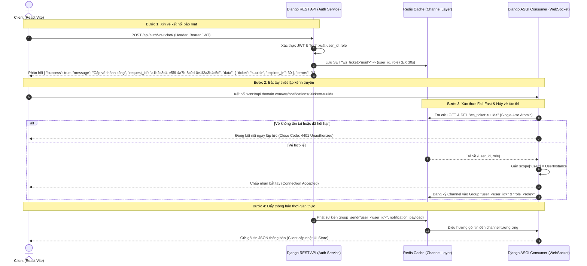

# ⚡ TECHWIZ 7 — REQUIREMENT-TO-IMPLEMENTATION PLAYBOOK
### (SỔ TAY KỸ THUẬT THỰC CHIẾN: TỪ ĐỀ BÀI SRS ĐẾN ỨNG DỤNG CHẠY THẬT TRONG 5 NGÀY)
> **Dự án**: TechWiz 7 — Aptech (Web Application Development Track)  
> **Tech Stack**: Django REST Framework (Backend) & React Vite (Frontend)
> **Styling**: CSS3 thuần (CSS Modules có sẵn trong Vite + CSS Custom Properties làm design tokens) — không dùng Tailwind, không dùng Bootstrap. Khớp danh mục công nghệ SRS §1.8 ("HTML5, CSS3").
> **Database**: MySQL 8.0.11+ (khuyến nghị 8.4 LTS, toàn đội dùng cùng phiên bản MySQL Community, không dùng MariaDB) — Storage Engine: InnoDB, Charset: utf8mb4 
> **Mục tiêu**: Trong 120 phút đầu bóc tách chính xác 100% yêu cầu đề bài, khóa chặt API Contract, chia việc độc lập cho 5 người để code song song không lệch pha và chạy nghiệm thu thành công trước hạn chót.  
> **Nguyên tắc làm việc**: **Fidelity > Completeness > Elegance** (Bám sát đề thi > Đầy đủ chức năng > Tối ưu kiến trúc).

---

> ### 🤖 LỆNH TỔNG CHỈ HUY CHO AI (MASTER INSTRUCTION)
> 
> **Khi nhận được đề thi SRS kèm theo tài liệu Playbook này, AI bắt buộc tuân thủ quy trình tương tác sau:**
> 
> 1. **Giao thức Tương tác Từng Pass (Interactive Pass-by-Pass Protocol)**:
>    * AI thực hiện tuần tự 5 Pass theo phương pháp Outside-In (từ ngoài vào trong).
>    * **Quy tắc dừng bắt buộc**: Với mỗi Pass, AI xuất kết quả phân tích và các phương án đề xuất ra ô chat, sau đó **DỪNG LẠI CHỜ LEAD ARCHITECT PHÊ DUYỆT / CHỐT LỰA CHỌN**. Tuyệt đối không tự ý chạy một lần gộp các Pass.
> 2. **Áp dụng Core Technical Invariants**: Tự động đưa các chốt chặn bắt buộc (ORM Parameterized, Object-Level Auth, Transaction Atomic, `.env`, Defense-in-Depth P0/P1) vào kiến trúc mà không cần hỏi lại.
> 3. **Quét Conditional Rules**: Chỉ kích hoạt quy tắc đặc thù khi đề có nghiệp vụ tương ứng:
>    * Mua bán / đơn hàng biến động giá $\rightarrow$ Snapshot lịch sử giá.
>    * Vòng đời nhiều bước $\rightarrow$ Triple-Gate Validation (400/403/422; mã lỗi 409 dành cho OCC/Integrity).
>    * Tranh chấp tài nguyên $\rightarrow$ Khóa dòng `select_for_update()` / Cập nhật nguyên tử `F()`.
>    * Thông báo realtime giữa các role $\rightarrow$ Phần 5: WebSocket One-Time Ticket.
> 4. **Thay thế placeholder** trong cây thư mục Backend và Frontend bằng tên thực thể cụ thể từ đề thi (`config/`, `[app_nghiep_vu_1]`, `[role_1]`, `[role_2]`).
> 5. **Hồ sơ thiết kế hoàn chỉnh sau khi đi qua 5 Pass phải bao gồm**:
>    * Bảng Use Case, FR, NFR và Scope đã được Lead Architect chốt ở Pass 2.
>    * Bản đặc tả Màn hình & Luồng Giao diện (Frontend UI Mockup & Data Flow) ở Pass 3.
>    * Sơ đồ CSDL ERD và Tài liệu Hợp đồng API đóng băng 10 điểm (suy ra từ UI) ở Pass 4.
>    * Hồ sơ bàn giao thi công theo Lát Cắt Dọc (Design Spec Handoff) ở Pass 5.
> 6. **Nguyên tắc Đồng Hành & Vị Trí làm việc**:
>    * Lập trình viên đóng vai trò là **Lead Architect** — người thiết kế toàn bộ bản vẽ từ đầu đến cuối để các thành viên khác thi công theo.
>    * AI là **Trợ lý Phân tích & Gợi mở**. Khi gặp điểm mơ hồ, AI chỉ rõ vấn đề + đề xuất 2–3 phương án để Lead Architect quyết định, tuyệt đối không tự tiện suy đoán hay mạ vàng (Anti-Gold Plating).

---

## 🧭 PHẦN 1: QUY TRÌNH BÓC TÁCH ĐỀ BÀI & THIẾT LẬP HỢP ĐỒNG HỆ THỐNG

> 💡 **Kỷ Luật Nền Tảng Của Playbook**:
> 1. **Đề bài là Nguồn Sự Thật Duy Nhất (Single Source of Truth)**: Tuyệt đối không tự ý "mạ vàng" (Gold-Plating) hay suy diễn các tính năng không có trong đề bài (như ví điện tử, hoàn tiền, đa ngôn ngữ, log phức tạp).
> 2. **Quy tắc Nền tảng Tối thiểu (Core Technical Invariants — Áp dụng cho mọi đề)**:
>    * 🛡️ **Bảo mật truy vấn**: Sử dụng ORM / Parameterized Queries mặc định; tuyệt đối không nối chuỗi dữ liệu người dùng trực tiếp vào raw SQL. Biến môi trường nhạy cảm lưu trong `.env`, không phơi bày Secret Keys vào biến `VITE_*`.
>    * 🛡️ **Bảo mật giao diện**: Không render untrusted HTML trực tiếp; sử dụng cơ chế escaping mặc định của framework (React JSX) và bắt buộc lọc sạch (sanitize qua thư viện như DOMPurify) khi thực sự cần hiển thị nội dung HTML do người dùng nhập.
>    * 🔑 **Kiểm soát quyền cấp đối tượng (Object-Level Authorization)**: Backend bắt buộc phải xác thực quyền truy cập dựa trên mối quan hệ thực tế được xác định trong SRS/Use Case (ví dụ: người tạo đơn, nhân sự được phân công, thành viên cùng phòng ban), ngăn chặn việc truy cập dữ liệu chéo trái phép (IDOR/BOLA).
>    * 🔒 **Ranh Giới Giao Dịch Nguyên Tử (Transaction Boundary Rule)**: Bắt buộc bọc `with transaction.atomic():` khi một thao tác nghiệp vụ (Business Operation) yêu cầu nhiều thay đổi dữ liệu phải thành công/thất bại cùng nhau (All-or-Nothing), HOẶC khi thao tác cần kết hợp với khóa dòng (`select_for_update()`) để bảo vệ tính bất biến nghiệp vụ (Business Invariants — ví dụ: trừ tồn kho, trừ số dư ví, giữ chỗ). **Tuyệt đối không sử dụng số lượng bảng được ghi (1 hay >1) làm tiêu chí duy nhất.**
> 3. **Ma Trận Kỹ Nghệ Có Điều Kiện (Conditional Engineering Matrix — CHỈ KÍCH HOẠT KHI SRS YÊU CẦU)**:
>    *(Nguyên tắc: Tuyệt đối không tự ý mạ vàng (Gold-Plating). CHỈ kích hoạt cơ chế kỹ thuật ở cột phải khi phát hiện từ khóa/nghiệp vụ tương ứng ở cột trái trong đề thi SRS)*:
>    *(⚠️ Lưu ý tinh thần thực chiến 5 ngày: Cụm từ "in-app alert" không mặc định kéo theo WebSocket phức tạp (Polling nhẹ là đủ); "gửi email" không mặc định kéo theo Celery + Outbox nếu gửi đồng bộ là đủ. AI BẮT BUỘC phải đưa các phương án nhẹ hơn vào Sổ Đăng Ký Giả Định ở Pass 2 để Lead Architect quyết định).*
> 
> | Yêu Cầu Phát Hiện Trong Đề Thi SRS | Cơ Chế Kỹ Thuật Bắt Buộc Kích Hoạt | Giải Pháp Kỹ Thuật Đã Quy Chuẩn Trong Playbook |
> | :--- | :--- | :--- |
> | **1. Thanh toán tài chính / Tiền tệ / Tạo đơn** | **Idempotency** | Header `Idempotency-Key` (UUIDv4) + Redis (TTL 2 pha: 60s in-progress, 24h completed). |
> | **2. Trừ tồn kho / Phân bổ tài nguyên hữu hạn** | **Concurrency Control** | `select_for_update()` cho thực thể có Audit Trail; Atomic `F()` có điều kiện cho bảng không gắn history (theo D5). |
> | **3. Vòng đời thực thể từ 3 trạng thái trở lên** | **Finite State Machine (FSM)** | Triple-Gate Validation (Đường đi hợp lệ `400`, Đúng Actor `403`, Đủ tiền đề `422`). |
> | **4. Dữ liệu sửa đổi phối hợp đa tác nhân** | **Optimistic Concurrency (OCC)** | Trường `version` + Header `If-Match` $\rightarrow$ phát hiện sửa đè trả **`409 Conflict`** (hoặc `428` nếu thiếu header). |
> | **5. Tác vụ ngoại vi kèm theo giao dịch CSDL** | **Transactional Outbox** | Bảng `OutboxEvent` bọc cùng `transaction.atomic()`, quét qua management command hoặc Celery (`on_commit` không đảm bảo). |
> | **6. Tác vụ nặng / Gửi email hàng loạt chạy nền** | **Background Worker (Celery)** | Celery Worker + Redis Queue; không kích hoạt nếu chỉ là CRUD thông thường hoặc gửi mail ít. |
> | **7. Thông báo tức thời giữa các Role** | **Realtime WebSocket** | One-Time Ticket WebSocket (TTL 30s) + Channels Redis Layer (không lộ JWT trên URL). |
> | **8. Tệp tin đính kèm (Ảnh, PDF, Excel)** | **File Upload Security** | Whitelist extension, MIME type, Magic bytes, sinh tên ngẫu nhiên UUIDv4. |
> | **9. Hành vi nhạy cảm / Đổi trạng thái thực thể** | **Audit Trail & Audit Log** | Phân định: Audit Log an ninh cho Super Admin & Audit Trail phả hệ FSM cho User. |
> | **10. Danh sách dữ liệu lớn / Lọc tìm kiếm** | **Indexing & Pagination** | Index trên khóa ngoại, `status`, `created_at`; phân trang cố định `page_size`. |
> | **11. Phân quyền sâu theo dữ liệu và trạng thái** | **Policy-Based Auth (PBAC)** | Thẩm định quyền 5 chiều: $f(\text{Actor}, \text{Action}, \text{Resource}, \text{Ownership}, \text{FSM State})$. |
> | **12. Tính năng Trợ lý AI / Chatbot (Bonus)** | **Responsible Tool Authorization** | LLM chỉ gọi Tool qua cổng PBAC của User, neo sự thật vào Audit Trail, cấm chọc thẳng DB. |

---

### 🔄 SƠ ĐỒ LUỒNG TÁC CHIẾN 5 PASS (OUTSIDE-IN SPECIFICATION FLOW)

```text
                        ĐỀ THI SRS (APTECH)
                                 │
                                 ▼
                     ┌───────────────────────┐
                     │        PASS 1         │
                     │    Raw Extraction     │
                     │ (Bóc tách nguyên bản) │
                     └───────────┬───────────┘
                                 │
                                 ▼
                     ┌───────────────────────┐
                     │        PASS 2         │
                     │   Ambiguity Audit &   │
                     │  Lead Decision Gate   │
                     │(AI gợi ý - Bạn chốt FR│
                     │  NFR, Scope, Use Case)│
                     └───────────┬───────────┘
                                 │
                                 ▼
                     ┌───────────────────────┐
                     │        PASS 3         │
                     │ FRONTEND UI/UX FLOW   │
                     │ (Mockup trang, form,  │
                     │  bảng để thấy rõ data)│
                     └───────────┬───────────┘
                                 │
                                 ▼
                     ┌───────────────────────┐
                     │        PASS 4         │
                     │ BACKEND & API FREEZE  │
                     │ (Từ UI suy ra ERD DB, │
                     │  10 điểm API Freeze,  │
                     │  Security Invariants) │
                     └───────────┬───────────┘
                                 │
                                 ▼
                     ┌───────────────────────┐
                     │        PASS 5         │
                     │  DESIGN SPEC HANDOFF  │
                     │ (Đóng gói bản vẽ giao │
                     │  các thành viên code) │
                     └───────────────────────┘
```

---

### 🔄 CHI TIẾT QUY TRÌNH 5 PASS (TỪ ĐỀ THI ĐẾN BẢN VẼ BÀN GIAO)

#### PASS 1: BÓC TÁCH NGUYÊN BẢN (RAW EXTRACTION)
* Đọc quét toàn bộ đề thi, trích xuất nguyên văn mọi câu chứa từ khóa chức năng (`Must`, `Should`, `Can`, `Allow`).
* Liệt kê danh sách Actor thực tế và Use Case thô.
* **Kỷ luật**: không đưa best practice cá nhân vào; không suy đoán tính năng con; không thiết kế API hay CSDL ở bước này.
* "Lưu ý: Không chỉ tìm Must/Should/Can/Allow, bắt buộc chú ý các từ khóa ẩn chứa luật nghiệp vụ và ràng buộc: only, cannot, unless, after, before, within, at least, automatically."
  
#### PASS 2: PHẢN BIỆN ĐỐI KHÁNG & LEAD ARCHITECT RA QUYẾT ĐỊNH (ADVERSARIAL AUDIT & DECISION GATE)
* **Đối chất từng Use Case**: *"Tính năng này có xuất phát từ câu chữ nào trong đề thi không, hay do AI tự suy diễn?"* Quét sạch mọi giả định mạ vàng (Gold-Plating).
* **Bắt buộc lập Sổ Đăng Ký Giả Định (Assumption Register)**: Mỗi khi phát hiện điểm mơ hồ hoặc đề bài không nói rõ, AI **BẮT BUỘC** phải xuất bảng theo mẫu sau và **DỪNG LẠI CHỜ LEAD ARCHITECT DUYỆT**:

| ID | Vấn Đề Mơ Hồ / Chưa Rõ | Bằng Chứng SRS (Evidence) | Giả Định Đề Xuất (Assumption) | Tác Động Kỹ Thuật (Impact) | Quyết Định Của Lead Architect (Decision Gate) |
| :---: | :--- | :---: | :--- | :--- | :---: |
| **A-001** | *Customer có được sửa booking không?* | UC-04, §2.1 | Giả định chỉ cho sửa khi còn PENDING | Cần thêm API PATCH & validate FSM | ❓ **Chờ Lead duyệt** |
| **A-002** | *Staff có xem được dữ liệu Staff khác?* | UC-08 | Giả định chỉ xem trong cùng Department | Cần cấu hình Policy trong PBAC | ❓ **Chờ Lead duyệt** |
| **A-003** | *Booking tự hủy nếu quá hạn thanh toán?* | SRS §3.4 | Giả định hệ thống quét hủy tự động | Cần Celery Beat hoặc Lazy Cleanup | ❓ **Chờ Lead duyệt** |

> 🔑 **Kỷ luật phân định 4 tầng tư duy (Cognitive Separation)**:
> 1. **FACT (Sự Thật)**: Câu chữ hiển ngôn trong đề thi SRS.
> 2. **ASSUMPTION (Giả Định)**: Khoảng trống đề bài chưa nói rõ mà AI phỏng đoán.
> 3. **DECISION (Quyết Định)**: Phê duyệt cuối cùng của Lead Architect (Chốt phương án, làm hay bỏ).
> 4. **IMPLEMENTATION (Thực Thi)**: Thiết kế API / CSDL / Code — **CHỈ ĐƯỢC PHÉP THỰC THI KHI ĐÃ CÓ DECISION**. Tuyệt đối cấm nhảy cóc từ Assumption sang Implementation!

* **Lead Architect phê duyệt**: Bạn chốt lựa chọn, phân loại rõ **Chức năng Bắt buộc (Must-Have)**, **Chức năng Điểm cộng (Bonus Feature)**, và khóa chặt bộ **Yêu cầu Nền tảng (Requirement Base: Use Cases / FR / NFR / Scope)** trước khi sang bước thiết kế.

#### PASS 3: THIẾT KẾ MÀN HÌNH & LUỒNG GIAO DIỆN (FRONTEND UI/UX FLOW & DATA SPEC)
* Dựa trên Use Case và FR đã chốt ở Pass 2, Lead Architect tiến hành thiết kế luồng màn hình Frontend theo nguyên tắc Outside-In (thấy giao diện trước để suy ra dữ liệu):
  * **Quy hoạch danh sách trang (`pages/`)**: Phân chia rõ ràng theo từng Role (`public/`, `customer/`, `staff/`, `admin/`).
  * **Đặc tả Form nhập liệu**: Xác định chính xác từng ô Input, kiểu dữ liệu, trường bắt buộc (`*`), quy tắc validate inline tại chỗ (email, số điện thoại, regex). (luôn validate dữ liệu ở cả 2 đầu frontend và backend)
  * **Đặc tả Bảng dữ liệu & Thẻ Card**: Xác định chính xác các cột cần hiển thị, bộ lọc tìm kiếm (filters), phân trang (`page_size`), huy hiệu trạng thái (`Badge`).
  * **Đặc tả Tương tác & Phản hồi**: Nút bấm chính (Primary CTA), modal xác nhận hành động nguy hiểm (Confirm Dialog), màn hình hoàn tất giao dịch (Success Screen).
* **Ý nghĩa cốt tử**: Bản đặc tả màn hình giúp xác định chính xác dữ liệu cần hiển thị cho người dùng và các trường dữ liệu cần trao đổi qua API. Tuy nhiên, UI không quyết định toàn bộ CSDL: ERD phải được thiết kế bằng cách đối chiếu đồng thời SRS, Use Case, Business Rules, UI/Data Flow và các yêu cầu toàn vẹn dữ liệu (Data Integrity Requirements).

#### PASS 4: THIẾT KẾ CƠ SỞ DỮ LIỆU & ĐÓNG BĂNG HỢP ĐỒNG API (BACKEND ARCHITECTURE & API FREEZE)
* Lead Architect tổng hợp luồng UI ở Pass 3 kết hợp với SRS, Use Case, Business Rules và các yêu cầu toàn vẹn dữ liệu để thiết kế tầng Backend:
  * **Thiết kế ERD CSDL**: Áp dụng chuẩn 3 bảng IAM (`roles`, `users`, `profiles`), chuẩn hóa 3NF (không nhân bản dữ liệu hiển thị của UI vào bảng), M2M Through Model, và bắt buộc bổ sung các trường kiểm soát toàn vẹn hệ thống (`status`, `version`, `created_at`, `updated_at`, audit keys) mà UI có thể không hiển thị trực tiếp nhưng kiến trúc bắt buộc phải có.
  * **Thống nhất cấu trúc tuyến đường API (BFF Pattern & Role-Scoped Routing)**:
    * Khóa cứng tiền tố duy nhất: `/api/` (Khai tử hoàn toàn `/v1/` để tránh lệch route khi ghép nối). Trong toàn bộ tài liệu này, ký hiệu `<API_PREFIX>` đại diện cho `/api/`.
    * Định tuyến phân vùng theo Role: `/api/[role]/[resource]/` (ví dụ: `/api/customer/orders/`, `/api/farmer/products/`, `/api/admin/users/`).
    * Định tuyến công khai: `/api/public/[resource]/` (ví dụ: `/api/public/markets/`, `/api/public/products/`) áp dụng quyền `AllowAny`.
    * Tuyến dùng chung / xác thực: `/api/auth/` (Login, Token, Refresh, Logout), `/api/notifications/`, `/api/chat/`.
    * Tên tài nguyên (`resource`): Bắt buộc là danh từ số nhiều dạng `kebab-case` (ví dụ: `booking-requests`, `audit-logs`).
    * Dấu gạch chéo kết thúc: 100% URL bắt buộc có dấu `/` ở cuối (`APPEND_SLASH = True`).
    * Hành động nghiệp vụ đặc thù: Dùng động từ đặt sau ID (ví dụ: `/api/farmer/orders/<int:id>/approve/`).
  * **Thiết lập chính sách phân trang**: Kích thước mặc định `page_size = 20`. (hoặc quy hoạch thực tế theo đề bài)
  * **Chốt 10 Thông Số Hợp Đồng API Đóng Băng (API Contract Freeze)**:
    1. Tuyến đường API chuẩn hóa (`Endpoint URL` tuân thủ quy tắc trên) & Phương thức HTTP (`GET`, `POST`, `PUT`, `PATCH`, `DELETE`).
    2. Cấu trúc Request Body và Query Parameters.
    3. Cấu trúc Response Body: 100% key ở dạng `snake_case`; giá trị Roles/Status/Action/Enum 100% là chữ HOA `UPPER_SNAKE_CASE`; trường `message` 100% viết bằng tiếng Việt thân thiện người dùng; trường `code` và `errors` 100% viết bằng tiếng Anh chuẩn lập trình.
    4. Tên trường dữ liệu (`Field Names`) & Kiểu dữ liệu (`Field Types`).
    5. Thuộc tính cho phép rỗng (`Nullable / Optional`).
    6. Mã phản hồi HTTP thành công (`200 OK`, `201 Created`, `204 No Content`).
    7. Định dạng phản hồi lỗi chuẩn (`400`, `401`, `403`, `404`, `409`, `422`, `428`, `429` kèm `request_id` dạng UUID v4).
    8. Cấu trúc phân trang thống nhất (`count, results...` nằm trọn trong `data`).
    9. Yêu cầu xác thực (`IsAuthenticated` / `AllowAny`).
    10. Yêu cầu phân quyền theo đối tượng (Object-level Scope).
  * **Kỷ luật Đóng Băng (Freeze Rule)**: Lead Architect chính thức chốt đóng băng Hợp đồng API. Sau thời điểm Freeze, **TUYỆT ĐỐI không** tự ý thay đổi tên trường, đổi kiểu dữ liệu hoặc đổi endpoint khi thi công.
  * **Thiết lập Tiêu chí Nghiệm thu 4 Tầng (4-Tier Acceptance)**: Functional Acceptance, Security Acceptance (P3 Evidence-based), Technical Quality Gates (Zero Console Error, Anti N+1), và Demo Acceptance (<3 phút kịch bản mượt mà).

#### PASS 5: ĐÓNG GÓI HỒ SƠ THIẾT KẾ & BÀN GIAO THI CÔNG (DESIGN SPEC HANDOFF)
* Lead Architect đóng gói toàn bộ hồ sơ kỹ thuật hoàn chỉnh (UI Mockup + ERD + API Contract + Cây thư mục + Kịch bản nghiệm thu) bàn giao cho các thành viên trong nhóm.
* Phân công thi công song song theo nguyên tắc **Lát Cắt Dọc (Vertical Slice)** dựa trên cấu trúc thư mục đã quy hoạch:
  * **Phân hệ Frontend**: Bàn giao các thư mục con trong `src/pages/` (`customer/`, `staff/`, `admin/`, `public/`) cho các thành viên phụ trách giao diện.
  * **Phân hệ Backend**: Bàn giao các app trong `backend/` (`accounts/`, `[app_nghiep_vu]/`) cho các thành viên phụ trách API.
* Mọi thành viên thi công độc lập, code song song dựa trên hợp đồng API và giao diện đã đóng băng mà không bao giờ bị lệch pha hay xung đột mã nguồn.
* **Thiết lập Ma Trận Truy Vết Yêu Cầu (Requirement Traceability Matrix - RTM)**: 
  Để triệt tiêu 100% rủi ro bỏ sót chức năng của đề bài và phục vụ kiểm tra độ phủ (Coverage Check) trước khi nộp bài, Lead Architect đóng gói bản ma trận ánh xạ 7 mắt xích:

| Mã Req (SRS) | Use Case (Pass 1) | Màn Hình / Form UI (Pass 3) | Tuyến Đường API (Pass 4) | Bảng CSDL (Pass 4) | Quyền Hạn (PBAC) | Mã Kịch Bản Test (Pass 5) |
| :---: | :---: | :--- | :--- | :--- | :--- | :---: |
| **FR-012** | UC-04 | Booking Form (`pages/customer/BookingPage.jsx`) | `POST /api/customer/bookings/` | `bookings`, `booking_items` | `Customer` (Chính chủ) | `TC-021` |
| **FR-015** | UC-08 | Task Assignment (`pages/manager/TaskBoard.jsx`) | `PATCH /api/manager/tasks/<id>/assign/` | `tasks`, `task_histories` | `Manager` (Cùng Dept) | `TC-034` |
| **FR-020** | UC-11 | System Export (`pages/admin/AuditReport.jsx`) | `GET /api/admin/audit-logs/export/` | `audit_logs` | `Admin` (Superuser) | `TC-045` |

> 🎯 **Quy tắc nghiệm thu độ phủ (100% Requirement Coverage Rule)**:
> 1. Mỗi câu chức năng trong đề thi SRS **bắt buộc** phải có ít nhất 1 dòng trong bảng RTM.
> 2. Trước giờ nộp bài 6 tiếng, nhóm thực hiện rà soát từ trái qua phải: Mọi dòng đều phải có bằng chứng Test Case chạy thành công. Không có tính năng nào được coi là hoàn tất nếu thiếu mắt xích trong chuỗi RTM.

* **Hồ Sơ Đóng Gói & Bàn Giao Nghiệm Thu Theo Chuẩn Aptech (SRS §1.9 Deliverables Checklist)**:
  Trước thời điểm nộp bài 3 tiếng, Lead Architect và toàn đội bắt buộc rà soát và đóng gói đầy đủ 5 hạng mục bàn giao:
  1. **Tệp Cơ Sở Dữ Liệu (`.sql`) & Dữ Liệu Kiểm Thử (SRS §1.9)**:
     - `database_schema.sql`: Xuất cấu trúc CSDL MySQL sạch không chứa data bằng lệnh:
       `mysqldump -u <user> -p --no-data <db_name> > database_schema.sql` (chống lộ dữ liệu rác không kiểm soát).
     - `database_seed_data.sql` (hoặc lệnh `python manage.py seed_demo`): Dữ liệu mẫu chuẩn hóa (Seed/Test Data) nạp sẵn danh mục vai trò (`roles`), tài khoản kiểm thử đại diện cho 100% các Role (đã băm mật khẩu chuẩn), và dữ liệu danh mục ban đầu để phục vụ chấm thi.
  2. **Tài Liệu Hướng Dẫn Nghiệm Thu (`ReadMe.doc` / `ReadMe.pdf`)**:
     - Ghi rõ danh sách các giả định kỹ thuật đã được chốt tại Sổ Đăng Ký Giả Định (Pass 2).
     - Bảng danh mục tài khoản kiểm thử cho 100% các vai trò (Role, Email, Mật khẩu mặc định) để Ban Giám Khảo có thể đăng nhập test ngay lập tức mà không cần tự tạo tài khoản.
     - Hướng dẫn cụ thể: Sau khi import schema hoặc chạy `python manage.py migrate`, chạy `python manage.py seed_demo` (hoặc import `database_seed_data.sql`) để nạp tài khoản test trước khi khởi chạy server.
  3. **Video Demo Nghiệm Thu (`.mp4`)**: Video quay màn hình độ nét cao (< 3 phút), dẫn dắt kịch bản mượt mà xuyên suốt giữa các Actor mà không phát sinh bất kỳ lỗi đỏ nào trên Console F12.
  4. **Kỷ Luật Tài Liệu Aptech (Anti-Code Pollution)**: Báo cáo Word/PDF thiết kế hệ thống (SWD) tuyệt đối không paste source code thô dài dòng; chỉ chứa sơ đồ kiến trúc, bảng ERD, wireframe và bảng API contract.
  5. **Bản Công Bố Sử Dụng AI (AI Usage Disclosure)**: Bắt buộc liệt kê minh bạch các công cụ AI đã hỗ trợ trong quá trình thực hiện dự án (Copilot, Gemini, v.v.) theo đúng quy định liêm chính học thuật của Aptech SRS §1.6.

---

## 🗄️ PHẦN 2: CÁC LƯU Ý KỸ THUẬT KHI THIẾT KẾ CƠ SỞ DỮ LIỆU (SWD/FORM NO. 6)

> 💡 **Nguyên tắc**: Sơ đồ bảng (ERD) và danh sách thuộc tính cụ thể được thiết kế ở Pass 4 bằng cách đối chiếu đồng thời SRS, Use Case, Business Rules, luồng giao diện UI ở Pass 3 và các yêu cầu toàn vẹn dữ liệu (Data Integrity Requirements). UI giúp xác định dữ liệu hiển thị và trao đổi qua API, nhưng CSDL phải tuân thủ chuẩn hóa 3NF và lưu trữ đầy đủ các trường kiểm soát toàn vẹn hệ thống. Dưới đây là các lưu ý kỹ thuật cốt lõi để tránh lỗi hệ thống và ghi điểm trong Báo cáo Aptech:

1. **Chuẩn Hóa Vừa Sức (3NF Thực Tế)**:
   * Thiết kế các bảng bám sát thực thể của đề bài theo dạng chuẩn 3NF để tránh dư thừa và dị thường cập nhật dữ liệu.
   * Tránh tách bảng quá vụn vặt gây phát sinh quá nhiều phép `JOIN` phức tạp, làm chậm tiến độ ghép nối của nhóm trong 5 ngày.
   * *Ngoại lệ Snapshot*: Chỉ lưu bản sao giá trị lịch sử (như đơn giá mua tại thời điểm đặt) trực tiếp vào bảng giao dịch khi đề bài có nghiệp vụ mua bán/hóa đơn mà giá sản phẩm có thể biến động theo thời gian.
2. **Cảnh Giác Với Khóa Ngoại (`on_delete` - Theo Quyết Định D6)**:
   * **Mặc định**: Bắt buộc sử dụng `models.RESTRICT` hoặc `models.PROTECT` cho các thực thể nghiệp vụ chính (User, Role, Category, Product, Order) để chặn tuyệt đối nguy cơ xóa nhầm một bản ghi làm mất sạch dữ liệu liên quan.
   * **Dùng `models.SET_NULL`**: Chỉ dùng khi bản ghi con có thể tồn tại độc lập mà không cần thực thể cha (ví dụ: `assigned_to` khi nhân sự bị xóa thì task vẫn còn; yêu cầu `null=True, blank=True`).
   * **Dùng `models.CASCADE`**: CHỈ cho phép trong 2 trường hợp duy nhất: (1) Bảng mở rộng quan hệ 1-1 (như `Profile` gắn với `CustomUser`); (2) Dòng con phụ thuộc thuần túy theo cha (như `OrderItem` gắn với `Order`, xóa Order nháp thì xóa sạch các item của đơn đó).
3. **Đặc Thù Kỹ Thuật Với MySQL (InnoDB Storage Engine)**:
   * **MUST (Ràng buộc kỹ thuật bắt buộc)**:
     * **Storage Engine**: BẮT BUỘC sử dụng `InnoDB`. InnoDB là storage engine phù hợp cho Django vì hỗ trợ transactions, foreign keys và row-level locking. Không sử dụng `MyISAM` vì MyISAM không hỗ trợ transactions và không enforce foreign-key constraints.
     * **Character Set & Collation**: BẮT BUỘC sử dụng `utf8mb4` cho database mới. Không sử dụng `utf8/utf8mb3` vì `utf8mb3` chỉ hỗ trợ tối đa 3 byte/ký tự và đã deprecated trong MySQL 8. Với MySQL 8.0+, ưu tiên collation `utf8mb4_0900_ai_ci` nếu không có yêu cầu đặc thù khác về sorting/comparison. `utf8mb4_0900_ai_ci` không phân biệt dấu và hoa/thường ("Bàn" = "Ban"). Tìm kiếm tiếng Việt có lợi, nhưng cột unique cần phân biệt dấu (tên danh mục, mã) phải khai báo `db_collation="utf8mb4_0900_as_ci"`. Database phải tạo thủ công: `CREATE DATABASE <tên> CHARACTER SET utf8mb4 COLLATE utf8mb4_0900_ai_ci;`.
     * **Cấu hình DATABASES Chuẩn trong `settings.py`**:
       ```python
       DATABASES = {
           'default': {
               'ENGINE': 'django.db.backends.mysql',
               'NAME': os.getenv('DB_NAME'),
               'USER': os.getenv('DB_USER'),
               'PASSWORD': os.getenv('DB_PASSWORD'),
               'HOST': os.getenv('DB_HOST', '127.0.0.1'),
               'PORT': os.getenv('DB_PORT', '3306'),
               'ATOMIC_REQUESTS': False,  # Bắt buộc False để log an ninh không bị rollback khi request lỗi
               'OPTIONS': {
                   'charset': 'utf8mb4',
                   'init_command': "SET sql_mode='STRICT_TRANS_TABLES'",
                   'isolation_level': 'read committed',
               },
               'TEST': {
                   'CHARSET': 'utf8mb4',
                   'COLLATION': 'utf8mb4_0900_ai_ci',
               },
               'CONN_MAX_AGE': int(os.getenv('DB_CONN_MAX_AGE', '0')),
           }
       }
       ```
     * **Bảng Cấm / Lưu Ý Kỹ Thuật Khi Dùng Django Với MySQL**:
       * Không dùng: `.distinct("field")`, `ArrayField`, `HStoreField`, `django.contrib.postgres` (`SearchVector`, `GinIndex`, `ArrayAgg`…), `select_for_update(no_key=True)`, `constraint deferrable`.
       * `UniqueConstraint(condition=...)` bị MySQL bỏ qua (Django phát cảnh báo `models.W036`). Bất biến dạng này phải bảo vệ bằng `select_for_update()` trong service.
       * `bulk_create()` không trả về ID. Khi cần ID ngay, dùng `create()` trong `transaction.atomic()`.
       * `filter(id__in=qs[:n])` gây lỗi 1235. Hãy lấy `list(values_list(...))` trước.
       * Không đặt `db_index`/`unique` trên `TextField`. Index ghép nhiều `CharField` dài không vượt 3072 byte (4 byte/ký tự).
       * `CharField` bắt buộc có `max_length` (tránh lỗi `fields.E120` trên MySQL do code mẫu PostgreSQL hay bỏ qua).
       * MySQL xếp `NULL` lên đầu khi sắp xếp tăng dần (`ASC`), ngược với PostgreSQL. Với cột có thể `NULL` (như `deadline`), dùng `F("deadline").asc(nulls_last=True)`.
       * Tìm kiếm chuỗi dùng `icontains` (không phân biệt dấu nhờ collation `utf8mb4_0900_ai_ci`); `contains` trên MySQL phân biệt cả hoa/thường và dấu.
       * `db_table` luôn viết chữ thường dạng `snake_case`.
   * **RECOMMENDED (Khuyến nghị thực chiến 5 ngày)**:
     * **Primary Key & Khóa Tự Tăng**: Cấu hình `DEFAULT_AUTO_FIELD = "django.db.models.BigAutoField"` trong `settings.py`. Model không tự khai báo `id`. Dùng `BIGINT AUTO_INCREMENT` làm internal primary key với InnoDB để giữ clustered index và các secondary indexes nhỏ gọn, tối ưu tốc độ ghi B-Tree.
     * **select_for_update() & Concurrency Locking**: Django mặc định đặt isolation `READ COMMITTED` cho MySQL. Ở mức này InnoDB hạn chế gap lock, nhưng vẫn phải lock theo PK/UNIQUE, giữ transaction ngắn và lock theo thứ tự nhất quán (`order_by("id")`). Khi gặp deadlock (`OperationalError 1213`), service retry 1–2 lần hoặc trả 409.
     * **Python Database Driver**: Ưu tiên `mysqlclient` (phiên bản tương thích Django hiện hành $\ge 2.2.1$), là native driver chính thức được Django khuyến nghị về hiệu năng và độ ổn định. `mysqlclient` cần `pkg-config` và `libmysqlclient-dev` khi build trên Linux/Render. Nếu dùng PyMySQL thay thế: gọi `pymysql.install_as_MySQLdb()`, ghi đè `pymysql.version_info = (2, 2, 1, "final", 0)` và cài thêm `cryptography`.
     * **Quy ước Chữ HOA Bất Biến Cho Giá Trị Lưu CSDL**: Toàn bộ Roles (`ADMIN`, `CUSTOMER`, `FARMER`), Trạng thái FSM (`PENDING`, `IN_PROGRESS`, `COMPLETED`, `CANCELLED`), Hành động & Severity Audit Log (`LOGIN`, `CREATE_ORDER`, `CRITICAL`, `NORMAL`) bắt buộc 100% lưu dạng `UPPER_SNAKE_CASE`. Luôn so sánh trong code bằng Enum (`Order.Status.PENDING`), tuyệt đối không dùng chuỗi cứng để tránh bẫy lệch pha giữa Python và Collation MySQL.
     * **Email & Identifier Normalization**: Nếu email được xác định là định danh logic không phân biệt hoa/thường, ứng dụng nên thống nhất quy tắc chuẩn hóa (`email.strip().lower()`) trước khi tạo user, xác thực và sử dụng email làm cache key để bảo đảm tính toàn vẹn danh tính người dùng. Không coi normalization là yêu cầu riêng của JWT/Redis.
   * **CONDITIONAL (Tùy biến theo yêu cầu đề bài & hạ tầng)**:
     * **JSONField**: MySQL hỗ trợ kiểu dữ liệu `JSON`, nhưng không có GIN index như PostgreSQL. Với các thuộc tính JSON cần query/index thường xuyên, ưu tiên thiết kế schema quan hệ (Relational Columns) hoặc sử dụng Generated Column + B-tree index; đối với JSON array, MySQL 8.0.17+ hỗ trợ thêm Multi-Valued Indexes. Trong bài thi 5 ngày, ưu tiên normal relational columns nếu SRS không bắt buộc JSON query phức tạp. Khai báo `default=dict` và luôn thêm `encoder=DjangoJSONEncoder`.
     * **Connection Lifetime**: Cấu hình `CONN_MAX_AGE` trong Django phải phù hợp với `wait_timeout` của MySQL và hạ tầng deployment; không hardcode một giá trị cố định cho mọi môi trường. Trong môi trường thi/localhost, `CONN_MAX_AGE = 0` là lựa chọn đơn giản, an toàn; nếu sử dụng persistent connections, phải đảm bảo lifetime không vượt quá giới hạn connection idle của hạ tầng.
4. **Đánh Chỉ Mục Thiết Thực (Pragmatic Indexing)**:
   * Đánh Index trên các cột khóa ngoại và các cột thường xuyên lọc/sắp xếp (`status`, `created_at`) để lấy trọn điểm tiêu chí Performance trong Báo cáo Aptech.
   * Không đánh index bừa bãi lên các cột Đúng/Sai (Boolean) có độ phân tán dữ liệu thấp.
5. **Múi Giờ & Bảng Mã (Timezone & TimeField Rule)**:
   * Sử dụng bảng mã `UTF-8` toàn vẹn tiếng Việt có dấu.
   * Cấu hình bắt buộc: `TIME_ZONE = "Asia/Ho_Chi_Minh"`, `USE_TZ = True`.
   * CSDL luôn lưu trữ thời gian theo chuẩn `UTC`; việc hiển thị theo giờ Việt Nam (GMT+7) do giao diện Frontend đảm nhận.
   * **Quy tắc so sánh `TimeField` (giờ mở cửa, giờ nhận hàng, cutoff time)**:
     - Trường `TimeField` trong MySQL lưu giờ naive (không có timezone).
     - Khi kiểm tra so sánh với thời gian hiện tại trong Python, bắt buộc chuyển về giờ địa phương Việt Nam trước khi lấy `.time()`: `timezone.localtime(timezone.now()).time() > cutoff_time`.
     - Tuyệt đối không so sánh trực tiếp với giờ UTC (`timezone.now().time()`) vì sẽ bị lệch 7 tiếng.
   * Nếu backend thống kê theo ngày giờ VN (`TruncDate`, `__date` có tzinfo) thì phải nạp timezone tables cho MySQL (`mysql_tzinfo_to_sql`).
6. **Mẫu Thiết Kế IAM & Phân Quyền User-Role Tham Chiếu (3 Bảng Cốt Lõi)**:
   * Nhóm áp dụng mẫu thiết kế tài khoản và vai trò độc lập để vừa chuẩn hóa bảo mật vừa tránh rủi ro vỡ migration khi cần thêm quyền:
     * **Bảng `roles`**: Lưu định danh vai trò (`code` VARCHAR(50) UNIQUE INDEX như `ADMIN`, `CUSTOMER`, `FARMER`, `name`, `is_active`). Khi đề bài phát sinh vai trò mới, chỉ cần thêm data vào bảng, tuyệt đối không phải sửa code hay chạy lại migration CSDL.
     * **Bảng `users` (`CustomUser` kế thừa `AbstractUser`)**: Đăng nhập 100% bằng `email` (`USERNAME_FIELD = "email"`), loại bỏ các trường thừa (`username`, `first_name`, `last_name`). Khóa ngoại `role` trỏ về bảng `roles` bắt buộc dùng **`on_delete=models.RESTRICT`** (chặn đứng nguy cơ xóa nhầm Role làm mất sạch tài khoản người dùng), kèm cờ `must_change_password = BooleanField(default=False)` (theo D7: mặc định là False; chỉ set True khi tài khoản do Admin tạo thủ công). Khai báo `AUTH_USER_MODEL = "accounts.CustomUser"` trước lần migrate đầu tiên. CustomUser bỏ username thì bắt buộc phải có `email = EmailField(unique=True)` và `CustomUserManager` riêng kế thừa `BaseUserManager` (override `create_user`, `create_superuser`). Nếu đổi user model sau khi migrate, CSDL sẽ hỏng; trên MySQL DDL không rollback được nên không thể sửa tự động.
     * **Bảng `profiles` (`Profile / UserProfile`)**: Nối 1-1 với `CustomUser` bằng `OneToOneField(CustomUser, on_delete=models.CASCADE, primary_key=True, related_name="profile")`. Toàn bộ thông tin cá nhân mở rộng (họ tên, điện thoại, avatar) đưa sang bảng này để bảng `CustomUser` luôn siêu nhẹ, tối ưu RAM khi xác thực token.
7. **Mẫu Quan Hệ Nhiều - Nhiều Kèm Dữ Liệu Thời Điểm (M2M Through Model)**:
   * Trong các đề bài có quan hệ N-N phát sinh thêm thông tin tại thời điểm tạo (ví dụ: Chi tiết đơn hàng lưu số lượng và đơn giá mua; Lịch khám lưu ghi chú bác sĩ) $\rightarrow$ Luôn khai báo bảng trung gian tường minh thông qua tham số `through='TenBangTrungGian'` trong `ManyToManyField`.
   * Tránh dùng bảng phụ ẩn mặc định của Django vì sẽ không thể thêm trường snapshot dữ liệu sau này.
8. **Kỷ Luật Đặt Tên `related_name` Khóa Ngoại**:
   * Mọi `ForeignKey` bắt buộc phải khai báo thuộc tính `related_name` tường minh theo dạng **danh từ số nhiều của thực thể con** (ví dụ: `ForeignKey(Order, related_name='items')`).
   * Giúp toàn bộ 5 thành viên khi viết truy vấn ORM hoặc Serializer lồng nhau đều dùng chung một tên gọi, triệt tiêu lỗi gãy dữ liệu.
9. **Kỷ Luật Migration Trên MySQL**:
   * MySQL không rollback DDL, nên migration lỗi giữa chừng sẽ để lại schema dở dang. Chỉ Lead tạo và merge migration. Mọi người dev trực tiếp trên MySQL, không dùng SQLite. User MySQL phải có quyền `CREATE`/`DROP` để pytest-django tạo test DB.

---

## 🐍 PHẦN 3: CẤU TRÚC & KỶ LUẬT LẬP TRÌNH BACKEND DJANGO (SWD/FORM NO. 8)

> 💡 **Mục tiêu thực chiến**: Phân tách rõ ràng không gian làm việc cho các thành viên, triệt tiêu xung đột Git (Merge Conflict), bảo đảm tính toàn vẹn dữ liệu và kiểm soát quyền chặt chẽ trên từng API endpoint.

### 1. CÂY THƯ MỤC BACKEND CHUẨN THỰC CHIẾN (BATTLE-TESTED DJANGO ARCHITECTURE)

```text
backend/
├── manage.py                        # Django CLI
├── requirements.txt                 # Danh sách thư viện ghim cứng phiên bản
├── .env.example                     # File mẫu biến môi trường (SECRET_KEY, DB_NAME, DB_USER, DB_PASSWORD, DB_HOST, DB_PORT, DB_CONN_MAX_AGE...). Nếu muốn giữ DATABASE_URL thì phải thêm dj-database-url vào requirements.
├── .gitignore                       # Bỏ qua venv, __pycache__, .env, media/, db.sqlite3
│
├── config/                          # THƯ MỤC CẤU HÌNH GỐC
│   ├── __init__.py
│   ├── settings.py                  # Cấu hình tập trung (MySQL InnoDB, Redis Channel Layer, CORS, SimpleJWT)
│   ├── urls.py                      # Root URLconf: Nối định tuyến của các app vào /api/
│   ├── wsgi.py                      # WSGI server cho Render
│   ├── asgi.py                      # ASGI server (kết hợp Django ASGI + Channels Router)
│   └── routing.py                   # Root WebSocket URLconf: Điều hướng các tuyến /ws/
│
├── core/                            # TẦNG DÙNG CHUNG TOÀN HỆ THỐNG
│   ├── models.py                    # BaseModel abstract (created_at, updated_at) & HistoryRequestMeta
│   ├── apps.py                      # CoreConfig (kích hoạt ready() đăng ký signals)
│   ├── signals.py                   # Signal pre_create_historical_record (gắn request_id vào lịch sử)
│   ├── context.py                   # ContextVar lưu trữ request_id cho model & signal
│   ├── exceptions.py                # Bộ Exception phân tầng chuẩn (400, 403, 409, 422, 428)
│   ├── middleware.py                # RequestIDMiddleware (sinh & gắn X-Request-ID xuyên suốt)
│   ├── pagination.py                # StandardPagination (page_size=20, bọc trong data)
│   ├── policies/                    # Chính sách phân quyền PBAC tập trung (RoleCode, BasePolicy)
│   ├── services/                    # Dịch vụ hạ tầng dùng chung toàn hệ thống
│   │   ├── ws_ticket.py             # Sinh & xác thực vé WebSocket 1 lần (Single-Use Ticket)
│   │   └── outbox.py                # Helper enqueue_outbox_event bọc trong transaction
│   └── utils.py                     # Helper: api_response(), custom_exception_handler()
│
├── system/                          # PHÂN HỆ QUẢN TRỊ AN NINH & GIÁM SÁT (Super Admin)
│   ├── models.py                    # Model AuditLog (lưu vết an ninh: LOGIN, 403, EXPORT)
│   ├── services.py                  # log_security_event() (ghi ngoài transaction nghiệp vụ)
│   └── views.py                     # API xem nhật ký an ninh cho Super Admin
│
├── accounts/                        # PHÂN HỆ TÀI KHOẢN & XÁC THỰC (Bắt buộc cho mọi đề tài)
│   ├── models.py                    # Custom User Model (kế thừa AbstractUser, phân quyền Role)
│   ├── admin.py                     # Đăng ký quản trị User trên Django Admin (CustomUserAdmin)
│   ├── permissions.py               # Phân quyền cấp View theo vai trò (IsAdmin, IsStaff, IsAuthenticated...)
│   ├── authentication.py            # Cơ chế xác thực JWT, Blacklist Redis
│   ├── services/                    # Logic nghiệp vụ tài khoản: cấp token JWT, đổi mật khẩu, profile
│   ├── auth/                        # Phân hệ Xác thực: Login, Logout, Refresh, Forgot Pass, WS-Ticket (gọi core.services)
│   │   ├── views_auth.py
│   │   ├── serializers_auth.py
│   │   └── urls_auth.py
│   └── urls.py                      # Nối toàn bộ routes của accounts vào hệ thống (/api/auth/)
│
├── notifications/                   # PHÂN HỆ THÔNG BÁO REALTIME (Áp dụng khi đề bài có Realtime)
│   ├── models.py                    # Bảng Notification (lưu vết bền vững thông báo vào DB)
│   ├── consumers.py                 # WebSocket Consumer (xác thực vé 1 lần, join Redis Channel Groups)
│   ├── routing.py                   # Định tuyến WebSocket: ws/notifications/
│   ├── services.py                  # Hàm phát thông báo: push_notification(user_id, payload)
│   ├── views.py                     # API danh sách thông báo, đánh dấu đã đọc (PATCH read)
│   └── urls.py                      # Nối routes /api/notifications/
│
├── [app_nghiep_vu_1]/               # CÁC PHÂN HỆ THEO ĐỀ BÀI (Ví dụ: tasks, bookings, orders...)
│   ├── models.py                    # Khai báo thực thể CSDL của phân hệ (kèm HistoricalRecords)
│   ├── admin.py                     # Đăng ký hiển thị Django Admin
│   ├── policies.py                  # Chính sách phân quyền nghiệp vụ (Object-level & FSM Policy)
│   ├── services/                    # Xử lý nghiệp vụ chính, Transaction Atomic, FSM transition
│   ├── [role_1]/                    # Nhánh API dành riêng cho Role 1 (ví dụ: client / customer)
│   │   ├── views_[role_1].py
│   │   ├── serializers_[role_1].py
│   │   └── urls_[role_1].py
│   ├── [role_2]/                    # Nhánh API dành riêng cho Role 2 (ví dụ: staff / manager)
│   │   ├── views_[role_2].py
│   │   ├── serializers_[role_2].py
│   │   └── urls_[role_2].py
│   └── urls.py                      # Gom urls_[role_1] và urls_[role_2] xuất ra ngoài
│
└── media/                           # Thư mục lưu file upload cục bộ khi dev
```

> 💡 **Lưu ý phân định quyền & cấu trúc phân hệ**:
> 1. `accounts/permissions.py`: **Chỉ kiểm tra phân quyền cấp View theo vai trò** (`IsAdmin`, `IsStaff`, `IsAuthenticated`). Phân quyền cấp đối tượng (Object-level) và điều kiện FSM do `[app]/policies.py` kết hợp thu hẹp phạm vi tại `get_queryset()` đảm nhiệm (chống triệt để BOLA/IDOR).
> 2. Các phân hệ `system/`, `accounts/auth/`, và `notifications/` là các phân hệ dùng chung toàn hệ thống / phi vai trò (role-agnostic), do đó không phân nhánh thư mục con theo `[role_1]/`, `[role_2]/`.

---

### 2. DANH MỤC THƯ VIỆN BACKEND ĐỀ XUẤT (BATTLE-TESTED REQUIREMENTS.TXT)

> 💡 **Nguyên Tắc Kích Hoạt & Mở Rộng Thư Viện Backend**:
> * **Kích hoạt có chọn lọc (Anti-Bloat)**: Nhóm chỉ cài đặt các gói thực sự cần thiết theo yêu cầu của đề bài SRS (ví dụ: chỉ cài Celery nếu có gửi mail chạy nền; chỉ cài Channels nếu có WebSocket; chỉ cài openpyxl/xhtml2pdf nếu đề bài yêu cầu xuất báo cáo Excel/PDF).
> * **AI gợi ý & mở rộng theo đề**: Nếu đề bài phát sinh nghiệp vụ đặc thù chưa có trong danh mục (ví dụ: cổng thanh toán VNPay/MoMo, tích hợp quét mã QR, AI phân tích dữ liệu), AI sẽ phân tích và đề xuất thư viện tối ưu nhất kèm phiên bản tương thích để Lead Architect duyệt trước khi thêm vào file.

```text
# --- Framework & Core API ---
Django==5.2.15                      # Web framework cốt lõi (bản mới nhất, hiệu năng cao, bảo mật)
djangorestframework==3.17.1          # Bộ công cụ xây dựng RESTful API chuẩn công nghiệp
django-filter==24.3                  # Bộ lọc nâng cao hỗ trợ Search, Filter & Ordering chuẩn cho DRF
asgiref==3.11.1                     # Giao tiếp ASGI chuẩn cho tác vụ bất đồng bộ và WebSocket
sqlparse==0.5.5                     # Phân tích cú pháp SQL phục vụ Django ORM debug & migration
tzdata==2026.2                      # Dữ liệu múi giờ IANA hỗ trợ convert giờ chính xác (UTC sang GMT+7)

# --- Database & Storage ---
mysqlclient==2.2.7                  # Native MySQL database adapter được Django chính thức khuyến nghị
pillow==12.3.0                      # Xử lý tệp hình ảnh (upload avatar, ảnh sản phẩm, resize thumbnail)

# --- Authentication & Security ---
djangorestframework_simplejwt==5.5.1   # Xác thực JWT an toàn (hỗ trợ Access/Refresh Token, Rotation, Blacklist)
PyJWT==2.13.0                       # Thư viện giải mã, mã hóa và ký chữ ký số JSON Web Token
django-cors-headers==4.9.0          # Quản lý CORS Whitelist cho phép Frontend React gọi API không bị chặn
python-dotenv==1.2.2                # Nạp biến môi trường bí mật (.env) chống lộ credentials lên Git

# --- Caching, Sessions & Redis ---
redis==8.0.1                        # Python client kết nối máy chủ Redis / Upstash Cloud
django-redis==7.0.0                 # Cache backend hiệu năng cao cho Django (lưu session, rate limit, ticket)

# --- Audit Logging & Documentation ---
django-simple-history==3.12.0       # Tự động lưu vết lịch sử thay đổi bản ghi (Audit Trail thực thể theo dõi tiến độ và diff FSM)
drf-spectacular==0.28.0             # Tự động sinh tài liệu Swagger / OpenAPI 3.0 chuẩn mực cho ban giám khảo chấm

# --- File Processing & Export (Kích hoạt theo đề bài) ---
openpyxl==3.1.5                     # Đọc và xuất dữ liệu báo cáo ra bảng tính Microsoft Excel (.xlsx)
et_xmlfile==2.0.0                   # Thư viện phụ trợ xử lý XML hiệu năng cao cho openpyxl
xhtml2pdf==0.2.16                   # Chuyển đổi HTML/CSS sang file PDF (in hóa đơn thanh toán, vé, báo cáo)
python-magic-bin==0.4.14; sys_platform == "win32"  # Nhúng sẵn libmagic DLL cho môi trường dev Windows
python-magic==0.4.27; sys_platform != "win32"      # Dùng libmagic hệ thống cho môi trường production Linux (Render)

# --- Web Server & Production Deployment ---
gunicorn==23.0.0                    # WSGI HTTP Server chuẩn cho production deployment (Render)
whitenoise==6.8.2                   # Phục vụ file tĩnh (static files) hiệu năng cao cho Django

# --- Asynchronous Tasks (Kích hoạt nếu đề có tác vụ nền / Gửi Email) ---
celery==5.6.3                       # Hàng đợi tác vụ bất đồng bộ phân tán (gửi email, tính toán nặng chạy nền)
django-celery-results==2.5.1        # Lưu trữ trạng thái và kết quả thực thi của Celery vào CSDL Django

# --- Django Channels (Kích hoạt nếu đề yêu cầu Realtime WebSocket) ---
channels==4.2.2                     # Mở rộng Django hỗ trợ giao tiếp 2 chiều thời gian thực qua WebSocket
channels-redis==4.2.1               # Channel Layer backend điều phối broadcast tin nhắn WebSocket qua Redis
daphne==4.2.0                       # ASGI Server chính thức chạy WebSocket trên production (Render)

# --- Testing & Code Quality (Phục vụ nghiệm thu & Báo cáo Aptech) ---
pytest==8.3.2                       # Test runner hiện đại, chạy kiểm thử tự động nhanh và cú pháp gọn
pytest-django==4.9.0                # Plugin tích hợp Pytest với cơ sở dữ liệu và client test của Django
pytest-cov==5.0.0                   # Đo lường và báo cáo độ phủ mã nguồn (Test Coverage %) cho hồ sơ SWD Form 10
model-bakery==1.19.5                # Tự động sinh dữ liệu mẫu (mock data/fixtures) cho unit test và seed data siêu tốc
```

> ⚠️ **Lưu ý kiểm thử môi trường**: Chạy migrate thử django-celery-results và django-simple-history trên MySQL từ ngày 1. Kiểm tra lại các phiên bản ghim bằng pip install -r requirements.txt trên máy sạch.

---

### 3. NĂM NGUYÊN TẮC THIẾT KẾ BACKEND THỰC CHIẾN

1. **Khởi Tạo App Đơn Giản & Tự Nhiên**:
   * Mọi app được tạo bằng lệnh chuẩn `python manage.py startapp <tên_app>` đặt thẳng tại thư mục gốc `backend/`.
   * Cấu hình trực tiếp trong `INSTALLED_APPS` mà không cần can thiệp sửa `sys.path`.
2. **Kỷ Luật "Một App Nhiều Role" (Role-based Submodules & BFF Routing)**:
   * Khi một phân hệ nghiệp vụ phục vụ nhiều vai trò (ví dụ: Khách hàng và Nhân viên/Quản lý), nhóm tách thành các thư mục con theo Role bên trong app đó kết hợp định tuyến URL theo mô hình Backend-For-Frontend (BFF Pattern: `/api/[role]/[resource]/`).
   * *Lợi ích*: Giúp các thành viên code song song trên cùng một phân hệ mà không bị xung đột Git; Serializer của Khách hàng không bao giờ bị lộ các trường nhạy cảm của Quản lý; tăng cường phòng thủ bảo mật đa tầng (Defense-in-Depth).
3. **Nguyên Tắc "Views Mỏng - Service Dày" (Thin Views, Fat Services)**:
   * `views.py` chỉ làm nhiệm vụ điều phối HTTP: nhận request, gọi serializer để validate, gọi hàm nghiệp vụ trong `services/` và trả về response.
   * Toàn bộ logic nghiệp vụ cốt lõi (tính toán, đổi trạng thái FSM, bọc Database Transaction Atomic) nằm trong thư mục `services/`.
4. **Kiểm Soát Quyền Cấp Đối Tượng (Object-Level Authorization)**:
   * Mọi API thao tác trên bản ghi cụ thể theo ID (`/api/<resource>/<id>/`) bắt buộc phải kiểm tra quyền sở hữu hoặc quyền phân công nhiệm vụ của Actor (chống BOLA/IDOR), tuyệt đối không chỉ dựa vào vai trò chung chung.
   * *(Chi tiết quy chuẩn kỹ thuật phòng thủ BOLA/IDOR, Concurrency Locking `select_for_update()` và kịch bản test P0–P3 xem trọn vẹn tại [Phần 6: Defense-in-Depth Architecture](#phần-6-quy-chuẩn-an-ninh--bảo-mật-hệ-thống-toàn-diện-defense-in-depth-architecture))*.
5. **Kỷ Luật Truy Vấn ORM Chống N+1 (Query Efficiency)**:
   * Bắt buộc dùng `select_related` cho quan hệ Khóa ngoại (1-1, Many-to-One) và `prefetch_related` cho quan hệ nhiều (Many-to-Many, 1-Many) trên toàn bộ các API danh sách.

---

## ⚛️ PHẦN 4: CẤU TRÚC & KỶ LUẬT LẬP TRÌNH FRONTEND REACT VITE (SWD/FORM NO. 8)

```text
frontend/src/
├── assets/                          # Static assets: logo, favicon, vector illustrations
│
├── config/                          # Cấu hình tập trung toàn app
│   ├── env.js                       # Validate biến môi trường (VITE_API_BASE_URL)
│   └── constants.js                 # Hằng số: ROLES = { ADMIN: 'ADMIN', ... }, ORDER_STATUS
│
├── styles/                          # CSS3 TOÀN CỤC (Import 1 lần duy nhất tại main.jsx theo đúng thứ tự dưới)
│   ├── tokens.css                   # Design tokens: --color-*, --space-*, --radius-*, --font-*, --shadow-*, --z-*
│   ├── reset.css                    # Chuẩn hóa trình duyệt (box-sizing, margin, img responsive)
│   ├── globals.css                  # body, heading, link, :focus-visible, .container, prefers-reduced-motion
│   └── utilities.css                # Số ít class tiện ích dùng chung: .sr-only, .stack, .cluster, .truncate
│
├── components/                      # GIAO DIỆN DÙNG CHUNG PHI NGHIỆP VỤ (Domain-Agnostic)
│   ├── ui/                          # UI Primitives tự bọc Radix Headless + CSS Modules (mỗi .jsx kèm 1 file .module.css cùng tên)
│   │   ├── Button.jsx               # Primary, Secondary, Danger, Loading state (+ Button.module.css)
│   │   ├── Input.jsx                # Label + Input + Inline Error message
│   │   ├── Dialog.jsx               # Bọc @radix-ui/react-dialog (Modal xác nhận, popup)
│   │   ├── Dropdown.jsx             # Bọc @radix-ui/react-dropdown-menu
│   │   ├── Select.jsx               # Bọc @radix-ui/react-select
│   │   ├── Tabs.jsx                 # Bọc @radix-ui/react-tabs
│   │   ├── Badge.jsx                # Huy hiệu màu (Success, Warning, Danger, Info)
│   │   └── Table.jsx                # Bọc @tanstack/react-table (Responsive Table-to-Card)
│   │
│   ├── feedback/                    # Trạng thái phản hồi trải nghiệm (Anti-masking)
│   │   ├── ErrorBoundary.jsx        # Chặn sập trắng trang web khi lỗi JS
│   │   ├── PageSkeleton.jsx         # Khung xương khi đang tải API
│   │   └── EmptyState.jsx           # Khi danh sách trống (Icon + Chữ + Nút bấm tạo)
│   │
│   └── layout/                      # Khung cấu trúc chung
│       ├── AppHeader.jsx            # Header chung (Search, NotificationBell, UserAvatar)
│       └── AppSidebar.jsx           # Sidebar động co giãn
│
├── features/                        # 🌟 TRÁI TIM NGHIỆP VỤ (Mỗi domain gom trọn 1 chỗ - Chống Shotgun Surgery)
│   ├── auth/                        # Phân hệ Xác thực
│   │   ├── authApi.js               # login, register, refreshToken, changePassword
│   │   ├── LoginForm.jsx            # Form đăng nhập (dùng react-hook-form + zod)
│   │   └── useAuth.js               # Hook xử lý đăng nhập / đăng xuất
│   │
│   ├── users/                       # Phân hệ Quản lý Người dùng & Quyền
│   │   ├── usersApi.js              # getUsers, updateUserRole, toggleLockUser
│   │   ├── UserTable.jsx            # Bảng danh sách tài khoản
│   │   └── UserRoleModal.jsx        # Modal phân quyền / khóa tài khoản
│   │
│   ├── orders/                      # Phân hệ Đơn hàng / Dịch vụ cốt lõi của đề thi
│   │   ├── ordersApi.js             # getOrders, createOrder, updateStatus, cancelOrder
│   │   ├── OrderCard.jsx            # Thẻ đơn hàng (Dùng chung cho cả Admin, Staff, Customer!)
│   │   ├── OrderStatusBadge.jsx     # Badge màu hiển thị trạng thái đơn
│   │   └── OrderTimeline.jsx        # Vòng đời lịch sử đơn hàng
│   │
│   ├── tasks/                       # Phân hệ Kanban / Phân công (Nếu đề bài yêu cầu)
│   │   ├── tasksApi.js              # getTasks, moveTask
│   │   ├── KanbanBoard.jsx          # Bảng kéo thả task (@dnd-kit)
│   │   └── TaskCard.jsx
│   │
│   └── reports/                     # Phân hệ Thống kê & Báo cáo
│       ├── reportsApi.js            # getStats, exportExcel
│       └── AnalyticsChart.jsx       # Bọc recharts hiển thị doanh thu, hiệu suất
│
├── layouts/                         # KHUNG GIAO DIỆN THEO ROLE (Bọc <Outlet />)
│   ├── AuthLayout.jsx               # Layout đơn giản giữa màn hình cho Login/Forgot
│   ├── CustomerLayout.jsx           # Layout khách hàng (Navbar trên + Container rộng)
│   ├── StaffLayout.jsx              # Layout nhân viên chuyên môn (Sidebar tác vụ)
│   └── AdminLayout.jsx              # Layout quản trị (Sidebar đen/đỏ kỹ thuật + Settings)
│
├── pages/                           # 🌟 NƠI LẮP GHÉP (Assembly Layer - Phân bổ cho 5 người)
│   ├── public/                      # [Dev 5 - Tester & Public]
│   │   ├── LoginPage.jsx            # Nhập LoginForm từ features/auth
│   │   ├── [PublicPages].jsx        # Các trang công khai bóc tách theo SRS (ví dụ: HomePage, AboutUsPage, ContactUsPage có map, CatalogPage; chỉ tạo SitemapPage khi đề yêu cầu)
│   │   ├── ForbiddenPage.jsx        # Lỗi 403
│   │   └── NotFoundPage.jsx         # Lỗi 404
│   │
│   ├── customer/                    # [Dev 4 - Khách hàng]
│   │   ├── CustomerDashboard.jsx    # Lắp OrderCard từ features/orders
│   │   ├── CreateBookingPage.jsx    # Form đặt dịch vụ
│   │   └── MyOrdersHistoryPage.jsx
│   │
│   ├── staff/                       # [Dev 3 - Nhân viên]
│   │   ├── StaffDashboard.jsx       # Lắp KanbanBoard từ features/tasks
│   │   └── OrderDispatchPage.jsx    # Lắp OrderCard để duyệt đơn
│   │
│   └── admin/                       # [Dev 2 - Quản trị viên]
│       ├── AdminDashboard.jsx       # Lắp AnalyticsChart từ features/reports
│       ├── UserManagementPage.jsx   # Lắp UserTable từ features/users
│       └── AuditLogsPage.jsx        # Xem lịch sử hệ thống
│
├── router/                          # ĐỊNH TUYẾN & BẢO MẬT (Kế thừa từ WorkTracker)
│   ├── AppRouter.jsx                # Khai báo cây URL toàn hệ thống (React Router v7)
│   ├── ProtectedRoute.jsx           # Chặn chưa đăng nhập & Ép đổi pass lần đầu
│   ├── PublicOnlyRoute.jsx          # Chặn người đã login quay lại /login
│   └── RoleRoute.jsx                # Chặn sai quyền truy cập
│
├── stores/                          # STATE TOÀN CỤC (Zustand - Đặt tên nhất quán 100%)
│   ├── useAuthStore.js              # Token, Profile, Role, Permissions, Login, Logout
│   ├── useUIStore.js                # Đóng/mở sidebar, theme
│   └── useNotificationStore.js      # Danh sách chuông thông báo
│
├── lib/                             # CẤU HÌNH THƯ VIỆN BÊN THỨ BA (Gom gọn gàng)
│   ├── axiosClient.js               # Instance Axios có hàng đợi 401 (Lấy từ WorkTracker)
│   └── utils.js                     # Hàm cn() nối class CSS Modules có điều kiện (bọc clsx)
│
└── utils/                           # HÀM XỬ LÝ THUẦN TÚY (Pure Functions)
    ├── formatters.js                # formatCurrency(VND), formatDate(GMT+7)
    └── validators.js                # Regex validate email, số điện thoại VN
```

---

### 2. DANH MỤC THƯ VIỆN FRONTEND ĐỀ XUẤT (RECOMMENDED PACKAGE.JSON)

> 💡 **Nguyên Tắc Kích Hoạt & Mở Rộng Thư Viện Frontend**:
> * **Kích hoạt có chọn lọc (Anti-Bloat)**: Bộ dependency đã được tối ưu hóa chuẩn Vite. Tùy thuộc vào đề bài SRS, nhóm chỉ import và sử dụng các gói phục vụ đúng nghiệp vụ (ví dụ: chỉ dùng dnd-kit nếu có màn hình Kanban/kéo thả; chỉ dùng recharts nếu có màn hình Dashboard thống kê biểu đồ; chỉ dùng react-use-websocket nếu có chuông thông báo realtime).
> * **AI gợi ý & mở rộng theo đề**: Nếu đề bài phát sinh nghiệp vụ giao diện đặc thù chưa có trong danh mục (ví dụ: bản đồ số Leaflet/Google Maps, trình quét mã QR/Barcode camera, trình soạn thảo văn bản Rich-Text WYSIWYG), AI sẽ phân tích và gợi ý thư viện React tương thích cao nhất với Vite để Lead Architect phê duyệt trước khi cài đặt.

> ⚠️ **Lưu ý cú pháp**: File `package.json` chuẩn **không hỗ trợ chú thích** (`//` hoặc `/* */`). Các dòng chú thích trong khối mã dưới đây chỉ nhằm mục đích giải thích công năng cho lập trình viên. Khi sao chép vào file `package.json` thực tế của dự án, **bắt buộc phải xóa bỏ toàn bộ các dòng chú thích** để tránh làm gãy lệnh `npm install`.

```json
{
  "name": "frontend",
  "private": true,
  "version": "0.0.0",
  "type": "module",
  "scripts": {
    "dev": "vite",
    "build": "vite build",
    "lint": "eslint .",
    "preview": "vite preview"
  },
  "dependencies": {
    /* --- State Management & Server Cache --- */
    "zustand": "^5.0.14",                  // Quản lý client state toàn cục siêu nhẹ (Auth, Sidebar, Theme)
    "@tanstack/react-query": "^5.101.4",   // Quản lý server state, auto refetch, caching, optimistic update

    /* --- Routing & HTTP Client --- */
    "react-router-dom": "^7.11.0",         // Định tuyến SPA, quản lý Route Guard bảo vệ theo vai trò
    "axios": "^1.19.0",                    // HTTP client bọc Interceptor quản lý Bearer Token & hàng đợi 401

    /* --- Form Management & Validation --- */
    "react-hook-form": "^7.84.0",          // Quản lý state form hiệu năng cao, tối ưu chống re-render
    "zod": "^4.4.3",                       // Khai báo Schema và validate dữ liệu form/API chặt chẽ
    "@hookform/resolvers": "^5.7.1",       // Cầu nối tích hợp Zod schema vào React Hook Form

    /* --- Headless UI Primitives (Radix UI) --- */
    "@radix-ui/react-dialog": "^1.1.23",   // Modal popup xác nhận hành động nguy hiểm, form dialog
    "@radix-ui/react-dropdown-menu": "^2.1.24", // Menu ngữ cảnh thả xuống (User avatar menu, table actions)
    "@radix-ui/react-select": "^2.3.7",    // Hộp chọn Select tùy biến giao diện đẹp, chuẩn trợ năng
    "@radix-ui/react-tabs": "^1.1.21",     // Chuyển tab phân loại nội dung mượt mà
    "@radix-ui/react-tooltip": "^1.2.16",  // Tooltip chú thích thông tin khi di chuột vào icon/nút

    /* --- Data Table & Drag-and-Drop (Kích hoạt theo đề bài) --- */
    "@tanstack/react-table": "^8.21.3",    // Quản lý logic bảng dữ liệu (Sort, Filter, Pagination) không gò bó UI
    "@dnd-kit/core": "^6.3.1",             // Lõi xử lý tương tác kéo thả mượt mà trên cả desktop & mobile
    "@dnd-kit/sortable": "^10.0.0",        // Hỗ trợ kéo thả sắp xếp danh sách (Kanban board, tiến độ task)
    "@dnd-kit/utilities": "^3.2.2",        // Các hàm tiện ích hỗ trợ tính toán tọa độ kéo thả

    /* --- Visualization & Realtime (Kích hoạt theo đề bài) --- */
    "recharts": "^3.10.1",                 // Dựng biểu đồ trực quan (cột, đường, tròn) cho Dashboard báo cáo
    "react-use-websocket": "^4.13.0",      // Hook quản lý kết nối WebSocket, tự động kết nối lại an toàn

    /* --- Styling, Icons & User Feedback --- */
    "clsx": "^2.1.1",                      // Ghép class CSS Modules có điều kiện: cn(styles.btn, isActive && styles.active)
    "lucide-react": "^1.28.0",             // Bộ icon vector SVG sắc nét, chuẩn phong cách hiện đại
    "sonner": "^2.0.7",                    // Thư viện Toast thông báo trạng thái mượt mà, hỗ trợ action
    "date-fns": "^4.4.0",                  // Thư viện xử lý, định dạng ngày tháng nhẹ và chuẩn hóa

    /* --- React Core --- */
    "react": "^19.2.6",                    // Thư viện xây dựng giao diện người dùng cốt lõi
    "react-dom": "^19.2.6"                 // Cầu nối render React vào DOM trình duyệt
  },
  "devDependencies": {
    "vite": "^8.0.12",                     // Công cụ biên dịch dev server và đóng gói build siêu tốc
    "@vitejs/plugin-react": "^6.0.1",      // Plugin tích hợp React với Vite (Fast Refresh, JSX Transform)
    "eslint": "^10.3.0",                   // Công cụ kiểm tra chất lượng và phát hiện lỗi mã nguồn
    "@eslint/js": "^10.0.1",               // Cấu hình quy tắc ESLint mặc định cho JavaScript
    "eslint-plugin-react-hooks": "^7.1.1", // Bắt buộc tuân thủ quy tắc sử dụng React Hooks
    "eslint-plugin-react-refresh": "^0.5.2", // Tối ưu hóa Fast Refresh khi phát triển giao diện
    "globals": "^17.6.0",                  // Định nghĩa biến môi trường toàn cục (Browser, Node) cho ESLint
    "@types/react": "^19.2.14",            // Khai báo kiểu TypeScript cho React
    "@types/react-dom": "^19.2.3"          // Khai báo kiểu TypeScript cho React DOM
  }
}
```

---

### 3. SÁU LƯU Ý KỸ THUẬT CỐT LÕI TẦNG FRONTEND REACT

1. **Bẫy Hàng Đợi Axios Interceptor & Refresh Token**:
   * *Xử lý gọi đồng thời*: Khi Access Token hết hạn, nhiều request cùng nhận lỗi 401 $\rightarrow$ Sử dụng biến cờ `isRefreshing` và hàng đợi `failedQueue` để chỉ gọi API Refresh Token đúng 1 lần; các request khác đợi token mới rồi tự động thực thi lại.
   * *Lưu ý Rotation*: Khi Backend bật xoay vòng token (`ROTATE_REFRESH_TOKENS = True`), Frontend bắt buộc phải lưu đè cả `access_token` MỚI lẫn `refresh_token` MỚI.
   * *Bẫy đăng nhập sai*: Bắt buộc loại trừ (Whitelist) endpoint đăng nhập (`/api/auth/login/`) khỏi interceptor 401. Khi người dùng nhập sai mật khẩu, Backend trả 401 $\rightarrow$ Frontend hiển thị thông báo lỗi tại form, tuyệt đối không kích hoạt cơ chế refresh làm reload lại trang web.
2. **Bẫy Header `Content-Type` Khi Upload File (`FormData`)**:
   * Tuyệt đối không đặt cứng header `'Content-Type': 'application/json'` toàn cục trên Axios Client vì sẽ ghi đè lên `multipart/form-data` và làm mất boundary phân tách tệp tin khi upload.
   * Hãy để Axios tự động nhận diện payload `FormData` và tự sinh header kèm boundary tương ứng.
3. **Kỷ Luật Trải Nghiệm Giao Diện Thực Tế (UX Anti-Masking & Loading)**:
   * **Báo lỗi tại chỗ (Inline Error)**: Hiển thị lỗi màu đỏ ngay bên dưới ô nhập liệu (`Input`) bị sai, không lạm dụng popup/alert che mất màn hình.
   * **Chống bấm đúp (Double-Submit)**: Luôn khóa nút bấm (`disabled={isSubmitting}`) và hiển thị biểu tượng loading xoay tròn khi form đang được gửi lên server.
   * **Đủ 3 trạng thái giao diện**: Mọi màn hình danh sách/bảng dữ liệu bắt buộc xử lý đủ 3 trạng thái: Đang tải (Skeleton Loading), Danh sách rỗng (Empty State với icon và nút tạo mới), và Lỗi mất kết nối (Error State với nút Thử lại).
4. **Kỷ Luật Sạch Bảng Điều Khiển (Zero Console Errors - F12)**:
   * Gỡ bỏ toàn bộ lệnh `console.log` debug rác trước khi quay video demo và nộp bài.
   * Xử lý triệt để cảnh báo thiếu prop `key` trong vòng lặp danh sách React (`Each child in a list should have a unique "key" prop`).
   * Bảo đảm không phát sinh bất kỳ lỗi đỏ Runtime / Unhandled Exception nào trên Console F12.
5. **Kỷ Luật Biến Môi Trường API Base URL (`VITE_API_BASE_URL`)**:
   * Tuyệt đối không hardcode chuỗi `localhost:8000` hoặc domain máy chủ trực tiếp vào bất kỳ file React nào.
   * Mọi kết nối API và WebSocket bắt buộc phải thông qua biến môi trường: `import.meta.env.VITE_API_BASE_URL` và `import.meta.env.VITE_WS_URL`. Luôn tạo sẵn file `.env.example` chuẩn để đồng bộ giữa môi trường Local và Vercel.

6. **Kỷ Luật Viết CSS3 (CSS Modules + Design Tokens)**:
   * **Phân tầng style**: `styles/` chứa CSS toàn cục (import 1 lần tại `main.jsx` theo thứ tự `tokens → reset → globals → utilities`). Mọi style riêng của component bắt buộc nằm trong file `TenComponent.module.css` đặt cạnh file `.jsx`. Không tạo file `.css` toàn cục mới ngoài 4 file trên.
   * **Tên class trong module**: dùng `camelCase` (`.cardHeader`, `.isActive`) để truy cập `styles.cardHeader`. Hạn chế `:global(...)`; chỉ dùng khi phải ghi đè class của thư viện ngoài (ví dụ `.leaflet-container`).
   * **Không hardcode giá trị thiết kế**: Màu, khoảng cách, bo góc, cỡ chữ, đổ bóng, z-index bắt buộc lấy từ biến `var(--...)` trong `tokens.css`. Muốn thêm token mới phải qua người phụ trách UI primitives để cả nhóm dùng chung.
     ```css
     /* tokens.css */
     :root {
       --color-primary: #2f6b3a;   --color-primary-hover: #25562e;
       --color-danger: #c0392b;    --color-warning: #d68910;
       --color-text: #1f2933;      --color-muted: #6b7280;
       --color-surface: #ffffff;   --color-bg: #f6f8f5;   --color-border: #e5e7eb;
       --space-1: 0.25rem; --space-2: 0.5rem; --space-3: 0.75rem; --space-4: 1rem; --space-6: 1.5rem; --space-8: 2rem;
       --radius-sm: 4px; --radius-md: 8px; --radius-lg: 12px; --radius-full: 9999px;
       --font-base: "Be Vietnam Pro", system-ui, sans-serif;
       --text-sm: 0.875rem; --text-base: 1rem; --text-lg: 1.125rem; --text-xl: 1.5rem;
       --shadow-sm: 0 1px 2px rgb(0 0 0 / 0.06); --shadow-md: 0 4px 12px rgb(0 0 0 / 0.08);
       --z-dropdown: 1000; --z-header: 1100; --z-modal: 1300; --z-toast: 1400;
     }
     ```
   * **Responsive Mobile-First với 3 mốc cố định**: Viết style cho mobile trước, mở rộng bằng `@media (min-width: ...)`. Biến CSS không dùng được trong media query, vì vậy toàn đội thống nhất 3 mốc: `640px` (sm), `768px` (md — bảng chuyển thành card, sidebar thành drawer), `1024px` (lg). Bố cục dùng Flexbox / Grid; không dùng `float`.
   * **Style Radix theo thuộc tính trạng thái**: Radix là headless (không kèm CSS), style qua selector thuộc tính như `.content[data-state="open"]`, `.item[data-highlighted]`, `.trigger[data-disabled]`.
   * **Khả năng truy cập (NFR Accessibility)**: Không xóa outline mà không thay thế; dùng `:focus-visible` với vòng focus rõ ràng. Tương phản chữ/nền ≥ 4.5:1. Tôn trọng `@media (prefers-reduced-motion: reduce)` để tắt animation.
   * **Hạn chế inline style**: Chỉ dùng `style={{...}}` cho giá trị động tính toán lúc chạy (ví dụ chiều rộng thanh tiến độ); còn lại dùng class trong module.
   * **CSS thư viện bên thứ ba**: Import trực tiếp một lần tại nơi dùng hoặc tại `main.jsx` (ví dụ `import "leaflet/dist/leaflet.css"`), đặt trước `styles/` của dự án để style dự án ghi đè được.
   * **Giải trình với Ban Giám Khảo**: Tài liệu dự án ghi rõ *"Giao diện viết bằng CSS3 thuần, tổ chức theo CSS Modules (tính năng có sẵn của Vite) và design tokens bằng CSS Custom Properties"* — đây là bằng chứng nhóm tự thiết kế, không phụ thuộc template dựng sẵn.

---

## 📡 PHẦN 5: QUY CHUẨN TÍCH HỢP REALTIME WEBSOCKET AN TOÀN (SWD/FORM NO. 8 — REALTIME ARCHITECTURE)

> 💡 **Phạm vi áp dụng (Conditional Module)**: Đây là quy chuẩn kiến trúc áp dụng khi đề bài SRS yêu cầu chức năng thời gian thực (Realtime Notification, Cập nhật trạng thái tức thì giữa các Roles, hoặc Đấu giá/Chat). Nếu đề bài thuần CRUD tĩnh, nhóm tập trung dồn lực hoàn thành các phân hệ cốt lõi trước theo đúng triết lý *Fidelity > Completeness > Elegance*.  
> **Mục tiêu kỹ thuật**: Thiết lập kênh thông báo thời gian thực đạt chuẩn bảo mật công nghiệp, tương thích hoàn toàn với cụm hạ tầng **Render (backend) + MySQL tự chạy trên VPS hoặc dịch vụ ngoài (Aiven / Railway) hoặc demo local nếu đề không bắt buộc deploy + Redis**, triệt tiêu nguy cơ rò rỉ token qua URL logs.

---

### 1. THREAT MODEL & NGUYÊN TẮC BẢO MẬT HANDSHAKE

* **Vấn đề cốt lõi (Query Token Exposure)**:
  * Trình duyệt không cho phép gửi Header tùy biến (`Authorization: Bearer ...`) trong hàm khởi tạo `new WebSocket(url)`.
  * Nếu truyền trực tiếp JWT dài hạn qua Query String (`?token=ey...`), token sẽ bị lưu vết vĩnh viễn trên: Nhật ký Reverse Proxy (Nginx Logs), Console Logs của Render, Lịch sử duyệt web (Browser History), và Referrer Header khi chuyển trang.
* **Nguyên tắc Vé Dùng Một Lần (One-Time Ticket Pattern)**:
  * Tuyệt đối **KHÔNG** đưa Access Token dài hạn lên URL WebSocket.
  * Chỉ dùng JWT trong tầng REST API bảo mật qua Request Header để xin cấp một chuỗi định danh ngẫu nhiên ngắn hạn gọi là **WebSocket Ticket**.
  * Vé chỉ có giá trị sử dụng đúng **1 lần duy nhất** trong khoảng thời gian cực ngắn (**TTL = 30 giây**) và bị xóa tức thì khi máy chủ chấp nhận bắt tay.

---

### 2. QUY TRÌNH VẬN HÀNH 4 BƯỚC (END-TO-END SEQUENCE)



#### Chi Tiết Nghiệp Vụ Từng Bước:
1. **Bước 1 (Cấp Vé)**: Client gửi yêu cầu REST đã được xác thực đến endpoint `/api/auth/ws-ticket/`. Backend sinh một chuỗi ngẫu nhiên chuẩn an toàn mật mã (`UUID v4` hoặc chuỗi Base64 dài 32 ký tự) và phản hồi theo khung chuẩn: `{ "success": true, "message": "Cấp vé thành công", "request_id": "a1b2c3d4-e5f6-4a7b-8c9d-0e1f2a3b4c5d", "data": { "ticket": "<uuid>", "expires_in": 30 }, "errors": {} }`.
2. **Bước 2 (Lưu Cache)**: Backend lưu khóa vé vào Redis với định dạng `ws_ticket:<ticket_str>` kèm thời gian sống (TTL) đúng 30 giây. Giá trị lưu trữ gồm `user_id` và `role`.
3. **Bước 3 (Bắt tay & Triệt Tiêu Vé)**: Tại middleware ASGI/Consumer, khi nhận yêu cầu nâng cấp kết nối (Handshake), máy chủ bóc tách query param `ticket`. Nếu vé tồn tại, máy chủ **XÓA NGAY LẬP TỨC** khỏi Redis trước khi gọi `accept()`. Nếu vé sai, hết hạn hoặc rỗng, đóng kết nối ngay lập tức (`close(code=4401)`).
4. **Bước 4 (Phân Luồng Kênh)**: Khi kết nối mở thành công, Consumer thêm định danh `channel_name` vào các Group tương ứng trong Redis Channel Layer.

---

### 3. QUY HOẠCH CHANNEL GROUP & HỢP ĐỒNG PAYLOAD DỮ LIỆU

#### A. Ma Trận Phân Phối Kênh (Channel Routing Groups):
* **Kênh cá nhân (`user_{user_id}`)**: Dùng cho thông báo bảo mật hoặc tiến trình riêng tư (Ví dụ: trạng thái đơn hàng của khách hàng thay đổi, nhân viên được giao việc mới, có cảnh báo đăng nhập lạ).
* **Kênh vai trò (`role_{role_name}`)**: Dùng cho thông báo nghiệp vụ nhóm (Ví dụ: thông báo có đơn hàng mới cần bộ phận Staff duyệt, cảnh báo hệ thống gửi đến toàn bộ Admin).
* **Kênh toàn hệ thống (`broadcast_all`)**: Dùng cho các bản tin bảo trì, thông cáo khẩn cấp hoặc sự kiện chung toàn sàn.

#### B. Hợp Đồng Dữ Liệu Gói Tin WebSocket (Standard Payload Contract):
Mọi gói tin đẩy qua WebSocket bắt buộc tuân thủ 100% định dạng JSON với các khóa `snake_case`:

```json
{
  "event": "NEW_NOTIFICATION",
  "data": {
    "id": 101,
    "title": "Cập nhật trạng thái đơn hàng",
    "message": "Đơn hàng #101 của bạn đã được chuyển cho đơn vị vận chuyển.",
    "level": "INFO",
    "target_url": "/orders/101",
    "is_read": false,
    "created_at": "2026-09-18T03:00:00.000000Z"
  }
}
```

---

### 4. QUẢN LÝ VÒNG ĐỜI KẾT NỐI TẦNG FRONTEND REACT

1. **Đồng Bộ Hóa Với State Store (`useNotificationStore`)**:
   * Quản lý trạng thái kết nối gồm 3 giá trị: `CONNECTING`, `OPEN`, `CLOSED`.
   * Danh sách `notifications` và biến đếm `unread_count` được cập nhật tức thời khi nhận sự kiện `NEW_NOTIFICATION`.
   * Khi người dùng nhấp đọc thông báo: Gọi REST API đánh dấu đã đọc (`PATCH /api/notifications/<id>/read/`) để lưu vết bền vững vào Database, đồng thời giảm `unread_count` ở client state.
2. **Kỷ Luật Tự Động Kết Nối Lại (Exponential Backoff Auto-Reconnect)**:
   * Khi đường truyền bị ngắt (rớt mạng tạm thời, server reload), Frontend bắt buộc áp dụng thuật toán lùi thời gian lũy thừa (1s $\rightarrow$ 2s $\rightarrow$ 4s $\rightarrow$ tối đa 16s).
   * **Quy tắc bất biến**: Khi thử kết nối lại, Frontend **BẮT BUỘC PHẢI GỌI LẠI REST API XIN VÉ MỚI**, tuyệt đối không tái sử dụng vé cũ vì vé cũ đã bị hủy tại bước bắt tay trước đó.
3. **Phòng Chống Rò Rỉ Bộ Nhớ (Memory Leak Prevention)**:
   * Khi người dùng bấm Đăng xuất (Logout) hoặc tắt ứng dụng: Phải gọi lệnh đóng socket sạch sẽ (`socket.close()`), dọn dẹp các hàm lắng nghe sự kiện (`removeEventListener`) và reset toàn bộ state thông báo về giá trị mặc định.

---

### 5. BẢNG TIÊU CHÍ NGHIỆM THU TÍNH NĂNG REALTIME (ACCEPTANCE CHECKLIST)

| STT | Kịch Bản Kiểm Thử & Nghiệm Thu | Kết Quả Mong Đợi Bắt Buộc | Đạt/Chưa |
| :---: | :--- | :--- | :---: |
| **1** | **Bảo mật vé 1 lần (Single-Use Ticket)** | Copy URL WebSocket chứa ticket vừa kết nối và dán vào tab khác hoặc Postman $\rightarrow$ Server từ chối bắt tay ngay lập tức (`4401`). | ⬜ |
| **2** | **Độ trễ thông báo liên tab (Cross-tab Latency)** | Tab Customer bấm tạo đơn $\rightarrow$ Tab Staff/Admin nhận biểu tượng chuông rung và tăng số đỏ trong vòng **dưới 500ms** (không cần F5). | ⬜ |
| **3** | **Tự động phục hồi kết nối (Auto-Reconnect)** | Ngắt kết nối mạng giả lập (DevTools Offline) trong 5 giây rồi bật lại $\rightarrow$ Client tự động xin vé mới và phục hồi kết nối thành công. | ⬜ |
| **4** | **Chống kết nối ma (Anti-Ghost Connection)** | Đóng tab trình duyệt $\rightarrow$ Backend phát hiện sự kiện ngắt kết nối và giải phóng Channel khỏi Channel Layer, không để treo tài nguyên RAM. | ⬜ |

---

## 🛡️ PHẦN 6: QUY CHUẨN AN NINH & BẢO MẬT HỆ THỐNG TOÀN DIỆN (DEFENSE-IN-DEPTH ARCHITECTURE)

> **Mục tiêu**: Thiết lập hệ thống phòng thủ đa tầng (Defense-in-Depth) bảo đảm ứng dụng kiên cố trước các kịch bản tấn công thực tế (OWASP Top 10), đồng thời cung cấp đầy đủ bằng chứng kiểm thử (Evidence-based Security) để bảo vệ đồ án trước Ban Giám Khảo Aptech.

---

### 1. BỐN TRỤ CỘT BẢO MẬT THỰC CHIẾN

#### 🏛️ TRỤ CỘT 1: Xác Thực và Phân Quyền Tầng Sâu

| Hạng mục đề xuất | Bản chất kỹ thuật & Điểm mấu chốt | Cách triển khai thực chiến (Django + React) | Mức độ công sức (Effort) |
| :--- | :--- | :--- | :---: |
| **Phân Quyền Theo Chính Sách & Đối Tượng (PBAC & Chống BOLA/IDOR)** | Tuyệt đối không chỉ dừng lại ở Role (`user.role == "STAFF"`). Quyền hạn là hàm số động 5 chiều: `Quyền = f(Actor, Action, Resource, Ownership, FSM State)`. Backend phải thẩm định quyền dựa trên: (1) Ai gửi request; (2) Hành động gì; (3) Tác động vào thực thể nào; (4) Có sở hữu/được phân công không; và (5) Thực thể đang ở trạng thái nào trong FSM (Ví dụ: Đơn `DELIVERED` thì chủ sở hữu cũng cấm `CANCEL`). | Tập trung hóa logic vào các Policy classes chuyên biệt (`core/policies/` cho BasePolicy và `[app]/policies.py` cho từng thực thể), sử dụng Service Guard hoặc Policy methods. Áp dụng cho 100% API thao tác dữ liệu. Tuyệt đối không để `if user.role` rải rác trong View. | 🔴 **Code nghiệp vụ (Bắt buộc)** |
| **Vòng đời Token Blacklist & One-Time Ticket WebSocket** | **Hai cơ chế độc lập cùng tận dụng cơ chế tự hủy (TTL) của Redis:**<br>1. *Token Blacklist (HTTP)*: Thu hồi Refresh Token khi user đăng xuất hoặc rotation. Lưu JTI vào Redis với TTL bằng hạn token (ví dụ: 7 ngày) $\rightarrow$ Redis tự động hủy key khi hết hạn, không lưu rác trong CSDL và không cần cron job dọn dẹp.<br>2. *WebSocket One-Time Ticket*: Vé thông hành 1 lần để handshake kết nối thời gian thực mà không làm lộ JWT trên URL. Backend sinh chuỗi UUID ngẫu nhiên, lưu Redis với TTL ngắn cố định (30 giây). Handshake thành công là xóa vé ngay lập tức (`single-use`). Nếu client không kết nối, Redis tự hủy vé theo TTL. | • Backend xử lý blacklist bằng Redis cache backend (`SET blacklist:<jti> "1" EX <token_lifetime>`). Tránh dùng app `token_blacklist` của SimpleJWT trong DB để không sinh bảng rác.<br>• WebSocket Ticket triển khai custom qua Redis helper (`SET ws_ticket:<uuid> '{"user_id": 1, "role": "UPPER"}' EX 30` và `GETDEL ws_ticket:<uuid>`). | 🔴 **Code WebSocket + Redis (Theo Phần 5)** |
| **Rate Limiting Đa Tầng (IP, User, Endpoint)** | Giới hạn request giúp kiểm soát abuse, brute-force và scraping ở tầng ứng dụng. Mức giới hạn phải được lựa chọn theo từng endpoint và hành vi thực tế, không có một con số cố định áp dụng cho mọi API. DRF throttling không phải là giải pháp DDoS hoàn chỉnh. | Sử dụng DRF Throttling như `AnonRateThrottle`, `UserRateThrottle` và `ScopedRateThrottle`. Đặt policy riêng cho `/api/auth/login/` (ví dụ: 5 request/phút/IP). Ở production kết hợp rate limiting/WAF ở edge như Cloudflare để bảo vệ trước traffic lớn. | 🟡 **Cấu hình settings.py + Policy** |

> 💡 **Nguyên tắc phân định cốt tử**:  
> * Authentication trả lời: **"Bạn là ai?"**  
> * Authorization trả lời: **"Với vai trò của bạn, tại trạng thái này của dữ liệu, bạn được phép làm gì?"**  
> *Tuyệt đối không coi việc user đã đăng nhập hoặc có role hợp lệ là đủ để truy cập mọi bản ghi dữ liệu.*  
>  
> ⚠️ **Cảnh báo ngộ nhận bảo mật (UUID vs. BOLA)**: Sử dụng chuỗi ngẫu nhiên hoặc UUID trên URL chỉ có tác dụng giảm khả năng đoán tuần tự (Sequential ID Enumeration), **hoàn toàn KHÔNG THỂ thay thế Object-Level Authorization**. Dù endpoint dùng Integer ID hay UUID (`GET /api/orders/<uuid>/`), Backend bắt buộc 100% phải kiểm tra quyền sở hữu đối tượng qua Policy/Permission Guard (User A có UUID của User B vẫn dính lỗi BOLA/IDOR nếu thiếu kiểm tra quyền).

##### 🛡️ MA TRẬN TIẾN HÓA PHÂN QUYỀN: RBAC ➔ OBJECT-LEVEL ➔ PBAC

| Cấp Độ Phân Quyền | Câu Hỏi Thẩm Định Quyền | Điểm Yếu / Rủi Ro Nghiệp Vụ | Trạng Thái Áp Dụng |
| :--- | :--- | :--- | :---: |
| **1. RBAC (Theo Vai Trò)** | *"Bạn mang vai trò gì?"* | Dính lỗ hổng BOLA/IDOR (cùng Role nhưng xem/sửa trộm dữ liệu chéo nhau). | ❌ **Cấm dùng đơn độc** |
| **2. Object-Level (Theo Sở Hữu)** | *"Bạn có phải chủ sở hữu bản ghi này không?"* | Bị gian lận trạng thái (chủ sở hữu vẫn hủy/sửa đơn khi đã xử lý xong hoặc đóng). | 🟡 **Chỉ dùng cho dữ liệu tĩnh** |
| **3. PBAC (Theo Chính Sách Ngữ Cảnh)** | *"Với vai trò của bạn, đối với bản ghi của bạn, **tại trạng thái FSM hiện tại**, bạn có được làm hành động này không?"* | Khép kín 100% rủi ro, kết nối chặt chẽ giữa Phân quyền (Authz) và Máy trạng thái (FSM). | ✅ **BẮT BUỘC cho thực thể chính** |

---

#### 🏛️ TRỤ CỘT 2: Toàn Vẹn Dữ Liệu và Khử Tấn Công Logic

| Hạng mục đề xuất | Bản chất kỹ thuật & Điểm mấu chốt | Cách triển khai thực chiến (Django + React) | Mức độ công sức (Effort) |
| :--- | :--- | :--- | :---: |
| **Zero-Trust Input & Chống XSS / SQLi** | SQL Injection phải được ngăn chặn bằng ORM hoặc parameterized queries. React JSX mặc định escape dữ liệu khi render thông thường. Dữ liệu HTML/rich-text do user cung cấp phải được sanitize trước khi render. Không được tin tưởng dữ liệu chỉ vì nó đến từ frontend. | không nối chuỗi raw SQL với dữ liệu user (`cursor.execute(f"...{user_input}")`). Ưu tiên Django ORM. Nếu bắt buộc sử dụng raw SQL phải parameterize toàn bộ input. Ở React, không dùng `dangerouslySetInnerHTML`. Nếu bắt buộc render HTML, sử dụng thư viện `DOMPurify.sanitize()` trước khi hiển thị. | 🟢 **Framework hỗ trợ + Kỷ luật lập trình** |
| **Kiểm soát Tranh chấp (Concurrency: Pessimistic vs OCC)** | Phải ngăn race condition và mất mát cập nhật (Lost Updates) khi tài nguyên bị thay đổi đồng thời. Phân định rõ: (1) Khóa bi quan (Pessimistic `select_for_update`) cho tài nguyên hữu hạn trừ hao tức thì; (2) Khóa lạc quan (Optimistic Concurrency Control - OCC) bằng trường `version` và HTTP header `If-Match` cho dữ liệu nghiệp vụ có nhiều tác nhân cùng sửa đổi. | Xác lập Ranh giới Giao dịch (`with transaction.atomic():`) dựa trên tính nguyên tử của thao tác nghiệp vụ và nhu cầu bảo vệ business invariants (kể cả thao tác 1 bảng hay nhiều bảng). Áp dụng Ma trận 3 kịch bản: (1) Dữ liệu cá nhân: chỉ dùng IDOR; (2) Dữ liệu đa role (Ticket, Order, Task): dùng OCC (`version` + `If-Match` $\rightarrow$ `409 Conflict`); (3) Tài nguyên hữu hạn (Kho, Slot, Ví): bắt buộc dùng `select_for_update()` kết hợp transaction. | 🔴 **Code trong services/ (Tối quan trọng)** |
| **Tính Bất Biến Khi Lặp (Idempotency)** | Ngăn chặn việc bấm đúp (Double-Submit), mạng giật lag hoặc client tự động retry làm phát sinh giao dịch tài chính hoặc tạo mới đơn hàng trùng lặp. Bắt buộc nhận diện ý định duy nhất của người dùng trên các thao tác `POST` quan trọng. | Frontend gửi header `Idempotency-Key` (UUID v4). Backend kiểm tra và khóa tạm trong Redis (TTL 24h). Request lặp lại trả ngay response cũ trong 2ms mà không chạy lại tầng Service/DB. (Chi tiết xem tại Ma trận Idempotency bên dưới). | 🟡 **Cấu hình Redis Cache + Header** |
| **Máy Trạng Thái Hữu Hạn (Finite State Machine - FSM)** | Khử tấn công gian lận quy trình nghiệp vụ (Business Logic Bypass) và cấm nhảy cóc trạng thái qua API `PATCH`. Bắt buộc kiểm soát chuyển dịch trạng thái theo đồ thị có hướng qua cơ chế Triple-Gate Validation (Đường đi hợp lệ, Đúng thẩm quyền Actor, Đủ điều kiện tiên quyết). | Định nghĩa ma trận `TRANSITIONS` trong `services/`. Hàm chuyển trạng thái bọc trong `with transaction.atomic():` và khóa dòng `select_for_update()`. (Chi tiết xem tại Ma trận FSM bên dưới). | 🔴 **Code trong services/ (Tối quan trọng)** |
| **Bảo Toàn Sự Kiện Ngoại Vi (Transactional Outbox Pattern)** | Khử triệt để lỗi mất sự kiện (Dual-Write Problem) khi giao dịch CSDL cần kích hoạt dịch vụ bên thứ 3 (Email hóa đơn, SMS OTP, WebSocket, Đẩy việc sang Worker). Bản ghi sự kiện (`OutboxEvent`) được lưu trong cùng CSDL (MySQL InnoDB) qua cùng `with transaction.atomic():`, sau đó Worker nền mới đọc và dispatch sự kiện an toàn kèm cơ chế tự động thử lại (Retry). | Bảng `OutboxEvent` (event_type, payload JSON, status: PENDING/PROCESSED, retry_count). Worker (Celery hoặc Post-Commit Signal) xử lý nền bất đồng bộ. Lỗi mạng thì tự động thử lại, cam kết không bao giờ mất mát giao dịch của khách. (Chi tiết xem Ma trận Outbox bên dưới). | 🟡 **Gắn với tác vụ tài chính/email trọng yếu** |
| **Mã hóa Phân cấp (At-Rest & Password Hashing)** | Password không bao giờ được lưu plaintext. Password phải được xử lý bằng password hashing có salt và cost phù hợp. Encryption at rest bảo vệ dữ liệu khi storage/database bị truy cập ở tầng vật lý, nhưng không thay thế authentication và access control. | Django hỗ trợ password hashing framework và mặc định sử dụng PBKDF2-SHA256 (hoặc Argon2 qua `argon2-cffi`). Sử dụng encryption at rest do nền tảng máy chủ/CSDL cung cấp. Vẫn phải bảo vệ credentials, database keys và secrets. | 🟢 **Platform hỗ trợ + Quản lý secrets an toàn** |

##### 🎯 MA TRẬN ĐIỀU PHỐI KỸ THUẬT: ĐỒNG THỜI & TOÀN VẸN DỮ LIỆU

Bắt buộc phân biệt và áp dụng đúng các kỹ thuật độc lập, tuyệt đối không dùng mặc định hay đánh đồng `select_for_update()` cho mọi tình huống:

| Tình Huống Nghiệp Vụ Thực Tế | Kỹ Thuật Bắt Buộc | Bản Chất Cơ Chế & Lý Do Lựa Chọn |
| :--- | :--- | :--- |
| **1. Trừ tồn kho đơn thuần / Tăng giảm số lượng** | **Atomic Update (`F()` Expression) / `select_for_update()`** | Cập nhật trực tiếp trong SQL (`WHERE stock >= X`) cho bảng KHÔNG gắn HistoricalRecords. Bảng CÓ HistoricalRecords bắt buộc dùng `select_for_update() + save()` (theo D5). |
| **2. Phân bổ tài nguyên hữu hạn phức tạp**<br>*(Giữ chỗ vé máy bay, xếp phòng họp, tính quota)* | **Pessimistic Locking (`select_for_update()`)** | Cần đọc dữ liệu ra Python để thẩm định nhiều logic phụ thuộc trước khi quyết định ghi; bọc trong transaction. |
| **3. Nhiều người/Role cùng mở sửa 1 bản ghi**<br>*(Manager & Staff sửa Task, Ticket, Hợp đồng)* | **Optimistic Concurrency (OCC: `version` + `If-Match`)** | Không khóa DB trong thời gian người dùng mở form (human time); phát hiện xung đột trả mã **`409 Conflict`** (thiếu header trả `428`). Khi ghi vào DB (write phase), bọc `with transaction.atomic()` và dùng `select_for_update(of=("self",))` ngắn hạn để kiểm tra `version == if_match` và tăng `version += 1`. |
| **4. Chuyển dịch vòng đời nghiệp vụ**<br>*(Đơn hàng, Hồ sơ, Ticket qua các bước)* | **FSM (Triple-Gate) + `transaction.atomic()`** | Kiểm soát đồ thị trạng thái có hướng, chặn nhảy cóc, đúng Actor và đủ điều kiện tiên quyết. |
| **5. Mạng lag, Client tự retry, Double-Click**<br>*(Thanh toán tài chính, Tạo đơn mới `POST`)* | **Idempotency (`Idempotency-Key` + Redis 24h)** | Nhận diện ý định duy nhất tại Gateway/Cache, trả ngay kết quả cũ trong 2ms mà không chạy lại DB. |
| **6. Giao dịch đồng thời đa luồng (Multi-threading)** | **Phân tích Race-Condition & Isolation** | Đối chiếu vào 5 trường hợp trên để chọn đúng kỹ thuật, tuyệt đối không áp dụng máy móc một cơ chế. |

---

##### 🔒 MA TRẬN PHÂN LOẠI & ÁP DỤNG KIỂM SOÁT ĐỒNG THỜI (CONCURRENCY MATRIX)

Khi thiết kế Model và Service ở Pass 4, bắt buộc đối chiếu thực thể vào 3 kịch bản sau:

| Kịch Bản Dữ Liệu | Cơ Chế Bắt Buộc | Bản Chất Kỹ Thuật (Rule) | Mã Phản Hồi Khi Xung Đột |
| :--- | :---: | :--- | :---: |
| **1. Dữ liệu thuần cá nhân 1 người sở hữu**<br>*(Profile cá nhân, Đổi mật khẩu, Giỏ hàng cá nhân)* | ❌ **KHÔNG DÙNG OCC** | • Chỉ áp dụng Object-Level Authorization (`user_id == request.user.id`).<br>• Không thêm cột `version` để giữ CSDL tinh gọn. | `403 Forbidden` *(nếu truy cập chéo IDOR)* |
| **2. Dữ liệu có sự phối hợp từ 2 Role trở lên**<br>*(Task giữa Manager & Staff, Đơn hàng giữa Khách & Thu ngân, Ticket CSKH)* | ✅ **BẮT BUỘC DÙNG OCC**<br>*(Optimistic Locking)* | • Model khai báo trường `version` (PositiveInteger, default=1). ReadSerializer bắt buộc trả `version`.<br>• Client gửi phiên bản hiện tại qua HTTP header `If-Match: "<version>"` khi cập nhật (thiếu header trả `428 Precondition Required`).<br>• Service trong `with transaction.atomic()`: dùng `select_for_update(of=("self",))` lấy bản ghi theo ID, đối chiếu version khớp và tăng `version += 1`. | **`409 Conflict`**<br>`code: "RESOURCE_MODIFIED"`<br>*(hoặc `428` nếu thiếu header)* |
| **3. Tài nguyên hữu hạn trừ hao nhanh trong mili-giây**<br>*(Tồn kho sản phẩm, Số dư ví tiền, Ghế rạp phim, Slot phòng họp)* | ❌ **KHÔNG DÙNG OCC**<br>*(Dùng Pessimistic Locking)* | • Bắt buộc bọc `with transaction.atomic():`<br>• Bảng có HistoricalRecords: dùng `select_for_update(of=("self",)) + save()`. Bảng không có HistoricalRecords: dùng Atomic `F()` có điều kiện kiểm tra số lượng tồn dư. | **`400 Bad Request`**<br>*(Hết hàng / Hết slot)* |

*(Tuyệt đối không áp dụng OCC máy móc cho mọi bảng; luôn đối chiếu bảng ma trận trên trước khi thiết kế schema).*

---

##### 🔑 QUY CHUẨN TÍNH BẤT BIẾN KHI LẶP (IDEMPOTENCY MATRIX)

Bắt buộc Frontend gửi header `Idempotency-Key` (UUID v4) kết hợp Redis Cache (TTL 24h) để chống tạo trùng đơn hàng và trừ tiền 2 lần khi mạng chập chờn hoặc người dùng bấm đúp:

| Kịch Bản Nghiệp Vụ | Cần `Idempotency-Key`? | Bản Chất Kỹ Thuật & Hành Vi Hệ Thống (Rule) |
| :--- | :---: | :--- |
| **1. Giao dịch tài chính & Tiền tệ**<br>*(Thanh toán đơn, Nạp ví, Hoàn tiền, Khấu trừ voucher)* | ✅ **BẮT BUỘC** | Lưu response vào Redis (24h). Request lặp lại $\rightarrow$ trả ngay kết quả cũ trong 2ms, tuyệt đối không trừ tiền lần 2. |
| **2. Khởi tạo tài nguyên quan trọng**<br>*(Tạo đơn hàng mới `POST`, Đặt lịch khám, Giữ chỗ vé)* | ✅ **BẮT BUỘC** | Đang xử lý dở $\rightarrow$ trả `409 Conflict` (tránh spam). Đã xong $\rightarrow$ trả lại kết quả cũ, không tạo thêm bản ghi mới. |
| **3. Thao tác đọc dữ liệu** *(Mọi request `GET`, `HEAD`)* | ❌ **KHÔNG DÙNG** | Chuẩn HTTP đã an toàn (Safe) và Idempotent sẵn, không làm thay đổi CSDL. |
| **4. Cập nhật hoặc xóa theo ID** *(`PUT`, `DELETE /<id>/`)* | ❌ **KHÔNG DÙNG** | Đã idempotent tự nhiên theo ID (xóa hoặc sửa $N$ lần kết quả CSDL vẫn như nhau). |
| **5. Tương tác phụ & Tìm kiếm** *(Like, Đọc thông báo, Filter)* | ❌ **KHÔNG DÙNG** | Thao tác nhẹ, không gây rủi ro dữ liệu; tránh làm rác bộ nhớ RAM của Redis. |

---

##### 🔄 QUY CHUẨN MÁY TRẠNG THÁI NGHIỆP VỤ (FSM MATRIX)

Vòng đời của các thực thể chính có từ 3 trạng thái trở lên (Đơn hàng, Hợp đồng, Ticket, Lịch hẹn) bắt buộc phải kiểm soát bằng FSM cô lập tại tầng Service qua **3 chốt chặn bắt buộc (Triple-Gate Validation)**:

| Chốt Chặn Kiểm Soát | Quy Tắc Bắt Buộc (Rules & Invariants) | Mã Lỗi Phản Hồi Khi Vi Phạm |
| :--- | :--- | :---: |
| **Gate 1: Đường đi hợp lệ (Valid Path)** | • Chỉ cho phép chuyển trạng thái theo đúng sơ đồ đồ thị có hướng đã chốt ở Pass 4.<br>• Cấm nhảy cóc trạng thái (ví dụ: từ `NEW` nhảy cóc sang `CLOSED`).<br>• Trạng thái kết thúc (`CLOSED`, `CANCELLED`) là điểm dừng vĩnh viễn (End of Life), không thể chuyển tiếp. | **`400 Bad Request`**<br>`code: "INVALID_STATUS_TRANSITION"` |
| **Gate 2: Thẩm quyền tác nhân (Actor Authority)** | • Mỗi bước chuyển dịch gắn chặt với quyền của 1 Actor cụ thể:<br>  - `ASSIGNED` $\rightarrow$ `IN_PROGRESS`: Chỉ Staff được phân công.<br>  - `WAITING_CUSTOMER` $\rightarrow$ `CLOSED`: Chỉ Customer sở hữu đơn nghiệm thu.<br>  - Chuyển `CANCELLED`: Chỉ Admin hoặc Khách hủy khi đơn chưa được tiếp nhận. | **`403 Forbidden`**<br>`code: "ACTION_NOT_PERMITTED_FOR_ROLE"` |
| **Gate 3: Tiền đề nghiệp vụ (Pre-conditions)** | • Chỉ cho phép chuyển trạng thái khi dữ liệu liên đới đã đầy đủ:<br>  - Chuyển sang `RESOLVED`: Bắt buộc phải có nội dung ghi chú giải pháp.<br>  - Chuyển sang `PAID`: Số tiền thanh toán thực tế phải đủ $100\%$ giá trị đơn. | **`422 Unprocessable Entity`**<br>`code: "FAILED_PRECONDITION"` |

###### Ma Trận Nhận Diện: Khi Nào Dùng FSM & Khi Nào Không Dùng?

| Kịch Bản Dữ Liệu | Áp Dụng FSM? | Bản Chất Nghiệp Vụ |
| :--- | :---: | :--- |
| **Thực thể có vòng đời từ 3 trạng thái trở lên**<br>*(Đơn hàng, Hồ sơ tuyển dụng, Ticket hỗ trợ, Lịch hẹn)* | ✅ **BẮT BUỘC** | Luồng nghiệp vụ có sự tham gia của nhiều bước và nhiều bên liên quan. |
| **Thực thể chỉ có cờ bật/tắt nhị phân**<br>*(Kích hoạt tài khoản `is_active`, Ẩn/hiện bài viết `is_published`)* | ❌ **KHÔNG DÙNG** | Chỉ là cờ logic đơn thuần (Boolean Toggle), không phải vòng đời nghiệp vụ. |

---

##### 📬 QUY CHUẨN TRANSACTIONAL OUTBOX (CHỐNG MẤT SỰ KIỆN KHI DUAL-WRITE)

Khi một hành động nghiệp vụ vừa ghi dữ liệu vào CSDL vừa phải kích hoạt dịch vụ bên ngoài (Gửi Email/OTP, Bắn WebSocket, Đẩy tác vụ nặng), bắt buộc áp dụng mẫu thiết kế **Transactional Outbox**:

$$\text{BEGIN TRANSACTION} \implies \text{Ghi dữ liệu nghiệp vụ (Order/User)} + \text{Ghi sự kiện (OutboxEvent)} \implies \text{COMMIT}$$

###### Ma Trận Nhận Diện: Khi Nào Cần Transactional Outbox?

| Kịch Bản Dữ Liệu | Cần Outbox? | Bản Chất Kỹ Thuật & Hành Vi Hệ Thống |
| :--- | :---: | :--- |
| **Giao dịch tài chính, Email kích hoạt / OTP, Chốt hợp đồng** | ✅ **BẮT BUỘC** | Sự kiện bất khả kháng, tuyệt đối không được phép mất mát kể cả khi rớt mạng bên thứ 3. |
| **Thông báo tương tác nhẹ (Thả tim, Bình luận, Đổi avatar)** | ❌ **KHÔNG DÙNG** | Rớt kết nối thì người dùng refresh lại thấy; không đáng phát sinh chi phí ghi bảng Outbox. |
| **Thao tác nội bộ CSDL (CRUD thông thường không gọi bên ngoài)** | ❌ **KHÔNG DÙNG** | Đã được bảo toàn 100% bằng tính chất ACID của CSDL quan hệ (MySQL InnoDB). |

---

#### 🏛️ TRỤ CỘT 3: Gia Cố Tầng Truyền Tải và HTTP Headers

| Hạng mục đề xuất | Bản chất kỹ thuật & Điểm mấu chốt | Cách triển khai thực chiến (Django + React) | Mức độ công sức (Effort) |
| :--- | :--- | :--- | :---: |
| **Bộ Tiêu Chuẩn HTTP Security Headers** | Ép sử dụng HTTPS, hạn chế clickjacking, ngăn MIME sniffing và kiểm soát nguồn tài nguyên thông qua CSP. Các header phải được cấu hình phù hợp với frontend, API và môi trường production. | Cấu hình trong Django SecurityMiddleware: `SECURE_HSTS_SECONDS = 31536000`, `X_FRAME_OPTIONS = "DENY"`, `SECURE_CONTENT_TYPE_NOSNIFF = True`. **Không sử dụng `SECURE_BROWSER_XSS_FILTER` như một biện pháp bảo mật hiện đại vì header X-XSS-Protection đã lỗi thời.** | 🟡 **Cấu hình settings.py + Test Prod** |
| **Content Security Policy (CSP)** | CSP hạn chế các nguồn browser được phép thực thi script, style, image, font, API connection, frame... giúp giảm thiểu tác động của XSS và injection. CSP phải khớp với kiến trúc frontend, CDN và WebSocket. | Cấu hình CSP ở Django hoặc reverse proxy/CDN: `default-src 'self'`, `script-src 'self'`, `img-src 'self' data:`, `connect-src 'self' https://api.domain.com wss://api.domain.com`. Triển khai `Content-Security-Policy-Report-Only` trước khi enforce để tránh chặn nhầm tài nguyên. | 🟡 **Cấu hình + Kiểm thử** |
| **Cấu hình CORS Thu Hẹp & Khóa Header (Strict CORS & Headers)** | Không bật `CORS_ALLOW_ALL_ORIGINS = True` một cách tùy tiện, đặc biệt khi sử dụng credentials/cookie. Chỉ cho phép các origin frontend thực sự cần thiết. Khóa chặt danh sách header tùy biến để tránh bị trình duyệt chặn preflight OPTIONS request. | • Khóa danh sách origin trong `.env`/settings (ví dụ: `http://localhost:5173`).<br>• **Bắt buộc cấu hình Headers**: `CORS_ALLOW_HEADERS = list(default_headers) + ["if-match", "idempotency-key", "x-request-id"]`.<br>• **Bắt buộc xuất Header**: `CORS_EXPOSE_HEADERS = ["x-request-id"]` để Frontend Axios đọc được mã sự cố. | 🔴 **Cấu hình settings.py (Bắt buộc)** |

> ⚠️ **Cảnh báo cấu hình HSTS Preload**:  
> Không nên bật `SECURE_HSTS_PRELOAD = True` chỉ vì muốn "có thêm điểm". Trước khi dùng preload, hệ thống phải đáp ứng đủ yêu cầu HTTPS ổn định dài hạn trên toàn bộ domain và mọi subdomain liên quan để tránh nguy cơ bị khóa truy cập không thể gỡ.

---

#### 🏛️ TRỤ CỘT 4: Nhật Ký Bất Biến và Giám Sát Chủ Động

| Hạng mục đề xuất | Bản chất kỹ thuật & Điểm mấu chốt | Cách triển khai thực chiến (Django + React) | Mức độ công sức (Effort) |
| :--- | :--- | :--- | :---: |
| **Audit Log Append-Only (An Ninh Hệ Thống)** | Ghi lại: Ai làm gì? Vào lúc nào? IP nào? Dành riêng cho Super Admin giám sát an toàn thông tin toàn hệ thống (Login, Logout, Đổi pass, Xuất dữ liệu). Tuyệt đối không cung cấp API Update/Delete. Password, secrets và token phải bị loại bỏ khỏi log. | Tạo model `AuditLog` phẳng gồm `user`, `action`, `endpoint`, `ip_address`, `status_code`, `request_id`, `details` (`JSONField`), `user_agent`, `created_at`. Ghi log qua helper tập trung `log_security_event` ngoài transaction nghiệp vụ. | 🟡 **Code 1 Model + helper + tích hợp** |
| **Audit Trail (Phả Hệ Vòng Đời Thực Thể FSM)** | Chuỗi lịch sử bất biến ghi lại từng dấu chân chuyển dịch trạng thái của thực thể FSM (Đơn hàng, Task, Ticket). Trả lời câu hỏi: Ai đổi trạng thái? Từ gì sang gì? Lúc nào? Lý do tại sao? Phục vụ trực tiếp cho User/Staff xem Timeline tiến độ và giải trình khiếu nại. | Sử dụng `HistoricalRecords(table_name="[entity]_histories")` của `django-simple-history`. Tự động ghi nhận khi FSM chuyển trạng thái thành công qua `instance.save()` trong cùng `with transaction.atomic():`. Hiển thị UI qua Timeline Component (`GET /api/[role]/[resource]/<int:id>/histories/`). | 🟡 **Gắn cùng tầng Service FSM** |
| **Tường Lửa Ứng Dụng Web (WAF)** | WAF đặt ở lớp biên mạng giúp phát hiện/chặn một số mẫu request độc hại như SQLi, XSS và abuse trước khi request đi sâu vào application. WAF bổ sung cho application security, không thay thế input validation. | Đưa domain qua Cloudflare Proxy (đám mây cam) để sử dụng DDoS protection và WAF managed rules cơ bản. Kết hợp Cloudflare rate limiting/WAF ở edge với DRF throttling ở application layer. | 🟢 **Cấu hình Cloudflare / DNS** |
| **Truy Vết Yêu Cầu Xuyên Suốt (`X-Request-ID` / Correlation ID)** | Gán mã định danh duy nhất (UUID v4) cho mỗi HTTP request để liên kết xuyên suốt: Header HTTP, Log context hệ thống (`[<uuid>]`), Error Envelope trả về client (`request_id`), và Audit Trail. Giúp định vị chính xác nguyên nhân gốc rễ (Root Cause) của sự cố trong 5 giây mà không bị lẫn lộn giữa hàng nghìn request đồng thời. | Frontend hoặc Middleware Django sinh header `X-Request-ID`. Gắn mã vào logger context và response header. UI React hiển thị *"Mã sự cố: `<uuid>`"* khi bắt gặp lỗi 4xx/5xx để người dùng dễ dàng phản hồi hỗ trợ. | 🟡 **Cấu hình Middleware + Header** |

##### 📜 PHÂN ĐỊNH KHÁI NIỆM: AUDIT LOG (AN NINH) VS. AUDIT TRAIL (PHẢ HỆ NGHIỆP VỤ)

| Tiêu Chí | 🛡️ Audit Log (An Ninh Hệ Thống) | 📜 Audit Trail (Phả Hệ Vòng Đời Thực Thể) |
| :--- | :--- | :--- |
| **Mục đích** | Giám sát an toàn thông tin & Trách nhiệm giải trình hệ thống. | Theo dõi tiến độ nghiệp vụ & Minh bạch lịch sử chuyển trạng thái FSM. |
| **Phạm vi** | Toàn hệ thống (System-wide): Ai đăng nhập, đổi pass, xuất file, truy cập lỗi. | Từng thực thể cụ thể (Entity-scoped): Đơn hàng #12, Task #45, Ticket #88. |
| **Dữ liệu cốt lõi** | `user_id`, `action`, `endpoint`, `ip_address`, `status_code`, `request_id`, `details`, `created_at`. | `history_user` (actor), `history_date`, `history_change_reason`, `request_id`, snapshot trạng thái (`status`). *(Chuyển dịch `from_status` $\rightarrow$ `to_status` được tính toán bằng cách so sánh 2 bản ghi liền kề trong Python).* |
| **Điểm chạm UI/UX** | Màn hình Quản trị An ninh dành riêng cho Super Admin. | Thành phần Timeline / Tiến trình trên màn hình chi tiết cho Khách hàng & Staff. |

##### 🔍 QUY CHUẨN TRUY VẾT YÊU CẦU (`X-Request-ID` TRACING MATRIX)

Mọi tương tác trong hệ thống được liên kết xuyên suốt qua mã định danh `X-Request-ID` (UUID v4):

| Điểm Chạm Hệ Thống | Hành Vi & Dữ Liệu Bắt Buộc | Mục Đích Thực Chiến |
| :--- | :--- | :--- |
| **HTTP Headers** | Client gửi hoặc Middleware tự sinh `X-Request-ID`, trả ngược lại trong Response Header. | Đồng bộ định danh duy nhất giữa Frontend và Backend. |
| **Error Envelope** | Khung lỗi chuẩn bắt buộc chứa trường: `"request_id": "<uuid>"`. | UI React hiển thị *"Mã tra cứu sự cố: `<uuid>`"* để người dùng phản hồi hỗ trợ. |
| **Application Logs** | Tự động chèn tiền tố `[<uuid>]` vào mọi dòng log của request đó. | Lọc log cô lập theo đúng request bị lỗi, không bị nhiễu bởi các user khác. |
| **Audit Log & Trail** | Lưu trường `request_id` trong mỗi bản ghi kiểm toán/lịch sử FSM. | Truy xuất ngược từ dữ liệu nghiệp vụ về hạ tầng mạng tương ứng. |

---

### 2. SÁU NGUYÊN TẮC KIỂM SOÁT BỔ SUNG CHO TOÀN HỆ THỐNG

1. **Quản Lý Bí Mật Tuyệt Đối (Secrets Management)**:
   * Tuyệt đối không commit vào Git: `SECRET_KEY`, `DB_PASSWORD`, `JWT_SECRET`, `SMTP_PASSWORD`, `REDIS_PASSWORD`, `CLOUDFLARE_API_TOKEN`.
   * Sử dụng file `.env` (không commit) và cấu hình Environment Variables trên Render/Vercel.
2. **An Toàn Khi Tải Lên Tệp Tin (File Upload Security)**:
   * Khi hệ thống cho phép upload file (`PDF`, `DOCX`, `XLSX`, `PNG`, `JPG`), không được chỉ kiểm tra đuôi mở rộng (extension).
   * Bắt buộc kiểm tra kết hợp: Dung lượng (`MAX_UPLOAD_SIZE`), Extension whitelist, MIME type, Magic bytes (`python-magic` hoặc `Pillow.verify()`), sinh tên file ngẫu nhiên qua `uuid4().hex + ext`, và lưu trữ ở thư mục cách ly.
3. **Phòng Chống CSRF (CSRF Protection)**:
   * Nếu authentication dùng cookie/session, phải bật CSRF protection kèm cấu hình cookie `Secure`, `HttpOnly`, `SameSite='Lax'/'Strict'`.
   * Nếu dùng JWT qua header `Authorization: Bearer <token>`, mô hình CSRF không bị ảnh hưởng nhưng phải lưu trữ token cẩn trọng, kết hợp CSP để chống XSS đánh cắp token.
4. **Kiểm Soát Lỗi Ở Production (Production Error Handling)**:
   * Tuyệt đối không trả thông tin nội bộ ra client khi gặp lỗi 500: Database connection string, câu lệnh SQL, stack trace traceback, đường dẫn ổ đĩa, IP nội bộ, hay biến môi trường.
   * Luôn trả về envelope lỗi chuẩn có đính kèm mã tra cứu: `{ "success": false, "message": "Máy chủ gặp sự cố. Vui lòng thử lại sau.", "code": "INTERNAL_SERVER_ERROR", "request_id": "a1b2c3d4-e5f6-4a7b-8c9d-0e1f2a3b4c5d", "data": {}, "errors": {} }`.
5. **Bảo Mật Các Gói Phụ Thuộc (Dependency Security)**:
   * Quét kiểm tra lỗ hổng phụ thuộc thường xuyên trên cả Backend và Frontend qua lệnh: `pip-audit` (hoặc `safety check`) và `npm audit`. Không sử dụng các package không rõ nguồn gốc hoặc đã ngừng bảo trì.
6. **Chiến Lược Dọn Dẹp Dữ Liệu Tùy Biến (Pragmatic Data Retention & Housekeeping)**:
   * **Nguyên tắc kích hoạt linh hoạt (Context-Driven Activation)**: Tránh lạm dụng hoặc tự ý đưa vào các tác vụ nền định kỳ phức tạp (như Celery Beat, hàng đợi worker nhiều tầng) khi đề bài không có yêu cầu thời gian biểu cụ thể, nhằm tối ưu tài nguyên hạ tầng và thời gian hoàn thành đồ án 5 ngày. AI Assistant và nhóm phát triển chỉ thiết kế cơ chế dọn dẹp khi đề bài (SRS) có yêu cầu rõ ràng về: thời hạn lưu trữ (retention policy), dung lượng dữ liệu lớn (high-volume data), hoặc tệp tin tạm/xuất báo cáo hết hạn.
   * **Phân định cơ chế dọn dẹp thực chiến (Không nhất thiết phải dùng Celery)**:
     * *Dữ liệu ngắn hạn / Tự hủy (Token Blacklist, WebSocket Ticket, OTP)*: Tận dụng TTL của Redis (`SET ... EX <seconds>`) để Redis tự động giải phóng bộ nhớ, 0 dòng code dọn dẹp thủ công.
     * *Dữ liệu hết hạn theo tương tác (Giữ chỗ phòng/vé, đơn quá hạn thanh toán)*: Ưu tiên kỹ thuật **Lazy Cleanup (Dọn lười khi truy vấn)** qua 1 dòng lệnh ORM (ví dụ: `filter(expires_at__lt=now()).update(status='expired')`), bảo đảm dữ liệu luôn tươi mới mà không cần background worker chạy ngầm.
     * *Dữ liệu tích tụ định kỳ trong CSDL (Audit Log cũ, Thông báo đã đọc > 30 ngày, Tệp tạm)*: Xây dựng **Django Management Command** (ví dụ: `python manage.py purge_stale_data`). Lệnh này vừa dùng để cắm vào Cron Job định kỳ trên Cloud (tốn 0MB RAM khi không dùng), vừa là công cụ demo trực quan ăn điểm trước Ban Giám Khảo.
     * *Khi nào mới dùng Celery?*: CHỈ kích hoạt Celery Worker / Celery Beat khi đề bài thực sự yêu cầu: (1) Gửi email/thông báo hàng loạt bất đồng bộ, (2) Xử lý báo cáo tệp nặng tốn nhiều thời gian, hoặc (3) Lịch biểu tự động cố định theo giờ (ví dụ: 0h đêm chốt số, 8h sáng gửi tin).

---

### 3. SƠ ĐỒ MÔ HÌNH PHÒNG THỦ ĐA TẦNG (DEFENSE-IN-DEPTH)

```text
                    INTERNET
                        │
                        ▼
              ┌─────────────────┐
              │ Cloudflare / WAF │  --> Chặn DDoS, Botnet, Bad IPs
              │ DDoS / Edge Rate│
              └────────┬────────┘
                       │
                       ▼
              ┌─────────────────┐
              │ HTTPS / Headers │  --> HSTS, X-Frame-Options, CSP, Strict CORS
              │ CORS / CSP      │
              └────────┬────────┘
                       │
                       ▼
              ┌─────────────────┐
              │ Django / DRF    │  --> Xác thực JWT, DRF Throttling (Rate limit)
              │ Authentication  │
              │ Rate Limiting   │
              └────────┬────────┘
                       │
                       ▼
              ┌─────────────────┐
              │ Authorization   │  --> BOLA/IDOR Prevention, Object-level Scope
              │ BOLA / IDOR     │
              │ Object Scope    │
              └────────┬────────┘
                       │
                       ▼
              ┌─────────────────┐
              │ Service Layer   │  --> Zero-Trust Input, transaction.atomic(),
              │ Validation      │      select_for_update(), Business FSM Rules
              │ Business Rules  │
              │ Transactions    │
              └────────┬────────┘
                       │
                       ▼
              ┌─────────────────┐
              │ MySQL (InnoDB)  │  --> DB Constraints, Row Locking, RESTRICT FK,
              │ Constraints     │      At-Rest Encryption, Acid Invariants
              │ Row Locking     │
              └────────┬────────┘
                       │
                       ▼
              ┌─────────────────┐
              │ Audit / Logs    │  --> Append-Only Audit Logging, PII Sanitization
              │ Monitoring      │
              └─────────────────┘
```

---

### 4. THỨ TỰ ƯU TIÊN TRIỂN KHAI TRONG DỰ ÁN 5 NGÀY

```text
├── P0 — BẮT BUỘC PHẢI CÓ (Ngày 1 - 2)
│   ├── Authentication (JWT Bearer)
│   ├── Object-level Authorization / BOLA Prevention
│   ├── Password Hashing (PBKDF2/Argon2)
│   ├── Serializer Input Validation
│   ├── ORM / SQL Injection Prevention
│   ├── HTTPS & Strict CORS
│   └── Secrets Management (.env)
│
├── P1 — RẤT QUAN TRỌNG (Ngày 3)
│   ├── Rate Limiting (DRF Throttling)
│   ├── Refresh Token Rotation & Blacklist
│   ├── transaction.atomic() trong Services
│   ├── select_for_update() / F() cho tài nguyên hữu hạn
│   ├── Database Constraints (Unique, Check, RESTRICT FK)
│   ├── Audit Logging cơ bản (Append-Only)
│   └── Security Headers (HSTS, NoSniff, Deny Frame)
│
├── P2 — GIA CỐ HẠ TẦNG (Ngày 4)
│   ├── One-Time WebSocket Ticket (nếu có realtime)
│   ├── Cloudflare Proxy WAF & DDoS Protection
│   ├── Dependency Security Scan (npm/pip audit)
│   ├── File Upload Security (Magic bytes + UUID name)
│   └── Content Security Policy (CSP)
│
└── P3 — BẰNG CHỨNG KIỂM THỬ (Ngày 5 - Trước khi nộp)
    ├── BOLA / IDOR Tests (User A truy cập đơn User B -> 404 Not Found)
    ├── Privilege Escalation Tests (Staff gọi API Admin -> 403 Forbidden)
    ├── Token Reuse Tests (Dùng lại refresh token cũ -> 401)
    ├── Rate Limit Tests (Gửi 6 lần login sai liên tiếp -> 429)
    ├── XSS & SQLi Injection Tests (Payload độc hại bị vô hiệu hóa)
    ├── Concurrency Tests (Test trừ kho đồng thời không âm)
    └── WebSocket Ticket Single-Use Tests (Dán lại URL ticket -> 4401)
```

---

### 5. CHUỖI TRUY VẾT BẢO MẬT (EVIDENCE-BASED SECURITY TRACEABILITY)

Mục tiêu của bảo mật thực chiến không phải là liệt kê công nghệ, mà là đảm bảo mỗi **Yêu cầu an ninh (Security Requirement)** đều có chuỗi kiểm chứng thực nghiệm rõ ràng:

$$\text{Requirement} \longrightarrow \text{Threat} \longrightarrow \text{Security Control} \longrightarrow \text{Implementation} \longrightarrow \text{Test Scenario} \longrightarrow \text{Verifiable Evidence}$$

#### Ví Dụ Kịch Bản Chấm Thi (Jury Defense Scenario):
* **Yêu cầu nghiệp vụ (Requirement)**: Nhân viên chỉ được xem và duyệt công việc/đơn hàng thuộc bộ phận hoặc ca trực của mình.
* **Mối đe dọa (Threat)**: Tấn công BOLA / IDOR (Nhân viên cố tình thay ID đơn hàng khác trên URL để xem lén).
* **Biện pháp kiểm soát (Control)**: Thu hẹp phạm vi truy vấn cấp đối tượng (Object-level Scope) qua `get_queryset()` kết hợp Policy.
* **Thực thi mã nguồn (Implementation)**: `get_queryset()` lọc `assigned_to == request.user or department == request.user.department`. Nếu người dùng truy cập ID ngoài danh sách, ORM không tìm thấy và trả về `404 Not Found` (ngăn kẻ tấn công dò quét sự tồn tại của ID). Nếu người dùng gọi sai endpoint vai trò (Privilege Escalation), Permission trả về `403 Forbidden` và tự động ghi vết an ninh.
* **Kịch bản kiểm thử (Test Scenario)**: Đăng nhập tài khoản Staff A, gửi request `GET /api/staff/orders/999/` (đơn hàng thuộc Staff B).
* **Bằng chứng thực nghiệm (Evidence)**:
  * Phản hồi HTTP trả về mã **`404 Not Found`** (triệt tiêu nguy cơ rò rỉ sự tồn tại của dữ liệu cá nhân theo D3).
  * Đối với kịch bản leo thang quyền (Staff A gọi `GET /api/admin/orders/999/`), phản hồi HTTP trả về mã **`403 Forbidden`** và bảng `audit_logs` ghi nhận 1 bản ghi cảnh báo truy cập trái quyền từ IP của Staff A.

